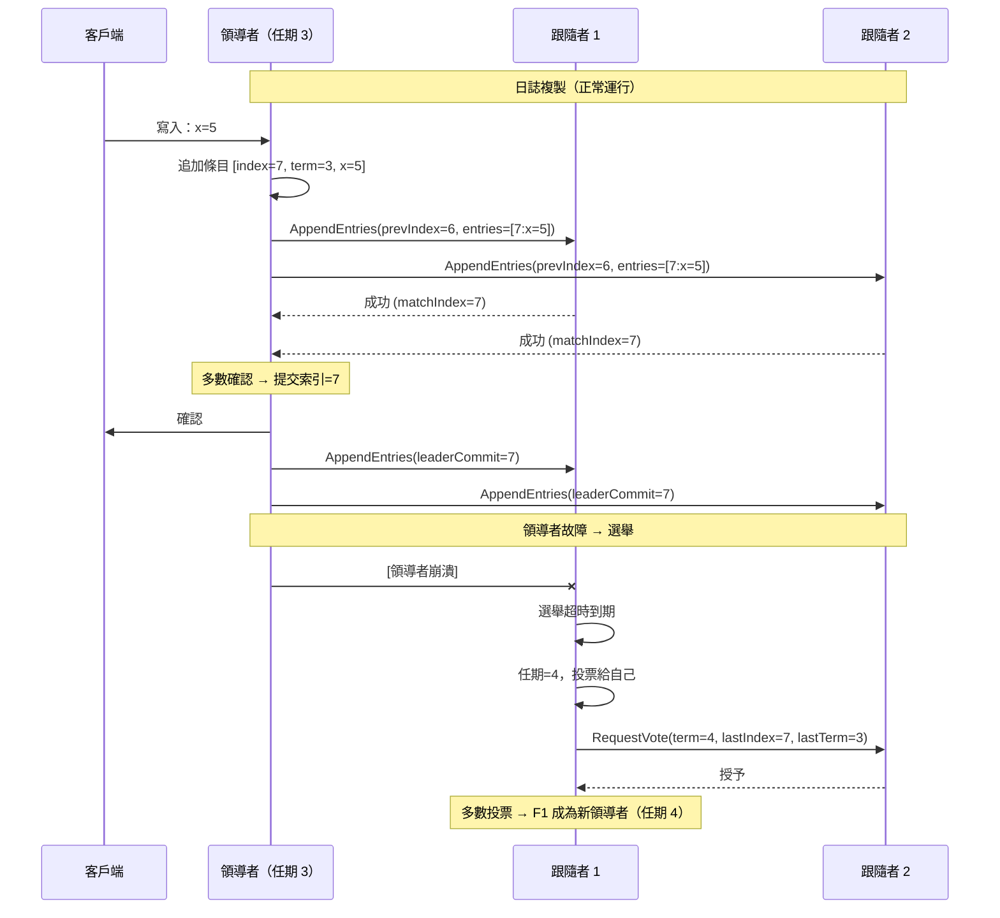

# [BEE-421] 共識演算法：Paxos 與 Raft

:::info
共識演算法允許一個節點叢集在面對節點故障和網路分區的情況下對一系列值達成一致——它們是使分散式系統表現得像一台可靠機器的機制，並支撐著工程師所依賴的每個協調服務：etcd、ZooKeeper 和分散式資料庫。
:::

## Context

共識問題的陳述出奇地簡單：給定 N 個可以相互通信且可能各自失敗的節點，它們如何就單一值達成一致？天真的答案——讓一個節點決定並告訴其他節點——在該節點在告知所有人之前崩潰時就會失敗。這個問題抵拒簡單的解決方案，因為節點無法區分「另一個節點崩潰了」和「網路丟棄了我的消息」。

Leslie Lamport 在 1989 年以希臘議會寓言的形式提交了第一個嚴格的解決方案，論文名為「兼職議會」（The Part-Time Parliament）。該論文因過於奇特而被 TOCS 拒絕；1998 年最終發表在 *ACM Transactions on Computer Systems* 時，仍然難以理解。Lamport 自己的後續文章《Paxos Made Simple》（2001）開篇就承認該演算法「完全不明顯」。核心思想：提議者需要**多數**接受者的承諾才能提交一個值——而多數的重疊保證任何兩個已提交的決定至少共享一個接受者，從而防止矛盾。

Paxos 定義了三個角色。**提議者（Proposer）**通過發出具有單調遞增編號的提案來推動一致性。**接受者（Acceptor）**對提案進行投票，並將其最後的承諾持久化到穩定存儲。**學習者（Learner）**在法定人數提交後接收已達成一致的值。在第一階段（準備/承諾），提議者廣播帶有提案號 N 的準備請求；接受者承諾忽略任何低於 N 的內容，並返回任何先前接受的值。在第二階段（接受/已接受），提議者將選定的值發送給接受者；一旦多數接受，該值即被提交。**Multi-Paxos** 通過選舉穩定的領導者來擴展這一點以複製日誌，後續條目可以跳過第一階段。

Paxos 留下未解決的問題是實際的可理解性。正確實現 Paxos 需要推理領導者更換、日誌間隙和接受者恢復等微妙邊緣情況——這些細節原始論文留給了實現者。Diego Ongaro 和 John Ousterhout 以「可理解性」為明確目標設計了一個替代方案。他們的論文《尋找一個可理解的共識演算法》（In Search of an Understandable Consensus Algorithm）在 USENIX ATC 2014 上發表（獲得最佳論文獎），介紹了 **Raft**。

Raft 將共識分解為三個可分離的問題：**領導者選舉**、**日誌複製**和**安全性**。時間被劃分為**任期（term）**——單調遞增的整數，充當邏輯時鐘。每個任期從選舉開始。每個服務器默認都是跟隨者，有一個隨機化的**選舉超時**（通常為 150-300 毫秒）。當跟隨者的超時在沒有聽到領導者消息的情況下到期時，它成為候選人，增加其任期，投票給自己，並向對等方請求投票。第一個從多數服務器獲得投票的候選人成為該任期的領導者。隨機化的超時使分票情況很少見；當發生時，服務器再次以新的隨機延遲超時，很快收斂。

領導者處理所有客戶端寫入。它將每個命令追加到本地日誌，並向所有跟隨者廣播 **AppendEntries** RPC。一旦領導者確認了多數節點的複製，日誌條目即被**提交**——此時可以安全地應用到狀態機。領導者追蹤 `matchIndex[i]`（確認在服務器 i 上複製的最高日誌條目）和 `nextIndex[i]`（要發送到服務器 i 的下一個條目）。落後的跟隨者從領導者接收補充。安全保證：如果任何服務器在索引 I 處應用了日誌條目，沒有其他服務器會在該索引處應用不同的命令。這通過選舉限制來強制執行——候選人只有在其日誌至少與投票多數中任何節點一樣是最新的情況下才能獲勝。

## Design Thinking

**共識是一個法定人數遊戲。** 對於 N 個節點的叢集，提交需要 ⌊N/2⌋ + 1 個節點（多數）。這意味著：
- 3 個節點：容忍 1 個故障（需要 2 個提交）
- 5 個節點：容忍 2 個故障（需要 3 個提交）
- 7 個節點：容忍 3 個故障（需要 4 個提交）

增加節點提高了容錯性，但也增加了提交延遲，因為領導者必須等待更多的確認。大多數生產部署使用 3 或 5 個節點——7 個節點很少見，除非有非常高的可用性要求。

**少數分區最多只能讀取。** 當網路分區將少數節點隔離時，這些節點無法選舉領導者（它們缺乏法定人數）。它們無法提交寫入。如果它們之前是跟隨者，它們最終會讓選舉超時到期並反复嘗試形成法定人數——它們沒有進展。多數分區選舉新的領導者並繼續服務。當分區癒合時，少數節點從新領導者的日誌追上，丟棄它們持有的任何未提交條目。這是 CP 行為（BEE-420）：系統犧牲少數分區的可用性來維護一致性。

**領導者選舉意味著短暫的不可用。** 當領導者崩潰或網路分區將其從多數中移除時，跟隨者檢測到缺席（在選舉超時內沒有 AppendEntries 心跳）並開始選舉。這引入了一個不可用窗口——通常是一到兩個選舉超時週期（默認設置下為 300-600 毫秒）。在此窗口期間，客戶端寫入被拒絕或排隊。調整選舉超時是延遲與檢測速度的取捨：更短的超時在真正故障後更快觸發選舉，但也在暫時性網路抖動下觸發偽選舉。

**任期是領導權轉換的權威信號。** Raft 中的每條消息都帶有發送方的當前任期。當節點收到任期高於自己的消息時，它立即降為跟隨者並更新其任期。這意味著來自先前任期的日誌條目——即使是已提交的——也必須被驗證：新選舉的領導者重新複製提交標記，而不是假設先前的提交對所有跟隨者都可見。

## Best Practices

工程師 MUST NOT（不得）從頭構建生產級共識。Paxos 和 Raft 的正確實現有微妙的正確性要求（承諾前的持久化存儲、任期邊界的正確處理、領導者更換時的日誌截斷），難以驗證和測試。使用經過實戰驗證的實現：etcd 用於協調、ZooKeeper 用於排序保證，或具有內置複製的資料庫。

工程師 MUST（必須）根據所需的容錯能力確定共識組的大小，而不是更大。3 個節點的組容忍 1 個故障，需要 2 個確認提交。5 個節點的組容忍 2 個故障，需要 3 個確認提交。向 3 個節點組添加第 4 個節點不會增加容錯能力（仍然需要 3 個提交），但會增加提交延遲。優先選擇奇數大小的組：偶數大小的組不提供比下面的奇數更多的容錯能力。

工程師 SHOULD（應該）理解 Raft 叢集中任何強一致性讀取必須通過領導者，或使用租約機制。跟隨者可能尚未看到最近提交的條目。聯繫跟隨者的線性化讀取即使在健康的叢集中也可能返回陳舊數據。大多數基於 Raft 的系統默認將讀取路由到領導者；檢查你使用的任何系統的配置。

工程師 SHOULD（應該）在可用性 SLO 中考慮領導者選舉延遲。如果 etcd 或 ZooKeeper 叢集位於服務後面，共識領導者崩潰，客戶端將在選出新領導者的過程中（默認選舉超時範圍為 150-600 毫秒）看到失敗。設計具有適當退避的重試邏輯以在此窗口內繼續存活。

工程師 MUST（必須）通過共識協議本身配置共識叢集成員變更，而不是通過停止和重啟具有不同成員列表的節點。添加或刪除節點會改變法定人數計算；如果不一致地執行，可能形成兩個獨立的多數（腦裂）。Raft 的聯合共識機制和 etcd 的叢集管理 API 可以安全地處理這一點。

工程師 SHOULD（應該）監控任期號和領導者選舉頻率作為健康指標。快速增加的任期號表示反復失敗的選舉——網路不穩定、資源耗盡或時鐘偏移。穩定運行的叢集很少更換領導者；頻繁的領導權更改是症狀，而非正常行為。

## Visual



## Example

**法定人數計算的實際情況：**

```
叢集：5 個節點（A、B、C、D、E）
容錯能力：2 個故障（需要 3 個提交）

場景：A 是領導者，寫入 x=5
  A → B：複製 x=5     B 確認 ✓
  A → C：複製 x=5     C 確認 ✓  ← 達到多數（A+B+C = 3）
  A → D：複製 x=5     D [緩慢，尚未確認]
  A → E：複製 x=5     E [緩慢，尚未確認]
  → A 提交 x=5。客戶端收到確認。

場景：網路分區 {A, B} | {C, D, E}
  分區 1（少數）：A（舊領導者）、B
    → A 無法獲得 3 個確認 → 寫入阻塞
    → A 的領導權在 C、D、E 選出新領導者時過期
  分區 2（多數）：C、D、E
    → C 贏得選舉（任期 4）
    → C、D、E 可以提交寫入（3 = 5 的多數）
    → 分區 1 的客戶端必須在分區 2 上重試

  分區癒合後：
    → A 從 C 收到任期=4 > 任期=3 的 AppendEntries
    → A 立即成為跟隨者，同步 C 的日誌
    → A 持有的任何未提交條目被丟棄
```

## Related BEEs

- [BEE-19001](cap-theorem-and-the-consistency-availability-tradeoff.md) -- CAP 定理：共識演算法是 CP 系統背後的機制——它們寧可停止也不允許不一致
- [BEE-8003](../transactions/distributed-transactions-and-two-phase-commit.md) -- 分散式事務與兩階段提交：2PC 是基於協調器的協議；共識是基於法定人數的——兩者解決一致性問題，但具有不同的故障特性
- [BEE-9004](../caching/distributed-caching.md) -- 分散式快取：分散式快取使用共識進行分片領導；理解法定人數解釋了快取可用性行為
- [BEE-12006](../resilience/chaos-engineering-principles.md) -- 混沌工程：領導者選舉容錯是一個自然的混沌實驗——注入領導者故障並驗證客戶端重試行為

## References

- [兼職議會 -- Leslie Lamport, ACM Transactions on Computer Systems 1998](https://dl.acm.org/doi/10.1145/279227.279229)
- [Paxos Made Simple -- Leslie Lamport（2001）](https://lamport.azurewebsites.net/pubs/paxos-simple.pdf)
- [尋找一個可理解的共識演算法 -- Ongaro & Ousterhout, USENIX ATC 2014](https://www.usenix.org/conference/atc14/technical-sessions/presentation/ongaro)
- [Raft 擴展論文 -- Diego Ongaro](https://raft.github.io/raft.pdf)
- [Raft 官方網站 -- raft.github.io](https://raft.github.io/)
- [管理關鍵狀態：可靠性的分散式共識 -- Google SRE 書籍](https://sre.google/sre-book/managing-critical-state/)
