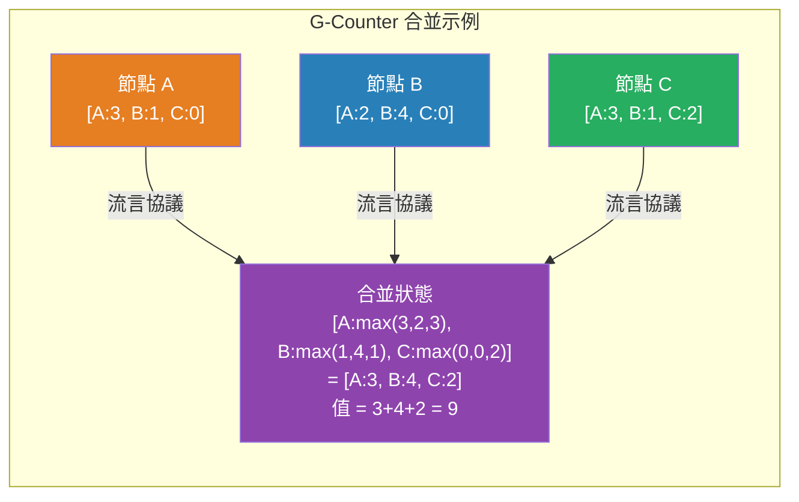

# [BEE-429] CRDT：無衝突複製數據類型

:::info
CRDT 是一種可以在多個節點間複製、無需協調即可並發更新、並自動合併到一致狀態的數據結構——使其成為構建高可用系統的原則性機制，無需共識或分散式鎖即可實現收斂，且不產生衝突。
:::

## Context

最終一致性（BEE-165）是一個承諾：如果更新停止，副本將收斂。這個承諾對兩個副本已發散時*如何*收斂隻字不提。樸素的答案——使用時間戳的「最後寫入勝」——會靜默丟棄更新。謹慎的答案——在每次寫入之前都需要共識——破壞了您選擇最終一致性所追求的可用性。

Marc Shapiro、Nuno Preguiça、Carlos Baquero 和 Marek Zawirski 在「收斂和交換複製數據類型的全面研究」（INRIA 技術報告 RR-7506，2011 年）和會議論文「無衝突複製數據類型」（SSS 2011）中正式化了解決方案。核心洞察：如果您設計的數據類型其合並函數是**交換的、結合的且冪等的**，那麼以任何順序合並任何更新集都將始終產生相同的結果。您在寫入時不需要協調，因為合並保證會收斂。

「CRDT」涵蓋了一族數據結構，而非單個算法。Amazon 2007 年 Dynamo 論文中的購物車使用了添加勝利語義——論文描述了激發 CRDT 的問題，尽管正式的 CRDT 框架在四年後才發布。Riak（Basho）在 2013 年提供了生產 CRDT 數據類型（計數器、集合、映射）。Redis Enterprise 使用 CRDT 在數據中心間進行 Active-Active 地理複製。Figma、協作文本編輯器和分散式存在系統都依賴類 CRDT 機制。

## Design Thinking

**CRDT 用語義約束換取協調成本。** CRDT 不是通用衝突解決器——它是一種設計上不會發生衝突的數據結構。數據結構定義了自己的合並語義，這些語義必須被選擇為與您的應用實際含義相匹配。增長計數器永遠不會「衝突」，因為合並兩個計數器只是取每個節點的最大值。OR-Set 不會衝突，因為添加和刪除都用唯一 ID 標記。但如果您的應用要求「文本字段上最後編輯勝利」，您正在做一個語義選擇，CRDT 必須明確編碼（LWW-Register），而不是隱藏一個問題。

**兩個族解決不同的網絡可靠性問題。** 基於狀態的 CRDT（CvRDT）發送完整狀態並合並——在不可靠網絡上安全，因為重新傳輸相同的完整狀態是冪等的。基於操作的 CRDT（CmRDT）發送操作——帶寬效率更高，但需要恰好一次的因果傳遞。在它們之間的選擇取決於您的消息傳遞層是否保證有序因果傳遞。Delta-CRDT（Almeida 等人，2016 年）結合了兩者的優點：基於狀態的正確性，通過只發送狀態變更的增量來實現操作大小的帶寬。

**CRDT 並不適用於所有數據。** 使用添加勝利語義的銀行餘額 CRDT 會在與存款並發時丟失提款。LWW-Register 靜默丟棄在時間戳比較中失敗的任何更新。正確的 CRDT 類型必須編碼您應用的預期合並語義——沒有適用於所有情況的「通用 CRDT」。

## Common CRDT Types

**G-Counter（增長計數器）：** N 個節點集群中的每個節點擁有一個 N 個整數向量中的一個槽位。遞增只觸及本地節點的槽位。合並取逐元素最大值。最終值是所有槽位的總和。即使副本以任何順序交換狀態也能收斂。無法遞減。

**PN-Counter：** 兩個 G-Counter（P 用於遞增，N 用於遞減）。值 = sum(P) - sum(N)。支持遞增和遞減。P 和 N 中的槽位獨立增長；差值收斂。

**G-Set（增長集合）：** 合並為集合并集。元素永不刪除。集合并集的屬性天然使合並交換、結合且冪等。最簡單的 CRDT。

**OR-Set（觀察刪除集合）：** 解決添加勝利與刪除勝利的問題。每個 `add(element)` 生成一個唯一標籤；集合存儲 `(element, tag)` 對。`remove(element)` 刪除該元素在刪除時觀察到的所有標籤。如果相同元素被並發添加（新標籤）和刪除（舊標籤），添加勝利，因為新標籤存活。允許在刪除後重新添加元素。

**LWW-Register（最後寫入勝利寄存器）：** 存儲帶時間戳的單個值。合並取時間戳較高的值。簡單，但靜默丟棄失敗的寫入——僅適用於丟失並發更新可接受的值（配置、緩存元數據）。

**RGA（複製增長數組）：** 序列中的每個字符被分配一個全局唯一 ID（通常是 Lamport 時間戳）。插入按 ID 排序；在同一位置的並發插入按節點 ID 確定性排序。允許協作文本編輯而無需操作轉換（OT）。用於文本編輯器和結構化文檔協作。

## Visual



## Example

**G-Counter：分散式頁面瀏覽計數器**

```
# 3 節點集群；每個節點獨立遞增自己的槽位。
# 不需要協調——讀取可以從任何節點提供。

# 節點 A 本地遞增（用戶訪問頁面）：
state_A = [A:3, B:1, C:0]
state_A[A] += 1 → state_A = [A:4, B:1, C:0]

# 同時，節點 B 也收到訪問：
state_B = [A:2, B:4, C:0]   # （B 的視圖，落後 A 的更新）

# 合並（A 和 B 之間的流言）：
merged = [max(4,2), max(1,4), max(0,0)] = [A:4, B:4, C:0]
value  = 4 + 4 + 0 = 8                  # 正確的總計

# 合並是冪等的：兩次合並相同的狀態產生相同的結果。
# 合並是交換的：A.merge(B) == B.merge(A)。
# 合並是結合的：(A.merge(B)).merge(C) == A.merge(B.merge(C))。
# → 任何流言順序都收斂到相同的最終值。
```

**OR-Set：帶並發添加和刪除的購物車**

```
# 副本 1 上的用戶會話：添加「書」→ 標籤 t1
cart_R1 = {("書", t1)}

# 副本 2 上的用戶會話（並發，尚未同步）：
# 副本 2 看到「書」在購物車中，刪除它
cart_R2 = {}     # 刪除 ("書", t1) — 在刪除時觀察到

# 同時在副本 1：再次添加「書」→ 標籤 t2
cart_R1 = {("書", t1), ("書", t2)}

# 同步（合並 R1 和 R2）：
# R2 的刪除只刪除了 t1；它從未見到 t2。
# 合並後：{("書", t2)}  ← 書留在購物車中（新添加的添加勝利）

# 與 2P-Set 行為的比較：
# 2P-Set：一旦刪除，「書」永遠不能重新添加 → 購物車語義錯誤
# OR-Set：刪除後允許重新添加 → 正確的語義

# Amazon Dynamo（2007 年）：描述了這個確切的問題並用
# 添加勝利語義解決——Shapiro 等人在 2011 年正式化的 OR-Set 模式。
```

**Delta-CRDT：帶寬高效的狀態同步**

```
# 樸素的基於狀態的 CRDT：每輪流言都發送完整狀態
# 問題：有 1000 個節點的 G-Counter = 每次更新發送 1000 個整數

# Delta-CRDT：只發送更改的內容
before_increment = [A:3, B:1, C:0]
after_increment  = [A:4, B:1, C:0]
delta            = [A:4]             # 只有更改的槽位

# 接收者像完整狀態一樣合並 delta：
# 對 delta 中的每個槽位執行 max(receiver_slot, delta_slot)；保持其他槽位不變
# 結果：相同的收斂保證，操作大小的消息。

# Delta-CRDT（Almeida、Shoker、Baquero，arXiv:1603.01529）：
# 實現無需完整狀態傳輸的反熵——與集群大小成比例地降低帶寬
# 而非與更新頻率成比例。
```

## Related BEEs

- [BEE-8006](../transactions/eventual-consistency-patterns.md) -- 最終一致性模式：CRDT 是最終一致系統的原則性實現機制——它們精確指定了分散的副本如何收斂
- [BEE-19001](cap-theorem-and-the-consistency-availability-tradeoff.md) -- CAP 定理：CRDT 是 AP 策略——它們為了可用性和分區容忍性犧牲強一致性（無共識、無線性化讀取）；收斂是它們的一致性替代
- [BEE-19004](gossip-protocols.md) -- 流言協議：CRDT 狀態傳播通常使用流言——節點定期交換狀態（或增量），CRDT 合並處理收斂，無論流言順序如何
- [BEE-10003](../messaging/delivery-guarantees.md) -- 投遞保證：基於操作的 CRDT（CmRDT）需要操作的恰好一次因果投遞；基於狀態的 CRDT（CvRDT）只需要完整狀態的最終投遞

## References

- [無衝突複製數據類型 -- Shapiro 等人, SSS 2011](https://link.springer.com/chapter/10.1007/978-3-642-24550-3_29)
- [收斂和交換複製數據類型的全面研究 -- Shapiro 等人, INRIA RR-7506, 2011](https://inria.hal.science/inria-00555588/en/)
- [Delta 狀態複製數據類型 -- Almeida、Shoker & Baquero, arXiv:1603.01529, 2016](https://arxiv.org/abs/1603.01529)
- [Dynamo：Amazon 的高可用鍵值存儲 -- DeCandia 等人, SOSP 2007](https://www.allthingsdistributed.com/files/amazon-dynamo-sosp2007.pdf)
- [Riak 中的 CRDT -- Riak 文檔](https://docs.riak.com/riak/kv/2.2.3/learn/concepts/crdts/index.html)
- [使用 CRDT 的 Active-Active 地理分佈 -- Redis 文檔](https://redis.io/docs/latest/operate/rs/databases/active-active/)
- [CRDT 論文和資源 -- crdt.tech](https://crdt.tech/papers.html)
