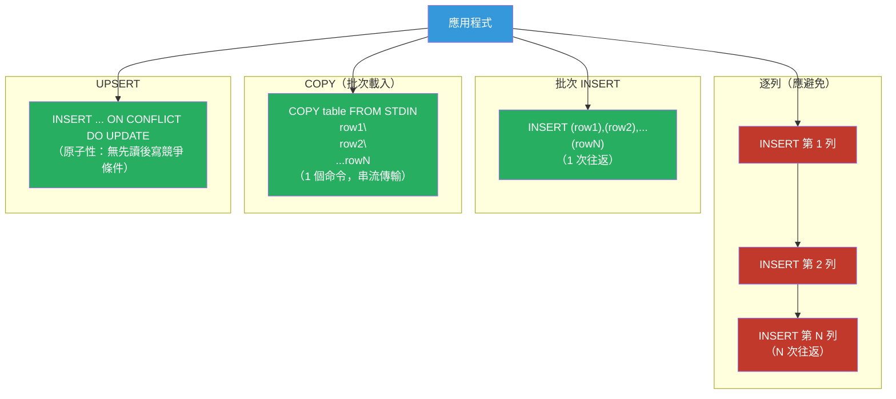

# [BEE-469] 資料庫批次操作與 UPSERT 模式

:::info
批次操作（bulk operation）——在單次資料庫往返中插入或更新多列——將客戶端與資料庫之間的延遲從 O(N) 降低到 O(1)，並可將寫入吞吐量提升 10–100 倍；UPSERT 模式在此基礎上進一步實現冪等寫入，能安全處理重複鍵而無需應用層的「先讀後寫」邏輯。
:::

## 背景

後端系統中最常見的寫入效能問題，與 N+1 讀取問題具有相同的結構，只是發生在寫入端：在迴圈中用 N 條獨立的 `INSERT` 或 `UPDATE` 語句插入或更新 N 列。每條語句都是一次往返資料庫的過程——解析、規劃、執行、返回。在每次往返 1 毫秒、10,000 列的情況下，僅網路和協議開銷就耗費 10 秒，還未開始實際寫入任何資料。

PostgreSQL 的 `COPY` 命令自 1990 年代初期以來一直提供批次載入能力：它以單次命令的形式將列從客戶端串流傳送到伺服器，完全繞過逐列的解析-規劃-執行週期。內部測試定期顯示 `COPY` 的資料攝取速度比等效的多語句 `INSERT` 快 5–100 倍。MySQL 的 `LOAD DATA INFILE` 提供相同的能力。對於應用層面的攝取（而非基於檔案的），多列 `INSERT ... VALUES (...),...` 可以透過在一個批次中攤銷每語句開銷，達到接近 `COPY` 吞吐量的水準。

UPSERT 概念——若列不存在則插入，若存在則更新——早於 SQL 標準化，但直到 2003 年的 `MERGE` 語句才成為 ANSI SQL 的一部分。在此之前，各資料庫廠商以不同方式實作此模式：Oracle 的 `MERGE`（1999 年）、MySQL 的 `INSERT ... ON DUPLICATE KEY UPDATE`（MySQL 4.1，2003 年）、PostgreSQL 的 `INSERT ... ON CONFLICT`（PostgreSQL 9.5，2016 年）。它們之間的差異不僅僅是語法層面的：MySQL 的 `REPLACE INTO` 刪除衝突的列並插入一個新列（丟失自動生成的欄位並觸發與刪除相關的副作用），而 PostgreSQL 的 `ON CONFLICT DO UPDATE` 是真正的原子性更新，保留現有列。

在高並發情況下，UPSERT 語義與鎖定的交互方式並不直觀。PostgreSQL 的 `ON CONFLICT DO UPDATE` 結合了索引掃描和行層級鎖；在對同一鍵進行並發插入時，第二個插入者等待第一個插入者提交，然後看到該列已存在並執行更新。這在語義上是正確的，但可能使熱鍵上的吞吐量序列化，使得對同一頻繁更新鍵的 UPSERT 成為競爭點。理解這些語義可以防止「並發 UPSERT」靜默覆蓋彼此增量更新的那類錯誤。

## 設計思維

### 選擇正確的批次策略

| 場景 | 最佳方法 |
|---|---|
| 初始資料載入（檔案） | `COPY` / `LOAD DATA INFILE` |
| 應用層攝取，僅插入 | 批次多列 `INSERT`（每批 500–5000 列） |
| 插入或忽略重複 | `INSERT ... ON CONFLICT DO NOTHING` |
| 插入或覆寫最新值 | `INSERT ... ON CONFLICT DO UPDATE SET col = EXCLUDED.col` |
| 條件式更新（僅在更新時） | `ON CONFLICT DO UPDATE ... WHERE existing.ts < EXCLUDED.ts` |
| 複雜邏輯合併 | `MERGE` 語句（SQL:2003，PostgreSQL 15+，MySQL 8.0.31+） |
| 批次更新現有列 | `UPDATE ... FROM (VALUES ...)` 或暫存表 + JOIN |

### 各資料庫的 UPSERT 語義

各廠商實作之間的關鍵行為差異：

**PostgreSQL `INSERT ... ON CONFLICT`**：行層級的原子性讀-改-寫。衝突目標是一個索引（唯一約束或部分索引）。`EXCLUDED` 指向原本會插入的列。不觸發刪除觸發器。不重置序列欄位。支援 `DO UPDATE` 上的 `WHERE` 子句用於條件式更新。

**MySQL `INSERT ... ON DUPLICATE KEY UPDATE`**：對任何唯一鍵衝突觸發（不僅是主鍵），這在有多個唯一索引時可能導致意外行為。`VALUES(col)` 指向原本會插入的值（在 8.0 中已棄用；改用別名語法）。不刪除列。

**MySQL `REPLACE INTO`**：刪除衝突列並插入新列。自增 ID 會改變。外鍵級聯會在刪除時觸發。刪除觸發器會觸發。對有外鍵子表、自增主鍵或觸發器的表應避免使用。

**SQL Standard `MERGE`**（PostgreSQL 15+，MySQL 8.0.31+，SQL Server，Oracle）：最具表達力——獨立的 `WHEN MATCHED THEN UPDATE`、`WHEN NOT MATCHED THEN INSERT`、`WHEN NOT MATCHED BY SOURCE THEN DELETE` 子句。語法較複雜，但允許多個匹配條件和在一條語句中混合插入/更新/刪除。

### 批次大小選擇

多列 `INSERT` 的吞吐量隨批次大小增加而提升，直到某個點後趨於平穩或下降：
- 低於約 100 列：每語句開銷佔主導；吞吐量幾乎與批次大小線性增長。
- 500–5,000 列：大多數工作負載的最佳範圍——語句準備成本已攤銷；事務日誌寫入效率高。
- 高於約 10,000 列：單個事務持有鎖的時間更長；失敗時整個批次必須重試；記憶體壓力增加。

最佳批次大小取決於列寬、索引數量和事務日誌設定。從 1,000 列開始並進行效能分析。對於 `COPY`，不存在最佳點——在一個命令中傳送整個資料集；伺服器自行處理緩衝。

## 最佳實踐

**必須（MUST）批次寫入——永不在應用迴圈中每次迭代只插入或更新一列。** 在記憶體中收集列（列表或緩衝區），然後在單次多列 `INSERT` 或 `COPY` 中一起刷新。批次大小上限通常為 1,000–5,000 列；當批次已滿或達到時間閾值（例如 100 毫秒）時刷新。即使批次大小為 10，也比 1 好一個數量級。

**必須（MUST）對數百萬列的批次載入使用 `COPY`（PostgreSQL）或 `LOAD DATA INFILE`（MySQL）。** `COPY` 繞過解析-規劃-執行週期，直接寫入儲存層。它是 ETL 管線、資料遷移和大型表初始填充的正確工具。對於應用程式生成的資料，透過資料庫驅動程式使用 `COPY` 協議（psycopg3 的 `copy_records_to_table`、asyncpg 的 `copy_records_to_table`），而非寫入檔案。

**必須（MUST）使用 `INSERT ... ON CONFLICT DO NOTHING` 而非應用層的「先讀後寫」來實現冪等插入。** 「SELECT → 若未找到則 INSERT」模式存在競爭條件：兩個並發請求都可能讀取到「未找到」並都嘗試插入，導致其中一個因唯一約束違反而失敗。`ON CONFLICT DO NOTHING` 在並發下是原子性且正確的，無需鎖定。

**必須（MUST）在 `ON CONFLICT` 中明確指定衝突目標**，而非使用不帶目標的裸 `ON CONFLICT DO NOTHING`。指定目標（`ON CONFLICT (id)` 或 `ON CONFLICT ON CONSTRAINT orders_pkey`）使意圖清晰，並能捕捉到添加或刪除唯一約束的 Schema 變更。

**不得（MUST NOT）對有外鍵子表、自增主鍵或刪除觸發器的表使用 `REPLACE INTO`。** 刪除後再插入的語義會改變列的主鍵（新的自增值），破壞子表的外鍵引用，並對語義上是更新的操作觸發刪除觸發器。改用 `INSERT ... ON DUPLICATE KEY UPDATE`。

**應該（SHOULD）在 `ON CONFLICT DO UPDATE` 中使用條件式 `WHERE` 子句，實現後來者勝出（last-write-wins）而不覆蓋更新的資料。** 沒有條件，後到的重複資料總是覆蓋當前列，無論哪個更新：

```sql
INSERT INTO metrics (device_id, ts, value)
VALUES ($1, $2, $3)
ON CONFLICT (device_id) DO UPDATE
  SET ts = EXCLUDED.ts, value = EXCLUDED.value
  WHERE metrics.ts < EXCLUDED.ts;  -- 僅在傳入資料更新時才更新
```

**應該（SHOULD）將批次操作包裝在顯式事務中，並對非常大的批次定期提交（checkpoint）。** 在單一事務中插入 1000 萬列會產生大量事務日誌段並持有鎖直到提交。對於大型載入，每 10,000–100,000 列提交一次（`COMMIT; BEGIN;`），以釋放鎖、刷新 WAL，並允許自動清理增量回收死元組。這也限制了失敗時的重試範圍。

**應該（SHOULD）在批次載入前停用不必要的索引，載入後再重建。** 每次 INSERT 都會維護每個索引；對有 5 個索引的表插入 100 萬列，需要更新 500 萬個索引條目。對於初始載入，刪除非必要索引，載入資料，然後用 `CREATE INDEX CONCURRENTLY` 重建。在現有資料上建立索引比逐列增量更新快得多。

## 視覺說明



## 實作範例

**Python 批次 INSERT（psycopg3）：**

```python
import psycopg

BATCH_SIZE = 1000

def bulk_insert_orders(conn: psycopg.Connection, orders: list[dict]) -> None:
    """以 BATCH_SIZE 為批次插入訂單，每批次一次往返。"""
    with conn.cursor() as cur:
        # executemany 使用 prepared statement：一次解析，N 次批次執行
        cur.executemany(
            """INSERT INTO orders (id, customer_id, amount, status)
               VALUES (%(id)s, %(customer_id)s, %(amount)s, %(status)s)
               ON CONFLICT (id) DO NOTHING""",
            orders,
            returning=False,
        )
    conn.commit()

# 對於大型資料集：使用 COPY 獲得最大吞吐量
def bulk_copy_orders(conn: psycopg.Connection, orders: list[tuple]) -> None:
    with conn.cursor() as cur:
        with cur.copy("COPY orders (id, customer_id, amount, status) FROM STDIN") as copy:
            for batch_start in range(0, len(orders), BATCH_SIZE):
                batch = orders[batch_start : batch_start + BATCH_SIZE]
                for row in batch:
                    copy.write_row(row)
    conn.commit()
```

**帶條件更新的 UPSERT（PostgreSQL）：**

```sql
-- 攝取設備遙測資料：僅在傳入時間戳比儲存的更新時才更新
-- 這防止遲到的訊息覆蓋更新的資料
INSERT INTO device_readings (device_id, metric, ts, value)
VALUES
  ('dev-001', 'temperature', '2024-03-15T10:00:00Z', 22.5),
  ('dev-001', 'temperature', '2024-03-15T10:01:00Z', 22.7),
  ('dev-002', 'humidity',    '2024-03-15T10:00:00Z', 65.0)
ON CONFLICT (device_id, metric) DO UPDATE
  SET ts    = EXCLUDED.ts,
      value = EXCLUDED.value
  WHERE device_readings.ts < EXCLUDED.ts;

-- EXCLUDED 指向因衝突而被拒絕的列
-- WHERE 子句使此操作冪等：重新插入相同的列是無操作（no-op）
```

**透過 VALUES 建構函式進行批次 UPDATE（PostgreSQL）：**

```sql
-- 更新 N 列，無需 N 條獨立的 UPDATE 語句
UPDATE orders AS o
SET status = v.new_status
FROM (VALUES
  (1001, 'shipped'),
  (1002, 'delivered'),
  (1003, 'cancelled')
) AS v(order_id, new_status)
WHERE o.id = v.order_id;
```

**複雜批次更新的暫存表方法：**

```sql
-- 對於非常大的批次：先載入到暫存表，再進行 JOIN
-- 避免給規劃器帶來壓力的巨大 VALUES 子句
CREATE TEMPORARY TABLE staging_updates (
    order_id    BIGINT,
    new_status  TEXT,
    updated_at  TIMESTAMPTZ
) ON COMMIT DROP;

-- 透過 COPY 載入暫存資料（最快路徑）
COPY staging_updates FROM STDIN;

-- 在一次 UPDATE JOIN 中套用
UPDATE orders o
SET status     = s.new_status,
    updated_at = s.updated_at
FROM staging_updates s
WHERE o.id = s.order_id;
```

**批次載入的索引管理：**

```sql
-- 載入數百萬列前：
-- 刪除非必要索引以跳過增量索引維護
DROP INDEX IF EXISTS idx_orders_customer;
DROP INDEX IF EXISTS idx_orders_created_at;

-- 載入資料（COPY 或批次 INSERT）
COPY orders FROM '/path/to/orders.csv' CSV HEADER;

-- 載入後重建索引：比逐列維護快得多
-- CONCURRENTLY 允許索引建立期間進行讀取（無表鎖）
CREATE INDEX CONCURRENTLY idx_orders_customer ON orders (customer_id);
CREATE INDEX CONCURRENTLY idx_orders_created_at ON orders (created_at DESC);

-- 批次載入後更新表統計資訊
ANALYZE orders;
```

## 實作注意事項

**PostgreSQL**：`COPY` 是最快的攝取路徑；對應用程式生成的資料使用 `psycopg3` 的 `cursor.copy()`。`INSERT ... ON CONFLICT` 需要 PostgreSQL 9.5+。`MERGE` 語句（SQL 標準）從 PostgreSQL 15 起可用。對於熱鍵上的大量並發 UPSERT，考慮透過佇列序列化寫入以避免鎖競爭。

**MySQL**：`INSERT ... ON DUPLICATE KEY UPDATE` 是 UPSERT 語法。使用 `VALUES(col)` 表示建議的值——在 8.0 中已棄用，改用列別名語法（`AS new`）。`LOAD DATA INFILE` 是 `COPY` 的批次載入等效物；需要 `FILE` 權限或 `LOAD DATA LOCAL INFILE`。`INSERT IGNORE` 是 MySQL 的 `ON CONFLICT DO NOTHING` 等效物。

**SQLite**：`INSERT OR REPLACE`、`INSERT OR IGNORE` 和 `INSERT OR ABORT` 涵蓋衝突處理情況。`INSERT ... ON CONFLICT (column) DO UPDATE`（SQLite 3.24+）與 PostgreSQL 語法相符。沒有 COPY 等效物；對於批次載入，將許多插入包裝在單一事務中（`BEGIN; INSERT...; INSERT...; COMMIT`）。

**應用框架**：Django 的 `bulk_create(objs, update_conflicts=True)`（Django 4.1+）為 PostgreSQL 生成 `INSERT ... ON CONFLICT`。SQLAlchemy 的 `insert().on_conflict_do_update()` 建構特定方言的語法。Hibernate 的帶 `merge()` 的 `@NaturalId` 處理 UPSERT 語義，但生成 SELECT + INSERT/UPDATE 而非單一原子語句——請驗證生成的 SQL。

## 相關 BEE

- [BEE-19042](n-plus-1-query-batching.md) -- N+1 查詢問題與批次載入：讀取端的等效問題——批次資料庫讀取以避免 N 次往返；本文涵蓋寫入端
- [BEE-8005](../transactions/idempotency-and-exactly-once-semantics.md) -- 冪等性與精確一次語義：UPSERT 是實現冪等寫入的主要資料庫層面工具；本文展示如何正確實作
- [BEE-8001](../transactions/acid-properties.md) -- ACID 特性：批次操作在事務內要麼全部成功要麼全部原子性失敗；了解提交範圍對選擇批次提交間隔至關重要
- [BEE-6007](../data-storage/database-migrations.md) -- 資料庫遷移：批次載入是資料遷移中填充表的主要工具；載入期間的索引管理是關鍵的效能槓桿

## 參考資料

- [INSERT — PostgreSQL Documentation](https://www.postgresql.org/docs/current/sql-insert.html)
- [COPY — PostgreSQL Documentation](https://www.postgresql.org/docs/current/sql-copy.html)
- [Populating a Database — PostgreSQL Documentation](https://www.postgresql.org/docs/current/populate.html)
- [INSERT ... ON DUPLICATE KEY UPDATE — MySQL 8.0 Documentation](https://dev.mysql.com/doc/refman/8.0/en/insert-on-duplicate.html)
- [MERGE — PostgreSQL 15 Documentation](https://www.postgresql.org/docs/15/sql-merge.html)
