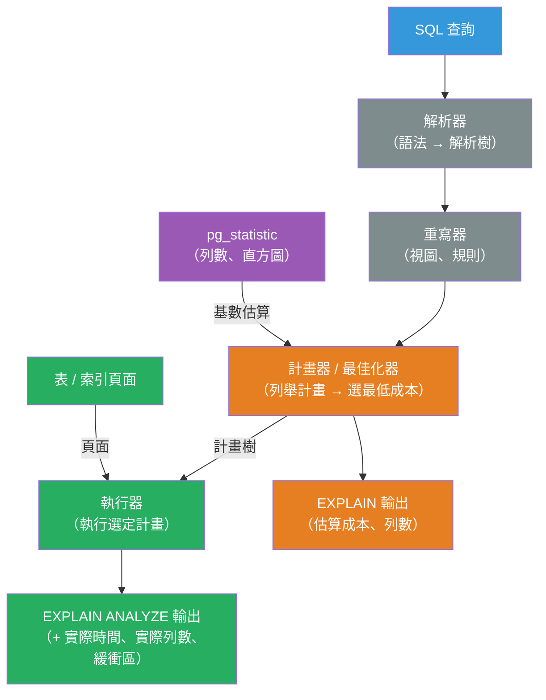

# [BEE-466] 資料庫查詢計畫與 EXPLAIN

:::info
查詢計畫器（query planner）透過估算不同存取路徑與連接方法的成本，選擇執行 SQL 陳述式的方式；`EXPLAIN` 讓這些選擇變得可見，而 `EXPLAIN ANALYZE` 則加入實測的執行時間——兩者合在一起，是診斷慢查詢最主要的工具，無需靠猜測。
:::

## 背景

每條 SQL 陳述式在執行前都會通過查詢計畫器。計畫器是一個基於成本的最佳化器：它列舉候選執行計畫——應該全表掃描還是使用索引？應該使用雜湊連接（hash join）還是巢狀迴圈（nested loop）？——估算每個計畫的 I/O 和 CPU 成本，並選擇最低成本的方案。估算依賴表的統計資訊：列數、欄位值分布、物理列順序與索引順序的相關性。當統計資訊準確時，計畫器能做出正確選擇。當統計資訊過時、缺失或具有誤導性時——例如在批次載入後、某欄位具有偏斜分布（skewed distribution）時，或資料大幅漂移後——計畫器的成本估算就會出錯，導致計畫比最優方案慢上幾個數量級。

PostgreSQL 的 `EXPLAIN` 指令在 1990 年代初期引入，並在 PostgreSQL 7.0 中正式確立。MySQL 在 4.0 版本加入 `EXPLAIN` 支援。兩者遵循相同原則：印出執行器將使用的計畫節點樹，並標注估算的列數和成本。`EXPLAIN ANALYZE` 執行查詢後，在估算值旁邊加入實際測量的列數和計時——估算列數與實際列數之間的差異，是計畫問題最可靠的指標。

`EXPLAIN` 輸出是業界查詢效能調查的標準起點。模式總是相同的：對慢查詢執行 `EXPLAIN ANALYZE`，找到實際列數與估算列數差異最大的節點，在該節點更新統計資訊或新增索引，然後再次測量。Markus Winand 的《Use The Index, Luke》（2011，use-the-index-luke.com）系統化了這套方法論，至今仍是 SQL 效能分析引用最多的實務參考。

## 設計思維

### 成本模型

計畫器為每個計畫節點分配兩部分成本：

- **啟動成本（Startup cost）**：在可以返回第一列之前完成的工作（例如為雜湊連接建立雜湊表）。
- **總成本（Total cost）**：返回所有列的工作量。

成本是無量綱單位，以兩個參數為基準校準：`seq_page_cost`（讀取一個循序頁面的成本，預設 1.0）和 `random_page_cost`（隨機頁面讀取的成本，預設 4.0）。讀取 100 個隨機頁面的索引掃描成本為 400 單位；循序掃描同樣 100 個頁面成本為 100 單位。計畫器只在索引過濾後的結果集足夠小、使額外隨機 I/O 值得付出時，才選擇索引掃描。這就是為什麼低選擇性欄位的索引（例如 `status = 'active'` 匹配 80% 的列）會被忽略——全表掃描更便宜。

在 SSD 上將 `random_page_cost` 設為 1.1（NVMe 則設為 1.0），可讓計畫器正確評估索引掃描對較大結果集的價值。在現代快閃儲存上保留旋轉磁碟的預設值（4.0），是常見的錯誤設定。

### 列數估算

計畫器最大的誤差來源是基數估算（cardinality estimation）——預測一個節點將返回多少列。單欄謂詞的估算來自 `pg_statistic`：計畫器儲存 N 個最常見值的列表和其餘值的直方圖。對於多欄謂詞，它假設獨立性並相乘選擇率——這個假設對相關欄位（`city = 'Paris' AND country = 'France'`）會失效。

預設統計目標是每欄 100 個直方圖桶。對於具有許多不同值或偏斜分布的欄位，提高目標可改善估算：

```sql
ALTER TABLE orders ALTER COLUMN status SET STATISTICS 500;
ANALYZE orders;
```

PostgreSQL 14 引入了**擴展統計資訊**（`CREATE STATISTICS`），用於多欄相關性、欄位群組的 n_distinct 估算和功能性依賴——解決了相關謂詞的獨立假設問題。

## 最佳實踐

**必須（MUST）執行 `EXPLAIN (ANALYZE, BUFFERS)`，而非裸 `EXPLAIN` 進行實際調查。** 裸 `EXPLAIN` 只顯示估算成本；`ANALYZE` 加入實際列數和時間；`BUFFERS` 加入快取命中/未命中次數。三者結合可揭示慢速是來自 I/O（高 `shared read` 數）還是 CPU（低 I/O 但高實際時間）。沒有 `BUFFERS`，I/O 密集型查詢與 CPU 密集型查詢看起來完全相同。

**必須（MUST）尋找 `rows=`（估算）與 `actual rows=`（實際）之間的大差異。** 一個節點估算 10 列但實際返回 100,000 列，意味著計畫器選擇了針對 10 列最佳化的計畫——通常是在大規模場景下代價極高的索引巢狀迴圈。差異指出統計資訊錯誤的位置；在新增索引之前先修正統計資訊。

**應該（SHOULD）在批次資料載入後執行 `ANALYZE`。** PostgreSQL 的自動清理（autovacuum）會定期執行 `ANALYZE`，但在大量 `COPY` 或 `INSERT ... SELECT` 後可能來不及執行。載入數百萬列後，在下次查詢前手動執行 `ANALYZE table_name`。批次載入後的過時統計資訊是 ETL 管線中錯誤計畫最常見的原因。

**不得（MUST NOT）全域停用 `enable_seqscan` 或 `enable_nestloop` 來繞過錯誤計畫。** 這些計畫器提示會抑制整個計畫節點類型，導致計畫器為每個查詢而非僅針對你正在調查的查詢選擇次優方案。正確的修復是改善統計資訊、調整成本，或新增索引。使用 `SET enable_seqscan = off` 在 session 層級診斷計畫器是否會在強制時使用可用的索引，然後找出為何通常不選擇它。

**應該（SHOULD）調整 `random_page_cost` 以反映實際儲存硬體。** SSD 使用 `random_page_cost = 1.1`–`2.0`；NVMe 使用 `random_page_cost = 1.0`–`1.1`。預設值（4.0）是旋轉磁碟的模型，在現代硬體上系統性地低估索引掃描的價值。這是 `postgresql.conf` 中的一行變更，可消除許多在已索引欄位上的循序掃描。

**應該（SHOULD）對相關的多欄謂詞使用 `CREATE STATISTICS`。** 如果查詢頻繁地在 `(country, city)` 或 `(user_id, status)` 上過濾，且計畫器的聯合估算持續出錯，請建立統計物件：

```sql
CREATE STATISTICS country_city_stats ON country, city FROM addresses;
ANALYZE addresses;
```

**應該（SHOULD）在生產環境使用 `pg_stat_statements` 和 `auto_explain` 捕捉慢查詢計畫。** `pg_stat_statements` 記錄查詢指紋、呼叫次數、總時間和平均時間——足以識別哪些查詢較慢。`auto_explain`（PostgreSQL 擴充套件）記錄任何超過設定閾值的查詢的 `EXPLAIN ANALYZE` 輸出，捕捉生產環境中實際使用的計畫，無需手動重現。

## 讀取 EXPLAIN 輸出

### 計畫節點類型（PostgreSQL）

| 節點 | 含義 | 使用時機 |
|---|---|---|
| `Seq Scan` | 從表中讀取所有列 | 低選擇性、小型表、無可用索引 |
| `Index Scan` | 走訪索引，取回堆積（heap）列 | 高選擇性，`random_page_cost` 允許 |
| `Index Only Scan` | 讀取索引，完全跳過堆積 | 所需欄位都在索引中（覆蓋索引） |
| `Bitmap Heap Scan` | 從索引建立點陣圖，按頁順序取回堆積 | 中等選擇性——比索引掃描減少隨機 I/O |
| `Nested Loop` | 對每個外側列，掃描內側 | 外側結果集小，內側有索引 |
| `Hash Join` | 從內側建立雜湊表，用外側探測 | 兩側都大，等值連接，無索引 |
| `Merge Join` | 兩側預先按連接鍵排序 | 兩側已排序或有排序索引可用 |

### 識別瓶頸

EXPLAIN 輸出是一棵樹；實際執行從葉節點到根節點進行。找到 `actual time`（獨占時間 = 節點時間減去子節點時間）最高的節點，那就是瓶頸。然後檢查：

1. `actual rows` >> `rows=`（估算）？→ 統計資訊問題。
2. `actual time` 高但列數少？→ 每列代價昂貴；尋找索引未命中或函數呼叫。
3. `shared read`（快取未命中）高？→ I/O 密集；考慮新增索引或覆蓋索引。
4. `Hash Join` 的 `Memory Usage` 很大？→ `work_mem` 可能過低，導致溢出到磁碟。

## 視覺說明



## 實作範例

**讀取 PostgreSQL `EXPLAIN (ANALYZE, BUFFERS)` 輸出：**

```sql
EXPLAIN (ANALYZE, BUFFERS, FORMAT TEXT)
SELECT o.id, o.amount, c.name
FROM orders o
JOIN customers c ON o.customer_id = c.id
WHERE o.status = 'pending'
  AND o.created_at > NOW() - INTERVAL '7 days';
```

帶有標注的範例輸出：

```
Hash Join  (cost=1520.00..4830.00 rows=1200 width=48)  -- 計畫器預期 1,200 列
           (actual time=45.3..312.7 rows=89,412 loops=1) -- 實際返回 89,412 列！
  Buffers: shared hit=3240 read=1820                    -- 1,820 個快取未命中 = I/O 密集
  ->  Seq Scan on orders o  (cost=0..3200.00 rows=1200 width=32)
      (actual time=0.04..198.3 rows=89,412 loops=1)
      Filter: ((status = 'pending') AND (created_at > ...))
      Rows Removed by Filter: 310,588
      Buffers: shared hit=1440 read=1820
  ->  Hash  (cost=900.00..900.00 rows=50000 width=24)
      (actual time=12.1..12.1 rows=50000 loops=1)
      ->  Seq Scan on customers c  (...)
```

診斷：
- 計畫器估算 `orders` 返回 1,200 列，但實際得到 89,412 列——74 倍的差異。
- 這導致選擇了雜湊連接（針對大型輸入最佳化）——在這裡恰好合適，但只是巧合。
- `Seq Scan on orders` 有 1,820 個快取未命中，表明 I/O 壓力大。
- 修復方案：執行 `ANALYZE orders`，檢查 `status` 和 `created_at` 的統計資訊，並新增部分索引：

```sql
-- 部分索引：僅針對待處理訂單，覆蓋日期過濾
CREATE INDEX idx_orders_pending_created
    ON orders (created_at DESC)
    WHERE status = 'pending';

ANALYZE orders;
```

建立索引後：
```
Index Scan using idx_orders_pending_created on orders
  (cost=0.56..4820.00 rows=89000 width=32)
  (actual time=0.08..98.3 rows=89,412 loops=1)
  Buffers: shared hit=4920 read=0   -- 零快取未命中：索引頁面已快取
```

**診斷連接方法：**

```sql
-- 強制計畫器顯示停用雜湊連接時的行為
SET enable_hashjoin = off;
EXPLAIN (ANALYZE, BUFFERS) SELECT ...;
-- 若巢狀迴圈被選擇且運行更快：雜湊連接是錯誤選擇
-- 若巢狀迴圈運行更慢：雜湊連接是正確選擇；調查為何估算出錯
RESET enable_hashjoin;
```

**提高偏斜欄位的統計目標：**

```sql
-- 檢查目前統計資訊
SELECT attname, n_distinct, correlation
FROM pg_stats
WHERE tablename = 'orders' AND attname = 'status';

-- n_distinct = 3（只有 'pending'、'complete'、'cancelled'）
-- correlation = 0.02（隨機分布；索引掃描需要許多隨機讀取）

-- 為具有偏斜分布的高基數欄位提高統計目標
ALTER TABLE events ALTER COLUMN event_type SET STATISTICS 500;
ANALYZE events;
```

## 實作注意事項

**PostgreSQL**：主要工具是 `EXPLAIN (ANALYZE, BUFFERS)`、`pg_stat_statements`（呼叫次數、總時間）、`auto_explain`（記錄慢查詢計畫）和 `pg_stats`（欄位統計資訊）。`pgBadger` 和 `pganalyze` 解析查詢日誌並產生計畫分析報告。`VACUUM ANALYZE` 同時回收死列並更新統計資訊。

**MySQL**：`EXPLAIN FORMAT=JSON` 提供比預設表格格式更豐富的細節，包括 `cost_info`、`used_columns` 和 `attached_condition`。`EXPLAIN ANALYZE`（MySQL 8.0.18+）加入實測時間。`optimizer_trace` 為單一查詢輸出完整的最佳化器決策日誌。`FORCE INDEX` 提示可用，但應作為最後手段——它在查詢文字中永久停用替代存取路徑。

**SQLite**：`EXPLAIN QUERY PLAN` 顯示策略；`EXPLAIN` 顯示位元組碼。SQLite 的最佳化器比 PostgreSQL 簡單；大多數調整涉及索引選擇和覆蓋索引。`PRAGMA optimize` 更新所有表的統計資訊。

**查詢視覺化工具**：`explain.depesz.com`（PostgreSQL）、`explain.tensor.ru` 和 MySQL Workbench 的 Visual Explain，以彩色計時呈現計畫樹——在團隊除錯時分享計畫非常有用。

## 相關 BEE

- [BEE-6002](../data-storage/indexing-deep-dive.md) -- 索引深度解析：索引是提升計畫品質的主要機制；了解計畫器何時選擇索引掃描而非循序掃描，是進行有效索引設計的前提
- [BEE-6006](../data-storage/connection-pooling-and-query-optimization.md) -- 連線池與查詢最佳化：涵蓋高層次的查詢最佳化實踐；本文提供應用這些實踐的診斷工具（EXPLAIN）
- [BEE-8002](../transactions/isolation-levels-and-their-anomalies.md) -- 隔離等級及其異常：長時間執行的事務會阻塞自動清理，導致統計資訊過時和計畫退化；隔離等級選擇影響清理頻率
- [BEE-13004](../performance-scalability/profiling-and-bottleneck-identification.md) -- 效能分析與瓶頸識別：EXPLAIN ANALYZE 是特定於資料庫的分析工具；更廣泛的方法論（測量、識別瓶頸、修復、再測量）適用於堆疊的每一層

## 參考資料

- [Using EXPLAIN — PostgreSQL Documentation](https://www.postgresql.org/docs/current/using-explain.html)
- [Use The Index, Luke: SQL Performance Explained — Markus Winand (2011)](https://use-the-index-luke.com/)
- [EXPLAIN Statement — MySQL 8.0 Documentation](https://dev.mysql.com/doc/refman/8.0/en/using-explain.html)
- [Extended Statistics — PostgreSQL Documentation](https://www.postgresql.org/docs/current/planner-stats.html#PLANNER-STATS-EXTENDED)
- [auto_explain — PostgreSQL Documentation](https://www.postgresql.org/docs/current/auto-explain.html)
- [pg_stat_statements — PostgreSQL Documentation](https://www.postgresql.org/docs/current/pgstatstatements.html)
