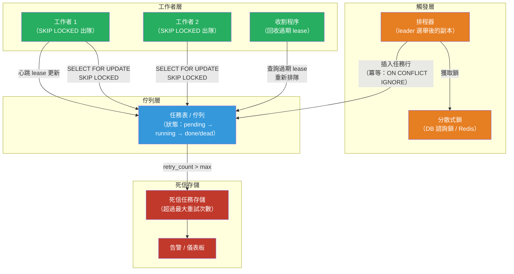

# [BEE-457] 分散式任務排程

:::info
分散式任務排程跨多個程序或機器協調後端任務的可靠執行——週期性 cron 任務、一次性延遲任務和長時間運行的工作流程——提供單一 cron 程序無法提供的容錯性、至少一次傳遞保證和可觀測性。
:::

## 背景

Unix `cron` 守護程序自 1975 年起便負責排程週期性任務。對於單台伺服器，它運作良好：時間表達式觸發命令，shell 執行它，程序退出。當系統擴展到超過一台機器時，問題就出現了：

**單點故障。** 如果運行 cron 的伺服器重啟或崩潰，任務將不會執行。高可用性 cron 需要在多台主機上運行守護程序——但這樣每台主機都會同時觸發任務，任務必須容忍並發重複執行，或使用外部協調來抑制重複執行。

**無傳遞保證。** 如果在伺服器重啟時任務正在運行，cron 沒有它正在執行中的記錄。任務會無聲地消失。沒有重試、沒有告警、沒有死信記錄。

**無可觀測性。** cron 預設不產生結構化輸出。日誌（如果有的話）發送到 `/var/mail`。沒有儀表板顯示哪些任務運行了、花了多長時間或失敗了多少次。Google SRE 書籍（Beyer 等，2016）直接指出：「cron 任務從 SRE 角度常被忽視，因為它們通常是低優先級的後台活動。但它們可能成為重大問題的來源。」

**跨主機的時鐘偏差。** 分散式系統依賴系統時鐘，而系統時鐘可能漂移。當兩個副本都認為應該在 03:00 觸發任務時，即使 50ms 的時鐘差異也可能導致雙重執行——或者當一個時鐘向前跳過而另一個落後時導致漏執行（見 BEE-427 關於時鐘同步）。

ACM Queue 論文「Reliable Cron across the Planet」（Sanfilippo 和 Koop，2015）形式化了這些故障模式，並描述了 Google 內部在全球規模運行 cron 的架構：一個由 Paxos 共識支援的分散式 cron 守護程序，即使在區域故障情況下也能保證每個任務只有一個副本觸發。

對大多數系統來說，正確的答案不是構建一個 Paxos 支援的 cron 守護程序。而是使用**帶有排程器前端的任務佇列**：任務在排程時間被持久地寫入佇列或資料庫表，工作者（worker）獨立地從佇列中拉取任務。這將「決定何時運行任務」與「運行任務」分離，使每個步驟都具有獨立的容錯性。

## 設計思維

### 任務排程的三個層次

一個完整的排程系統有三個層次：

1. **觸發層**：決定任務何時應該運行（cron 表達式、延遲、事件）。這一層必須去重——只有一個實例應該將每個任務插入佇列。
2. **佇列層**：持久地存儲待處理任務，直到工作者取走它們。佇列中的任務在工作者崩潰後仍然存在。
3. **工作者層**：從佇列中拉取任務，執行它們，將它們標記為完成或失敗。

觸發層是大多數分散式協調複雜性所在的地方。佇列和工作者層可以視為獨立的系統。

### 至少一次 vs. 精確一次執行

**至少一次**是實際的預設值：系統保證任務最終會運行，但可能多次運行（在崩潰和重試時）。使用持久佇列和標準分散式系統原語可以實現。

**精確一次**要難得多：它需要一個全局提交協議，原子性地將任務標記為「運行中」並開始執行，不留下崩潰可能導致重新運行的空隙。Google Spanner（BEE-454）和 Kafka 精確一次事務近似實現了這一點，但即使是這些系統最終也使任務具有冪等性並檢測重複，而不是在協議層面防止重複。

**實際答案始終是：使所有排程任務具有冪等性，接受至少一次傳遞。** 冪等任務無論運行一次還是十次都產生相同的結果。技術包括：

- 執行前檢查：在執行任務之前查詢資料庫，查看任務的結果是否已經存在。
- 冪等鍵：任務攜帶一個唯一鍵（例如 `"invoice-generation:2024-03-01:tenant-7"`）；工作者在 `completed_jobs` 表中記錄此鍵，如果已存在則跳過。
- 使用 upsert 而不是 insert：使用資料庫的 `INSERT ... ON CONFLICT DO NOTHING` 或等效操作。

### 觸發層的 Leader 選舉

當一個服務的多個副本運行時，所有副本都會評估 cron 排程。沒有協調，所有副本會同時插入相同的任務。

**資料庫諮詢鎖**對於已經使用關係型資料庫的服務來說是最簡單的解決方案。PostgreSQL 的 `pg_try_advisory_lock(key)` 獲取一個 session 級別的鎖；一次只有一個副本持有它。持有鎖的副本成為 cron leader 並插入排程任務；所有其他副本跳過。如果 leader 崩潰，其 session 結束，鎖釋放，另一個副本在下一個週期獲取它。

**分散式鎖存儲**（Redis `SET NX PX`、etcd lease、ZooKeeper 臨時節點）為沒有共享資料庫的服務提供相同的保證。

**受管排程器**（AWS EventBridge Scheduler、Google Cloud Scheduler）通過代表應用程式運行排程器，完全消除觸發層——它們將訊息插入 SQS、調用 Lambda 或呼叫 HTTP 端點，由雲端供應商保證至少一次傳遞。

### 任務持久性：Lease 模式

在任務執行中途崩潰的工作者使任務處於不確定狀態。沒有恢復機制，任務就會永久卡在「執行中」狀態。**Lease 模式**（Martin Fowler，2023）解決了這個問題：當工作者認領一個任務時，它記錄一個 lease 到期時間戳。工作者必須定期刷新 lease（延長時間戳）——即心跳。如果工作者崩潰，它停止心跳，lease 過期，收割程序（reaper process）（或下一個工作者輪詢）回收任務並重新排隊。

PostgreSQL 的 `SKIP LOCKED` 是一個關鍵的實現原語：`SELECT ... FOR UPDATE SKIP LOCKED` 原子性地將一個未被其他連接鎖定的任務出隊。如果工作者崩潰，其事務回滾，鎖釋放，行可供下一個工作者使用。

## 最佳實踐

**必須不（MUST NOT）依賴系統 cron 來處理不能丟失的任務。** 如果排程任務缺少一次執行會導致資料丟失、計費錯誤或使用者可見的故障，則需要持久佇列。系統 cron 不提供重試、持久性或可觀測性。僅將其用於盡力而為的清理任務，偶爾遺漏可以接受的場景。

**必須（MUST）使所有排程任務具有冪等性。** 接受至少一次傳遞是現實的保證。設計每個任務在執行工作之前檢查其工作是否已經完成。使用冪等鍵記錄任務完成，以便第二次執行可以檢測並跳過重複。

**必須（MUST）在觸發層去重任務插入。** 當多個副本運行排程器時，使用分散式鎖（資料庫諮詢鎖、Redis `SET NX` 或受管排程器）確保只有一個副本插入給定的任務實例。已插入但尚未運行的任務應該（SHOULD）通過 `(job_name, scheduled_at)` 對的唯一約束來檢測。

**必須（MUST）為長時間運行的任務實現 lease/心跳模式。** 運行時間超過幾秒的任務應該（SHOULD）持有可更新的 lease。工作者必須（MUST）以短於 lease TTL 的間隔更新 lease（例如，在 60 秒 TTL 下每 15 秒更新一次）。收割程序必須（MUST）定期查詢過期的 lease 並重新排隊這些任務。

**應該（SHOULD）使用 `SELECT FOR UPDATE SKIP LOCKED`（或等效操作）用於基於資料庫的任務佇列。** 這個模式在工作者的事務中原子性地出隊一個任務。如果工作者的事務回滾（崩潰、異常），任務行自動釋放並可供下一個工作者使用——不需要顯式清理。

**必須（MUST）設置最大重試限制，並將永久失敗的任務路由到死信存儲。** 始終失敗的任務（錯誤、無效輸入、下游中斷）必須不（MUST NOT）無限重試。達到可配置的重試限制（通常為 3-5 次）後，將任務標記為 `dead` 並移至死信表或佇列。當死信積壓增長時，必須（MUST）發出告警，並且必須（MUST）有一個機制來檢查、修復和重放死信任務。

**必須（MUST）為任務提供開始時間、持續時間、狀態和錯誤的可觀測性。** 任務執行是可觀測性中的「暗物質」——除非明確測量，否則不可見。每次任務執行應該（SHOULD）發出結構化日誌或指標，包含：任務名稱、任務 ID、嘗試次數、狀態（已開始/已完成/已失敗）、持續時間和錯誤訊息（如適用）。佇列深度（等待中的任務）和最老待處理任務的年齡是工作者池規模不足的主要信號。

**應該（SHOULD）為具有依賴關係的多步驟任務使用工作流程編排器。** 由多個步驟組成的任務——「獲取資料、轉換、寫入數據倉庫、發送通知」——最好以工作流程（Temporal、AWS Step Functions）而不是單個長時間運行的任務來建模。編排器提供步驟級別的重試、跨崩潰的狀態持久性和視覺化執行歷史。

## 視覺說明



## 範例

**基於 PostgreSQL 的任務佇列，使用 SKIP LOCKED 出隊和 lease 心跳：**

```sql
-- 任務表：待處理、運行中和死信任務的持久存儲
CREATE TABLE scheduled_jobs (
    id            BIGSERIAL PRIMARY KEY,
    job_name      TEXT NOT NULL,
    payload       JSONB NOT NULL DEFAULT '{}',
    scheduled_at  TIMESTAMPTZ NOT NULL,
    status        TEXT NOT NULL DEFAULT 'pending',  -- pending | running | done | dead
    attempt       INT NOT NULL DEFAULT 0,
    max_attempts  INT NOT NULL DEFAULT 5,
    lease_expires TIMESTAMPTZ,                      -- 未運行時為 NULL
    error         TEXT,
    created_at    TIMESTAMPTZ NOT NULL DEFAULT now(),
    UNIQUE (job_name, scheduled_at)                 -- 去重鍵
);

CREATE INDEX ON scheduled_jobs (status, scheduled_at)
    WHERE status = 'pending';
CREATE INDEX ON scheduled_jobs (lease_expires)
    WHERE status = 'running';
```

```python
import psycopg2
from datetime import datetime, timedelta, timezone
import time
import logging

LEASE_TTL_SECONDS = 60
HEARTBEAT_INTERVAL = 15

def dequeue_job(conn) -> dict | None:
    """使用 SKIP LOCKED 原子性地認領一個待處理任務。"""
    with conn.cursor() as cur:
        cur.execute("""
            UPDATE scheduled_jobs
            SET status = 'running',
                attempt = attempt + 1,
                lease_expires = now() + interval '60 seconds'
            WHERE id = (
                SELECT id FROM scheduled_jobs
                WHERE status = 'pending'
                  AND scheduled_at <= now()
                ORDER BY scheduled_at
                LIMIT 1
                FOR UPDATE SKIP LOCKED   -- 跳過被其他工作者鎖定的任務
            )
            RETURNING id, job_name, payload, attempt, max_attempts
        """)
        row = cur.fetchone()
        conn.commit()
        return dict(zip(["id","job_name","payload","attempt","max_attempts"], row)) if row else None

def heartbeat(conn, job_id: int):
    """延長 lease 以防止收割程序回收正在執行的任務。"""
    with conn.cursor() as cur:
        cur.execute(
            "UPDATE scheduled_jobs SET lease_expires = now() + interval '60 seconds' WHERE id = %s",
            (job_id,)
        )
        conn.commit()

def complete_job(conn, job_id: int):
    with conn.cursor() as cur:
        cur.execute("UPDATE scheduled_jobs SET status = 'done', lease_expires = NULL WHERE id = %s", (job_id,))
        conn.commit()

def fail_job(conn, job_id: int, error: str, attempt: int, max_attempts: int):
    next_status = 'dead' if attempt >= max_attempts else 'pending'
    with conn.cursor() as cur:
        cur.execute(
            """UPDATE scheduled_jobs
               SET status = %s, lease_expires = NULL, error = %s,
                   -- 指數退避：下次嘗試在 2^attempt 分鐘後
                   scheduled_at = CASE WHEN %s = 'pending'
                                       THEN now() + (power(2, %s) * interval '1 minute')
                                       ELSE scheduled_at END
               WHERE id = %s""",
            (next_status, error, next_status, attempt, job_id)
        )
        conn.commit()

def reaper(conn):
    """回收工作者崩潰的任務（lease 已過期）。"""
    with conn.cursor() as cur:
        cur.execute("""
            UPDATE scheduled_jobs
            SET status = 'pending', lease_expires = NULL
            WHERE status = 'running'
              AND lease_expires < now()
        """)
        reclaimed = cur.rowcount
        conn.commit()
    if reclaimed:
        logging.info("reaper: 回收了 %d 個過期的任務 lease", reclaimed)
```

**冪等任務主體——執行前檢查：**

```python
def generate_monthly_invoices(payload: dict):
    """
    可以安全地多次運行：使用 ON CONFLICT DO NOTHING 跳過已生成的發票。
    冪等鍵是 (tenant_id, billing_month)——與此任務插入時使用的鍵相同。
    """
    tenant_id = payload["tenant_id"]
    billing_month = payload["billing_month"]  # 例如 "2024-03"

    with db.transaction():
        rows_inserted = db.execute("""
            INSERT INTO invoices (tenant_id, billing_month, amount, created_at)
            SELECT %s, %s, calculate_amount(%s, %s), now()
            WHERE NOT EXISTS (
                SELECT 1 FROM invoices WHERE tenant_id = %s AND billing_month = %s
            )
        """, (tenant_id, billing_month, tenant_id, billing_month, tenant_id, billing_month))

        if rows_inserted == 0:
            logger.info("tenant=%s month=%s 的發票已存在 — 跳過",
                        tenant_id, billing_month)
            return   # 冪等：第二次執行什麼都不做
```

## 相關 BEE

- [BEE-19005](distributed-locking.md) -- 分散式鎖定：排程器觸發層的 leader 選舉機制是分散式鎖定原語的直接應用
- [BEE-19028](fencing-tokens.md) -- Fencing Token：在使用分散式鎖進行排程器 leader 選舉時，fencing token 防止過期的 leader 在其鎖過期後插入重複任務
- [BEE-19017](lease-based-coordination.md) -- Lease 協調：任務工作者的心跳/lease 模式與 BEE-436 中描述的 lease 原語相同
- [BEE-10005](../messaging/dead-letter-queues-and-poison-messages.md) -- 死信佇列與毒訊息：超過重試限制的任務是任務佇列中毒訊息的等效物；DLQ 模式直接適用
- [BEE-8005](../transactions/idempotency-and-exactly-once-semantics.md) -- 冪等性與精確一次語義：所有排程任務必須（MUST）設計為冪等性，以安全容忍至少一次傳遞
- [BEE-19008](clock-synchronization-and-physical-time.md) -- 時鐘同步與物理時間：cron 表達式根據掛鐘時間評估；跨副本的時鐘偏差是重複和遺漏任務觸發的根本原因

## 參考資料

- [Distributed Periodic Scheduling with Cron -- Google SRE Book](https://sre.google/sre-book/distributed-periodic-scheduling/)
- [Reliable Cron across the Planet -- ACM Queue (Sanfilippo 和 Koop，2015)](https://queue.acm.org/detail.cfm?id=2745840)
- [Lease -- Patterns of Distributed Systems (Martin Fowler，2023)](https://martinfowler.com/articles/patterns-of-distributed-systems/lease.html)
- [SELECT FOR UPDATE SKIP LOCKED -- PostgreSQL 文件](https://www.postgresql.org/docs/current/sql-select.html#SQL-FOR-UPDATE-SHARE)
- [What is Amazon EventBridge Scheduler? -- AWS 文件](https://docs.aws.amazon.com/scheduler/latest/UserGuide/what-is-scheduler.html)
- [Temporal Workflow Documentation -- temporal.io](https://docs.temporal.io/)
