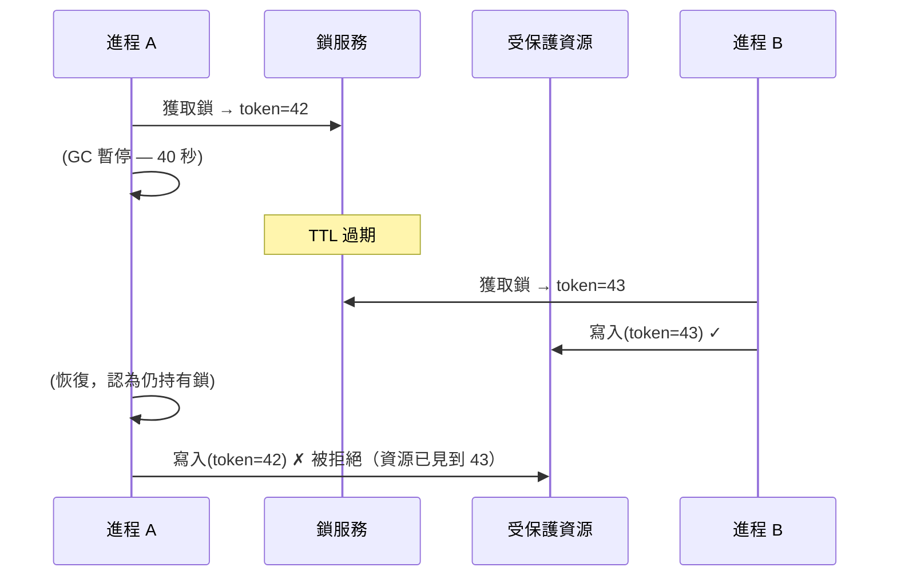

# [BEE-424] 分散式鎖

:::info
分散式鎖在不同機器上的進程之間提供互斥——防止對共享資源的並發寫入——但核心挑戰不在於獲取鎖：而在於確保鎖已靜默過期的進程無法破壞它認為仍在保護的數據。
:::

## Context

在單台機器上，OS 互斥鎖是安全的，因為內核原子性地控制時鐘、進程調度和內存。在分散式系統中，這些保證都不成立。進程可以獲取具有 30 秒 TTL 的鎖，進入垃圾收集暫停 40 秒，恢復後仍認為自己持有鎖——卻發現另一個進程已經獲取了它並開始寫入。兩者現在都認為自己擁有獨佔訪問權。這不是理論上的邊緣案例：在生產 JVM 工作負載中記錄了這樣長度的 GC 暫停，同樣的失敗也可能由 VM 熱遷移、內核交換風暴或 NTP 時鐘跳躍觸發。

GC 暫停場景說明了根本問題：**鎖是有時間限制的租約，而租約持有者無法從內部觀察到自己的租約過期**。任何不考慮這一點的鎖定方案都會產生 TOCTOU（檢查時到使用時）間隙。

Martin Kleppmann 2016 年的文章「如何做分散式鎖」（見參考資料）給出了這個問題的規範性處理。他提出的解決方案是**圍欄令牌**：每次鎖獲取返回一個單調遞增的整數。受保護的資源——數據庫行、文件、外部 API——拒絕任何令牌低於其先前接受的最高令牌的寫入。如果進程 A 持有令牌 33 並在鎖過期後才醒來，但進程 B 已獲取鎖（令牌 34）並用令牌 34 寫入，資源將拒絕 A 的令牌 33 寫入。資源，而非租約持有者，才是誰持有鎖的權威。

實際實現從最輕量到最強一致性保證分為幾個層次：

**數據庫咨詢鎖**是最簡單的選項，當您的應用程式已經使用關係型數據庫時尤為適用。PostgreSQL 提供 `pg_advisory_lock(bigint)`（會話級，阻塞直到獲取）和 `pg_advisory_xact_lock(bigint)`（事務級，在提交/回滾時釋放）。它們不需要外部基礎設施，自然參與連接池，且安全，因為數據庫服務器中介所有獲取。限制是範圍：只有共享同一數據庫實例的進程才能參與。它們不實現圍欄令牌。

**Redis 單實例鎖**使用 `SET resource_name unique_random_value NX EX 30` 原子性地設置一個鍵（僅當它不存在時），TTL 為 30 秒。值必須是唯一的隨機令牌（不是固定字符串），且釋放必須通過 Lua 腳本原子性地完成：

```lua
if redis.call("get", KEYS[1]) == ARGV[1] then
    return redis.call("del", KEYS[1])
else
    return 0
end
```

Lua 腳本防止了這種競態：進程 A 讀取其值，決定匹配，但在刪除之前被搶占——結果刪除了進程 B 的鎖。單實例 Redis 適用於 Redis 節點運維良好且您接受 Redis 故障意味著鎖服務不可用的場景。它不提供圍欄令牌。

**Redlock** 是 Redis 的多節點鎖算法：在時間窗口內從 N 個獨立 Redis 節點的多數（⌊N/2⌋ + 1）獲取鎖。Kleppmann 的 2016 年批評證明，Redlock 的安全性依賴於時序假設——有界網路延遲、有界 GC 暫停、有界 NTP 偏移——這些假設在實踐中會失效。網路分區或時鐘跳躍可能導致兩個客戶端都認為自己持有鎖。Antirez（Redis 的創建者）對此分析提出異議，認為在實踐中時序窗口是安全的。這場爭論未有定論；實際指導是：如果您需要強安全保證且工作負載可以承受，請改用基於共識的系統。

**etcd 租約**和 **ZooKeeper 臨時節點**提供基於共識的鎖定。etcd 存儲具有 TTL 的租約，由 `keepalive` goroutine 刷新；如果客戶端死亡，租約過期，鎖被釋放。ZooKeeper 通過路徑下的臨時順序節點實現鎖定：創建序號最小節點的客戶端持有鎖；每個等待者只監視其前驅（序號次小的節點），避免了當鎖釋放時所有等待者都被喚醒的羊群效應。兩者都在 Raft 或 ZAB 共識日誌之上實現鎖，意味著鎖狀態可以在單個節點故障後存活。它們不原生發出圍欄令牌，但 ZooKeeper 節點的 `czxid`（創建事務 ID）是單調遞增的，可以充當圍欄令牌。

## Design Thinking

**鎖不是安全邊界——資源才是。** 使分散式鎖在任意進程暫停下安全的唯一方法是讓受保護的資源拒絕過期寫入。圍欄令牌要求資源參與協議。如果您無法修改資源（第三方 API、遺留服務），鎖提供的是概率性而非絕對的互斥——要明確地為這種風險做預算。

**將鎖的 TTL 匹配到預期臨界區的持續時間，而非網路超時。** 比臨界區短的鎖 TTL 在負載下會導致自我過期。比臨界區長得多的鎖 TTL 意味著故障需要更長時間恢復。測量負載下臨界區持續時間的 p99，並將 TTL 設置為其 5–10 倍，如果區間可能超過它，則使用顯式租約續期（keepalive）。

**盡可能優先選擇冪等操作而非分散式鎖。** 如果受保護的操作是冪等的——寫入具有已知 ID 的記錄、使用條件檢查更新計數器——您通常可以通過數據庫級別的 `INSERT ON CONFLICT DO NOTHING` 或樂觀並發控制（BEE-245）完全消除鎖。鎖是當操作本身無法變為冪等時的最後手段正確性機制。

## Visual



## Example

**Redis 單實例鎖的獲取和釋放：**

```
# 獲取：SET NX EX — 原子性，僅在鍵不存在時設置
SET inventory_lock:{item_id} "unique-client-id-abc123" NX EX 30

# 返回 OK  → 鎖已獲取
# 返回 nil → 鎖已被持有，重試或快速失敗

# 臨界區：
# ... 更新庫存 ...

# 釋放：Lua 腳本 — 原子性的檢查並刪除
EVAL "
  if redis.call('get', KEYS[1]) == ARGV[1] then
    return redis.call('del', KEYS[1])
  else
    return 0
  end
" 1 inventory_lock:{item_id} unique-client-id-abc123

# 返回 1 → 釋放了自己的鎖
# 返回 0 → 鎖已過期，其他人持有（不要刪除）
```

**帶圍欄令牌的 ZooKeeper 鎖：**

```
# 獲取：創建臨時順序節點
CREATE /locks/inventory/lock- (ephemeral, sequential)
→ /locks/inventory/lock-0000000042

# 列出子節點，按數字排序
GETCHILDREN /locks/inventory → [lock-0000000041, lock-0000000042]

# 我的節點不是最小的 → 監視前驅
WATCH /locks/inventory/lock-0000000041

# 前驅被刪除 → 我現在持有鎖
# 圍欄令牌 = 42（序列號）

# 寫入資源時包含令牌：
resource.write(data, fencing_token=42)  # 資源拒絕如果已見到 > 42
```

## Related BEEs

- [BEE-11006](../concurrency/optimistic-vs-pessimistic-concurrency-control.md) -- 樂觀 vs 悲觀並發控制：樂觀控制（比較並交換、MVCC）通過使衝突可檢測而非防止衝突，為許多工作負載消除了分散式鎖
- [BEE-19002](consensus-algorithms-paxos-and-raft.md) -- 共識演算法：etcd 和 ZooKeeper 在 Raft/ZAB 共識之上實現分散式鎖——理解底層協議解釋了為何它們比 Redis 更安全
- [BEE-8005](../transactions/idempotency-and-exactly-once-semantics.md) -- 冪等性和恰好一次語義：冪等操作通常通過使重複執行無害而非不安全，消除了對分散式鎖的需求
- [BEE-12003](../resilience/timeouts-and-deadlines.md) -- 超時和截止日期：鎖的 TTL 是應用於租約的截止日期；相同的超時大小分析適用

## References

- [如何做分散式鎖 -- Martin Kleppmann, 2016](https://martin.kleppmann.com/2016/02/08/how-to-do-distributed-locking.html)
- [Redlock 安全嗎？-- Salvatore Sanfilippo (antirez), 2016](http://antirez.com/news/101)
- [使用 Redis 的分散式鎖 -- Redis 文檔](https://redis.io/docs/latest/develop/use/patterns/distributed-locks/)
- [配方和保證：鎖 -- Apache ZooKeeper 文檔](https://zookeeper.apache.org/doc/current/recipes.html#sc_recipes_Locks)
- [基於租約的鎖 -- etcd 文檔](https://etcd.io/docs/latest/dev-guide/interacting_v3/)
- [咨詢鎖 -- PostgreSQL 文檔](https://www.postgresql.org/docs/current/explicit-locking.html#ADVISORY-LOCKS)
- [設計數據密集型應用程式，第 8 章 -- Martin Kleppmann, O'Reilly 2017](https://www.oreilly.com/library/view/designing-data-intensive-applications/9781491903063/)
