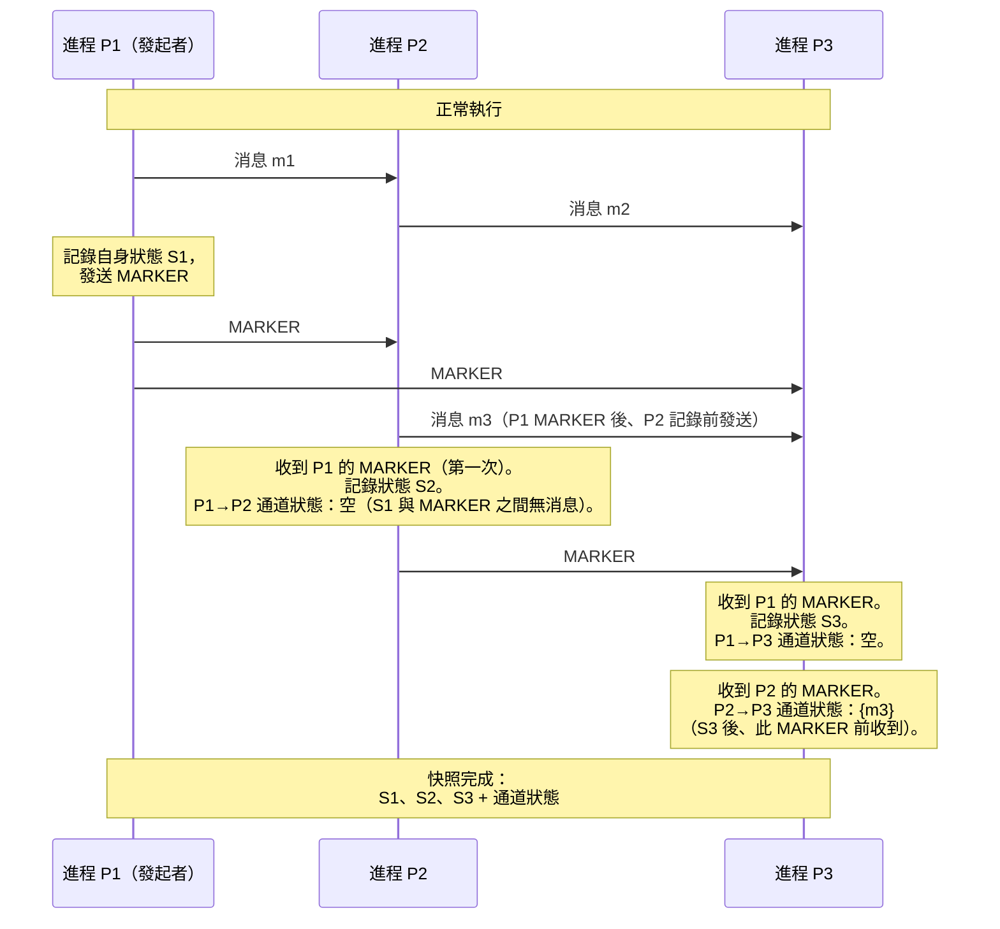

# [BEE-19016] 分散式快照

:::info
分散式快照在不停止執行的情況下，捕獲運行中的分散式系統的一致全局狀態——每個進程的局部狀態以及傳輸中的每條消息——通過使用標記消息來協調每個進程作為同一邏輯瞬間的一部分所記錄的內容。
:::

## Context

記錄單個進程的狀態很簡單：暫停它、複製其內存、恢復。記錄分散式系統的狀態則不然：進程在沒有共享內存的獨立機器上運行，傳輸中的消息既不屬於發送方也不屬於接收方。一個樸素的方法——廣播「停止、記錄狀態、發送給我、恢復」——引入了與集群規模成比例的暫停，並需要一個可靠的協調者。更深的問題是正確性：進程 A 記錄接收了一條消息，而進程 B 尚未記錄發送該消息，這樣的快照是不一致的。它意味著一條被接收但從未發送的消息，這不可能對應任何可達的系統狀態。

K. Mani Chandy 和 Leslie Lamport 在「分散式快照：確定分散式系統的全局狀態」（ACM Transactions on Computer Systems，第 3 卷，第 1 期，1985 年 2 月）中解決了這個問題。該算法只需要 FIFO 通道——消息按發送順序到達——並引入了一種新消息類型：**MARKER**。發起進程記錄自己的狀態並在每條出站通道上發送 MARKER。任何第一次收到 MARKER 的進程都會記錄自己的狀態，將該通道的狀態記錄為空（MARKER 之前沒有傳輸中的消息），然後立即在所有出站通道上發送 MARKER。在通道 C 上收到的任何後續 MARKER 意味著「將 C 的通道狀態記錄為在你記錄自己的狀態之後、此 MARKER 到達之前在 C 上收到的所有消息。」當每個進程在每條入站通道上都收到 MARKER 時，快照完成。該算法與正常執行並發運行——它不暫停系統。

關鍵不變式：因為通道是 FIFO，從進程 P 到達通道 C 的 MARKER 意味著 P 在記錄其狀態之前發送的每條消息都已到達（它們在 MARKER 之前發送，因此在 FIFO 隊列中先於 MARKER）。這保證了快照是一個**一致切割**：每條記錄為已接收的消息也被其發送者記錄為已發送。沒有消息在時間上倒退傳播。

Apache Flink 將此算法改編為**異步屏障快照（ABS）**，由 Carbone、Fóra、Ewen、Haridi 和 Tzoumas 在「分散式數據流的輕量級異步快照」（arXiv:1506.08603，2015 年）中描述。Flink JobManager 不使用 MARKER 消息，而是將**檢查點屏障**注入到記錄之間的數據流中。屏障將流分為快照前和快照後的記錄。當有狀態算子在所有輸入上收到屏障時，它將狀態保存到持久存儲並向下游轉發屏障。一旦屏障到達所有 sink，檢查點完成。Flink 1.11 引入了**非對齊檢查點**（FLIP-76）：算子不等待屏障到達所有輸入後再進行快照（這在反壓下會阻塞處理），而是立即快照其狀態和所有緩衝的傳輸中記錄，允許屏障超越排隊的數據。這以更大的檢查點狀態為代價，降低了負載下的檢查點延遲。

## Design Thinking

**快照服務於不同目的；理解你需要哪種。** Chandy-Lamport 設計用於全局謂詞檢測——在不停止系統的情況下詢問「系統是否曾處於滿足條件 X 的狀態？」Flink 檢查點服務於故障恢復——故障後，恢復最後一個檢查點並重放未處理的輸入。災難恢復快照服務於持久性——定期持久化狀態，使集群重啟無需重放多年的輸入。每種用途對頻率、粒度和存儲有不同要求。

**一致切割與全局同步狀態不同。** 一致切割捕獲系統可能所處的狀態，而不是在單一掛鐘瞬間的狀態。兩個進程MAY（可以）在不同的實際時間記錄其局部狀態，只要不發生因果性違反即可。這對於故障恢復（從因果一致的狀態重放）和全局謂詞檢測是可接受的，但對於需要單一同步瞬間的用例則不然——例如生成用於讀取流量分流的時間點副本——這些需要協調或基於鎖的技術。

**反壓下的屏障對齊是吞吐量問題。** 當流算子有多個輸入時，對齊檢查點（在所有輸入上等待屏障後再快照）在等待慢速輸入上的屏障時，會阻塞快速輸入的處理。在持續反壓下——突發流量中很常見——這MAY（可以）將檢查點延遲幾分鐘並積累無界隊列。非對齊檢查點解決了延遲問題，但增加了快照大小，因為所有緩衝記錄MUST（必須）包含在內。正確的選擇取決於檢查點延遲還是檢查點大小是約束條件。

**檢查點頻率在恢復時間和開銷之間取捨。** 更頻繁的檢查點減少故障後MUST（必須）重放的輸入量，但消耗更多 I/O 和 CPU。不那麼頻繁的檢查點減少開銷但延長恢復時間。對於有下游消費者的流處理管道，需要重放 10 分鐘輸入的故障MAY（可以）違反延遲 SLO。通過計算來確定檢查點間隔的大小：最壞情況下可接受的重放持續時間是多少？

## Visual



## Example

**Flink 檢查點配置和恢復：**

```java
// 在 Flink 流式作業中配置檢查點
StreamExecutionEnvironment env = StreamExecutionEnvironment.getExecutionEnvironment();

// 每 60 秒進行一次檢查點；Flink 將屏障注入流中
env.enableCheckpointing(60_000);

CheckpointConfig config = env.getCheckpointConfig();

// 恰好一次：屏障對齊（默認）
// 使用 AT_LEAST_ONCE 可降低延遲，但接受潛在的重複處理
config.setCheckpointingConsistencyMode(CheckpointingMode.EXACTLY_ONCE);

// 如果檢查點超過 2 分鐘則使作業失敗
config.setCheckpointTimeout(120_000);

// 最多允許 1 個並發檢查點（防止檢查點風暴）
config.setMaxConcurrentCheckpoints(1);

// 保留最後 3 個檢查點用於手動恢復
config.setExternalizedCheckpointCleanup(
    ExternalizedCheckpointCleanup.RETAIN_ON_CANCELLATION);
config.setNumRetainedSuccessfulCheckpoints(3);

// 非對齊檢查點：降低反壓下的檢查點延遲
// （Flink 1.11+；增加檢查點大小——使用前請進行基準測試）
config.enableUnalignedCheckpoints();

// 狀態後端：檢查點之間算子狀態的存儲位置
// 大狀態使用 RocksDB；小/中狀態使用 HashMapStateBackend
env.setStateBackend(new EmbeddedRocksDBStateBackend());

// 遠程檢查點存儲（例如 S3、HDFS）
// 跨集群重啟恢復所必需
env.getCheckpointConfig().setCheckpointStorage("s3://my-bucket/flink-checkpoints/");
```

**手動 Chandy-Lamport 快照（偽代碼）：**

```python
# 需要 FIFO 通道——使用 TCP 或有序消息隊列

class Process:
    def initiate_snapshot(self):
        self.record_local_state()
        self.snapshot_initiated = True
        self.channel_state = {}
        # 將所有通道標記為「記錄中」——跟蹤此後到達的消息
        for channel in self.outgoing_channels:
            channel.send(MARKER)

    def on_message(self, msg, channel):
        if msg == MARKER:
            if not self.snapshot_initiated:
                # 收到第一個 MARKER：記錄自身狀態，將此通道記錄為空
                self.record_local_state()
                self.snapshot_initiated = True
                self.channel_state = {channel: []}  # 空——MARKER 之前無傳輸中消息
                # 在所有其他出站通道上轉發 MARKER
                for c in self.outgoing_channels:
                    c.send(MARKER)
            else:
                # 已在記錄：此通道的傳輸中消息現在已知
                # channel_state[channel] = 自記錄狀態以來收到的消息
                self.channel_state[channel] = self.recording_buffer[channel]
                self.recording_buffer[channel] = None  # 停止記錄此通道
                # 當所有入站通道都已發送 MARKER 時，快照完成
                if all(ch in self.channel_state for ch in self.incoming_channels):
                    self.snapshot_complete()
        else:
            if self.snapshot_initiated and channel not in self.channel_state:
                # 記錄階段：緩衝在 MARKER 之前到達此通道的消息
                self.recording_buffer.setdefault(channel, []).append(msg)
            self.deliver(msg)
```

## Related BEEs

- [BEE-19002](consensus-algorithms-paxos-and-raft.md) -- 共識演算法：Raft 和 Paxos 使用日誌複製而非快照進行故障恢復，但 Raft 的 `InstallSnapshot` RPC 用於在不重放完整日誌的情況下使滯後的跟隨者跟上進度——這是在共識協議中快照的有針對性應用
- [BEE-10003](../messaging/delivery-guarantees.md) -- 交付保證：Flink 的恰好一次處理保證將檢查點（源自 Chandy-Lamport）與外部 sink 的兩階段提交結合——檢查點屏障承載事務邊界
- [BEE-10004](../messaging/event-sourcing.md) -- 事件溯源：事件溯源系統面臨同樣的恢復時間問題——從頭重放完整事件日誌很慢；定期快照（事件 N 時的狀態）將重放截斷到快照之後的事件
- [BEE-19011](write-ahead-logging.md) -- 預寫日誌：數據庫使用 WAL 檢查點的原因與 Flink 使用定期快照的原因相同——限制崩潰後MUST（必須）重放的日誌量；兩者都是快照-然後-重放模式的應用

## References

- [分散式快照：確定分散式系統的全局狀態 -- Chandy and Lamport, ACM TOCS 1985](https://dl.acm.org/doi/10.1145/214451.214456)
- [Chandy-Lamport 論文 PDF -- Leslie Lamport 的存檔](https://lamport.azurewebsites.net/pubs/chandy.pdf)
- [分散式數據流的輕量級異步快照 -- Carbone 等人, arXiv 2015](https://arxiv.org/abs/1506.08603)
- [通過狀態快照的容錯 -- Apache Flink 文檔](https://nightlies.apache.org/flink/flink-docs-master/docs/learn-flink/fault_tolerance/)
- [FLIP-76：非對齊檢查點 -- Apache Flink Wiki](https://cwiki.apache.org/confluence/display/FLINK/FLIP-76:+Unaligned+Checkpoints)
- [從對齊到非對齊檢查點 -- Apache Flink 博客, 2020](https://flink.apache.org/2020/10/15/from-aligned-to-unaligned-checkpoints-part-1-checkpoints-alignment-and-backpressure/)
