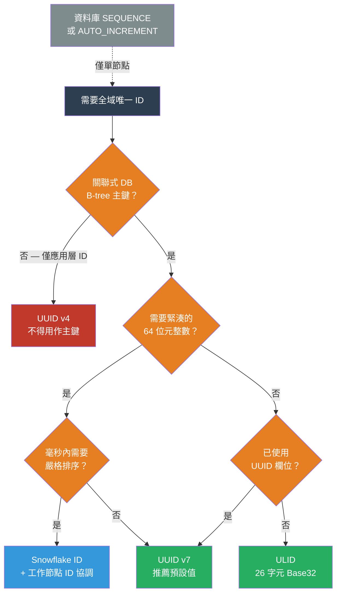

# [BEE-19031] 分散式唯一 ID 生成

:::info
每個分散式系統都需要全域唯一識別碼。挑戰在於如何在沒有中央協調器的情況下生成它們——並且以不破壞資料庫寫入效能、不洩漏敏感資訊、不破壞自然排序的方式做到這一點。
:::

## 背景

最早的方案是資料庫自動遞增欄位。在單節點設定中，它完美運作：資料庫保證唯一性，且循序整數對 B-tree 索引而言是理想的。問題出現在寫入分散於多個主節點，或 ID 必須在資料庫插入前於應用層生成的情況——這兩種情境都無法在沒有協調的情況下使用單一原子計數器。

**UUID v4** 於 RFC 4122（2005）中引入，透過生成 122 位元的密碼學隨機數解決了協調問題。它成為大多數 Web 應用程式的預設分散式 ID。然而，其隨機性對關聯式資料庫而言是一場隱性的效能災難：以隨機 UUID 作為主鍵插入時，寫入位置分散在整個 B-tree 中，與循序插入相比，造成多達 500 倍的頁面分裂（page split）。每次頁面分裂都需要資料庫獲取鎖定、重新平衡節點並寫入額外的頁面——這種寫入放大（write amplification）效應在負載下不斷累積。

2010 年，Twitter 發布了 **Snowflake** 格式，以在擴展超出單一資料庫節點時取代資料庫序列生成器。一個 64 位元的 Snowflake ID 在高位元中編碼毫秒精度的時間戳、中間編碼工作節點 ID、低位元中編碼每節點序列計數器。高位元時間戳使 Snowflake ID 大致按時間排序，且緊湊到可以放入 `BIGINT` 欄位。代價是協調：每個工作節點必須被分配一個唯一的工作節點 ID，這需要一個運維流程（通常透過 ZooKeeper 或設定服務）。

**ULID**（Universally Unique Lexicographically Sortable Identifier，通用唯一可字典序排列識別碼）採取不同的方式：使用相同的 48 位元毫秒時間戳，但將剩餘 80 位元填充密碼學隨機數，而非工作節點序列。無需協調，但隨機性意味著同一毫秒內來自兩個不同節點的 ULID 相互之間沒有嚴格排序。

**UUID v7** 在 RFC 9562（2024 年 5 月）中標準化，將時間排序引入官方 UUID 標準。UUID v7 使用毫秒為單位的 48 位元 Unix 紀元時間戳，後跟 74 位元的隨機數，以標準 UUID 帶連字號格式編碼。它與 ULID 具有相同的無協調特性，但可以原生適用於任何已處理 UUID 的系統，包括 PostgreSQL 的 `uuid` 欄位類型和大多數 ORM 庫。

## 設計思維

根本張力在於**協調**（嚴格排序和緊湊性所需）與**獨立性**（容錯和簡單性所需）之間的取捨。

### 結構比較

| 格式 | 位元數 | 時間戳精度 | 排序 | 協調 | 存儲 |
|---|---|---|---|---|---|
| UUID v4 | 128 | 無 | 無 | 無 | 16 位元組 / 36 字元 |
| UUID v7 | 128 | 1 毫秒 | 毫秒級 | 無 | 16 位元組 / 36 字元 |
| ULID | 128 | 1 毫秒 | 毫秒級 | 無 | 16 位元組 / 26 字元 |
| Snowflake | 64 | 1 毫秒 | 每節點嚴格 | 工作節點 ID 分配 | 8 位元組 / ~19 字元 |
| UUID v1 | 128 | 100 奈秒 | UUID 排序* | 無（但洩露 MAC） | 16 位元組 / 36 字元 |

*UUID v1 的位元組順序將時間欄位排列為非字典序排列；UUID v6 重新排列相同的位元以修正此問題。

### B-tree 論點

當 UUID v4 用作主鍵時，每次插入都落在 B-tree 葉子層的偽隨機位置。該位置的葉子頁面很可能已滿（因為它在之前的隨機插入期間被寫入）。資料庫必須分裂頁面、寫入兩個新頁面、更新父節點——如果父節點也滿了——則向上級聯分裂。在寫入密集型工作負載下，這種級聯行為會造成：

- 寫入放大：每次邏輯插入 5-10 次物理寫入
- 快取抖動：熱頁的工作集跨越整個索引，而非僅在最近的末尾
- 索引膨脹：分裂的頁面在隨機插入工作負載中永遠不會再被完全利用

時間有序 ID（UUID v7、ULID、Snowflake）總是追加到 B-tree 最右側的葉子節點。熱頁保留在緩衝池中，分裂罕見且單向，填充因子（fill factor）保持高位。

### 無協調對大多數系統已足夠

嚴格的每 ID 排序（Snowflake 的保證）很少是必需的。大多數應用程式需要的是「較晚生成的 ID 通常應排在較早生成的 ID 之後。」UUID v7 和 ULID 在毫秒粒度上滿足這一點，對於分頁、基於游標的訂閱源和稽核日誌已足夠。嚴格排序需要中央序列或具有已知工作節點邊界的每節點序列——兩者都增加了運維複雜性。SHOULD（應該）選擇無協調格式，除非毫秒內嚴格排序是有文件記錄的需求。

## 最佳實踐

**MUST NOT（不得）將 UUID v4 作為具有 B-tree 索引的關聯式資料庫的主鍵。** 隨機插入造成的寫入放大在持續寫入負載下會顯著降低效能。請改用 UUID v7、ULID 或 Snowflake。

**SHOULD（應該）對已使用 UUID 的新系統使用 UUID v7 作為預設值。** UUID v7 是 RFC 9562 標準，PostgreSQL 17+ 原生支援（`gen_random_uuid()` 仍生成 v4；使用 `uuidv7()` 或應用層生成），且可以無縫替換任何預期 UUID 欄位的地方。其 74 位元的隨機性為所有實際分散式系統提供了足夠的碰撞抵抗力。

**SHOULD（應該）在需要存儲緊湊性或毫秒內嚴格排序時使用 Snowflake ID。** 64 位元 `BIGINT` 佔用的存儲空間是 128 位元 UUID 的一半，這對於寬表和大型索引很重要。Snowflake 還透過序列計數器提供每工作節點毫秒內的嚴格排序。運維成本是工作節點 ID 管理——使用輕量協調服務（etcd、ZooKeeper 或資料庫表）來租用工作節點 ID，並在節點重啟時實作隔離（fencing）。

**MUST NOT（不得）在新系統中使用 UUID v1。** UUID v1 在低位元中嵌入了生成主機的 MAC 位址，這洩露了網路拓撲資訊並產生可預測性。UUID v6 重新排列 UUID v1 的位元以實現字典序排列，但保留了 MAC 位址問題。RFC 9562 建議新應用程式不要使用這兩者。

**MUST（必須）在用於分頁或訂閱源排序的 ID 中包含時間戳組件。** 純隨機 ID（UUID v4）不能用作時間有序訂閱源中的游標——應用程式必須維護單獨的 `created_at` 欄位並使用複合游標。時間有序 ID 將創建時間編碼在 ID 本身中，實現單欄位游標分頁。

**SHOULD（應該）在單一進程中的 ULID 生成中包含單調模式。** ULID 規範定義了一種單調模式：如果在同一毫秒內生成兩個 ULID，第二個的隨機組件遞增 1 而非重新生成。這確保來自同一生成器的 ULID 即使在毫秒內也嚴格有序，防止單節點稽核日誌中的反轉。

## 視覺圖



## 範例

**UUID v7 生成（應用層）：**

```python
import os
import time
import struct

def generate_uuid_v7() -> str:
    """
    生成 UUID v7（RFC 9562）：48 位元毫秒時間戳 + 版本 + 74 位元隨機數。
    可字典序排列，無需協調。
    """
    ms = int(time.time() * 1000)  # 48 位元毫秒時間戳

    # 16 位元組：時間戳（6）+ 版本半位元組（1）+ 隨機數（9）
    rand = os.urandom(10)

    # 將 48 位元時間戳打包到前 6 位元組
    ts_bytes = struct.pack(">Q", ms)[2:]  # 捨棄頂部 2 位元組

    # 位元組 6：高半位元組為版本 7（0111），低半位元組為 4 位隨機數
    ver_byte = (0x70) | (rand[0] & 0x0F)

    # 位元組 8：變體位元 10xxxxxx
    var_byte = (0x80) | (rand[1] & 0x3F)

    raw = ts_bytes + bytes([ver_byte, rand[2]]) + bytes([var_byte]) + rand[3:10]

    # 格式化為標準 UUID 字串
    hex_str = raw.hex()
    return f"{hex_str[:8]}-{hex_str[8:12]}-{hex_str[12:16]}-{hex_str[16:20]}-{hex_str[20:]}"

# 較晚生成的 ID 總是排在較早生成的 ID 之後（毫秒粒度）
id1 = generate_uuid_v7()
time.sleep(0.001)
id2 = generate_uuid_v7()
assert id1 < id2  # 字典序排列 == 時間順序
```

**Snowflake ID 生成器（使用工作節點 ID）：**

```python
import time
import threading

class SnowflakeGenerator:
    """
    Twitter Snowflake：41 位元時間戳 | 10 位元工作節點 | 12 位元序列
    紀元：2010-11-04T01:42:54.657Z（Twitter 原始紀元）
    上限：~69 年、1023 個工作節點、每工作節點每毫秒 4096 個 ID
    """
    EPOCH_MS = 1288834974657
    WORKER_BITS = 10
    SEQUENCE_BITS = 12
    MAX_SEQUENCE = (1 << SEQUENCE_BITS) - 1   # 4095
    MAX_WORKER = (1 << WORKER_BITS) - 1       # 1023

    def __init__(self, worker_id: int):
        if not 0 <= worker_id <= self.MAX_WORKER:
            raise ValueError(f"worker_id 必須在 0-{self.MAX_WORKER} 之間")
        self.worker_id = worker_id
        self.sequence = 0
        self.last_ms = -1
        self._lock = threading.Lock()

    def next_id(self) -> int:
        with self._lock:
            ms = int(time.time() * 1000) - self.EPOCH_MS
            if ms == self.last_ms:
                self.sequence = (self.sequence + 1) & self.MAX_SEQUENCE
                if self.sequence == 0:
                    # 序列耗盡：等待下一毫秒
                    while ms <= self.last_ms:
                        ms = int(time.time() * 1000) - self.EPOCH_MS
            else:
                self.sequence = 0
            self.last_ms = ms
            return (ms << 22) | (self.worker_id << 12) | self.sequence

# 使用方式：啟動時透過協調服務分配 worker_id
gen = SnowflakeGenerator(worker_id=1)
id1 = gen.next_id()
id2 = gen.next_id()
assert id1 < id2  # 保證工作節點內嚴格排序
```

**ULID 單調生成：**

```python
import os
import time

class ULIDGenerator:
    """
    ULID：48 位元毫秒時間戳（Crockford Base32）+ 80 位元隨機數
    單調模式：在同一毫秒內遞增隨機位元。
    """
    ENCODING = "0123456789ABCDEFGHJKMNPQRSTVWXYZ"

    def __init__(self):
        self._last_ms = -1
        self._last_random = 0

    def _encode(self, n: int, length: int) -> str:
        chars = []
        for _ in range(length):
            chars.append(self.ENCODING[n & 0x1F])
            n >>= 5
        return "".join(reversed(chars))

    def generate(self) -> str:
        ms = int(time.time() * 1000)
        if ms == self._last_ms:
            # 單調遞增：防止同一毫秒內的反轉
            self._last_random += 1
        else:
            self._last_ms = ms
            self._last_random = int.from_bytes(os.urandom(10), "big")

        ts_part = self._encode(ms, 10)         # 48 位元 → 10 個 Base32 字元
        rand_part = self._encode(self._last_random & ((1 << 80) - 1), 16)  # 80 位元 → 16 字元
        return ts_part + rand_part
```

## 相關 BEE

- [BEE-19005](distributed-locking.md) -- 分散式鎖定：Snowflake 工作節點 ID 分配在啟動時需要分散式鎖定或租約，以防止兩個節點聲明相同的工作節點 ID
- [BEE-19017](lease-based-coordination.md) -- 基於租約的協調：為分配和更新 Snowflake 工作節點 ID 的推薦機制，無需永久協調器
- [BEE-19027](b-tree-internals.md) -- B-Tree 內部機制：解釋了為何隨機主鍵會造成頁面分裂和寫入放大；為偏好時間有序 ID 提供了機械性的理由
- [BEE-19008](clock-synchronization-and-physical-time.md) -- 時鐘同步與物理時間：UUID v7、ULID 和 Snowflake 都依賴掛鐘時間；NTP 漂移和時鐘偏斜可能在各節點間造成 ID 反轉
- [BEE-19028](fencing-tokens.md) -- 隔離令牌：單調遞增的 ID（Snowflake）在需要資源保護的排序保證時，可以作為隔離令牌使用

## 參考資料

- [Announcing Snowflake -- Twitter Engineering Blog (2010)](https://blog.twitter.com/engineering/en_us/a/2010/announcing-snowflake)
- [RFC 9562: Universally Unique IDentifiers (UUIDs) -- IETF (2024 年 5 月)](https://www.rfc-editor.org/rfc/rfc9562.html)
- [ULID 規範 -- github.com/ulid/spec](https://github.com/ulid/spec)
- [時間可排序識別碼：UUIDv7、ULID 和 Snowflake 比較 -- Authgear](https://www.authgear.com/post/time-sortable-identifiers-uuidv7-ulid-snowflake)
- [避免 UUID Version 4 主鍵 -- Andy Atkinson](https://andyatkinson.com/avoid-uuid-version-4-primary-keys)
- [無狀態 Snowflake：雲端不可知的分散式 ID 生成器 -- arXiv (2024)](https://arxiv.org/pdf/2512.11643)
