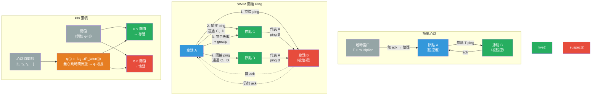

# [BEE-434] 故障檢測

:::info
故障檢測是分散式系統的問題——判斷遠程進程是已崩潰還是僅僅響應緩慢——在異步網絡中沒有完美解決方案，但實際系統通過心跳、概率懷疑和間接探測來在檢測速度和假陽性率之間取得平衡。
:::

## Context

理論邊界由 Fischer、Lynch 和 Paterson 在「含一個故障進程的分散式共識的不可能性」（JACM，1985 年）中確立——即 FLP 不可能性結果。在純異步消息傳遞系統中，無任何時序假設，已崩潰的進程與極度緩慢的進程無法區分。消息MAY（可以）被延遲任意長時間。任何算法都無法在有限時間內可靠地檢測崩潰而不冒誤報風險。該論文獲得了 2001 年 Dijkstra 獎，被評為分散式計算中最具影響力的論文。

Chandra 和 Toueg 在「可靠分散式系統的不可靠故障檢測器」（JACM，1996 年）中回應，將故障檢測器定義為一種具有兩個屬性的抽象：**完整性**（每個崩潰的進程最終都會被懷疑）和**準確性**（不會永久懷疑任何存活的進程）。完美的故障檢測器同時具備兩者；FLP 結果證明純異步系統中不可能存在完美的故障檢測器。Chandra 和 Toueg 表明，即使是最終準確的檢測器——MAY（可以）懷疑存活節點，但最終會停止懷疑——也足以解決共識問題。這將工程問題從「如何完美檢測崩潰？」轉移到「如何使故障檢測足夠好以滿足使用它的算法？」

實際系統使用三種主要方法。**基于心跳的檢測**最為簡單：被監控進程定期發送信號；如果監控器在超時窗口內未收到任何信號，則懷疑該進程已死亡。張力在于設置超時：太短在網絡擁塞時導致假陽性；太長延遲檢測並延長不可用時間。正確的超時取決于網絡 RTT 方差，這與環境有關（局域網 vs. 廣域網 vs. 雲端 VPC），且可能隨時間變化。

**SWIM**（可擴展弱一致性感染式成員協議），由 Das、Gupta 和 Motivala 在 DSN 2002 上描述，解決了大型集群中全對心跳的 O(n²) 消息複雜度問題。每個節點不是對每個其他節點進行 ping，而是每輪隨機選擇一個對等方進行 ping。如果在超時內未收到確認，節點不是立即宣佈對等方死亡，而是請求 k 個其他隨機選擇的對等方獨立 ping 被懷疑的節點（間接 ping）。只有在沒有間接 ping 成功的情況下，節點才將對等方標記為失敗。成員更新（加入、離開、故障）通過搭載在 ping 和 ack 消息上進行傳播——即「感染式」部分——每輪用 O(n) 條消息實現 O(log n) 傳播時間。HashiCorp 的 `memberlist` 庫實現了帶有額外 Lifeguard 擴展的 SWIM，為廣域網提供更好的健壯性；它為 Consul、Nomad 和 Serf 提供支持。

**phi (ϕ) 累積故障檢測器**，由 Hayashibara、Défago、Yared 和 Katayama 在 SRDS 2004 上描述，用連續的懷疑值替換二元的健康/死亡輸出。它不使用固定超時，而是對心跳的到達間隔時間分佈（近似為指數或高斯分佈）進行建模，並輸出 φ(t) = −log₁₀(P_later(t))，其中 P_later(t) 是在給定歷史分佈的情況下，心跳在當前時間 t 之後到達的概率。隨著時間在沒有心跳的情況下流逝，φ 從 0 增長到無窮大。應用程序設置自己的閾值——Cassandra 的 `phi_convict_threshold` 默認為 8，意味著當合法心跳延遲的概率降至 10⁻⁸ 以下時，節點被懷疑。高延遲環境（廣域網、EC2）通常使用 10–12。這種方法適應不斷變化的網絡條件：如果到達間隔分佈已經顯示出高方差，節點遭受瞬時擁塞會導致 φ 上升更緩慢，在不調整靜態超時的情況下減少假陽性。

## Design Thinking

**在主動和被動檢測之間進行選擇。** 主動檢測（心跳、探測）由監控器發起；它能捕獲緩慢或靜默崩潰的進程，但成本與集群大小成比例。被動檢測（異常值檢測、錯誤率監控）從觀察到的請求失敗推斷健康狀態，無需額外流量，但只能檢測通過正常流量可見的故障——一個接受連接但在某個端點上永遠掛起的節點MAY（可以）不被檢測到。生產系統結合兩者：Kubernetes 使用主動存活探測捕獲掛起的進程，使用被動就緒探測繞過緩慢的進程。

**將存活性與就緒性分開。** 進程**存活**是指它未崩潰且其運行時是功能性的。進程**就緒**是指它可以處理當前工作負載。存活的進程MAY（可以）不就緒（數據庫連接池耗盡、緩存預熱進行中、嚴重 GC 暫停）。混淆這兩者導致不必要的重啟（Kubernetes 殺死一個存活但短暫未就緒的容器）或失敗的請求（將流量路由到一個就緒但即將崩潰的容器）。為每個屬性定義不同的故障檢測器實例。

**明確調整假陽性取捨。** 每個故障檢測器都有一個檢測時間 vs. 假陽性率曲線。縮短超時或降低 phi 閾值能更快檢測故障，但增加了存活節點被錯誤懷疑的速率。分散式數據庫中的假陽性導致不必要的領導者選舉、數據重新分佈和複製風暴。在 Cassandra 中，假陽性聲明會導致該節點提供的所有數據被重新路由到其他副本，增加其負載。在 EC2 或 Kubernetes 上存在網絡抖動時，phi_convict_threshold 8 是保守的；5 MAY（可以）導致假性抖動。

**將網絡分區與節點崩潰區別對待。** 心跳超時無法區分崩潰的節點和分區但存活的節點。如果系統在兩種情況下行為相同（將節點標記為死亡並重新分配其工作），當分區癒合而被假定死亡的節點仍在寫入時，MAY（可以）違反正確性。這就是腦裂問題。Raft 等系統通過要求節點在失去仲裁聯繫時停止服務寫入來解決它，防止分區節點出現分歧。故障檢測本身不能解決這個問題——它MUST（必須）與隔離機制（見 BEE-424 分散式鎖）或共識協議結合使用。

## Visual



## Example

**Phi 累積閾值調整（Cassandra）：**

```yaml
# cassandra.yaml
# phi_convict_threshold：控制故障檢測器靈敏度
# 默認：8
# 範圍：5（非常靈敏，快速檢測）到 16（非常寬容，慢速檢測）
# φ(t) = -log₁₀(P_later(t))
# 在閾值 8 時：當合法延遲的概率 < 10⁻⁸ 時節點被懷疑

phi_convict_threshold: 8   # 默認——適合同一數據中心、低抖動
# phi_convict_threshold: 12  # EC2、廣域網或高抖動網絡
# phi_convict_threshold: 5   # 低延遲本地集群，需要快速故障切換

# Gossip 間隔也很重要：
# gossip_interval_in_ms: 1000  # 節點 gossip（和心跳）的頻率
# 節點大約在以下時間後被懷疑：
# detection_time ≈ phi_convict_threshold × gossip_interval / log(10)
# 在閾值 8、間隔 1s 時：≈ 8 × 1000 / 2.3 ≈ 3.5s + 方差
```

**Kubernetes 存活探測 vs. 就緒探測：**

```yaml
# 將存活性（進程健康）與就緒性（流量接受）分開

livenessProbe:
  httpGet:
    path: /healthz      # 如果 JVM/運行時存活則返回 200
    port: 8080
  initialDelaySeconds: 30   # 允許啟動時間
  periodSeconds: 10
  failureThreshold: 3        # 3 次連續失敗 → 重啟容器
  # 超時太短在 GC 或高負載期間導致假重啟

readinessProbe:
  httpGet:
    path: /ready        # 僅在連接和緩存預熱時返回 200
    port: 8080
  initialDelaySeconds: 10
  periodSeconds: 5
  failureThreshold: 2        # 2 次連續失敗 → 從負載均衡器移除
  # 不重啟——只是停止路由流量直到探測再次通過

startupProbe:
  httpGet:
    path: /healthz
    port: 8080
  failureThreshold: 30       # 30 × 10s = 最多 5 分鐘用於初始啟動
  periodSeconds: 10
  # 啟動期間禁用存活/就緒探測——防止啟動緩慢時被殺死
```

**SWIM 風格的間接 ping（偽代碼）：**

```python
# 每個節點每輪 gossip 運行此循環
PROBE_INTERVAL = 1.0   # 秒
INDIRECT_K = 3          # 請求間接 ping 的節點數量
SUSPECT_TIMEOUT = 5.0   # 宣告失敗前的秒數

def gossip_round(self):
    target = random.choice(self.members)

    if self.ping(target, timeout=0.5):
        target.status = ALIVE
        return

    # 直接 ping 失敗——請求 k 個其他節點嘗試
    helpers = random.sample([m for m in self.members if m != target], k=INDIRECT_K)
    acks = [self.indirect_ping(helper, target, timeout=1.0) for helper in helpers]

    if any(acks):
        # 至少有一個幫助者到達了目標——它還存活，我們有網絡問題
        target.status = ALIVE
        return

    # 沒有直接或間接確認——標記為懷疑，啟動計時器
    target.status = SUSPECT
    target.suspect_since = now()

    # 如果超時後仍然懷疑 → 宣告失敗，gossip 給集群
    if now() - target.suspect_since > SUSPECT_TIMEOUT:
        target.status = FAILED
        self.disseminate(FailureEvent(target))  # 搭載在下一個 ping/ack 上
```

## Related BEEs

- [BEE-19002](consensus-algorithms-paxos-and-raft.md) -- 共識演算法：Raft 使用基於心跳的故障檢測進行領導者選舉——如果跟隨者在選舉超時內未收到心跳，則啟動選舉；FLP 不可能性在這裡同樣適用，這就是為什麼 Raft 使用隨機化超時來打破對稱性
- [BEE-19004](gossip-protocols.md) -- Gossip 協議：SWIM 的感染式成員傳播是一種 Gossip 協議；故障事件通過搭載在用於探測的相同 ping/ack 消息上，在 O(log n) 輪內傳播
- [BEE-19005](distributed-locking.md) -- 分散式鎖：故障檢測告訴你鎖持有者已死亡；隔離令牌（單調遞增的鎖版本）防止被假定死亡的持有者在恢復後完成寫入，解決了故障檢測單獨無法防止的腦裂問題
- [BEE-19014](quorum-systems-and-nwr-consistency.md) -- 仲裁系統與 NWR 一致性：Cassandra 使用 phi 累積故障檢測來決定副本何時死亡；一旦死亡，讀寫繞過它使用仲裁；phi 閾值直接影響在故障切換之前過時路由持續多長時間

## References

- [含一個故障進程的分散式共識的不可能性 -- Fischer, Lynch, Paterson, JACM 1985](https://dl.acm.org/doi/10.1145/3149.214121)
- [可靠分散式系統的不可靠故障檢測器 -- Chandra and Toueg, JACM 1996](https://dl.acm.org/doi/10.1145/226643.226647)
- [SWIM：可擴展弱一致性感染式進程組成員協議 -- Das, Gupta, Motivala, DSN 2002](https://ieeexplore.ieee.org/document/1028914/)
- [SWIM 論文 PDF -- Cornell University](https://www.cs.cornell.edu/projects/Quicksilver/public_pdfs/SWIM.pdf)
- [Phi 累積故障檢測器 -- Hayashibara, Défago, Yared, Katayama, SRDS 2004](https://ieeexplore.ieee.org/document/1353004/)
- [memberlist：實現 SWIM 的 Go 庫 -- HashiCorp](https://github.com/hashicorp/memberlist)
- [配置存活、就緒和啟動探測 -- Kubernetes 文檔](https://kubernetes.io/docs/tasks/configure-pod-container/configure-liveness-readiness-startup-probes/)
- [異常值檢測 -- Envoy Proxy 文檔](https://www.envoyproxy.io/docs/envoy/latest/intro/arch_overview/upstream/outlier)
