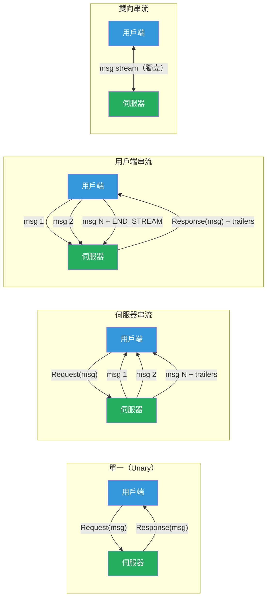

# [BEE-465] gRPC 串流模式

:::info
gRPC 提供四種 RPC 類型——單一（unary）、伺服器串流（server streaming）、用戶端串流（client streaming）和雙向串流（bidirectional streaming）——每種類型適用於不同的通訊模式；選錯類型會浪費連線、破壞流量控制，或在應該使用推送的地方強迫使用輪詢。
:::

## 背景

HTTP/1.1 的請求-回應模型本質上是半雙工（half-duplex）的：用戶端發送請求，伺服器回應，連線要麼被重用於下一次請求，要麼被關閉。對於某一方持續產生資料的服務間通訊——串流聚合服務推送事件、機器學習推論服務逐幀處理影片，或聊天服務中繼訊息——這個模型要求輪詢（N 次請求對應 N 次更新）或長輪詢（伴隨複雜的逾時和重連邏輯）。

gRPC 由 Google 於 2015 年開源，建立在 HTTP/2（RFC 7540）之上，可在單一 TCP 連線上實現全雙工多工串流。一個 HTTP/2 連線同時承載多個邏輯串流；每個串流是雙向的，支援任意訊息分幀，並在串流和連線兩個層級都有流量控制。gRPC 將四種 RPC 類型直接對應到 HTTP/2 串流：單一 RPC 使用一個請求 DATA 幀和一個回應 DATA 幀；伺服器串流 RPC 使用一個請求 DATA 幀和 N 個回應 DATA 幀；雙向串流同時保持兩個 DATA 幀序列都是開放的。

此架構提供了 HTTP/1.1 在不借助 hack 手段時無法實現的功能：伺服器可以在資料產生的瞬間推送；用戶端可以不等待伺服器完成就串流上傳；雙方可以同時傳送和取消。代價是複雜性：串流 RPC 有生命週期（開啟 → 半關閉 → 關閉）、錯誤語義（狀態碼在 HTTP/2 尾端 trailers 中到達，而非在標頭中），以及必須管理以避免死鎖的流量控制視窗。

## 設計思維

### 選擇正確的 RPC 類型

| RPC 類型 | 用戶端傳送 | 伺服器傳送 | 使用時機 |
|---|---|---|---|
| **單一（Unary）** | 1 則訊息 | 1 則訊息 | 請求-回應：CRUD、驗證、查詢 |
| **伺服器串流** | 1 則訊息 | N 則訊息 | 伺服器有超過單次回應容量的資料：大型結果集、即時推送、日誌追蹤 |
| **用戶端串流** | N 則訊息 | 1 則訊息 | 用戶端有超過單次請求容量的資料：檔案上傳、感測器資料攝取、批次寫入 |
| **雙向串流** | N 則訊息 | N 則訊息 | 傳送/接收獨立進行：聊天、即時協作、遊戲狀態同步 |

決策關鍵：任何一方是否需要在同一次交換中傳送多於一則邏輯訊息？若是，使用串流。來自每一方的訊息序列是否獨立交錯（而非請求/回應配對）？若是，使用雙向串流而非交替的伺服器/用戶端串流。

雙向串流功能強大，但在操作上更複雜。當只有一方需要傳送多則訊息時，優先選擇伺服器或用戶端串流。單一 RPC 更易於實作、除錯和觀測——預設使用它。

### HTTP/2 流量控制

gRPC 繼承了 HTTP/2 在兩個層級的滑動視窗流量控制：

**連線層級**：限制一個連線上所有串流的飛行中（in-flight）位元組總量（RFC 7540 預設為 65,535 位元組；大多數實作透過 SETTINGS 幀將其增加至 1–16 MB）。

**串流層級**：限制單一串流的飛行中位元組（同樣預設 65,535 位元組）。傳送方不能傳輸超過接收方通告視窗允許的資料量。接收方在處理資料後，透過傳送 WINDOW_UPDATE 幀來增加視窗。

慢速消費者會自動減慢生產者的速度——這就是背壓（backpressure）。若伺服器串流 RPC 的資料產生速度超過用戶端的讀取速度，當串流視窗填滿後，伺服器的寫入會阻塞。gRPC-Go 透過 `stream` 的 `Send` 方法實現阻塞；gRPC-Java 透過 `StreamObserver` 上的 `isReady()` 檢查串流視窗是否非零，再決定是否傳送。若生產者忽略 `isReady()`，訊息會在程序記憶體中排隊，而非等待 HTTP/2 背壓觸發，最終導致傳送方記憶體耗盡。

### 截止時間傳播

每個 gRPC 呼叫在 `grpc-timeout` HTTP/2 標頭中攜帶一個截止時間（deadline，絕對 UTC 時間）。截止時間代表呼叫方願意等待的總掛鐘時間，而非每跳的逾時。收到請求的服務必須（MUST）將剩餘截止時間傳播到它發起的所有下游 gRPC 呼叫，而不是設定一個新的逾時。未能傳播截止時間會導致下游服務在上游呼叫方已超時並繼續其他工作後，仍繼續執行——浪費資源並產生孤立的副作用。

gRPC 程式庫為此提供了 context 傳播機制。在 Go 中，`context.WithDeadline` 或 `context.WithTimeout` 被傳遞給每個下游呼叫。在 Java 中，使用 grpc-java 內建截止時間傳播時，攔截器鏈會自動傳播截止時間。在 Python 中，`asyncio` context 或 `grpc.aio` API 攜帶截止時間。

### 串流中的錯誤處理

gRPC 在串流 RPC 中的錯誤以 HTTP/2 尾端（trailers，在所有 DATA 幀之後）的形式到達，而非在回應標頭中。最終狀態是帶有 `grpc-status` 的尾端，包含已定義的狀態碼之一（`OK`、`CANCELLED`、`DEADLINE_EXCEEDED`、`RESOURCE_EXHAUSTED` 等）。

串流 RPC 可能在中途失敗。伺服器透過傳送 `RST_STREAM` 幀（強制中止）或傳送帶有非 OK 狀態的尾端來關閉串流。用戶端將其觀測為串流迭代器上的錯誤或 `StreamObserver.onError` 回呼。用戶端已接收的部分資料由應用程式定義——某些協議將部分串流視為可用；其他協議則丟棄它們。

## 最佳實踐

**必須（MUST）為每個 RPC（包括串流呼叫）設定並傳播截止時間。** 沒有截止時間的串流 RPC 若任何一方停滯，可能無限期保持連線開啟。在伺服器端，在訊息迴圈內檢查 `ctx.Done()`（Go）或 `context.is_active()`（Python），若 context 被取消則提前中止。在用戶端，將帶有剩餘截止時間的父 context 傳遞給每個下游呼叫。

**必須（MUST）尊重流量控制：在伺服器串流和雙向 RPC 中，寫入前檢查 `isReady()`。** 忽略流量控制會在應用層堆積記憶體排隊訊息，而非在 HTTP/2 視窗中。當接收方速度慢時，結果是傳送方記憶體無限制增長。在 gRPC-Go 中，`Send` 方法在視窗耗盡時會阻塞；在 gRPC-Java 中，必須輪詢 `isReady()` 或使用 `onReadyHandler`，僅在串流可接受更多資料時才觸發寫入。

**必須（MUST）設定最大訊息大小，並在用戶端和伺服器兩端都執行限制。** gRPC 預設最大訊息大小為 4 MB。無限制的訊息大小允許惡意用戶端透過一則大訊息耗盡伺服器堆積記憶體。明確設定 `grpc.MaxRecvMsgSize` 和 `grpc.MaxSendMsgSize`。對於大型資料，以區塊串流方式傳送，而非傳送單一大訊息。

**應該（SHOULD）使用伺服器串流代替分頁來處理分頁大型結果集。** 返回大型結果集的單一 RPC 需要在傳送前緩衝整個回應。伺服器串流 RPC 可以在從資料庫取得項目時立即產生，降低首字節時間（time-to-first-byte）和記憶體使用量。代價是：串流結果不如分頁回應容易快取；若串流中途失敗，用戶端必須處理部分交付。

**應該（SHOULD）實作優雅的串流終止。** 對於用戶端串流和雙向 RPC，用戶端透過半關閉串流（在最後一則訊息幀上傳送 `END_STREAM`）來表示沒有更多用戶端訊息。伺服器應在傳送尾端之前，排空剩餘的用戶端訊息。突然關閉串流（RST_STREAM）會丟失緩衝訊息；半關閉讓雙方都有機會清空緩衝。

**必須（MUST）為長期串流連線啟用 gRPC keepalive。** NAT 設備和負載平衡器會在 30–300 秒後靜默丟棄閒置的 TCP 連線。設定 `GRPC_ARG_KEEPALIVE_TIME_MS`（用戶端 ping 間隔）和 `GRPC_ARG_KEEPALIVE_TIMEOUT_MS`（等待 pong 回應的截止時間）。伺服器必須設定 `GRPC_ARG_HTTP2_MIN_RECV_PING_INTERVAL_WITHOUT_DATA_MS` 以接受來自用戶端的 ping。沒有 keepalive，長期閒置串流會靜默失敗，用戶端在下次寫入時觀測到 `UNAVAILABLE` 錯誤。

**應該（SHOULD）對一次往返即可完成的操作使用單一 RPC，即使回應較大。** 串流增加了複雜性：重連邏輯、部分狀態恢復、背壓管理。若回應可容納在記憶體中且被原子式消費，單一 RPC 更簡單。在以下情況使用伺服器串流：（a）回應太大無法在記憶體中緩衝；（b）首字節時間很重要；或（c）結果是在超過合理單一 RPC 逾時的時間視窗內逐步產生的。

## 視覺說明



## 實作範例

**四種串流類型的 Proto 定義：**

```protobuf
syntax = "proto3";

service OrderService {
  // 單一：建立一筆訂單，取得一個回應
  rpc CreateOrder(CreateOrderRequest) returns (Order);

  // 伺服器串流：訂閱一筆訂單的事件
  rpc WatchOrderStatus(WatchRequest) returns (stream OrderEvent);

  // 用戶端串流：批次上傳訂單，取得摘要
  rpc BulkCreateOrders(stream CreateOrderRequest) returns (BulkCreateResponse);

  // 雙向串流：即時訂單撮合
  rpc MatchOrders(stream OrderOffer) returns (stream OrderMatch);
}
```

**帶有截止時間和流量控制的伺服器串流（Go）：**

```go
func (s *Server) WatchOrderStatus(req *pb.WatchRequest, stream pb.OrderService_WatchOrderStatusServer) error {
    ctx := stream.Context()
    ch := s.events.Subscribe(req.OrderId)
    defer s.events.Unsubscribe(req.OrderId, ch)

    for {
        select {
        case <-ctx.Done():
            // 截止時間超過或用戶端取消——立即停止
            return status.FromContextError(ctx.Err()).Err()

        case event, ok := <-ch:
            if !ok {
                return nil // 串流正常關閉
            }
            // 若用戶端已斷線或串流視窗已滿，Send 會返回錯誤
            if err := stream.Send(event); err != nil {
                return err
            }
        }
    }
}
```

**帶有優雅終止的用戶端串流（Go）：**

```go
func BulkCreateOrders(client pb.OrderServiceClient, orders []*pb.CreateOrderRequest) (*pb.BulkCreateResponse, error) {
    ctx, cancel := context.WithTimeout(context.Background(), 30*time.Second)
    defer cancel()

    stream, err := client.BulkCreateOrders(ctx)
    if err != nil {
        return nil, err
    }

    for _, order := range orders {
        if err := stream.Send(order); err != nil {
            return nil, fmt.Errorf("send: %w", err)
        }
    }

    // 半關閉用戶端：表示沒有更多訊息；伺服器處理並回應
    resp, err := stream.CloseAndRecv()
    if err != nil {
        return nil, fmt.Errorf("close: %w", err)
    }
    return resp, nil
}
```

**Keepalive 設定（Go 伺服器 + 用戶端）：**

```go
// 伺服器：接受來自用戶端的 keepalive ping
serverOpts := []grpc.ServerOption{
    grpc.KeepaliveEnforcementPolicy(keepalive.EnforcementPolicy{
        MinTime:             10 * time.Second, // 用戶端可使用的最小 ping 間隔
        PermitWithoutStream: true,             // 允許在閒置連線上傳送 ping
    }),
    grpc.KeepaliveParams(keepalive.ServerParameters{
        MaxConnectionIdle: 5 * time.Minute,  // 5 分鐘後關閉閒置連線
        Time:              2 * time.Hour,    // 伺服器發起的 ping 間隔
        Timeout:           20 * time.Second, // 等待 ping ack 的時間
    }),
}

// 用戶端：ping 伺服器以保持串流連線存活
dialOpts := []grpc.DialOption{
    grpc.WithKeepaliveParams(keepalive.ClientParameters{
        Time:                30 * time.Second, // 閒置 30 秒後傳送 ping
        Timeout:             10 * time.Second, // 等待 10 秒的 ping ack，否則關閉
        PermitWithoutStream: false,            // 僅在有活躍 RPC 時才 ping
    }),
}
```

## 實作注意事項

**gRPC-Go**：串流 RPC 使用 `stream.Send()` / `stream.Recv()`。HTTP/2 流量控制視窗滿時 `Send` 會阻塞。訊息迴圈中必須輪詢 `Context.Done()` 以尊重截止時間。`grpc.MaxRecvMsgSize` 和 `grpc.MaxSendMsgSize` dial 選項按訊息套用。

**gRPC-Java**：伺服器串流使用 `StreamObserver<ResponseType>`。每次 `onNext()` 呼叫前呼叫 `isReady()`；註冊 `onReadyHandler` 以在視窗重新開放時得到通知。`ManagedChannelBuilder.maxInboundMessageSize()` 設定接收限制。截止時間傳播需要在每次呼叫時明確設定 `stub.withDeadline(deadline)`。

**gRPC-Python（grpc.aio）**：非同步串流在伺服器端使用 `async for message in stream:`。`context.is_active()` 檢查用戶端是否已取消。`await stream.write(message)` 受 HTTP/2 視窗背壓影響。使用帶有 `options=[('grpc.keepalive_time_ms', 30000), ...]` 的 `grpc.aio.insecure_channel`。

**gRPC-Node.js**：伺服器串流使用 `call.write(message)` 和 `call.end()`。內部緩衝清空後觸發 `drain` 事件；相應地暫停/恢復上游來源。截止時間透過呼叫選項物件中的 `deadline` 選項設定。

**負載平衡**：標準 L4/L7 負載平衡器分配連線，而非個別 RPC 串流。長期存在的雙向串流在其整個生命週期內都保持在同一個後端；後端重啟會終止串流。使用用戶端負載平衡（gRPC 內建的 `round_robin` 或 `pick_first` 策略配合名稱解析）或 gRPC 感知代理（Envoy、Linkerd）在後端間分配串流，並在故障時透明地重新連線。

## 相關 BEE

- [BEE-4005](../api-design/graphql-vs-rest-vs-grpc.md) -- GraphQL vs REST vs gRPC：涵蓋何時選擇 gRPC 而非 REST 或 GraphQL；本文涵蓋選擇 gRPC 後需要串流時應如何處理
- [BEE-10006](../messaging/backpressure-and-flow-control.md) -- 背壓與流量控制：gRPC 的 HTTP/2 流量控制是通用背壓原則的一個實作；相同概念適用於訊息佇列和響應式串流
- [BEE-12003](../resilience/timeouts-and-deadlines.md) -- 逾時與截止時間：gRPC 截止時間傳播是分散式截止時間管理的典型範例；這些概念同樣適用於 REST 呼叫和非同步操作
- [BEE-19037](long-polling-sse-and-websocket-architecture.md) -- 長輪詢、SSE 與 WebSocket 架構：SSE 和 WebSocket 透過 HTTP/1.1 提供伺服器推送和雙向通訊；gRPC 串流是 HTTP/2 的等價物，具有更強的型別約束和更好的流量控制

## 參考資料

- [Core Concepts, Architecture and Lifecycle — gRPC Documentation](https://grpc.io/docs/what-is-grpc/core-concepts/)
- [gRPC over HTTP2 — Protocol Specification](https://github.com/grpc/grpc/blob/master/doc/PROTOCOL-HTTP2.md)
- [gRPC on HTTP/2: Engineering a Robust, High-performance Protocol — gRPC Blog](https://grpc.io/blog/grpc-on-http2/)
- [Flow Control — gRPC Documentation](https://grpc.io/docs/guides/flow-control/)
- [Hypertext Transfer Protocol Version 2 (HTTP/2) — RFC 7540](https://www.rfc-editor.org/rfc/rfc7540)
