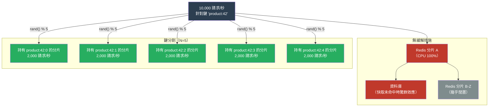

# [BEE-452] 熱點與熱鍵緩解

:::info
熱鍵（hot key）是單一快取條目、資料庫分區或訊息佇列分區，接收到不成比例的大量流量——足以讓負責它的單一節點飽和，而叢集其餘部分幾乎處於閒置狀態。解決方法從來不是「購買更大的節點」：而是需要將負載分散到整個叢集。
:::

## 背景

分散式系統是基於負載將在各節點之間大致均勻分佈的假設而設計的。一致性雜湊、基於範圍的分區以及 Kafka 分區分配都試圖實現這一目標。但它們無法控制的是客戶端實際請求哪些鍵。當一個鍵——名人的個人資料、熱門話題標籤、熱門產品的登陸頁面——每分鐘接收數百萬個請求時，持有該鍵的節點就成為瓶頸，無論叢集有多少節點。

典型案例是**名人推文問題**。當一個擁有 1 億粉絲的名人發帖時，Twitter 的快取同時接收來自數百萬個會話對單一推文記錄的讀取。處理該鍵的 Redis 節點將在叢集整體使用率達到 5% 之前就觸及其單執行緒 CPU 限制（Redis 在每個主分片上用一個執行緒處理命令）。問題不在於容量——而在於集中。

Facebook 2013 年的論文《Scaling Memcache at Facebook》（Nishtala 等，USENIX NSDI 2013）是這個問題在規模化方面的標準工程處理。Facebook 的解決方案涉及兩個機制：**租約（leases）**用於防止快取未命中時的驚群效應（只有一個請求從資料庫獲取；其餘的等待租約持有者填充快取），以及在多個 memcached 伺服器上選擇性複製最常讀取鍵的**區域池**。這兩個機制——折疊重複的快取未命中請求和複製熱資料——仍然是熱鍵緩解的兩種基本方法。

在雲端資料庫中，熱鍵表現為節流（throttling）。DynamoDB 在分區級別而非表格級別提供容量。接收超過每秒 3,000 個讀取請求單位或 1,000 個寫入請求單位的分區將被節流，即使其他分區處於閒置狀態且表格的聚合吞吐量限制尚未達到。DynamoDB 的**自適應容量**（2019 年引入）和**熱分割（split-for-heat）**（針對持續熱讀取的自動分區細分）部分緩解了這一問題，但完整的解決方案是將存取分散到各分區鍵值。

## 設計思維

熱鍵沿三個維度形成，正確的緩解方法取決於哪個維度是根源：

**讀取密集型 vs. 寫入密集型。** 每秒接收 10,000 次讀取但很少被寫入的鍵（產品目錄條目、個人資料圖片 URL）可以透過複製解決：從 N 個副本提供讀取，寫入去往一個來源並扇出。每秒接收 10,000 次寫入的鍵（即時計數器、排行榜分數）不能單靠複製解決——寫入仍需要在某處串行化。寫入密集型熱鍵需要寫入合併（緩衝多次寫入，批次應用）或分散式計數器結構（CRDT 計數器、帶本地累積的 Redis INCRBY）。

**可預測 vs. 不可預測。** 一些熱鍵是可預見的——產品發布、計劃活動、定期的每日高峰。這些允許預先緩解：預熱本地快取、預先複製鍵、預先擴展分區。不可預測的熱鍵（病毒內容、突發新聞）需要執行時偵測和自動響應。

**孤立 vs. 級聯。** 一個熱 Redis 鍵只影響持有它的 Redis 分片。一個導致分片主節點速度變慢的熱資料庫分片，同時也會餓死任何在快取未命中時查詢該分片的 cache-aside 模式——導致這些未命中堆積並放大負載，在熱分區之上形成**驚群效應**。這兩個問題相互疊加。

## 最佳實踐

### 偵測

**MUST（必須）在將效能問題歸因於熱鍵之前，先對鍵存取頻率進行儀器化。** 熱鍵症狀（一個 Redis 分片上 CPU 高、DynamoDB 在一個分區上出現節流異常、一個 Kafka broker 有異常的消費者延遲）往往被誤診為容量問題。先確認診斷：

- Redis：`redis-cli --hotkeys`（需要 `maxmemory-policy allkeys-lfu` 或 `volatile-lfu`）；`OBJECT FREQ <key>` 用於單個頻率檢查；在 Redis 監控儀表板中查看分片 CPU 不平衡
- DynamoDB：在表格上啟用 CloudWatch Contributor Insights；查找佔消耗容量超過 50% 的分區鍵
- Kafka：在 Kafka 指標中檢查每分區消費者延遲；一個分區的延遲是鄰近分區的 10 倍即為熱分區

### 本地進程內快取（L1 快取）

**SHOULD（應該）在已知熱鍵的 Redis 或 Memcached 前面新增進程內（L1）快取。** L1 快取在應用程式進程中吸收讀取，在到達網路之前攔截。以 1-5 秒的 TTL 和有界大小（例如，按存取頻率排列的前 1,000 個鍵），L1 快取可以以零額外基礎設施成本吸收 80-95% 的熱鍵讀取。代價是每進程的過期資料：每個應用程式實例都有自己的 L1 快取，因此對後端存儲的寫入不會立即反映在所有實例的 L1 快取中。對於可以容忍輕微過期資料的讀取密集型資料（個人資料資料、目錄條目、配置），這是可以接受的。

使用有界的 LRU 或 LFU 映射作為 L1 快取。不得使用無界映射——一個快取了所有鍵的錯誤配置的 L1 快取將耗盡堆疊記憶體。

### 鍵分割（扇出複製）

**SHOULD（應該）對無法容忍過期資料的讀取密集型工作負載，將熱鍵分割為 N 個副本鍵。** 不存儲值於 `product:42`，而是存儲副本於 `product:42:0`、`product:42:1`、...、`product:42:N-1`。讀取選擇一個隨機副本（`rand() % N`）。寫入更新所有 N 個副本（或更新一個並非同步複製）。當 N=10 時，單個鍵的讀取負載分散到 10 個分片。

根據觀察到的 QPS 相對於每分片讀取容量選擇 N。對於處理約每秒 100,000 個命令的單執行緒 Redis 分片，一個每秒接收 50,000 次讀取的鍵需要 N ≥ 2；一個每秒接收 500,000 次讀取的鍵需要 N ≥ 5，並留有餘量。

這種技術要求應用程式在讀取時知道副本數量。將 N 存儲在配置服務中，或確定性地推導（`hash(key) % shard_count`）。MUST NOT（不得）每個請求使用隨機 N——寫入者必須知道要更新多少個副本。

### 請求合併（單飛模式）

**MUST（必須）實作請求合併（single-flight 模式）以防止快取未命中時的驚群效應。** 當熱鍵過期或被驅逐時，許多並發請求將嘗試同時從資料庫重新獲取。每個請求看到快取未命中並啟動一個資料庫查詢。資料庫接收大量相同查詢的突增，每個查詢可能需要數百毫秒，在此期間快取鍵仍未填充。所有進行中的請求等待，且突增被放大。

單飛合併確保只有一個 goroutine/執行緒從後端存儲獲取缺失的值；所有其他對同一鍵的並發請求等待單次獲取完成，然後讀取已填充的快取。結果是每個鍵每次快取未命中只有一個資料庫查詢，無論並發請求數量如何。

### TTL 抖動

**MUST（必須）在快取 TTL 中加入隨機抖動以防止同步過期。** 如果 10,000 個快取鍵全部在批次操作中以 `TTL=300s` 寫入，它們將同時在 T+300 過期。所有 10,000 個鍵同時快取未命中，在數千個鍵上產生驚群效應，而非一個。加入抖動：`TTL = base_ttl + rand(0, base_ttl * 0.1)` 將過期時間分散在 10% 的窗口內。對於 5 分鐘的 TTL，過期時間分散在 30 秒窗口——將峰值未命中率降低 10 倍。

**MAY（可以）對極端熱鍵使用概率性提前重計算**（也稱為 XFetch 或提前過期），其中任何快取未命中的代價都很高：在過期前稍微提前重計算值，概率與鍵接近過期的程度成正比。在時間 t 對在 T 時過期的鍵進行提前重計算的概率為：`p = exp((t − T) / (β × recompute_time))`，其中 β 是調整常數（通常為 1.0）。這以略微多餘的計算換取零可見的快取未命中。

### 寫入密集型熱鍵

**SHOULD（應該）對計數器和排行榜分數使用寫入合併。** 不是對每個事件向 Redis 發出 `INCRBY counter 1`，而是在應用程式進程中本地累積增量（例如，`AtomicInteger`），並每 100ms 或每 100 次增量（以先達到者為準）批次刷新到 Redis。以每秒 10,000 個事件，這將 Redis 寫入速率從每秒 10,000 次降低到每秒 100 次（100 倍降低），代價是最多 100ms 的計數器過期資料。

對於不能容忍過期資料的精確計數，使用 CRDT G-Counter：每個節點維護自己的計數，全局計數是所有節點計數的總和。讀取需要跨節點聚合，但不需要協調。

## 系統特定說明

**Redis Cluster。** Redis Cluster 使用雜湊槽（16,384 個槽）在分片之間分配鍵。熱鍵始終映射到一個槽，因此映射到一個主節點。使用雜湊標籤（`{product:42}:0`、`{product:42}:1`）的鍵分割在叢集中有效，但同一邏輯鍵的所有副本 MUST（必須）使用相同的雜湊標籤以落在同一槽——或者不使用雜湊標籤並接受副本分散到各槽（因此是各分片）。跨分片分散通常對熱鍵緩解有利，但要求應用程式追蹤哪個分片持有哪個副本。

**DynamoDB。** DynamoDB 的自適應容量自動將熱分區的預配置容量提升到表格的總預配置容量，提供臨時緩解。對於持續的熱存取模式，使用**寫入分片**：在分區鍵中附加隨機後綴（`product_id#1`、`product_id#2`、...、`product_id#N`）。查詢必須分散到所有 N 個後綴並聚合結果。這是 DynamoDB 針對高寫入熱鍵的推薦模式。

**Kafka。** Kafka 分區分配默認基於鍵雜湊。熱訊息鍵將始終路由到同一分區。如果無法更改鍵（它代表像使用者 ID 這樣的真實實體），使用**自定義分割器**，透過附加後綴將已知熱鍵的訊息分散到多個分區。讀取這些分區的消費者必須根據實體 ID 進行去重。

## 視覺圖



## 範例

**熱 Redis 鍵的鍵分割：**

```python
import random
import json
import redis

NUM_REPLICAS = 5
r = redis.Redis()

def get_hot_key(logical_key: str) -> dict | None:
    """從熱鍵的隨機副本讀取。"""
    replica_idx = random.randrange(NUM_REPLICAS)
    physical_key = f"{logical_key}:{replica_idx}"
    value = r.get(physical_key)
    return json.loads(value) if value else None

def set_hot_key(logical_key: str, value: dict, ttl_seconds: int):
    """寫入所有副本。使用管道提高效率。"""
    serialized = json.dumps(value)
    # 分散過期時間以避免副本同時過期
    with r.pipeline() as pipe:
        for i in range(NUM_REPLICAS):
            physical_key = f"{logical_key}:{i}"
            jitter = random.randint(0, ttl_seconds // 10)
            pipe.setex(physical_key, ttl_seconds + jitter, serialized)
        pipe.execute()
```

**使用 Go 的 singleflight 進行請求合併：**

```go
import (
    "context"
    "golang.org/x/sync/singleflight"
)

var sfGroup singleflight.Group

// GetProduct 獲取產品，將並發快取未命中請求折疊為單一資料庫查詢。
// 所有等待者接收相同的結果。
func GetProduct(ctx context.Context, productID string) (*Product, error) {
    // 首先嘗試快取
    if cached := cache.Get(productID); cached != nil {
        return cached.(*Product), nil
    }

    // singleflight：每個 productID 只有一個 goroutine 從 DB 獲取
    result, err, _ := sfGroup.Do(productID, func() (interface{}, error) {
        // 雙重檢查快取，防止另一個 goroutine 已填充
        if cached := cache.Get(productID); cached != nil {
            return cached.(*Product), nil
        }
        product, err := db.QueryProduct(ctx, productID)
        if err != nil {
            return nil, err
        }
        // 使用帶抖動的 TTL 填充快取
        ttl := baseTTL + time.Duration(rand.Intn(30))*time.Second
        cache.Set(productID, product, ttl)
        return product, nil
    })
    if err != nil {
        return nil, err
    }
    return result.(*Product), nil
}
```

**熱計數器的寫入合併：**

```python
import threading
import time
import redis

class CoalescedCounter:
    """
    本地累積增量，批次刷新到 Redis。
    將 Redis 寫入速率降低至 flush_interval_ms × local_rate 倍。
    """
    def __init__(self, key: str, flush_interval_ms: int = 100):
        self._key = key
        self._local = 0
        self._lock = threading.Lock()
        self._redis = redis.Redis()
        self._flush_interval = flush_interval_ms / 1000.0
        threading.Thread(target=self._flush_loop, daemon=True).start()

    def increment(self, amount: int = 1):
        with self._lock:
            self._local += amount

    def _flush_loop(self):
        while True:
            time.sleep(self._flush_interval)
            with self._lock:
                if self._local > 0:
                    self._redis.incrby(self._key, self._local)
                    self._local = 0
```

## 相關 BEE

- [BEE-9005](../caching/cache-stampede-and-thundering-herd.md) -- 快取雪崩與驚群效應：single-flight/租約模式是快取未命中時驚群效應的標準解決方案；熱鍵過期是最常見的觸發器
- [BEE-19006](consistent-hashing.md) -- 一致性雜湊：一致性雜湊在理論上均勻分配鍵，但當客戶端存取不均勻時無法防止熱鍵；鍵分割在一致性雜湊層之上運作
- [BEE-9004](../caching/distributed-caching.md) -- 分散式快取：討論 Redis Cluster 和分片架構；理解分片拓撲是有效鍵分割的先決條件
- [BEE-19010](crdts-conflict-free-replicated-data-types.md) -- CRDT：G-Counter CRDT 是需要精確計數且不需要中央串行化的寫入密集型計數器的正確資料結構
- [BEE-19032](tail-latency-and-hedged-requests.md) -- 尾延遲與對沖請求：導致高 P99 延遲的熱分區是在部署熱鍵緩解時，進行對沖讀取的候選

## 參考資料

- [Scaling Memcache at Facebook -- Nishtala 等，USENIX NSDI 2013](https://research.facebook.com/publications/scaling-memcache-at-facebook/)
- [Scaling DynamoDB: How Partitions, Hot Keys, and Split for Heat Impact Performance -- AWS Database Blog](https://aws.amazon.com/blogs/database/part-2-scaling-dynamodb-how-partitions-hot-keys-and-split-for-heat-impact-performance/)
- [A Detailed Explanation of the Detection and Processing of BigKey and HotKey in Redis -- Alibaba Cloud](https://www.alibabacloud.com/blog/a-detailed-explanation-of-the-detection-and-processing-of-bigkey-and-hotkey-in-redis_598143)
- [OBJECT FREQ -- Redis 文件](https://redis.io/docs/latest/commands/object-freq/)
- [Handling Hotkeys in Timeline Storage at Twitter -- Matthew Tejo](https://matthewtejo.substack.com/p/handling-hotkeys-in-timeline-storage)
- [How Amazon DynamoDB Adaptive Capacity Accommodates Uneven Data Access Patterns -- AWS Database Blog](https://aws.amazon.com/blogs/database/how-amazon-dynamodb-adaptive-capacity-accommodates-uneven-data-access-patterns-or-why-what-you-know-about-dynamodb-might-be-outdated/)
