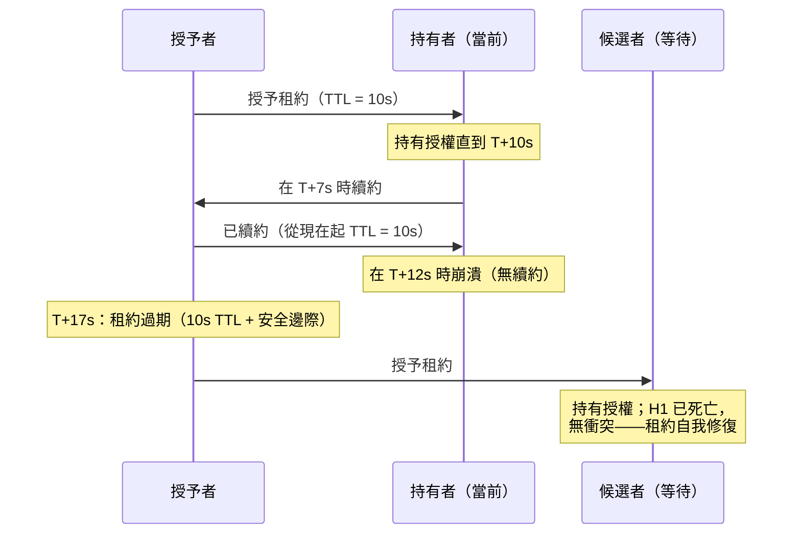

# [BEE-19017] 基於租約的協調

:::info
租約是有時限的授權：持有者在租約期間可以在不聯繫授予者的情況下採取行動，且授權在未續約時自動過期——使租約比無限期鎖更具容錯性，因為持有者崩潰無需故障檢測即可自行解決。
:::

## Context

Cary Gray 和 David Cheriton 在「租約：分散式文件緩存一致性的高效容錯機制」（SOSP 1989）中引入了租約。他們要解決的問題是：分散式文件系統緩存需要知道是否可以在不檢查服務器更新的情況下提供緩存讀取。傳統的鎖定方法向緩存授予讀鎖；當緩存數據更改時，服務器撤銷鎖。但撤銷需要服務器找到並聯繫每個緩存持有者——成本高昂——如果緩存在持有鎖時崩潰，服務器MUST（必須）在允許寫入之前檢測崩潰並強制回收鎖。租約解決了這兩個問題：授予緩存在時間 T 內提供緩存數據的授權；如果需要更新，它可以續約；當 T 在未續約的情況下到期時，服務器可以自由地向其他人授予衝突的租約。不需要撤銷協議。不需要崩潰檢測。

租約提供的不變式：在任何給定時間，至多一個實體持有給定資源的有效租約。授予者通過在授予衝突租約前等待至少 T_lease + T_clock_skew 來強制執行這一點。如果前一個持有者的時鐘和授予者的時鐘在 T_clock_skew 內一致，前一個持有者將在新租約被授予之前停止根據其租約行動。這需要時鐘的偏差有界——NTP 的有界偏差、GPS 時間或 Google 的 TrueTime（見 BEE-19008）可以提供這一保證。

Google 的 Chubby 鎖服務（Burrows，OSDI 2006）在大規模中實現了這一模式。Chubby 是一個 Paxos 複製的服務，提供分散式鎖和少量存儲；它是 GFS 領導者選舉、BigTable 元數據管理和 MapReduce 的協調基礎設施。客戶端持有針對 Chubby 主節點的會話租約。如果客戶端無法在會話超時內續約其會話租約，它會進入「危機」期，在此期間它MUST（必須）停止根據其持有的任何鎖或緩存數據行動——這是進程自我停止而不是冒著使用過期授權風險的分散式等效方式。當會話恢復時，客戶端了解其鎖是否仍然有效。ZooKeeper 作為開源替代方案出現，使用相同的核心思想：在其創建會話到期時消失的臨時節點。

**領導者租約**是此模式對基於共識的複製的特定應用。在 Raft 中，領導者通常通過將讀取追加到日誌並等待仲裁確認來提供所有讀取——這保證了讀取反映最新提交的狀態。但這為每次讀取增加了一個日誌往返。一個優化：如果領導者能夠證明它仍然是領導者，它可以在不使用日誌的情況下提供讀取。領導者租約的工作方式是：領導者記錄其最後一次成功心跳的時間。在接下來的 L 秒（租約期限）內，不可能有其他領導者被選舉出來——因為新的選舉需要多數仲裁，而仲裁需要大多數節點在當前領導者上超時，這比 L 花費更長時間。因此，領導者可以在租約窗口內直接提供讀取，降低讀取延遲。TiKV 將此用於「租約讀取」；CockroachDB 默認使用領導者租約作為其範圍租約持有者機制。

## Design Thinking

**租約以部分可用性換取容錯性。** 使用鎖時，如果持有者在持有鎖時崩潰，鎖會一直被佔用，直到持有者被檢測為失敗並強制釋放鎖。使用租約時，如果持有者崩潰，租約在 T 內自動過期。不需要檢測——授予者只需等待。缺點是：租約持有者MUST（必須）在到期前續約。如果持有者存活但暫時與授予者分區，它MUST（必須）在到期時停止根據其租約授權行動，即使它仍在運行。這會導致短暫的可用性中斷，而鎖不會導致。正確的選擇取決於崩潰還是分區在運營上更痛苦。

**租約期限是安全性-可用性取捨。** 短租約（秒）在持有者失敗後迅速過期，最大限度地減少其他客戶端等待授權的時間。長租約（分鐘）減少續約開銷，並在持有者MUST（必須）停止之前容忍更長的網絡中斷。Kubernetes 使用 15 秒的節點租約期限（kubelet MUST（必須）每 10 秒續約以保持 5 秒安全邊際）；etcd 建議服務租約為 5–30 秒。將租約期限設置為小於觀察到的最大網絡 RTT 是危險的：持有者續約，續約消息在 TTL 過後延遲，授予者過期租約並將其授予另一個節點，而原始持有者仍然認為它持有授權——兩者同時行動。

**時鐘偏差是正確性約束，而非僅僅是性能問題。** 授予者端的不變式——在授予衝突租約前等待 T_lease + T_clock_skew——要求雙方就租約何時到期達成一致。如果時鐘任意漂移，持有者MAY（可以）認為租約有效，而授予者已將其授予另一方。生產系統以以下三種方式之一限制這一點：使用具有已知最大偏差的 NTP（數據中心中 100ms 是典型值；etcd 文檔建議每台服務器 250ms），使用硬件 GPS 時間，或使用 TrueTime 的有界不確定性區間和提交等待。

**領導者租約需要時鐘同步以確保安全性。** 持續 L 秒的領導者租約僅在以下情況下安全：(a) 領導者和任何潛在新領導者之間的時鐘偏差小於 L，以及 (b) 領導者在其租約過期時MUST（必須）停止提供讀取，即使它無法聯繫跟隨者。如果具有快時鐘的領導者在其租約根據慢跟隨者的時鐘已過期後提供讀取，並且在那個間隙中選出了新領導者，快時鐘領導者提供了過期讀取。CockroachDB 記錄了 500ms 的最大時鐘偏差，如果偏差超過 400ms 則終止；其領導者租約相應調整大小。

## Visual



## Example

**etcd 服務注冊的租約（Go 客戶端）：**

```go
// 服務使用租約注冊自身；如果進程死亡，鍵自動過期
cli, _ := clientv3.New(clientv3.Config{Endpoints: []string{"localhost:2379"}})
defer cli.Close()

// 創建 30 秒的租約
lease, _ := cli.Grant(context.Background(), 30)

// 將鍵附加到租約——當租約過期時鍵消失
cli.Put(context.Background(), "/services/api/node-1", "10.0.0.5:8080",
    clientv3.WithLease(lease.ID))

// 在後台 goroutine 中保持租約活躍
// etcd 客戶端每 TTL/3 秒（這裡每 10s）自動續約
keepAlive, _ := cli.KeepAlive(context.Background(), lease.ID)
go func() {
    for range keepAlive {
        // 排空通道；KeepAlive 發送響應確認續約
    }
}()

// 如果此進程死亡，keepAlive 停止，etcd 在 30s 後過期租約，
// 且 /services/api/node-1 自動刪除——不需要顯式清理
```

**通過 Lease 對象進行 Kubernetes 領導者選舉：**

```yaml
# 由當前領導者創建/續約的 Lease 對象
apiVersion: coordination.k8s.io/v1
kind: Lease
metadata:
  name: kube-controller-manager
  namespace: kube-system
spec:
  holderIdentity: "controller-manager-pod-abc123"
  leaseDurationSeconds: 15       # MUST（必須）在 15s 內續約
  renewTime: "2026-04-14T10:30:00Z"
  acquireTime: "2026-04-14T09:00:00Z"
  leaseTransitions: 3            # 領導權更換次數
```

```go
// 使用 client-go 在控制器中進行領導者選舉
import "k8s.io/client-go/tools/leaderelection"

leaderelection.RunOrDie(ctx, leaderelection.LeaderElectionConfig{
    Lock:            resourceLock,
    LeaseDuration:   15 * time.Second,  // 租約有效期
    RenewDeadline:   10 * time.Second,  // 放棄領導權前的最長續約時間
    RetryPeriod:     2 * time.Second,   // 非領導者重試獲取的頻率
    Callbacks: leaderelection.LeaderCallbacks{
        OnStartedLeading: func(ctx context.Context) { runControllerLoop(ctx) },
        OnStoppedLeading: func() { os.Exit(1) }, // 安全：進程死亡，租約過期
        OnNewLeader: func(identity string) { log.Printf("leader: %s", identity) },
    },
})
// 如果領導者進程死亡，其租約在 LeaseDuration（15s）後過期
// 在 LeaseDuration + RetryPeriod（最多 17s）內選出新領導者
```

**用於快速讀取的領導者租約（TiKV 風格偽代碼）：**

```
# Raft 領導者在租約有效時無需日誌往返即可提供讀取

LEASE_DURATION = 9s          # MUST（必須）< 選舉超時（10s）
MAX_CLOCK_SKEW = 500ms       # 由 NTP 配置限制

class RaftLeader:
    def __init__(self):
        self.lease_start = None   # 最後一次成功心跳仲裁的時間

    def on_heartbeat_quorum(self):
        self.lease_start = now()  # 多數確認 → 我們是領導者

    def serve_read(self, key):
        lease_remaining = self.lease_start + LEASE_DURATION - now()

        if lease_remaining > MAX_CLOCK_SKEW:
            # 安全：在此窗口內不可能選出其他領導者
            return self.local_state[key]  # 無 Raft 日誌往返
        else:
            # 租約過期或即將過期——退回到線性化讀取
            return self.raft_read(key)    # 追加到日誌，等待仲裁
```

## Related BEEs

- [BEE-19002](consensus-algorithms-paxos-and-raft.md) -- 共識演算法：Raft 領導者租約擴展了 Raft 領導者無需日誌往返即可提供讀取的授權；租約的安全性依賴於 Raft 的選舉保證——仲裁不能比一個選舉超時更快地選出新領導者，這限制了租約期限
- [BEE-19005](distributed-locking.md) -- 分散式鎖：鎖和租約通過不同方式解決相同的互斥問題；鎖需要顯式釋放或故障檢測，租約自動過期——結合兩者（定時鎖 = 租約）可獲得租約的彈性和鎖的語義
- [BEE-19008](clock-synchronization-and-physical-time.md) -- 時鐘同步與物理時間：租約安全性依賴於有界時鐘偏差；授予者MUST（必須）在重新授予前等待 TTL + max_clock_skew，這需要知道 max_clock_skew——TrueTime 通過硬件支持的不確定性區間提供了這一點
- [BEE-19015](failure-detection.md) -- 故障檢測：租約消除了授予者端主動故障檢測的需求——授予者不是檢測持有者的崩潰（困難），而是等待租約過期（容易）；取捨是授予間隙（無人持有授權的時間）等於崩潰時剩餘的租約 TTL

## References

- [租約：分散式文件緩存一致性的高效容錯機制 -- Gray and Cheriton, SOSP 1989](https://dl.acm.org/doi/10.1145/74851.74870)
- [鬆散耦合分散式系統的 Chubby 鎖服務 -- Burrows, OSDI 2006](https://research.google/pubs/the-chubby-lock-service-for-loosely-coupled-distributed-systems/)
- [Chubby 論文 PDF -- Google Research](https://research.google.com/archive/chubby-osdi06.pdf)
- [租約 API -- etcd 文檔](https://etcd.io/docs/v3.7/learning/api/)
- [如何創建租約 -- etcd 文檔](https://etcd.io/docs/v3.5/tutorials/how-to-create-lease/)
- [租約 -- Kubernetes 文檔](https://kubernetes.io/docs/concepts/architecture/leases/)
- [租約讀取 -- TiKV 博客](https://tikv.org/blog/lease-read/)
- [複製層 -- CockroachDB 架構](https://www.cockroachlabs.com/docs/stable/architecture/replication-layer)
