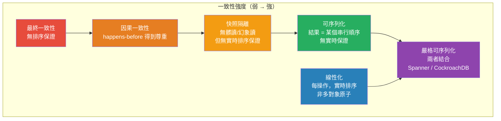

# [BEE-19009] 線性化與可序列化

:::info
線性化（Linearizability）和可序列化（Serializability）是兩種截然不同的一致性保證——線性化關注的是單個操作在共享對象上的實時排序；可序列化關注的是並發事務的結果是否等同於某個串行執行——混淆這兩者解釋了分散式系統中大多數一致性缺陷的根源。
:::

## Context

一致性是分散式系統中最被過度使用的詞之一。ACID 的「C」指的是應用不變量得到保留。CAP 的「C」指的是線性化。SQL 的隔離級別關注的是可序列化。這些不是同一個屬性，理解它們之間的確切差異是推理任何存儲系統正確性保證的前提。

**可序列化**由 Christos Papadimitriou 在「並發數據庫更新的可序列化性」（JACM，1979 年 10 月）中正式定義。定義：如果並發事務的執行結果等同於這些相同事務的某個串行（非交錯）執行的結果，則稱該執行是可序列化的。可序列化是*事務歷史*的屬性——多操作、可能多對象的執行。關鍵是，它對掛鐘時間沒有任何主張：可序列化的執行可能產生與不匹配事務提交實時順序的串行順序等效的結果。事務 A 可能在事務 B 開始之前開始並完成，但可序列化的執行可能產生等同於先運行 B 的結果。

**線性化**由 Maurice Herlihy 和 Jeannette Wing 在「線性化：並發對象的正確性條件」（ACM TOPLAS，1990 年 7 月）中定義。定義：如果共享對象上操作的並發執行中，每個操作都顯得在其調用和響應之間的某個時間點瞬間生效，並且這些瞬間效果尊重實時排序，則稱該執行是線性化的。線性化是共享對象（寄存器、隊列、鍵值存儲）上*單個操作*的屬性。它在一個維度上比可序列化更強（保留實時順序），但在另一個維度上更弱（每個對象適用，而非每個事務）。

這種差異在實踐中很重要。考慮一個具有線性化的鍵值存儲：如果寫入者 W 設置 `x = 1` 且其寫入在讀取者 R 開始讀取 `x` 之前完成，則 R 保證看到 `1`。這是新鮮性保證。沒有線性化，R 可能讀取一個落後的副本並看到 `x = 0`，即使 W 的寫入已在所有地方提交——系統內部一致，但 R 的讀取相對於實時是過期的。這是分散式數據庫中最典型的「讀取自己的寫入」失敗模式。

沒有線性化的可序列化很容易構造：在單線程上處理所有事務的數據庫是可序列化的（執行字面上是串行的），但如果該數據庫有落後於主節點的讀副本，從副本的讀取不是線性化的——它們可能不反映最近提交的狀態。許多在「讀已提交」或「可重複讀」模式下運行的關係型數據庫根本不是可序列化的（只有可序列化隔離級別才能保證），即使那些是可序列化的也不會在副本間自動線性化。

**嚴格可序列化**——兩者的結合——意味著事務以與實時排序一致的串行順序執行。如果事務 A 的提交在實時上先於事務 B 的開始，則可序列化順序必須將 A 置於 B 之前。Google Spanner 使用 TrueTime（BEE-19008）在實時區間內限定提交時間戳來實現嚴格可序列化。CockroachDB 和 FoundationDB 提出了類似的聲明。etcd 對單個鍵提供線性化讀取，是線性化的但不是可序列化的（單個鍵操作，而非多鍵事務，除非您使用其事務 API）。

Kyle Kingsbury 的 Jepsen 項目（jepsen.io）自 2013 年以來一直在對幾十個生產數據庫進行線性化違規的實證測試。他的方法：部署集群，注入網絡分區和節點故障，向數據庫寫入，讀取回值，然後使用 Knossos 線性化檢查器驗證觀察到的讀寫歷史是否與某個線性化執行一致。他的發現揭示了 MongoDB、Cassandra、Redis、RethinkDB 等在真實故障條件下違反了其聲明的一致性保證。Jepsen 分析是公開可用的最嚴格的實證證據，展示了一致性聲明與一致性現實之間的差距。

Peter Bailis 等人在「高可用事務：優點與局限」（VLDB 2013）中建立了理論限制：在網絡分區期間，可序列化和快照隔離*無法*以高可用性實現。任何聲稱嚴格可序列化的系統必然在分區事件期間犧牲可用性——它必須阻塞或拒絕請求，而不是提供可能過期的數據。

## Design Thinking

**可序列化關注發生了什麼；線性化關注它何時出現發生。** 可序列化系統讓您推理事務結果而不必擔心交錯。線性化系統還讓您推理這些結果相對於實際時間何時變得可見。大多數應用正確性缺陷源於違反其中之一——而非同時違反兩者。

**您需要的一致性級別由您的不變量決定，而非慣例。** 社交媒體「點讚」計數器可以容忍最終一致性——在分區期間損失幾個計數是可接受的。銀行轉賬不能容忍可序列化違規——借記和貸記必須以原子方式出現。分散式鎖服務不能容忍線性化違規——兩個進程不能都認為自己持有鎖。選擇一致性級別需要識別您的應用可以處理哪些故障模式。

**您無法用正常路徑負載測試來測試一致性違規。** 線性化違規只在並發訪問和故障下出現——網絡分區、領導者選舉、磁盤故障。在正常操作期間通過所有集成測試的數據庫，在 200ms 網絡分區期間仍可能違反線性化。Jepsen 風格的故障注入測試是驗證真實條件下一致性聲明的唯一可靠方式。

## Comparison Table

| 屬性 | 可序列化 | 線性化 | 嚴格可序列化 |
|---|---|---|---|
| 適用於 | 事務（多操作） | 單個操作 | 事務（多操作） |
| 實時排序 | 不要求 | 要求 | 要求 |
| 多對象原子性 | 是 | 僅每個對象 | 是 |
| 分區期間可用？ | 否 | 否 | 否 |
| 示例 | PostgreSQL SERIALIZABLE | etcd 讀取 | Spanner、CockroachDB |

## Visual



## Example

**線性化違規（過期副本讀取）：**

```
# 設置：主節點 + 一個副本；副本延遲約 500ms
# 線性化要求：如果 W 在 R 開始之前完成，R 必須看到 W 的值。

時間線（實時 →）：

  T=0ms:  寫入者 W：  SET x = 42         （開始）
  T=10ms: 寫入者 W：  SET x = 42         （在主節點提交，確認給客戶端）
  T=11ms: 讀取者 R：  GET x              （開始——在 W 完成之後）
  T=11ms: 讀取者 R 路由到副本           （副本尚未收到複製）
  T=11ms: 讀取者 R：  返回 x = 0        ← 線性化違規

正確（線性化）行為：R 必須返回 42，因為 R 在 W 完成後開始。
過期副本讀取：R 返回 0，這是 W 運行之前的值。

# 真實原因：從最終一致性複製的跟隨者讀取
# 修復：從主節點讀取（或使用讀取自己的寫入會話令牌）
# 避免此問題的系統：etcd（線性化讀取通過領導者），
#   Spanner（使用 TrueTime 限定過期讀取），CockroachDB（跟隨者讀取需選擇加入）
```

**可序列化違規（寫入偏斜）：**

```
# 設置：兩個並發事務更新值班計劃
# 不變量：至少必須有一個醫生值班。

初始狀態：Alice=ON_CALL，Bob=ON_CALL

事務 A（Alice 請求下班）：                    事務 B（Bob 請求下班）：
  READ：alice=ON，bob=ON → 2 人值班             READ：alice=ON，bob=ON → 2 人值班
  CHECK：2 > 1，移除 Alice 是安全的             CHECK：2 > 1，移除 Bob 是安全的
  WRITE：alice=OFF_CALL                          WRITE：bob=OFF_CALL
  COMMIT                                          COMMIT

最終狀態：Alice=OFF_CALL，Bob=OFF_CALL  ← 不變量被違反（無人值班）

# 這是寫入偏斜異常——兩個事務都讀取了一致的快照，
# 做出了局部有效的決定，但它們組合的效果違反了不變量。
# 寫入偏斜不能被快照隔離阻止——需要 SERIALIZABLE 隔離。
# 可序列化執行會阻塞事務 B 直到 A 提交，然後
# 事務 B 的重新讀取會顯示 Alice=OFF → 只有一人值班 → 拒絕 Bob 的請求。
```

**嚴格可序列化（Spanner 風格）：**

```
# 兩個事務，T1 在實時上在 T2 開始之前提交。
# 嚴格可序列化要求可序列化順序匹配實時順序。

T=100ms：T1 提交（從 A 向 B 轉賬 $100）
T=200ms：T2 開始（讀取 A 和 B 的餘額）

# 嚴格可序列化：T2 必須看到 T1 的效果。
# 僅可序列化：T2 可能被放在串行順序中的 T1「之前」
#   並讀取轉賬前的餘額——即使 T2 在 T1 提交後才開始。

# Spanner 的機制：
#   T1 提交時間戳 = TrueTime.now().latest（例如 100ms + 4ms 不確定性 = 104ms）
#   T1 等待 TrueTime.now().earliest > 104ms 再向客戶端返回
#   T2 在 T=200ms 開始，讀取 commit_timestamp ≤ 200ms 的任何值
#   → T2 將始終包含 T1 的寫入（104ms < 200ms）
```

## Related BEEs

- [BEE-8002](../transactions/isolation-levels-and-their-anomalies.md) -- 隔離級別及其異常：隔離級別（讀已提交、可重複讀、可序列化）是可序列化屬性的 SQL 分類法；寫入偏斜需要 SERIALIZABLE 來防止
- [BEE-19001](cap-theorem-and-the-consistency-availability-tradeoff.md) -- CAP 定理：CAP 的 C 特指線性化（而非可序列化）；Brewer 的原始框架和 Gilbert-Lynch 的證明都使用 Herlihy & Wing 的定義
- [BEE-19008](clock-synchronization-and-physical-time.md) -- 時鐘同步與物理時間：TrueTime 的有界不確定性窗口是 Spanner 實現嚴格可序列化的機制——提交時間戳在保證的實時區間內分配
- [BEE-11006](../concurrency/optimistic-vs-pessimistic-concurrency-control.md) -- 樂觀 vs 悲觀並發控制：可序列化快照隔離（SSI）通過在提交時檢測寫入偏斜循環而非阻塞讀取，樂觀地實現可序列化

## References

- [線性化：並發對象的正確性條件 -- Herlihy & Wing, ACM TOPLAS, 1990](https://dl.acm.org/doi/10.1145/78969.78972)
- [並發數據庫更新的可序列化性 -- Papadimitriou, JACM, 1979](https://dl.acm.org/doi/10.1145/322154.322158)
- [高可用事務：優點與局限 -- Bailis 等人, VLDB 2013](https://www.vldb.org/pvldb/vol7/p181-bailis.pdf)
- [一致性模型 -- Kyle Kingsbury, jepsen.io](https://jepsen.io/consistency)
- [設計數據密集型應用程式，第 9 章 -- Martin Kleppmann, O'Reilly](https://www.oreilly.com/library/view/designing-data-intensive-applications/9781491903063/)
- [Spanner：Google 的全球分散式數據庫 -- Corbett 等人, OSDI 2012](https://www.usenix.org/system/files/conference/osdi12/osdi12-final-16.pdf)
