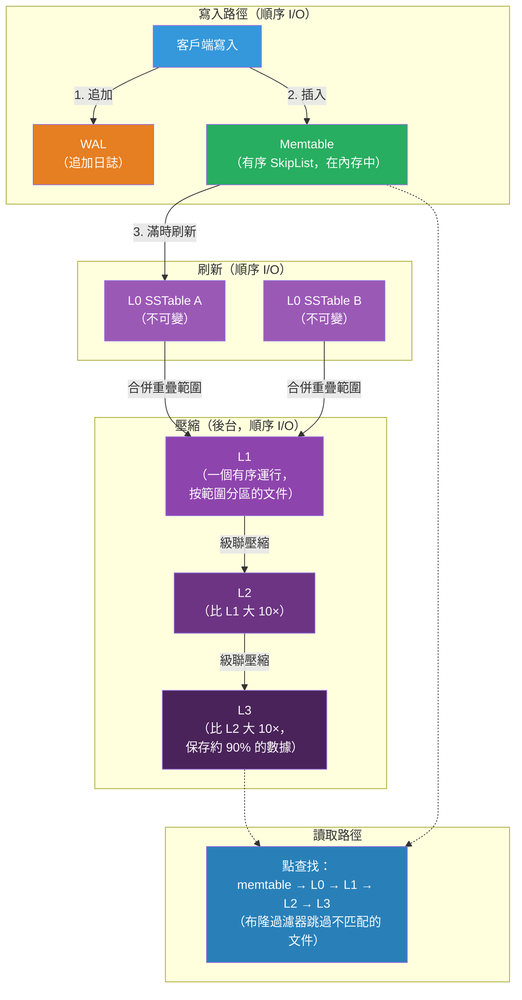

# [BEE-443] 日誌結構合併樹

:::info
日誌結構合併樹（LSM Tree）通過將隨機就地更新轉換為順序追加寫入來實現高寫入吞吐量——在內存中積累變更，將其刷新為不可變的有序文件，並在後台合併這些文件——與 B 樹相比，以更高的讀取放大換取顯著更低的寫入放大。
:::

## Context

Patrick O'Neil、Edward Cheng、Dieter Gawlick 和 Elizabeth O'Neil 在「日誌結構合併樹（LSM Tree）」（Acta Informatica，1996 年）中引入了 LSM Tree。他們的出發點是機械性的：旋轉磁盤上的隨機 I/O 比順序 I/O 慢兩到三個數量級。B 樹在葉頁上就地更新記錄，每次寫入都需要隨機磁盤尋道。LSM 樹則將所有寫入批量處理到內存緩衝區，以順序方式將緩衝區刷新到磁盤作為不可變的有序文件（SSTable），並在後台合併文件。寫入路徑完全變為順序的；隨機訪問懲罰被推遲到壓縮操作。

Google Bigtable（Chang 等人，OSDI 2006）在大規模生產環境中使用了 LSM 樹。Bigtable 使用三組件設計——內存中的 memtable、磁盤上不可變的 SSTable 層次結構和預寫日誌——並引入了生態系統沿用至今的術語。Bigtable 論文的影響產生了 HBase（其開源等效物）、Cassandra（將相同的存儲模型用于其列族）和 LevelDB（Google，2011 年），後者形式化了多級壓縮策略。Facebook 將 LevelDB 分叉為 RocksDB（2012 年），以處理其社交圖在生產環境中的寫入密集型工作負載：RocksDB 現在嵌入在 TiKV（TiDB 的存儲層）、CockroachDB、MyRocks（以 RocksDB 為存儲引擎的 MySQL）和 Kafka 的日誌存儲中。

LSM 樹向上層公開的關鍵數據結構是 **SSTable**（有序字符串表）：鍵值對的不可變有序文件，帶有嵌入式索引和布隆過濾器。不可變性至關重要——這意味著並發讀取永遠不會與文件內的寫入競爭，文件可以被緩存、複製和原子替換。代價是邏輯上的「刪除」無法從現有文件中移除鍵；相反，它寫入一個**墓碑**標記，在壓縮回收空間之前抑制舊版本。

Niv Dayan、Manos Athanassoulis 和 Stratos Idreos 在「Monkey：最優可導航鍵值存儲」（ACM SIGMOD，2017 年）中分析了 LSM 層級中布隆過濾器的內存分配，表明為所有層級分配相同的每元素位數是次優的。由於大多數數據位於最深層，且大多數假陽性成本來自較大的層級，為較淺層級指數級地分配更多過濾器位，在相同總內存預算下可以將查找延遲減半。RocksDB 的每層 `bloom_bits_per_key` 配置實現了這一洞見。

## Design Thinking

**LSM 樹和 B 樹的選擇歸結為寫讀比和寫入模式。** B 樹對許多點讀取和低寫入量的工作負載是最優的：單次對數 n 尋道可以找到任何鍵，當工作集適合頁面緩存時就地更新是廉價的。LSM 樹對寫入主導的工作負載是最優的，其中傳入的寫入量超過了就地 B 樹更新所能承受的程度：寫入吞吐量受限於 memtable 刷新速率和順序 SSTable 帶寬，而非隨機 I/O 容量。混合工作負載的拐點大約為 70% 寫入；低於此值，B 樹通常在讀取延遲上勝出。高於此值，LSM 樹在寫入吞吐量和每次寫入的硬件成本上勝出。

**三個放大指標在基本上是相互衝突的。** 寫入放大（每個邏輯字節寫入的字節數）衡量壓縮乘以 I/O 多少倍；分層壓縮會導致 10–30× 的寫入放大。讀取放大（每次點查找的磁盤讀取次數）衡量必須檢查多少個文件；沒有布隆過濾器時，它與文件數量成線性關係。空間放大（磁盤使用/邏輯數據大小）衡量待壓縮的舊版本和墓碑造成的浪費空間；大小分層壓縮可以將邏輯數據大小翻倍。沒有任何壓縮策略能同時最小化這三者：分層壓縮以寫入放大為代價減少空間和讀取放大；大小分層壓縮以空間和讀取放大為代價減少寫入放大。

**壓縮MUST（必須）被配置為跟上傳入的寫入速率。** 如果寫入到達速度快於壓縮合並文件的速度，L0 會無限積累文件。RocksDB 在 L0 達到 `level0_slowdown_writes_trigger`（默認 20 個文件）時減慢寫入，在 `level0_stop_writes_trigger`（默認 36 個文件）時停止寫入。配置壓縮資源——`max_background_compactions` 的 CPU 核心和 I/O 帶寬——MUST（必須）考慮壓縮扇出，而不僅僅是原始寫入速率。一個經驗法則：對於具有 10× 乘數的分層壓縮，總 I/O 負載約為應用程序寫入速率的 10–30 倍。

## Visual



## Best Practices

**將壓縮策略與主要訪問模式相匹配。** 在讀取延遲和空間效率是優先考慮因素時使用分層壓縮（RocksDB 默認）：點查找在每個層級最多檢查一個文件，因為層級保持不重疊的鍵範圍。在持續的寫入吞吐量是瓶頸且臨時空間翻倍可以接受時，使用大小分層（通用）壓縮：壓縮合並相似大小的文件，無需分層壓縮的級聯重寫。Cassandra 對時間序列和追加密集型工作負載默認使用大小分層；RocksDB 對通用 OLTP 使用分層。

**根據查找模式調整布隆過濾器每鍵位數，而非統一設置。** 默認的每鍵 10 位產生每個 SSTable 約 1% 的假陽性率。對於許多查找未命中（鍵不存在）的熱點工作負載，將較深層級的每鍵位數提高到 15–20 可以減少假陽性並消除不必要的磁盤讀取。每層過濾器調整（Monkey 風格：為較淺層級指數級更多位）在內存受限時進一步降低總體查找成本。

**保持 memtable 大小和刷新頻率平衡。** 較大的 memtable（RocksDB `write_buffer_size`，默認 64 MB）減少刷新頻率，因此減少每單位時間產生的 L0 文件數量，降低 L0 → L1 壓縮壓力。將 `max_write_buffer_number` 設置為 2–4 允許在刷新期間並發寫入繼續。SHOULD NOT（不應）將 memtable 設置得過大，以至於刷新延遲（將一個完整 memtable 寫為 SSTable 的時間）超過寫入壓力窗口，否則在停頓期間 L0 將積累。

**啟用每層壓縮，最底層最重。** 大多數數據（分層壓縮下 90% 以上）位於最深層。使用更重的編解碼器（Zstd）壓縮深層，對 L0/L1 不壓縮（或使用 Snappy），在不增加熱寫入路徑 CPU 的情況下降低存儲成本。RocksDB `bottommost_compression` 獨立配置底層。

**調整層級大小以防止壓縮停頓。** 使用 `level_compaction_dynamic_level_bytes = true`，讓 RocksDB 從實際底層大小計算層級目標，而非靜態基準。這防止了數據集增長時層級永久偏小，並消除了在意外寫入峰值期間觸發停頓級聯的「得分 >> 1」條件。

**持續監控寫入放大、空間放大和 L0 文件數量。** 寫入放大（由 RocksDB 統計數據報告為 `rocksdb.compaction.bytes.written` / `rocksdb.bytes.written`）超過 30× 通常表明壓縮配置不當。L0 文件數量超過 `level0_slowdown_writes_trigger` 是寫入速率超過壓縮能力的即時信號。空間放大超過 2× 表明壓縮運行不夠頻繁，無法回收墓碑和舊版本。

## Deep Dive

**SSTable 結構。** 每個 SSTable 文件組織為一系列塊：數據塊包含有序的鍵值對（默認每個 4 KB，可配置）；索引塊將每個數據塊的第一個鍵映射到其文件偏移量，支持二分查找；過濾器塊保存布隆過濾器；頁腳包含塊偏移量和壓縮元數據。打開時，RocksDB 將頁腳、索引和過濾器塊讀入內存（塊緩存）。只有數據塊按需獲取。命中布隆過濾器的點查找在內存中的索引塊執行一次二分查找，然後順序讀取目標數據塊——文件級查找減少為兩次內存訪問加一次順序磁盤讀取。

**分層壓縮機制。** L0 MAY（可以）包含跨文件的重疊鍵範圍（多次 memtable 刷新可能覆蓋相同的鍵）。L1 及更深的所有層級維護一個有序運行：同一層級的任意兩個文件不共享鍵範圍。當 L0 觸發壓縮時，壓縮作業選擇所有 L0 文件，並使用 k 路合併排序將其與 L1 中任何重疊的文件合併，生成新的不重疊的 L1 文件。如果 L1 現在超過其大小目標，選擇一個 L1 文件與任何重疊的 L2 文件合併——這根據需要通過層級級聯。對於跨層級的重複鍵，具有更高序列號（更近）的版本勝出，舊版本被丟棄。

**墓碑和壓縮延遲。** 刪除產生一個墓碑記錄（鍵 + 刪除標記）。墓碑在讀取期間抑制同一鍵的舊版本。底層存儲在墓碑和該鍵的任何舊版本位於同一壓縮作業中之前不會被回收。在最底層，墓碑可以完全丟棄（其下不可能存在更舊的版本）。這意味著刪除承擔的空間成本與墓碑到達底部並被壓縮出去所需時間成正比——這對具有高刪除量或短 TTL 的工作負載是一個重要考慮因素。

## Example

**適用於寫入密集型 OLTP 的 RocksDB 配置：**

```cpp
#include "rocksdb/options.h"

rocksdb::Options options;
// 增大 memtable 大小以減少 L0 文件數量（降低壓縮壓力）
options.write_buffer_size = 128 * 1024 * 1024;  // 每個 memtable 128 MB
options.max_write_buffer_number = 3;             // 內存中最多 3 個 memtable

// 分層壓縮——更好的讀取延遲和空間效率
options.compaction_style = rocksdb::kCompactionStyleLevel;
options.level_compaction_dynamic_level_bytes = true;  // 自動調整層級大小

// L1 目標：與 memtable 大小對齊以減少 L0→L1 壓縮成本
options.max_bytes_for_level_base = 128 * 1024 * 1024;  // 128 MB
options.max_bytes_for_level_multiplier = 10;             // L2=1.28 GB, L3=12.8 GB...

// 壓縮並發（為持續寫入負載配置）
options.max_background_compactions = 4;
options.max_background_flushes = 2;

// 壓縮：L0/L1 不壓縮（低延遲路徑），中層用 LZ4，底層用 Zstd
options.compression_per_level = {
    rocksdb::kNoCompression,    // L0
    rocksdb::kNoCompression,    // L1
    rocksdb::kLZ4Compression,   // L2
    rocksdb::kLZ4Compression,   // L3
    rocksdb::kZSTD,             // L4（底層——約 90% 的數據）
};
options.bottommost_compression = rocksdb::kZSTD;

// 布隆過濾器：每鍵 10 位 → 約 1% 假陽性率
rocksdb::BlockBasedTableOptions table_options;
table_options.filter_policy.reset(
    rocksdb::NewBloomFilterPolicy(10, false)  // false = 基於塊（更快）
);
table_options.block_cache = rocksdb::NewLRUCache(512 * 1024 * 1024);  // 512 MB 緩存
options.table_factory.reset(rocksdb::NewBlockBasedTableFactory(table_options));
```

**通過 RocksDB 統計數據觀察 LSM 內部狀態：**

```
# rocksdb.stats 輸出（來自 db.GetProperty("rocksdb.stats")）：

** 壓縮統計 [default] **
Level    Files   Size     Score Read(GB)  Rn(GB) Rnp1(GB) Write(GB) Wnew(GB)
----------------------------------------------------------------
  L0      3/0    192 MB   0.75  0.00      0.00   0.00      0.19      0.19
  L1      8/0    897 MB   0.86  2.31      0.81   1.50      2.16      0.66
  L2     64/0    8.95 GB  0.88  25.2      2.16   23.0      24.7      1.70
  L3    512/0   90.1 GB   1.00  254       24.7   229       243       14.0

運行時間（秒）：86400.0 總計，86400.0 間隔
刷新（GB）：累計 8.00
寫入放大：累計 30.4        ← 總寫入字節 / 應用字節
讀取放大：3.2
空間放大：1.12             ← 磁盤使用 / 邏輯數據大小
停頓（次數）：0 level0_slowdown，0 level0_stop
```

**Python：偽代碼形式的基本 LSM 風格寫入路徑：**

```python
import sortedcontainers  # 通過有序字典等效實現跳躍表

class LSMTree:
    def __init__(self, memtable_limit=64 * 1024 * 1024):
        self.wal = open("wal.log", "ab")          # 順序預寫日誌
        self.memtable = sortedcontainers.SortedDict()
        self.memtable_size = 0
        self.memtable_limit = memtable_limit
        self.sstables = []                          # 已刷新文件的列表（有序字典）

    def put(self, key: str, value: bytes):
        # 1. 追加到 WAL 以保證持久性（順序 I/O）
        self.wal.write(f"{key}={value.hex()}\n".encode())
        self.wal.flush()

        # 2. 插入內存中的 memtable（O(log n) 有序插入）
        self.memtable[key] = value
        self.memtable_size += len(key) + len(value)

        # 3. 達到大小限制時刷新
        if self.memtable_size >= self.memtable_limit:
            self._flush()

    def get(self, key: str) -> bytes | None:
        # 1. 首先檢查 memtable（最新數據）
        if key in self.memtable:
            return self.memtable[key]

        # 2. 從最新到最舊搜索 SSTable（線性——布隆過濾器會跳過大多數）
        for sstable in reversed(self.sstables):
            if key in sstable:
                return sstable[key]

        return None  # 未找到鍵

    def _flush(self):
        # 將 memtable 作為不可變有序 SSTable 寫入（順序 I/O）
        self.sstables.append(dict(self.memtable))  # 有序字典 → 不可變快照
        self.memtable.clear()
        self.memtable_size = 0
        # 後台：如果積累了太多 SSTable，觸發壓縮
        if len(self.sstables) >= 4:
            self._compact()

    def _compact(self):
        # 將所有 SSTable 合併為一個（k 路合併排序，每個鍵最後的值勝出）
        merged = {}
        for sstable in self.sstables:
            merged.update(sstable)  # 較新的 SSTable 覆蓋較舊的（更新勝出）
        self.sstables = [merged]
```

## Related BEEs

- [BEE-6005](../data-storage/storage-engines.md) -- 存儲引擎：B 樹和 LSM 樹是兩種主要的存儲引擎設計；B 樹通過就地更新最小化讀取放大；LSM 樹通過順序批處理最小化寫入放大——這一選擇決定了引擎的寫入吞吐量上限和讀取延遲下限
- [BEE-19011](write-ahead-logging.md) -- 預寫日誌：LSM 樹使用 WAL 作為第一個寫入目標以保證持久性；WAL 確保崩潰後可以重建 memtable 內容，允許 memtable 保持易失性而不犧牲寫入持久性
- [BEE-19012](bloom-filters-and-probabilistic-data-structures.md) -- 布隆過濾器和概率數據結構：LSM 樹中的每個 SSTable 都攜帶一個布隆過濾器；過濾器以無假陰性的方式回答「這個鍵肯定不在這個文件中？」，允許讀取路徑在沒有磁盤 I/O 的情況下跳過絕大多數文件
- [BEE-19022](anti-entropy-and-replica-repair.md) -- 反熵與副本修復：Cassandra 的存儲層是一個 LSM 樹（memtable + SSTable + 壓縮）；Cassandra 反熵修復MUST（必須）考慮 LSM 墓碑的生命周期——墓碑MUST（必須）在 gc_grace_seconds 內被壓縮出去，否則已刪除的鍵可能被仍持有舊數據的修復副本復活

## References

- [日誌結構合併樹（LSM Tree）-- O'Neil, Cheng, Gawlick, O'Neil, Acta Informatica 1996](https://www.cs.umb.edu/~poneil/lsmtree.pdf)
- [Bigtable：用于結構化數據的分散式存儲系統 -- Chang 等人, OSDI 2006](https://research.google.com/archive/bigtable-osdi06.pdf)
- [RocksDB Wiki -- Facebook/Meta](https://github.com/facebook/rocksdb/wiki)
- [分層壓縮 -- RocksDB Wiki](https://github.com/facebook/rocksdb/wiki/Leveled-Compaction)
- [Monkey：最優可導航鍵值存儲 -- Dayan, Athanassoulis, Idreos, ACM SIGMOD 2017](https://dl.acm.org/doi/10.1145/3035918.3064054)
- [LevelDB -- Google](https://github.com/google/leveldb)
