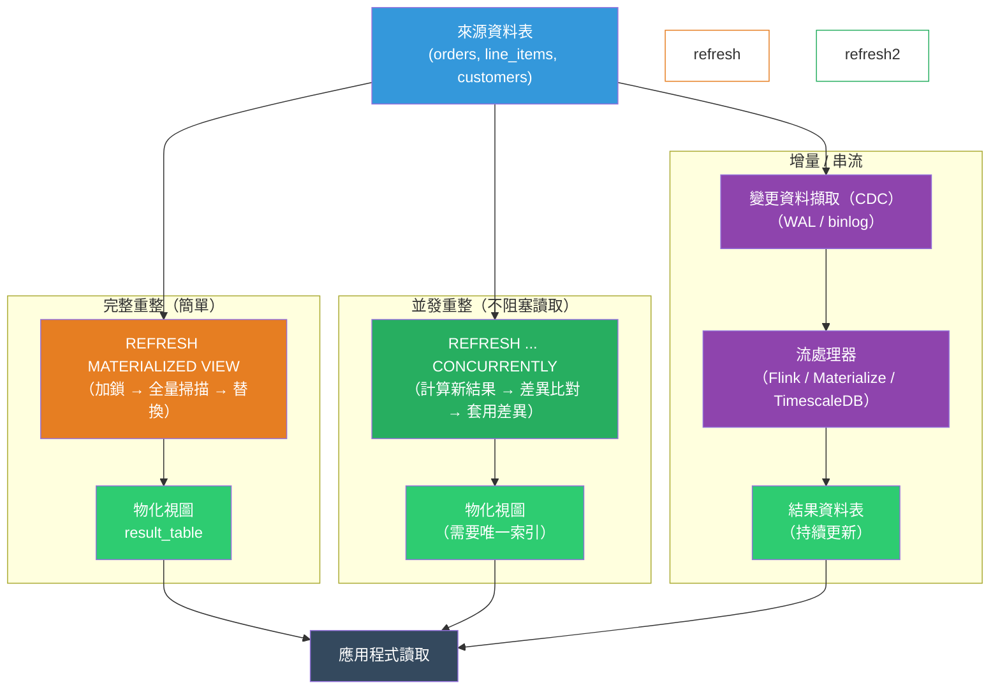

# [BEE-19051] 物化視圖與增量計算

:::info
物化視圖（Materialized View）將查詢結果儲存在磁碟上並以資料表形式提供服務——以資料新鮮度換取查詢速度；增量計算進一步延伸此概念，僅重新計算結果中發生變動的部分，而非從頭重建整個視圖。
:::

## 背景

有些查詢的執行代價過高，無法在每次請求時即時計算。一個需要聚合 5 億筆訂單資料、跨多張資料表 JOIN、依日期分組並套用 HAVING 條件的儀表板查詢，即使在索引完善的情況下也可能需要 30–60 秒。對每次頁面載入都執行此查詢是不可行的。最直覺的解法——將結果快取在應用程式記憶體或 Redis 中——雖然有效，但將快取失效的問題推給應用層，且無法再以 SQL 查詢快取的資料。

物化視圖在資料庫層解決了這個問題。物化視圖是一個將查詢結果儲存為實體資料表的機制。讀取時直接存取已儲存的結果；昂貴的計算只在視圖重新整理（Refresh）時才執行。PostgreSQL 在 9.3 版（2013 年）引入了 `CREATE MATERIALIZED VIEW`；Oracle 自 1990 年代末便提供此功能；SQL Server 則稱之為「索引視圖（Indexed View）」。

其限制在於資料新鮮度。物化視圖反映的是最後一次重新整理時的資料狀態。若來源資料表頻繁變動，而業務上又需要接近即時的資料，每次變更都觸發完整重建的代價將過於昂貴——反而失去物化的意義。

增量計算解決了這個問題。增量策略識別哪些來源資料列發生了變更，僅重新計算受影響的輸出列，而非重新讀取所有來源資料。PostgreSQL 原生不支援增量重新整理（截至第 16 版）；每次執行 `REFRESH MATERIALIZED VIEW` 都會重建整個視圖。增量重新整理可透過擴充套件（TimescaleDB 的持續聚合，用於時間序列）、應用層框架（dbt 的增量模型）以及流處理系統（Flink、Materialize、RisingWave）來實現，這些系統能在來源資料到達時持續更新結果。

完整重建與增量計算之間的選擇，是資料新鮮度與複雜度之間的取捨。完整重建簡單且正確；增量計算速度更快，但需要推論哪些差異（Delta）需要套用，以及如何處理延遲抵達的資料。

## 設計思考

### 重新整理策略

| 策略 | 機制 | 資料新鮮度 | 每次重整成本 |
|---|---|---|---|
| 完整重整（排他鎖） | `REFRESH MATERIALIZED VIEW` | 重整當下的時間點 | 完整查詢代價 |
| 完整重整（並發） | `REFRESH MATERIALIZED VIEW CONCURRENTLY` | 重整當下的時間點 | 完整查詢代價 + 差異比對 |
| 排程重整 | cron / pg_cron | 取決於重整間隔 | 完整查詢代價 |
| 觸發器驅動重整 | `AFTER INSERT/UPDATE/DELETE` 觸發器 | 近即時 | 每次寫入觸發完整查詢 |
| 增量 / 串流 | CDC → 流處理器 → 結果資料表 | 延遲數秒至數分鐘 | 與差異大小成正比 |
| 持續聚合（TimescaleDB） | 擴充套件管理 | 時間序列近即時 | 僅重新計算變動的時間桶 |

### CONCURRENTLY 與非並發重整

`REFRESH MATERIALIZED VIEW` 在整個重整期間會取得 `AccessExclusive` 鎖——阻擋所有讀取操作。對於重整耗時數秒的視圖而言尚可接受；若需耗時數分鐘則無法接受。

`REFRESH MATERIALIZED VIEW CONCURRENTLY` 需要視圖上有唯一索引（Unique Index），它會在臨時資料表中計算新結果，與當前視圖資料進行差異比對，再套用差異——整個過程允許讀取。代價是：並發重整因為有差異比對步驟，耗時比非並發更長，且唯一索引的要求限制了哪些視圖可以使用此模式。

### 新鮮度與重整間隔

重整間隔是主要的操作旋鈕。設定時需要了解：

- **資料可以有多舊？** 分析儀表板可能接受 15 分鐘的延遲；即時定價資料則不行。
- **重整的代價有多高？** 重整必須比間隔更快完成，否則重整工作會堆積。
- **來源資料表多頻繁變更？** 每分鐘重整一個每小時才變動一次的資料表是在浪費資源。

常見模式：在低流量時段依排程重整大型聚合，並在兩次重整之間對視圖加上短 TTL 的應用層快取，以應對重複的相同查詢。

### 增量計算模型

增量計算要求視圖必須是**可維護的（Maintainable）**：給定一組針對來源的新增 / 更新 / 刪除操作，系統必須能夠在不重新讀取所有來源資料的情況下，推導出對輸出的對應變更。

`COUNT`、`SUM`、`AVG` 等聚合函數是可維護的。`DISTINCT`、`MEDIAN` 以及視窗函數 `RANK()` 在沒有額外狀態的情況下則不可維護。Flink 和 Materialize 等系統實作了一種關聯式運算子，能追蹤每個群組的計數與加總並進行增量更新；涉及不可維護運算子的查詢則退回完整重新計算。

## 最佳實踐

**必須（MUST）在使用 `REFRESH MATERIALIZED VIEW CONCURRENTLY` 前建立唯一索引。** 沒有唯一索引，並發重整會在執行時失敗。索引必須涵蓋能唯一識別視圖中每一列的欄位（或欄位組合）——通常是 GROUP BY 的鍵值。

**必須（MUST NOT）不得從應用程式程式碼中以緊密迴圈呼叫重整物化視圖。** 每次重整都是一次完整的查詢執行。應從排程工作（`pg_cron`、外部 cron、任務協調器）以符合可接受新鮮度視窗的節奏呼叫。

**應該（SHOULD）對任何需要在重整期間保持可讀的視圖使用 `CONCURRENTLY`。** 非並發重整僅適用於視圖夠小、鎖定視窗可忽略不計（毫秒級），或是在維護視窗期間重整的情況。

**應該（SHOULD）將物化視圖納入資料庫遷移工作流程，並記錄重整排程。** 物化視圖是一個必須與其他 Schema 物件一起建立、追蹤和刪除的 Schema 物件。其重整工作是需要監控的維運基礎設施。

**應該（SHOULD）將新鮮度視為一等需求。** 明確定義每個視圖可接受的新鮮度 SLO（例如：「在上班時段每 10 分鐘內」）。這將驅動重整間隔的選擇、告警閾值，以及是否需要增量計算。

**應該（SHOULD）監控重整持續時間並在超時時發出告警。** 若重整耗時超過排程間隔，下一次重整將會重疊。追蹤重整工作本身的執行時間，並在持續時間超過間隔的 80% 時發出告警。

**必須（MUST NOT）不得將物化視圖作為寫入操作的權威記錄。** 物化視圖是唯讀的衍生資料。所有寫入操作都針對來源資料表。視圖是快取，不是事實來源。

**應該（SHOULD）優先使用 dbt 增量模型或 TimescaleDB 持續聚合，而非在應用程式程式碼中手工實作增量邏輯。** 在應用程式程式碼中手工實作增量計算容易出錯——必須處理並發寫入者、延遲抵達的資料列以及部分失敗。框架已將這些失敗模式編碼在內。

## 視覺化



## 範例

**建立與重整物化視圖（PostgreSQL）：**

```sql
-- 昂貴的聚合：依產品類別統計每日營收
CREATE MATERIALIZED VIEW daily_revenue_by_category AS
SELECT
    DATE_TRUNC('day', o.created_at)  AS day,
    p.category,
    SUM(li.quantity * li.unit_price) AS revenue,
    COUNT(DISTINCT o.id)             AS order_count
FROM orders o
JOIN line_items li ON li.order_id = o.id
JOIN products p   ON p.id = li.product_id
WHERE o.status = 'completed'
GROUP BY 1, 2
WITH DATA;  -- 立即填入資料；使用 WITH NO DATA 可延後填入

-- CONCURRENTLY 的必要條件：在 GROUP BY 鍵上建立唯一索引
CREATE UNIQUE INDEX ON daily_revenue_by_category (day, category);

-- 非阻塞重整（整個期間鎖定視圖——若重整快速則可接受）
REFRESH MATERIALIZED VIEW daily_revenue_by_category;

-- 並發重整（全程允許讀取；需要唯一索引）
REFRESH MATERIALIZED VIEW CONCURRENTLY daily_revenue_by_category;

-- 像查詢資料表一樣查詢視圖
SELECT category, SUM(revenue) AS total_revenue
FROM daily_revenue_by_category
WHERE day >= CURRENT_DATE - INTERVAL '30 days'
GROUP BY category
ORDER BY total_revenue DESC;
```

**使用 pg_cron 排程重整：**

```sql
-- 在上班日的上班時段（UTC）每 15 分鐘重整一次
SELECT cron.schedule(
    'refresh-daily-revenue',
    '*/15 7-19 * * 1-5',  -- 週一至週五，UTC 07:00–19:00，每 15 分鐘
    $$REFRESH MATERIALIZED VIEW CONCURRENTLY daily_revenue_by_category$$
);

-- 監控 cron 工作狀態
SELECT jobid, jobname, schedule, active, command
FROM cron.job
WHERE jobname = 'refresh-daily-revenue';

-- 透過系統目錄查詢最後重整時間戳記
SELECT schemaname, matviewname, ispopulated, definition
FROM pg_matviews
WHERE matviewname = 'daily_revenue_by_category';
```

**dbt 增量模型（應用層增量計算）：**

```sql
-- models/daily_revenue_by_category.sql
{{
    config(
        materialized='incremental',
        unique_key=['day', 'category'],
        incremental_strategy='merge'
    )
}}

SELECT
    DATE_TRUNC('day', o.created_at) AS day,
    p.category,
    SUM(li.quantity * li.unit_price) AS revenue,
    COUNT(DISTINCT o.id)             AS order_count
FROM {{ ref('orders') }} o
JOIN {{ ref('line_items') }} li ON li.order_id = o.id
JOIN {{ ref('products') }} p   ON p.id = li.product_id
WHERE o.status = 'completed'


-- 增量執行時，只處理最近 2 天內更新的資料列
-- （1 天的緩衝，以處理延遲抵達的資料）
AND o.created_at >= (SELECT MAX(day) - INTERVAL '2 days' FROM {{ this }})


GROUP BY 1, 2
```

**TimescaleDB 持續聚合（時間序列增量重整）：**

```sql
-- 來源：TimescaleDB 超級資料表（hypertable）
CREATE TABLE device_metrics (
    ts        TIMESTAMPTZ NOT NULL,
    device_id INT         NOT NULL,
    value     DOUBLE PRECISION
);
SELECT create_hypertable('device_metrics', 'ts');

-- 持續聚合：物化每小時聚合
CREATE MATERIALIZED VIEW device_metrics_hourly
WITH (timescaledb.continuous) AS
SELECT
    time_bucket('1 hour', ts) AS bucket,
    device_id,
    AVG(value)  AS avg_value,
    MAX(value)  AS max_value,
    MIN(value)  AS min_value,
    COUNT(*)    AS sample_count
FROM device_metrics
GROUP BY 1, 2;

-- TimescaleDB 自動僅重新整理發生變動的時間桶
-- 手動策略：保留 1 個月的即時資料，每 10 分鐘重整一次
SELECT add_continuous_aggregate_policy('device_metrics_hourly',
    start_offset => INTERVAL '1 month',
    end_offset   => INTERVAL '1 hour',  -- 不重整當前（未完成的）時間桶
    schedule_interval => INTERVAL '10 minutes'
);
```

## 實作說明

**PostgreSQL**：`REFRESH MATERIALIZED VIEW` 每次呼叫都會完整重建視圖——原生不支援增量重整。使用 `pg_cron`（可作為擴充套件安裝）或外部排程器自動化重整。透過 `pg_matviews` 監控視圖是否存在及填入狀態。若需要在不使用 TimescaleDB 的情況下實現近即時的使用案例，可考慮透過觸發器更新的彙總資料表，但需承擔相應的複雜度。

**TimescaleDB**：持續聚合使用 WAL 追蹤哪些時間桶有新資料，並僅重新計算這些桶。它們支援即時聚合（為當前桶讀取超級資料表中未物化的部分），是在 PostgreSQL 上進行時間序列物化的推薦解決方案。

**dbt**：增量模型適用於任何 SQL 資料倉儲（BigQuery、Snowflake、Redshift、DuckDB、PostgreSQL）。`is_incremental()` 巨集在非完整重新整理執行時啟用條件邏輯，過濾至近期的資料列。`unique_key` 設定驅動合併 / 更新插入策略。務必包含延遲抵達緩衝（處理已物化最大日期前 1–2 天的資料列），以處理亂序事件。

**Materialize / RisingWave**：專為串流設計的資料庫，使用資料流引擎即時增量維護視圖。SQL 查詢以視圖的形式編寫一次；引擎在來源資料抵達時負責維護它們。適用於排程重整無法滿足的次秒級新鮮度需求。

**Oracle**：`QUERY REWRITE` 讓最佳化器能在物化視圖涵蓋查詢範圍時，自動以物化視圖取代基底資料表查詢——對應用程式透明。PostgreSQL 目前不支援物化視圖的自動查詢重寫。

## 相關 BEE

- [BEE-6002](../data-storage/indexing-deep-dive.md) -- 索引深度解析：`REFRESH CONCURRENTLY` 需要唯一索引；物化視圖存取模式的索引選擇遵循與基底資料表相同的原則
- [BEE-9001](../caching/caching-fundamentals-and-cache-hierarchy.md) -- 快取基礎與快取層次：物化視圖是資料庫層的快取；理解快取層次有助於釐清何時使用物化視圖而非應用層快取
- [BEE-5003](../architecture-patterns/cqrs.md) -- CQRS：物化視圖是 CQRS 中讀取模型的常見實作方式——寫入模型更新來源資料表，讀取模型是從這些資料表重整的物化視圖
- [BEE-19018](change-data-capture.md) -- 變更資料擷取（CDC）：CDC 是為增量計算系統提供資料的機制；基於 WAL 的 CDC 讓串流處理器只需消費來源資料表中已變更的資料列

## 參考資料

- [Materialized Views — PostgreSQL 文件](https://www.postgresql.org/docs/current/rules-materializedviews.html)
- [REFRESH MATERIALIZED VIEW — PostgreSQL 文件](https://www.postgresql.org/docs/current/sql-refreshmaterializedview.html)
- [Continuous Aggregates — TimescaleDB 文件](https://docs.timescale.com/use-timescale/latest/continuous-aggregates/)
- [Incremental Models — dbt 文件](https://docs.getdbt.com/docs/build/incremental-models)
- [pg_cron — PostgreSQL Cron Job 排程器](https://github.com/citusdata/pg_cron)
