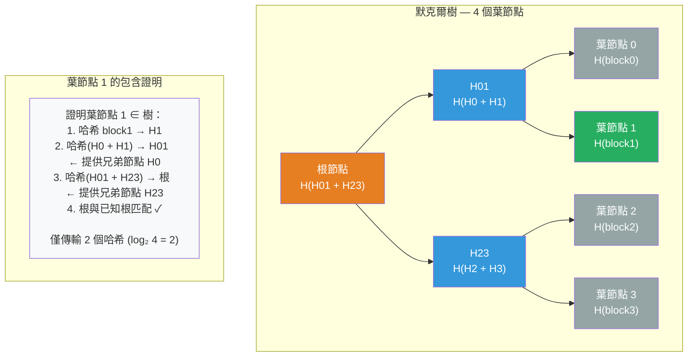

# [BEE-432] 默克爾樹

:::info
默克爾樹讓你只用 O(log n) 個哈希值——而不是傳輸所有 n 個項目——就能驗證單個元素是否屬於某個大型數據集，或兩個副本是否一致。這種不對稱性使默克爾樹成為分散式數據庫中反熵修復、Git 的內容定址存儲、比特幣的交易驗證以及憑證透明度的可信審計日誌的標準基礎原語。
:::

## Context

Ralph Merkle 在「認證數字簽名」（CRYPTO '89，1979 年首次提交給 CACM；美國專利 4,309,569，1982 年授予）中描述了哈希樹。核心思想很直觀：對每個數據塊進行哈希以產生葉節點，然後反覆對相鄰節點進行配對哈希，直到得到單一的根哈希值。根哈希是整個數據集的密碼學指紋。

有用的性質源自密碼學哈希函數的雪崩效應：輸入中任何單一字節的改變都會以不可預測的方式改變根哈希值。這使得樹具有**防篡改性**——持有相同根哈希的兩方可以確信其底層數據一致。但更重要的是，樹結構允許**證明者**向**驗證者**證明特定葉節點屬於該樹，只需提供從該葉節點到根的路徑上的兄弟哈希——對於 n 個葉節點，需要 O(log n) 個哈希。驗證者從下到上重新計算路徑，並檢查結果是否等於已知根。不需要其他數據。

**Git** 直接應用了這一點。每個 Git 對象——blob（文件內容）、tree（目錄列表）、commit——都存儲在由其內容派生的 SHA-1（後來是 SHA-256）鍵下。commit 指向 tree，tree 指向 blob 和子樹，形成一個默克爾有向無環圖（DAG）。比較兩個 commit 時，Git 遍歷 DAG，在任何根哈希匹配的子樹處停止遞歸——一個包含一萬個文件的整個目錄通過單次哈希比較就能確認完全相同。這使 `git diff` 和 `git clone --depth` 只傳輸實際更改的內容。

**比特幣**在每個區塊內使用默克爾樹來支持簡化支付驗證（SPV）。中本聰 2008 年白皮書的第 8 節描述了這一點：輕量級客戶端只下載 80 字節的區塊頭（包含默克爾根），並向全節點請求從特定交易到根的路徑上的兄弟哈希。客戶端重新計算路徑並驗證包含關係，而無需下載完整區塊。CVE-2012-2459 後來揭示，當交易數為奇數時，比特幣的實現會複製最後一筆交易，使相同的默克爾根可以對應兩個不同的交易集——這是一個輸入驗證漏洞，通過檢查這種規範化形式修復。

**Amazon DynamoDB 和 Apache Cassandra** 使用默克爾樹進行反熵修復。DeCandia 等人在 Dynamo 論文（SOSP 2007）中描述了這一點：每個節點維護其鍵範圍的默克爾樹，葉節點代表小的鍵空間桶。在後台修復期間，兩個副本交換根哈希。如果匹配，整個鍵範圍一致。如果不同，節點遞歸到子樹，縮小差異範圍到一小組MUST（必須）同步的桶。Cassandra 的 `nodetool repair` 運行此協議；沒有它，網絡分區和節點故障將導致永久性分歧。

**憑證透明度**（RFC 6962，Ben Laurie 等人，2013 年）使用僅追加的默克爾樹創建 TLS 憑證的公開可審計日誌，防止憑證授權機構欺詐。每個 CA 向一個或多個 CT 日誌提交憑證。日誌返回一個簽名憑證時間戳（SCT）——承諾在最大合並延遲內將憑證包含在樹中。瀏覽器驗證憑證出現在已知日誌中。包含證明（O(log n) 個哈希，證明憑證在樹中）和一致性證明（O(log n) 個哈希，證明舊日誌是新日誌的前綴）允許任何人在不下載整個日誌的情況下審計它。

## Design Thinking

**當你需要廉價地驗證子集成員資格或比較大型數據集時，使用默克爾樹。** 基本取捨是空間（存儲樹）和時間（構建和更新樹）換取通信成本（比較或驗證時 O(log n) 對 O(n)）。當數據集很大、通信成本高且驗證頻繁時，這種取捨有利於默克爾樹——正是分散式數據庫修復、區塊鏈 SPV 和憑證審計中的條件。

**默克爾樹是靜態結構，更新成本較高。** 追加新葉節點需要重新計算到根的 O(log n) 個哈希。在中間插入需要重構樹。憑證透明度日誌通過僅追加來回避這個問題——它們從不修改現有葉節點。Cassandra 和 DynamoDB 定期在固定鍵範圍上重建默克爾樹，而不是增量維護它們。如果你的用例需要頻繁的隨機更新，默克爾樹可能不是正確的結構；考慮使用布隆過濾器（BEE-431）進行成員資格查詢，或使用向量時鐘（BEE-422）進行因果關係追蹤。

**哈希函數的選擇決定了安全屬性。** SHA-1 的碰撞抗性已被破解（SHAttered 攻擊，2017 年），Git 正在遷移到 SHA-256。比特幣使用雙 SHA-256（SHA-256 應用兩次）。憑證透明度使用 SHA-256。對於新系統，使用 SHA-256 或 SHA-3。對于默克爾樹，第二原像抗性最為重要：給定一個葉節點，在計算上MUST（必須）不可行找到具有相同哈希的不同葉節點。

**區分包含證明和一致性證明。** 包含證明回答「此元素是否在此樹中？」——驗證者知道根，並檢查單個元素。一致性證明回答「舊樹是否是新樹的前綴？」——驗證者持有兩個根（在不同時間），並驗證日誌只通過追加增長。憑證透明度需要兩者。數據庫中的反熵修復只需要包含/排除比較。Git 只需要根相等性檢查。

## Visual



## Example

**Cassandra 使用默克爾樹進行反熵修復：**

```
# 兩個副本（A 和 B）使用默克爾樹進行比較
# 鍵範圍：[0x0000, 0xFFFF) 分為 4 個桶

副本 A 的樹：                副本 B 的樹（桶 2 已分歧）：
根：H(H01 + H23)             根：H(H01 + H23')   ← 根不同
├── H01：H(H0 + H1)          ├── H01：H(H0 + H1)   ← 匹配：跳過桶 0-1
└── H23：H(H2 + H3)          └── H23'：H(H2' + H3) ← 不同：遞歸
    ├── H2：hash(桶2)             ├── H2'：hash(桶2') ← 不同：同步桶 2
    └── H3：hash(桶3)             └── H3：hash(桶3)   ← 匹配：跳過桶 3

# 結果：只有桶 2（鍵 0x8000-0xBFFF）從 A 同步到 B
# 沒有默克爾樹的話：MUST（必須）比較所有 4 個桶的所有鍵
```

**Git 內容定址存儲：**

```bash
# Git 中的每個對象都存儲在其內容的哈希下
git cat-file -p HEAD
# tree 5b8e4b...     <- 指向根 tree 對象
# parent 3f7a2c...
# author Alice <alice@example.com> 1713100000 +0000
# 提交信息

git cat-file -p 5b8e4b
# 100644 blob a9f3b2...  README.md
# 100644 blob 7c8d1e...  main.go
# 040000 tree 2e5f9a...  internal/

# 比較兩個 commit：遍歷 DAG，在匹配的子樹哈希處停止
# 如果兩個 commit 之間 internal/ 的 tree 哈希匹配 → 該子樹中無更改
# 時間與更改的文件數成正比，而非文件總數
```

**憑證透明度包含證明（RFC 6962）：**

```
# 瀏覽器收到帶有 SCT（簽名憑證時間戳）的憑證
# SCT 證明 CT 日誌承諾包含該憑證

# 在合並延遲後驗證包含關係：
# 1. 瀏覽器獲取當前日誌樹大小和根哈希（由日誌簽名）
# 2. 瀏覽器請求憑證葉哈希的包含證明
# 3. 日誌返回 [sibling_hash_1, sibling_hash_2, ..., sibling_hash_k]（k = log₂ n 個哈希）
# 4. 瀏覽器重新計算：
#    leaf_hash = H(0x00 || certificate_data)
#    parent = H(0x01 || leaf_hash || sibling_1)
#    grandparent = H(0x01 || parent || sibling_2)
#    ... 直到根
# 5. 計算出的根MUST（必須）與簽名根匹配——憑證在日誌中

# 一致性證明（審計者驗證日誌只通過追加增長）：
# 給定 root_old（大小 m）和 root_new（大小 n，n > m）：
# 日誌提供 O(log n) 個哈希，證明 root_old 是 root_new 的前綴
```

## Related BEEs

- [BEE-6003](../data-storage/replication-strategies.md) -- 複製策略：Cassandra 和 DynamoDB 的反熵修復使用默克爾樹來識別副本間的差異鍵範圍，而無需傳輸所有數據——默克爾比較在 Gossip 複製基礎設施上運行
- [BEE-6005](../data-storage/storage-engines.md) -- 存儲引擎：Git 是建立在默克爾 DAG 上的內容定址對象存儲；存儲引擎直接將 SHA 哈希映射到對象文件，使去重和增量傳輸成為結構性屬性，而非附加功能
- [BEE-19004](gossip-protocols.md) -- Gossip 協議：Cassandra 節點使用 Gossip 協調哪些副本對應該運行反熵修復；默克爾樹比較是識別需要同步的鍵範圍的載體
- [BEE-19012](bloom-filters-and-probabilistic-data-structures.md) -- 布隆過濾器與概率數據結構：布隆過濾器和默克爾樹解決不同的分散式系統問題——布隆過濾器在 O(1) 內回答「此鍵是否存在？」但有有界假陽性；默克爾樹在 O(log n) 內回答「兩個副本在哪裡不同？」且無假陽性；生產數據庫（Cassandra、RocksDB）同時使用兩者

## References

- [認證數字簽名 -- Ralph Merkle, CRYPTO 1989](https://link.springer.com/content/pdf/10.1007/0-387-34805-0_21.pdf)
- [提供數字簽名的方法 -- 美國專利 4,309,569（Ralph Merkle，1982 年）](https://patents.google.com/patent/US4309569A/en)
- [比特幣：點對點電子現金系統 -- Satoshi Nakamoto, 2008](https://bitcoin.org/bitcoin.pdf)
- [默克爾樹漏洞 -- Bitcoin Optech](https://bitcoinops.org/en/topics/merkle-tree-vulnerabilities/)
- [Dynamo：Amazon 的高可用鍵值存儲 -- DeCandia 等人, SOSP 2007](https://www.allthingsdistributed.com/files/amazon-dynamo-sosp2007.pdf)
- [憑證透明度 -- RFC 6962（Ben Laurie 等人，2013 年）](https://www.rfc-editor.org/rfc/rfc6962.html)
- [憑證透明度 2.0 版 -- RFC 9162（2021 年）](https://www.rfc-editor.org/rfc/rfc9162.html)
