# [BEE-19042] N+1 查詢問題與批次載入

:::info
N+1 查詢問題發生在獲取 N 筆記錄的列表時，對每筆記錄又額外發出一次資料庫查詢以載入相關實體——共產生 N+1 次查詢，而本可以用一到兩次查詢完成——是 ORM 應用程式中最常見的效能反模式。
:::

## 背景

物件關聯對映（ORM）透過允許程式碼自然地遍歷關聯來橋接關係型資料庫和物件圖：`order.customer.name` 讀起來像屬性存取，但實際上執行了一個 `SELECT` 語句。這種便利帶來了一個陷阱：**延遲載入（Lazy Loading）**，相關實體在第一次存取時而非查詢時才被獲取。

延遲載入在存取單筆記錄時運作良好。在迴圈中就會出現病態情況。獲取 100 筆訂單，然後在迴圈中存取 `order.customer`，會觸發 100 個獨立的 `SELECT` 語句——每筆訂單一個——以及最初用於獲取訂單的 `SELECT`。這就是 N+1 問題：N 個關聯查詢加上 1 個父列表查詢。

這個問題在 ORM 文獻中至少從 Martin Fowler 的《企業應用架構模式》（2002 年）就有記載，書中命名了延遲載入模式並指出了其效能影響。每個主要 ORM 都提供了預先載入（Eager Loading）作為解決方案：Rails 的 `includes`/`preload`/`eager_load`、Django 的 `select_related`/`prefetch_related`、Hibernate 的 `JOIN FETCH` 和 `@BatchSize`。這個模式已被充分理解——然而 N+1 仍然是生產系統中最常被引用的 ORM 效能問題，因為延遲載入是預設行為，而預先載入必須明確請求。

GraphQL 顯著放大了這個問題。在 REST 端點中，開發者編寫一個可以聯接並返回所有所需資料的解析器。在 GraphQL 中，每個欄位都有自己的解析器函式，獨立運行。對 `{ orders { id customer { name } } }` 的查詢會呼叫 `orders` 解析器一次，並對返回的每筆訂單呼叫 `customer` 解析器一次。沒有明確的批次處理，使用延遲載入解析器的 GraphQL 伺服器在結構上就會產生 N+1 查詢。Facebook 工程師 Lee Byron 和 Nick Schrock 在 2015 年創建了 **DataLoader** 並將其開源作為標準解決方案：一個收集當前事件迴圈週期中請求的所有鍵、發出單次批次查詢並在請求生命週期內快取結果的工具。

## 設計思維

### 預先載入 vs. 批次載入

存在兩種結構性解決方案：

**預先載入**（JOIN 或多查詢預取）：應用程式預先宣告要與主查詢一起載入的關聯。ORM 要麼聯接資料表，要麼在第一次查詢後立即發出第二個 `SELECT ... WHERE id IN (...)`。結果集在迴圈開始前就包含了所有所需資料。這是 REST API、背景任務以及在處理開始前就知道完整記錄集及其關聯的任何情境下的正確解決方案。

**批次載入**（DataLoader 模式）：應用程式將所有鍵查找推遲到當前週期結束，然後發出單次批次查詢。這是當需要載入的鍵集事先未知時的正確解決方案——尤其是在 GraphQL 中，同一請求中不同的解析器獨立發現要查找的鍵。批次載入不能用預先載入來執行，因為在發現需要相關資料時，查詢已經在執行了。

實際規則：在 REST 和任務處理情境中使用預先載入；在 GraphQL 解析器中使用批次載入（DataLoader）。

### N+1 隱藏之處

N+1 並不總是帶有明確 ORM 呼叫的 `for` 迴圈。常見的偽裝形式：

- **序列化器存取關聯**：一個 JSON 序列化器為列表中的每個使用者呼叫 `user.profile.avatar_url`。
- **模板渲染**：一個 HTML 模板循環瀏覽文章並存取 `post.author.display_name`。
- **迴圈中的 `count()`**：為每篇文章呼叫 `.comments.count()` 會為每篇文章發出一個 `COUNT(*)`，而不是一個 `GROUP BY`。
- **中介軟體或過濾器**：在每個請求中查找當前使用者的組織的身份驗證中介軟體，沒有在請求生命週期內快取結果。

## 最佳實踐

**必須（MUST）在開發和測試環境中啟用 N+1 偵測。** Bullet gem（Rails）攔截 ActiveRecord 查詢，並在偵測到 N+1 或未使用的預先載入時發出警報。Django 有 `django-silk` 和 `nplusone`。在任何框架中，在測試中對最大查詢數進行斷言可以捕捉到回歸：

```python
# Django：無論結果大小，斷言只有 2 次查詢（1 次訂單，1 次客戶）
from django.test.utils import CaptureQueriesContext
from django.db import connection

with CaptureQueriesContext(connection) as ctx:
    response = client.get("/api/orders/")
assert len(ctx.captured_queries) <= 2, f"偵測到 N+1：{len(ctx.captured_queries)} 次查詢"
```

**必須（MUST）在始終需要關聯資料時使用預先載入。** 如果每個序列化的訂單都包含客戶名稱，就應始終預先載入客戶。1 次查詢和 N 次查詢之間的效能差異隨結果集大小線性增長：

```python
# Django：差 — N+1
orders = Order.objects.all()
for order in orders:
    print(order.customer.name)  # 每筆訂單觸發一次 SELECT

# Django：好 — 共 2 次查詢（一次訂單，一次客戶）
orders = Order.objects.select_related("customer").all()

# Django：對多對多或反向 FK 好 — 2 次查詢
orders = Order.objects.prefetch_related("line_items").all()
```

**必須（MUST）使用 `IN` 子句批次載入作為批次獲取的預設模式。** 當通過 ID 載入 N 筆相關記錄時，一個 `SELECT ... WHERE id IN (id1, id2, ..., idN)` 始終優於 N 個獨立的 `SELECT ... WHERE id = ?` 查詢。這同樣適用於 DataLoader 實現：

```javascript
// DataLoader 批次函式：接收鍵的陣列，以相同順序返回值的陣列
const userLoader = new DataLoader(async (userIds) => {
  const users = await db.query(
    "SELECT * FROM users WHERE id = ANY($1)",
    [userIds]
  );
  // DataLoader 要求結果與輸入鍵的順序相同
  const userMap = Object.fromEntries(users.map(u => [u.id, u]));
  return userIds.map(id => userMap[id] ?? new Error(`User ${id} not found`));
});
```

**應該（SHOULD）將 DataLoader 實例的範圍限定為每個請求，而非整個應用程式。** DataLoader 快取存儲 loader 實例生命週期內的結果。請求範圍的 DataLoader 在請求內正確去重（使用者 ID 42 被三個解析器查找 → 一次查詢），同時防止過期資料跨請求洩露。全局 DataLoader 會從之前的請求中提供快取資料，破壞快取失效：

```python
# FastAPI + Strawberry GraphQL：每個請求創建新的 DataLoader
from strawberry.dataloader import DataLoader

async def get_context(request: Request):
    return {
        "user_loader": DataLoader(load_fn=batch_load_users),
        "product_loader": DataLoader(load_fn=batch_load_products),
    }
```

**必須（MUST）對一對多關係從外鍵側而非主鍵側載入關聯。** 通過迭代文章並呼叫 `post.comments` 來載入「每篇文章的所有評論」是 N+1。正確的批次模式通過父 ID 列表查詢多側，然後分組結果：

```python
async def batch_load_comments_by_post(post_ids: list[int]) -> list[list[Comment]]:
    """返回評論列表的列表，每個輸入 post_id 一個，按輸入順序排列。"""
    comments = await db.fetch(
        "SELECT * FROM comments WHERE post_id = ANY($1) ORDER BY created_at",
        post_ids
    )
    # 按 post_id 分組
    by_post: dict[int, list] = {pid: [] for pid in post_ids}
    for comment in comments:
        by_post[comment["post_id"]].append(comment)
    return [by_post[pid] for pid in post_ids]  # 保持輸入順序
```

**應該（SHOULD）為高流量端點的整合測試添加查詢數量上限。** 分頁 100 筆記錄的列表端點中的 N+1 回歸會將 2 次查詢變為 101 次。在測試中斷言上限可防止這種情況在未被偵測到的情況下到達生產環境。將上限設置為相對於結果數量的 `O(1)`：典型列表端點 2–5 次查詢，無論頁面大小。

## 視覺說明

```mermaid
flowchart TD
    subgraph "N+1（差）"
        A1["SELECT * FROM orders\n→ [order1, order2, ..., order100]"]:::bad
        A2["SELECT * FROM customers WHERE id = 1"]:::bad
        A3["SELECT * FROM customers WHERE id = 2"]:::bad
        A4["... × 100"]:::bad
        A1 --> A2 --> A3 --> A4
    end

    subgraph "預先載入（好 — REST/任務）"
        B1["SELECT * FROM orders\n→ [order1..100]"]:::good
        B2["SELECT * FROM customers\nWHERE id IN (1, 2, ..., 100)\n→ [customer1..100]"]:::good
        B1 --> B2
    end

    subgraph "DataLoader（好 — GraphQL）"
        C1["解析器週期：\norder1.customer_id=1\norder2.customer_id=2\n..."]:::good
        C2["週期結束：\nbatch([1,2,...,100])"]:::good
        C3["SELECT * FROM customers\nWHERE id IN (1,2,...,100)"]:::good
        C1 --> C2 --> C3
    end

    style A1 fill:#c0392b,color:#fff
    style A2 fill:#c0392b,color:#fff
    style A3 fill:#c0392b,color:#fff
    style A4 fill:#c0392b,color:#fff
    style B1 fill:#27ae60,color:#fff
    style B2 fill:#27ae60,color:#fff
    style C1 fill:#3498db,color:#fff
    style C2 fill:#3498db,color:#fff
    style C3 fill:#3498db,color:#fff
```



## 實作注意事項

**Rails**：`includes` 根據條件是否引用關聯來選擇 `preload`（獨立 `IN` 查詢）和 `eager_load`（LEFT OUTER JOIN）。當按關聯資料表的欄位過濾時使用 `eager_load`；否則使用 `preload`。Bullet gem 在開發中偵測 N+1，幾乎不需要配置。

**Django**：`select_related` 使用 SQL JOIN 遵循 ForeignKey 和 OneToOne 關係——用於單個關聯物件。`prefetch_related` 發出單獨的查詢並在 Python 中進行聯接——用於 ManyToMany 和反向 ForeignKey 關係。在迴圈內使用 `.filter()` 對 `prefetch_related` 進行事後過濾而不再次引起 N+1。

**Hibernate/JPA**：`@ManyToOne` 上的 `FetchType.LAZY` 是預設值也是 N+1 的來源。解決方案：JPQL 查詢中的 `JOIN FETCH`、用於命名獲取計畫的 `@EntityGraph`，或 `@BatchSize` 告訴 Hibernate 將延遲載入批次處理為 `IN` 查詢而非個別 select。

**GraphQL（任何語言）**：DataLoader 是標準。每個關聯解析器都應該（SHOULD）使用 DataLoader。DataLoader 實現存在於 Python（`strawberry-graphql`、`aiodataloader`）、Go（`graph-gophers/dataloader`）、Java（`java-dataloader`）和 Ruby（`graphql-batch`）。關鍵不變量：DataLoader 批次函式必須以與輸入鍵陣列相同的順序返回結果，在未找到鍵的位置使用 `null` 或 `Error`。

## 相關 BEE

- [BEE-6006](../data-storage/connection-pooling-and-query-optimization.md) -- 連線池與查詢最佳化：N+1 查詢會成倍增加連線使用量；一個端點中的 N+1 耗盡的連線池會降低所有其他端點的效能
- [BEE-6002](../data-storage/indexing-deep-dive.md) -- 索引深度解析：N+1 查詢各自單獨訪問索引；即使是快速的索引查找，在重複 N 次後也會變慢；批次載入分攤了索引遍歷成本
- [BEE-4005](../api-design/graphql-vs-rest-vs-grpc.md) -- GraphQL vs REST vs gRPC：GraphQL 的每欄位解析器模型是 GraphQL 中 N+1 的結構性原因；DataLoader 是標準的緩解措施
- [BEE-9001](../caching/caching-fundamentals-and-cache-hierarchy.md) -- 快取基礎與快取階層：DataLoader 的每請求快取是請求內去重的最小、正確的快取；它補充但不取代持久快取層

## 參考資料

- [DataLoader — GitHub (graphql/dataloader)](https://github.com/graphql/dataloader)
- [Solving the N+1 Problem for GraphQL through Batching -- Shopify Engineering](https://shopify.engineering/solving-the-n-1-problem-for-graphql-through-batching)
- [Lazy Load -- Patterns of Enterprise Application Architecture, Martin Fowler (2002)](https://martinfowler.com/eaaCatalog/lazyLoad.html)
- [Active Record Query Interface -- Ruby on Rails Guides](https://guides.rubyonrails.org/active_record_querying.html)
- [QuerySet API Reference (select_related, prefetch_related) -- Django Documentation](https://docs.djangoproject.com/en/stable/ref/models/querysets/)
- [Bullet — N+1 Detection for Rails (flyerhzm)](https://github.com/flyerhzm/bullet)
