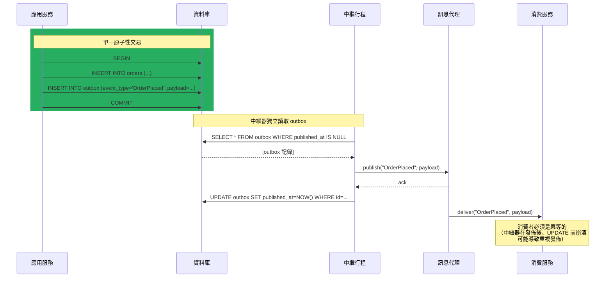

# [BEE-472] Outbox 模式與交易式訊息傳遞

:::info
Outbox 模式解決了雙重寫入問題——無法在單一操作中同時原子性地更新資料庫並向訊息代理發佈訊息——其方式是將事件與業務資料寫入同一筆資料庫交易中的「outbox」資料表，再由獨立的中繼行程（relay）將其發佈至代理。
:::

## 背景

事件驅動微服務中一個反覆出現的故障模式：服務成功更新資料庫，然後嘗試向訊息代理發佈事件。代理呼叫失敗。資料庫現在反映的狀態沒有任何下游消費者知曉。事件就此遺失。反之，發佈成功但資料庫寫入失敗或被回滾。下游服務已處理了一個實際上不存在的交易的事件。兩種結果都會破壞系統狀態的一致性。

這就是**雙重寫入問題**：服務必須寫入兩個獨立的系統——資料庫和訊息代理——而沒有任何分散式交易能同時跨越這兩者提供 ACID 保證。「重試」這個直覺解法並不奏效：若服務在發佈後、資料庫提交前崩潰，重試將產生重複事件；若在資料庫提交後、發佈前崩潰，事件將被靜默遺失。

Martin Kleppmann 在《Designing Data-Intensive Applications》（2017 年）第 11 章中明確點出此故障模式：在沒有協調機制的情況下對獨立系統進行雙重寫入，會產生難以重現、幾乎無法透過標準監控偵測的微妙一致性錯誤。

Outbox 模式由 Chris Richardson 在其 microservices.io 模式目錄中正式整理並推廣，透過將兩系統寫入轉為單系統寫入來解決此問題。服務將業務資料和 outbox 記錄在同一個資料庫交易中寫入。由於 outbox 資料表在同一個資料庫中，這次寫入是原子性的：業務資料列和 outbox 記錄要麼都提交，要麼都不提交。然後，一個獨立的行程——中繼器或發佈者——再從 outbox 資料表讀取並獨立發佈至訊息代理。中繼器可重試且具有崩潰安全性，因為 outbox 會持久保存直到事件被確認已發佈。

此模式提供**至少一次交付（at-least-once delivery）**：中繼器可能在發佈事件後、將其標記為已發送前崩潰，導致下次中繼器運行時再次發佈。消費者必須設計為能處理重複訊息——這一要求同樣適用於所有基於訊息的系統（BEE-226）。

## 設計思考

### 兩種中繼策略

從 outbox 讀取並發佈至代理的中繼行程可以用兩種方式實作：

**輪詢中繼**：背景執行緒或排程工作查詢 outbox 資料表以獲取未發佈的事件，發佈後將其標記為已發送。實作簡單，適用於任何資料庫。缺點：輪詢會增加資料庫的讀取負載，並引入等於輪詢間隔（通常為 1–5 秒）的延遲。在高事件率下，輪詢可能成為瓶頸。

**基於 CDC 的中繼（高吞吐量推薦）**：CDC 系統（Debezium、AWS DMS）監聽資料庫的預寫日誌（WAL）以追蹤 outbox 資料表的插入操作，並在它們出現時立即發佈至代理。無輪詢迴圈；事件在提交後的毫秒內即被捕獲。Debezium 的 Outbox Event Router 是一個 Kafka Connect Single Message Transform（SMT），它提取事件載荷、路由至正確的主題，並刪除或標記 outbox 記錄——整個過程無需輪詢。代價是：CDC 引入了較高的維運複雜度（WAL 設定、連接器部署）。

| | 輪詢中繼 | 基於 CDC 的中繼 |
|---|---|---|
| 延遲 | 輪詢間隔（通常 1–5 秒） | 毫秒級 |
| 資料庫負載 | 定期讀取 | WAL 串流（低） |
| 複雜度 | 低 | 較高（連接器基礎設施） |
| 排序 | 在輪詢批次內 | 從 WAL 保留 |
| 資料庫需求 | 任何關聯式資料庫 | 需支援邏輯複製 |

### Outbox 資料表設計

outbox 資料表是資料庫內部的訊息佇列。其 Schema 必須包含足夠讓中繼器正確發佈事件的資訊：

```sql
CREATE TABLE outbox (
    id           UUID        PRIMARY KEY DEFAULT gen_random_uuid(),
    aggregate_id VARCHAR(255) NOT NULL,  -- 例如訂單 ID，用於主題路由
    event_type   VARCHAR(255) NOT NULL,  -- 例如 "OrderPlaced"
    payload      JSONB        NOT NULL,  -- 序列化的事件資料
    created_at   TIMESTAMPTZ  NOT NULL DEFAULT now(),
    published_at TIMESTAMPTZ            -- NULL = 未發佈；由中繼器設定
);

-- 輪詢中繼的索引：只掃描未發佈的事件
CREATE INDEX ON outbox (created_at) WHERE published_at IS NULL;
```

中繼器查詢 `WHERE published_at IS NULL ORDER BY created_at` 並依序發佈。在代理成功確認後，設定 `published_at = now()`。舊的已發佈記錄可由定期清理工作刪除。

### 排序保證

在單一 `aggregate_id`（例如訂單 ID）內，事件應按照插入 outbox 的順序發佈。輪詢中繼透過查詢中的 `ORDER BY created_at` 實現此目標。CDC 中繼自動保留 WAL 順序，因為資料列以提交順序串流。

*跨*不同 aggregate ID 的排序保證通常不提供也不需要。支援分區主題的訊息代理（Kafka、AWS Kinesis）在中繼器以 `aggregate_id` 為鍵路由事件時，自然地保留每個鍵的順序。

## 最佳實踐

**必須（MUST）在與業務資料相同的資料庫交易中寫入 outbox 資料表。** 這是此模式的核心不變條件。在交易邊界之外寫入 outbox 會重新引入雙重寫入問題。

**不得（MUST NOT）單獨使用資料庫的 `LISTEN/NOTIFY` 作為中繼機制。** PostgreSQL 的 `LISTEN/NOTIFY` 通知在 `NOTIFY` 發出時若無監聽器連接，可能會被丟棄。outbox 資料表提供耐久性；`LISTEN/NOTIFY` 可作為中繼器的低延遲喚醒信號來補充，但中繼器必須退回輪詢資料表作為後備。

**必須（MUST）確保中繼器在代理端具有冪等性。** 中繼器可能在發佈事件後、將其標記為已發送前崩潰。重啟後，它將再次發佈該事件。代理和消費者必須處理重複訊息——透過代理層去重（Kafka 的冪等生產者）、消費者層冪等性（BEE-226），或在載荷中包含唯一事件 ID 供消費者去重。

**應該（SHOULD）在每個 outbox 記錄中包含唯一事件 ID，並將其作為訊息 ID 傳播至代理。** 大多數代理允許設定訊息鍵或 ID。將其設為 outbox 記錄的 UUID，可啟用代理端去重，並使消費者端冪等性變得簡單：儲存已處理的 ID 並跳過重複項。

**應該（SHOULD）在事件吞吐量超過每秒數百個事件，或需要次秒級延遲時，使用基於 CDC 的中繼（Debezium）。** 以 1 秒間隔輪詢會引入系統性延遲。CDC 中繼從 WAL 串流讀取，並在提交後的毫秒內發佈，對資料庫的讀取負載極低。

**應該（SHOULD）按排程清理舊的 outbox 記錄。** outbox 資料表是暫時性緩衝區，不是永久事件儲存。累積數百萬筆已發佈記錄會增加資料表大小、減慢索引掃描並浪費儲存空間。每日執行 `DELETE FROM outbox WHERE published_at < NOW() - INTERVAL '7 days'` 可保持資料表精簡。

**應該（SHOULD）監控 outbox 資料表中超過閾值仍未發佈的事件。** 中繼器中斷或代理故障將導致積壓增長。對 `COUNT(*) WHERE published_at IS NULL AND created_at < NOW() - INTERVAL '5 minutes'` 超過閾值發出告警。這能在大規模不一致發生之前及早發現中繼器靜默故障。

**可以（MAY）為每種聚合類型使用獨立的 outbox 資料表**（例如 `order_outbox`、`payment_outbox`），以簡化中繼路由和按領域清理。代價是要管理更多資料表；好處是每個聚合可有獨立的中繼設定。

## 視覺化



## 範例

**業務寫入 + outbox 插入在單一交易中（Python / psycopg3）：**

```python
import uuid
import json
from psycopg import Connection

def place_order(conn: Connection, order_data: dict) -> str:
    order_id = str(uuid.uuid4())
    event_id = str(uuid.uuid4())

    with conn.transaction():  # 原子性：兩者都寫入，或都不寫入
        conn.execute(
            """INSERT INTO orders (id, customer_id, amount, status)
               VALUES (%s, %s, %s, 'pending')""",
            (order_id, order_data["customer_id"], order_data["amount"]),
        )
        conn.execute(
            """INSERT INTO outbox (id, aggregate_id, event_type, payload)
               VALUES (%s, %s, %s, %s)""",
            (
                event_id,
                order_id,
                "OrderPlaced",
                json.dumps({
                    "event_id": event_id,   # 傳播以供代理去重
                    "order_id": order_id,
                    "customer_id": order_data["customer_id"],
                    "amount": order_data["amount"],
                }),
            ),
        )
    return order_id
```

**輪詢中繼（Python）：**

```python
import time

POLL_INTERVAL_SECONDS = 1
BATCH_SIZE = 100

def run_relay(conn: Connection, broker) -> None:
    while True:
        with conn.transaction():
            rows = conn.execute(
                """SELECT id, aggregate_id, event_type, payload
                   FROM outbox
                   WHERE published_at IS NULL
                   ORDER BY created_at
                   LIMIT %s
                   FOR UPDATE SKIP LOCKED""",  # 防止並發中繼器重複處理
                (BATCH_SIZE,),
            ).fetchall()

            for row in rows:
                # 以 outbox 記錄的 UUID 作為訊息 ID 發佈
                broker.publish(
                    topic=row["event_type"],
                    key=row["aggregate_id"],
                    value=row["payload"],
                    message_id=str(row["id"]),  # 啟用代理端去重
                )
                conn.execute(
                    "UPDATE outbox SET published_at = NOW() WHERE id = %s",
                    (row["id"],),
                )
            # 交易在此提交：published_at 以原子方式為批次設定

        if not rows:
            time.sleep(POLL_INTERVAL_SECONDS)
```

**Debezium Outbox Event Router 設定（Kafka Connect）：**

```json
{
  "name": "order-outbox-connector",
  "config": {
    "connector.class": "io.debezium.connector.postgresql.PostgresConnector",
    "database.hostname": "postgres",
    "database.port": "5432",
    "database.dbname": "orders_db",
    "table.include.list": "public.outbox",
    "transforms": "outbox",
    "transforms.outbox.type": "io.debezium.transforms.outbox.EventRouter",
    "transforms.outbox.table.field.event.id": "id",
    "transforms.outbox.table.field.event.key": "aggregate_id",
    "transforms.outbox.table.field.event.type": "event_type",
    "transforms.outbox.table.field.event.payload": "payload",
    "transforms.outbox.route.by.field": "event_type",
    "transforms.outbox.route.topic.replacement": "outbox.${routedByValue}",
    "transforms.outbox.table.expand.json.payload": "true"
  }
}
```

**Outbox 記錄清理（透過 pg_cron 每日執行）：**

```sql
-- 刪除 7 天前已發佈的事件
DELETE FROM outbox
WHERE published_at IS NOT NULL
  AND published_at < NOW() - INTERVAL '7 days';

-- 監控未發佈積壓（超過閾值時發出告警）
SELECT COUNT(*) AS unpublished_backlog
FROM outbox
WHERE published_at IS NULL
  AND created_at < NOW() - INTERVAL '5 minutes';
```

## 實作說明

**PostgreSQL + Debezium**：高吞吐量 outbox 中繼的推薦技術堆疊。啟用 PostgreSQL 邏輯複製（`wal_level = logical`）。Debezium 的 `PostgresConnector` 串流 WAL 變更；Outbox Event Router SMT 將 outbox 插入轉換為正確路由的 Kafka 訊息。連接器處理排序、重試和確認。刪除模式（`transforms.outbox.delete.handling.mode = rewrite`）將刪除操作重寫為墓碑訊息，而非轉發刪除事件。

**MySQL + Debezium**：使用 `MySqlConnector` 的等效設定。MySQL 的 binlog 等同於 PostgreSQL 的 WAL。相同的 Outbox Event Router SMT 可跨連接器使用。

**MongoDB**：MongoDB Change Streams 可作為 outbox collection 的 CDC 來源。Debezium MongoDB 連接器支援相同的 Outbox Event Router 模式，監聽指定的 outbox collection。

**SQLAlchemy（Python）**：將 outbox 插入與業務寫入包裝在同一個 `Session` 中並一起提交。Session 的工作單元模式確保原子性。

**Spring Data / Hibernate（Java）**：使用 `@Transactional` 跨越實體儲存和 `OutboxEvent` 實體儲存。Spring 的 `ApplicationEventPublisher` 搭配 `@TransactionalEventListener(phase = AFTER_COMMIT)` 是一種常見模式——但請注意，`AFTER_COMMIT` 監聽器在交易之外觸發，並未解決雙重寫入問題。正確做法是在交易*內部*寫入 outbox 記錄，而不是在 `AFTER_COMMIT` 監聽器中。

## 相關 BEE

- [BEE-19018](change-data-capture.md) -- 變更資料擷取（CDC）：CDC（Debezium、基於 WAL）是高吞吐量下 Outbox 模式的推薦中繼機制；outbox 資料表是 CDC 來源
- [BEE-10007](../messaging/idempotent-message-processing.md) -- 冪等訊息處理：Outbox 模式提供至少一次交付；消費者必須實作冪等性以處理重複事件
- [BEE-8004](../transactions/saga-pattern.md) -- Saga 模式：Outbox 模式是以原子方式發佈 Saga 步驟事件與對應資料庫狀態變更的標準實作機制
- [BEE-19052](choreography-vs-orchestration-in-distributed-workflows.md) -- 分散式工作流程中的編排 vs 協調：在基於編排的 Saga 中，每個服務透過 Outbox 模式發佈事件，以保證事件永遠不會被靜默遺失

## 參考資料

- [Transactional Outbox Pattern — microservices.io（Chris Richardson）](https://microservices.io/patterns/data/transactional-outbox.html)
- [Outbox Event Router — Debezium 文件](https://debezium.io/documentation/reference/stable/transformations/outbox-event-router.html)
- [Designing Data-Intensive Applications, Chapter 11 — Martin Kleppmann（O'Reilly，2017）](https://www.oreilly.com/library/view/designing-data-intensive-applications/9781491903063/ch11.html)
- [Implementing the Transactional Outbox Pattern with Amazon EventBridge Pipes — AWS Blog](https://aws.amazon.com/blogs/compute/implementing-the-transactional-outbox-pattern-with-amazon-eventbridge-pipes/)
