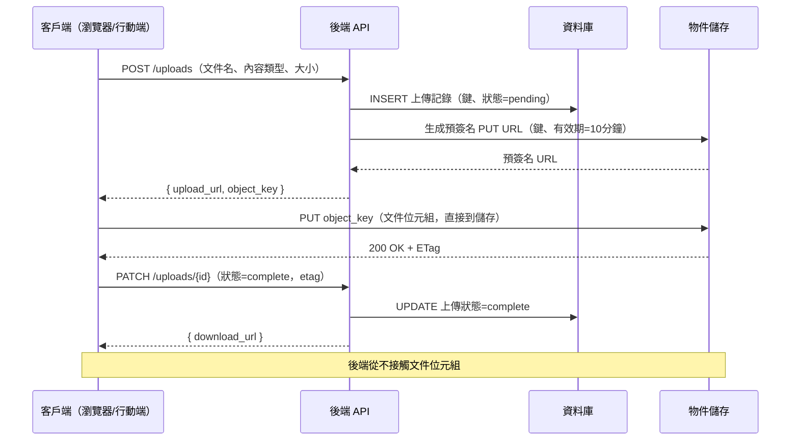

# [BEE-19040] 預簽名 URL 與物件儲存模式

:::info
預簽名 URL 授予對物件儲存中私有物件的臨時、有限範圍存取——允許客戶端直接向儲存服務上傳或下載檔案，無需通過後端伺服器傳輸位元組，也無需暴露長期憑證。
:::

## 背景

物件儲存系統（Amazon S3、Google Cloud Storage、Cloudflare R2 以及 S3 相容替代品）將檔案作為物件存儲在稱為 bucket 的扁平命名空間中。簡單的整合模式是通過應用伺服器代理每次檔案傳輸：客戶端將檔案發送到後端，後端將其寫入儲存，下載時後端從儲存讀取並串流傳輸給客戶端。這種方式可行，但擴展性不佳：後端伺服器的頻寬和 CPU 成為可以直接在客戶端和儲存之間進行的傳輸的瓶頸。

**預簽名 URL** 通過將單次、有時效、有限範圍的操作委託給客戶端來解決這個問題。後端生成一個 URL，其中編碼了 bucket、物件鍵、允許的 HTTP 方法（GET 或 PUT）、到期時間，以及使用服務存取金鑰計算的加密簽名。客戶端直接將此 URL 提交給儲存服務，儲存服務驗證簽名並執行操作——後端伺服器不在資料路徑中。客戶端從不看到底層的存取金鑰。

預簽名 URL 方法在 2010 年代初期成為網頁文件上傳和媒體傳遞架構的標準，當時 S3 的 REST API 成熟到足以支持通過 `PUT` 上傳而不需要基於 POST 的多部分表單。該模型現在使用 AWS Signature Version 4 在所有主要物件儲存服務中以相同方式實現。

一項相關但不同的技術是 **CDN 簽名 URL**。預簽名 S3 URL 直接指向源儲存，而 CDN 簽名 URL（CloudFront 簽名 URL、Akamai EdgeAuth 令牌、Cloudflare Workers 簽名 URL）通過 CDN 邊緣路由。CDN 簽名 URL 優先用於受益於邊緣快取和地理分佈的媒體串流和下載；儲存預簽名 URL 優先用於上傳和唯一物件的一次性下載。

## 設計思維

### 兩步驟上傳流程

標準直接上傳模式有兩個請求：

1. **客戶端 → 後端**：「我想上傳 `document.pdf`（200 KB，`application/pdf`）。給我一個上傳 URL。」
2. **後端 → 客戶端**：返回一個預簽名 `PUT` URL（有效期 5–60 分鐘）和最終的物件鍵。
3. **客戶端 → 儲存**：直接向預簽名 URL 執行 `PUT document.pdf`。後端不在這個資料路徑中。
4. **客戶端 → 後端**：「上傳完成。這是物件鍵。」後端在其資料庫中記錄物件鍵。

這消除了傳輸的後端頻寬成本，減少了延遲（少一跳），並且使上傳吞吐量與後端容量獨立擴展。

### 物件鍵設計

物件鍵（bucket 中的「路徑」）是一個具有安全性和運維影響的架構決策：

**避免使用用戶控制的鍵。** 如果客戶端可以將 `../../admin/config.json` 指定為鍵，或者鍵是一個可預測的值如 `user-123/avatar.jpg`，其他用戶可能能夠通過構建 URL 猜測並下載私有物件。使用隨機 UUID 或內容哈希作為鍵前綴：

```
uploads/{uuid}/{original-filename}           # 好：無法猜測的前綴
users/{user_id}/avatar.jpg                   # 差：可預測、可枚舉
```

**內容尋址儲存**使用文件內容的 SHA-256 哈希作為鍵：`objects/sha256/{hash}`。這提供了自動去重（兩個相同的文件映射到相同的鍵）、不可變性（鍵中的內容從不改變）和完整性驗證。後端可以在發出預簽名 PUT URL 之前檢查物件是否已存在，並完全跳過上傳。

### 有效期窗口

預簽名 URL 是不記名令牌（bearer token）：任何擁有 URL 的人都可以在 URL 到期之前執行允許的操作。有效期必須根據使用案例設置：

| 使用案例 | 建議有效期 |
|---------|-----------|
| 上傳 URL（瀏覽器/行動端） | 5–30 分鐘 |
| 下載 URL（面向用戶的連結） | 1–24 小時 |
| 內部服務間通訊 | 1–5 分鐘 |
| 共享下載連結（通過電子郵件發送給用戶） | 1–7 天 |
| 媒體串流的 CDN 簽名 URL | 會話持續時間 + 緩衝時間 |

不要使用最大允許有效期（S3 上的 7 天）作為預設值。較短的有效期限制了 URL 洩露時的影響範圍。

## 最佳實踐

**必須（MUST）在服務端設置限制後生成預簽名 PUT URL，限制物件鍵。** 客戶端不應決定最終的儲存鍵。後端生成鍵（UUID 前綴 + 清理後的文件名），在發出 URL 之前在資料庫中記錄它，並僅向客戶端返回預簽名 URL。如果客戶端提供文件名，必須（MUST）對其進行清理並作為後綴附加，而不是用作完整鍵。

**必須（MUST）在可能的情況下對預簽名 PUT URL 設置 `Content-Type` 和 `Content-Length` 條件。** 沒有內容類型限制的預簽名 PUT URL 允許客戶端將任何 MIME 類型上傳到後端期望包含 PDF 的鍵。使用預簽名 URL 策略條件來限制允許的內容類型和最大內容長度：

```python
# boto3：生成限制為 10MB 以下 PDF 的預簽名 PUT URL
s3 = boto3.client("s3")
url = s3.generate_presigned_url(
    "put_object",
    Params={
        "Bucket": "my-bucket",
        "Key": f"uploads/{uuid4()}/{filename}",
        "ContentType": "application/pdf",
        "ContentLength": max_size_bytes,   # 如果發送 Content-Length 標頭，由 S3 強制執行
    },
    ExpiresIn=600,   # 10 分鐘
)
```

**必須（MUST）在 bucket 上配置 CORS 以支持瀏覽器上傳。** 瀏覽器對 `PUT` 請求強制執行同源策略。如果沒有允許來自應用程式源的 `PUT` 的 CORS 配置，瀏覽器將拒絕上傳。CORS 配置必須（MUST）明確指定允許的源——`AllowedOrigins: ["https://app.example.com"]`——而不是萬用字元 `*`，這會允許任何源上傳。

**必須不（MUST NOT）對需要與已驗證用戶當前狀態相關的存取控制的物件使用預簽名 GET URL。** 預簽名 GET URL 是不記名令牌。如果用戶在 URL 發出後被撤銷存取，URL 在到期之前仍然有效。對於需要動態存取控制的物件（基於訂閱的內容、醫療記錄），優先使用短有效期（1–5 分鐘）或通過代理的簽名 URL 方法，後端在每次請求時驗證會話。

**應該（SHOULD）對大於 100 MB 的文件使用多部分上傳。** 多部分上傳允許並行部分上傳、單個部分的自動重試以及從網路中斷中恢復。流程：（1）後端初始化多部分上傳並接收 `uploadId`；（2）後端為每個部分發出預簽名 URL（每個部分最小 5 MB，最多 10,000 個部分）；（3）客戶端並行上傳部分，收集 ETag；（4）客戶端將 ETag 發送給後端；（5）後端呼叫 `CompleteMultipartUpload`。S3 上超過 5 GB 的文件需要多部分上傳（單個 PUT 限制）。

**應該（SHOULD）在去重很重要時對用戶上傳的內容使用內容尋址儲存（基於哈希的鍵）。** 在上傳之前計算文件的 SHA-256。檢查物件是否存在於 `objects/sha256/{hash}`。如果存在，跳過上傳並返回現有的物件引用。如果不存在，使用哈希作為鍵發出預簽名 PUT URL。這消除了相同文件的重複存儲，並且本質上是不可變的——哈希鍵中的內容從不改變。

**必須（MUST）在提供私有媒體時使用適當的策略保護 CDN 簽名 URL。** CDN 簽名 URL（CloudFront 簽名 URL、Cloudflare 簽名令牌）應該（SHOULD）包括：特定的資源路徑或萬用字元前綴（不是 `*`）、與已驗證會話綁定的到期時間，以及對高安全性內容的可選 IP 限制。當用戶在一個會話中存取多個資源時（例如，視頻播放器加載清單、片段和字幕），CDN 簽名 Cookie 優先於每 URL 簽名。

**應該（SHOULD）在發出上傳 URL 之前在資料庫中追蹤物件引用。** 在生成預簽名 URL 之前，在資料庫行中記錄預期的物件鍵和元數據（用戶、內容類型、預期大小），狀態為 `pending`。客戶端確認上傳完成後，將記錄標記為 `complete`。後台清理任務可以刪除超過 1 小時的 `pending` 記錄（從未完成的失敗上傳），並對相應的儲存鍵調用 `DeleteObject`。

## 視覺說明



## 範例

**後端：生成預簽名上傳 URL 和預簽名下載 URL（Python/boto3）：**

```python
import boto3
import hashlib
import uuid
from pathlib import Path

s3 = boto3.client("s3", region_name="us-east-1")
BUCKET = "my-app-uploads"
MAX_UPLOAD_SIZE = 50 * 1024 * 1024  # 50 MB

def create_upload_url(user_id: str, filename: str, content_type: str) -> dict:
    """
    生成預簽名 PUT URL 以供瀏覽器直接上傳到 S3。
    客戶端直接上傳；後端從不看到文件位元組。
    """
    # 清理文件名：只保留副檔名，生成隨機前綴
    ext = Path(filename).suffix.lower()[:10]  # 限制副檔名長度
    object_key = f"uploads/{user_id}/{uuid.uuid4()}{ext}"

    upload_url = s3.generate_presigned_url(
        "put_object",
        Params={
            "Bucket": BUCKET,
            "Key": object_key,
            "ContentType": content_type,
        },
        ExpiresIn=600,   # 10 分鐘開始上傳
        HttpMethod="PUT",
    )

    return {"upload_url": upload_url, "object_key": object_key}


def create_download_url(object_key: str, expiry_seconds: int = 3600) -> str:
    """
    生成預簽名 GET URL 以提供臨時私有物件存取。
    URL 是在 expiry_seconds 內有效的不記名令牌。
    """
    return s3.generate_presigned_url(
        "get_object",
        Params={"Bucket": BUCKET, "Key": object_key},
        ExpiresIn=expiry_seconds,
    )


def create_upload_url_content_addressed(file_sha256: str, content_type: str) -> dict:
    """
    內容尋址上傳：在發出 URL 之前檢查物件是否已存在。
    兩個相同的文件產生相同的鍵，只需要一個儲存副本。
    """
    object_key = f"objects/sha256/{file_sha256}"

    # 檢查物件是否已存在——如果存在則跳過上傳
    try:
        s3.head_object(Bucket=BUCKET, Key=object_key)
        return {"object_key": object_key, "already_exists": True}
    except s3.exceptions.ClientError:
        pass  # 物件不存在；發出上傳 URL

    upload_url = s3.generate_presigned_url(
        "put_object",
        Params={"Bucket": BUCKET, "Key": object_key, "ContentType": content_type},
        ExpiresIn=600,
    )
    return {"upload_url": upload_url, "object_key": object_key, "already_exists": False}
```

**多部分上傳：每個部分的預簽名 URL（Python/boto3）：**

```python
def initiate_multipart_upload(object_key: str, content_type: str, part_count: int) -> dict:
    """
    對於 > 100MB 的文件：初始化多部分上傳，返回每個部分的預簽名 URL。
    客戶端並行上傳部分，然後呼叫 complete_multipart_upload。
    """
    response = s3.create_multipart_upload(
        Bucket=BUCKET, Key=object_key, ContentType=content_type
    )
    upload_id = response["UploadId"]

    # 為每個部分發出預簽名 URL（每個部分最小 5MB，最後一個部分除外）
    part_urls = []
    for part_number in range(1, part_count + 1):
        url = s3.generate_presigned_url(
            "upload_part",
            Params={
                "Bucket": BUCKET,
                "Key": object_key,
                "UploadId": upload_id,
                "PartNumber": part_number,
            },
            ExpiresIn=3600,  # 每個部分 1 小時
        )
        part_urls.append({"part_number": part_number, "upload_url": url})

    return {"upload_id": upload_id, "parts": part_urls}


def complete_multipart_upload(object_key: str, upload_id: str, parts: list[dict]):
    """
    parts: [{"part_number": 1, "etag": "abc123"}, ...]
    ETag 由 S3 在每個部分 PUT 的回應標頭中返回。
    """
    s3.complete_multipart_upload(
        Bucket=BUCKET,
        Key=object_key,
        UploadId=upload_id,
        MultipartUpload={
            "Parts": [
                {"PartNumber": p["part_number"], "ETag": p["etag"]} for p in parts
            ]
        },
    )
```

**Bucket CORS 配置（用於瀏覽器上傳）：**

```json
[
  {
    "AllowedHeaders": ["Content-Type", "Content-Length", "Content-MD5"],
    "AllowedMethods": ["PUT", "GET"],
    "AllowedOrigins": ["https://app.example.com"],
    "ExposeHeaders": ["ETag"],
    "MaxAgeSeconds": 3000
  }
]
```

## 相關 BEE

- [BEE-2005](../security-fundamentals/cryptographic-basics-for-engineers.md) -- 工程師的密碼學基礎：預簽名 URL 是對規範請求字串的 HMAC-SHA256 簽名；不記名令牌安全模型意味著 URL 機密性等同於金鑰機密性
- [BEE-13005](../performance-scalability/content-delivery-and-edge-computing.md) -- 內容傳遞與邊緣計算：CDN 簽名 URL 將預簽名 URL 模式擴展到邊緣；媒體串流使用 CDN 簽名 URL 而非源端預簽名 URL，以受益於地理快取
- [BEE-4003](../api-design/api-idempotency.md) -- API 中的冪等性：上傳初始化端點應該（SHOULD）是冪等的；使用客戶端提供的冪等鍵可防止客戶端重試請求時產生重複的 pending 上傳記錄

## 參考資料

- [Using Presigned URLs -- Amazon S3 User Guide](https://docs.aws.amazon.com/AmazonS3/latest/userguide/using-presigned-url.html)
- [Signed URLs -- Google Cloud Storage Documentation](https://cloud.google.com/storage/docs/access-control/signed-urls)
- [Presigned URLs -- Cloudflare R2 Documentation](https://developers.cloudflare.com/r2/api/s3/presigned-urls/)
- [Uploading Large Objects Using Multipart Upload -- AWS Compute Blog](https://aws.amazon.com/blogs/compute/uploading-large-objects-to-amazon-s3-using-multipart-upload-and-transfer-acceleration/)
- [Using Signed URLs -- Amazon CloudFront Developer Guide](https://docs.aws.amazon.com/AmazonCloudFront/latest/DeveloperGuide/private-content-signed-urls.html)
- [TUS Resumable Upload Protocol -- tus.io](https://tus.io/protocols/resumable-upload)
- [How to Securely Transfer Files with Presigned URLs -- AWS Security Blog](https://aws.amazon.com/blogs/security/how-to-securely-transfer-files-with-presigned-urls/)
