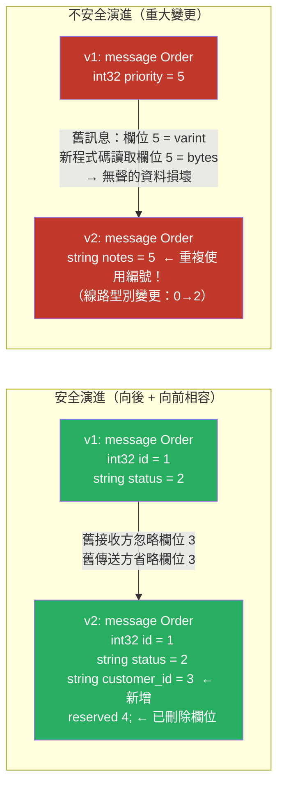

# [BEE-19049] Protocol Buffers 與 Schema 演進

:::info
Protocol Buffers（protobuf）使用欄位編號（field number）而非欄位名稱作為每個欄位的二進位識別標識，這使得新增欄位和重新命名欄位是安全的，但變更或重複使用欄位編號是一個無聲的資料損壞隱患，需要明確的 Schema 治理來預防。
:::

## 背景

當服務透過網路通訊時，雙方必須就資料編碼方式達成一致。JSON 使用字串欄位名稱，易於人類閱讀且具自描述性，但冗長。XML 以更多冗餘為代價增加了型別標注。Protocol Buffers 由 Google 於 2001 年前後開發，並於 2008 年開源，採用了不同的方式：每個欄位在二進位線路格式（wire format）中以一個小整數（欄位編號）識別，而非欄位名稱。編號為 1 的 32 位元整數欄位被編碼為位元組序列 `0x08`（varint，欄位 1，線路型別 0），後面跟著值——沒有欄位名稱，沒有型別字串。這使得序列化訊息緊湊且解析迅速，但將相容性的責任交給了 Schema 作者：欄位編號是永久的。

緊湊性優勢在 Google 的規模下意義重大。2008 年的 Google 內部論文估計，從 XML 切換到 Protocol Buffers 將訊息大小減少了 3–10 倍，解析速度提升了 20–100 倍。在每秒數百萬次 RPC 呼叫的規模下，差異會累積放大。但更持久的貢獻是 Schema 演進模型：因為通訊通道兩端各自獨立解析相同的 `.proto` 文件，且欄位編號是將序列化位元組串流連接到其 Schema 的唯一連結，在生產中變更欄位編號等同於刪除舊欄位並新增一個具有不同編號的新欄位——接收方會靜默忽略未知欄位。

proto3 語言修訂版（2016 年）預設保留未知欄位（proto2 預設會丟棄它們），這增強了向前相容性：新的傳送方可以新增舊接收方尚未見過的欄位，舊接收方將忽略而非報錯。這是微服務中「滾動升級（rolling upgrade）」模式的基礎：部署新的 proto 定義，在傳送方之前更新接收方，無需協調切換即可完成部署。

## 設計思維

### 線路型別與向後相容性

protobuf 將每個欄位編碼為一個標籤（欄位編號 + 線路型別打包成一個 varint），後跟欄位資料。線路型別為：

| 線路型別 | 含義 | 用於 |
|---|---|---|
| 0 | Varint | int32、int64、uint32、uint64、sint32、sint64、bool、enum |
| 1 | 64 位元 | fixed64、sfixed64、double |
| 2 | 長度分隔 | string、bytes、嵌入訊息、打包的 repeated 欄位 |
| 5 | 32 位元 | fixed32、sfixed32、float |

變更欄位的型別會改變其線路型別，這意味著即使保持相同的欄位編號，二進位編碼也不相容。原本是 `int32`（線路型別 0）的欄位，無法在保持相同欄位編號的情況下改為 `string`（線路型別 2）——接收方會解析錯誤。安全的型別變更（相同線路型別）為：`int32` ↔ `int64` ↔ `uint32` ↔ `uint64` ↔ `bool`、`fixed32` ↔ `sfixed32` ↔ `float`、`fixed64` ↔ `sfixed64` ↔ `double`、`string` ↔ `bytes`（若內容是有效的 UTF-8）。

### 相容性矩陣

| 變更 | 向後相容？ | 向前相容？ | 備註 |
|---|---|---|---|
| 新增 optional 欄位（新編號） | 是 | 是 | 舊接收方忽略；舊傳送方省略 |
| 刪除欄位 | 是 | 是 | 必須 `reserved` 編號以防重複使用 |
| 重新命名欄位 | 是 | 是 | 名稱不在線路格式中 |
| 變更欄位編號 | **否** | **否** | 視為刪除 + 新增 |
| 變更線路型別（int32 → string） | **否** | **否** | 接收方解析錯誤 |
| 新增 enum 值 | 是 | 是（proto3） | 舊接收方看到預設值 |
| 刪除 enum 值 | 是 | **否** | 舊傳送方仍會傳送它 |
| 新增 `required` 欄位（proto2） | **否** | **否** | 舊傳送方不填充它 |
| `optional` 改為 `repeated` | **否** | **否** | 線路編碼不同 |

最危險的操作是重複使用已刪除的欄位編號。若欄位 5 原本是 `string user_id`，你刪除了它，未來的開發者將欄位 5 新增為 `int32 priority`，任何以位元組形式編碼了 `user_id` 的舊訊息，都會被新程式碼誤讀為整數。`reserved` 關鍵字可防止這種情況：

```protobuf
message Order {
  reserved 5;           // 永不重複使用欄位編號 5
  reserved "user_id";   // 永不重複使用此欄位名稱
  int32 id = 1;
  string status = 2;
}
```

### 版本控制策略

兩種主流思路：

**單一演進的 proto**：每種訊息類型一個 `.proto` 文件，就地演進。相容的變更可自由進行；不相容的變更需要套件的主要版本升級（例如 `acme.orders.v1` → `acme.orders.v2`）。v2 套件獲得全新的 Schema；v1 套件在所有消費者遷移完成之前保持向後相容。這是 Google 的推薦方式（Google AIP-0180）。

**版本化的 proto 文件**：每次重大變更使用一個新的 `.proto` 文件（例如 `order_v1.proto`、`order_v2.proto`）。更易於推理，但會導致 Schema 激增和重複。適合較小的系統。

實務上：在主要版本內使用單一演進的 proto，積極地對已刪除的欄位使用 `reserved` 關鍵字，僅在需要重大變更（欄位編號重複使用、線路型別變更、刪除 required 欄位）時才引入新的主要版本套件。

## 最佳實踐

**必須（MUST）在刪除欄位時 `reserved` 欄位編號和名稱。** 風險不在於刪除本身——而在於重複使用。不了解欄位歷史的未來開發者，可能新增一個具有相同編號的欄位，導致任何傳輸中或佇列中的舊訊息出現無聲的資料損壞。將 `reserved` 視為 Schema 歷史的永久文件。

**不得（MUST NOT）在已部署的 Schema 中變更欄位編號或線路型別。** 即使 proto 文件能夠編譯，這也是一個重大變更。舊用戶端將錯誤解析使用新 Schema 編碼的訊息；新用戶端將錯誤解析使用舊 Schema 編碼的訊息。若確實需要此變更，請建立新的主要版本套件。

**應該（SHOULD）將欄位編號保持較小。** 欄位編號 1–15 使用一個位元組編碼（標籤 + 線路型別）；編號 16–2047 使用兩個位元組。對於每秒序列化數百萬次的訊息中的高頻欄位，將其放置在 1–15 範圍內可減少序列化大小。為最常填充的欄位保留 1–15。

**必須（MUST）在生產部署之前驗證傳送方和接收方的 Schema 是相容的。** `buf breaking`（Buf CLI）等工具可靜態偵測相較於基準 Schema 的重大變更：欄位編號變更、型別變更、刪除 required 欄位、重複使用保留編號。將 `buf breaking` 整合到 CI 中，在重大變更到達生產環境之前捕捉它們。

**應該（SHOULD）對新 Schema 使用 `proto3` 而非 `proto2`。** `proto3` 移除了 `required`（向後不相容性最常見的來源），預設保留未知欄位（啟用向前相容性），具有更清晰的 JSON 對應，並且在生成的用戶端程式庫中有更廣泛的支援。僅在維護依賴 `required` 欄位語義的現有 Schema 時才使用 `proto2`。

**應該（SHOULD）對互斥欄位使用 `oneof` 而非多個可空欄位。** `oneof` 編碼了一組欄位中恰好一個被設置，且設置一個會清除其他欄位。它避免了模糊狀態（同時設置兩個欄位），而無需執行時期檢查。注意：無法在不謹慎的情況下以向後相容的方式向現有 `oneof` 新增欄位——將 `oneof` 成員資格視為欄位型別的一部分。

**應該（SHOULD）使用固定到特定版本的可重現工具鏈從 proto 文件生成程式碼。** 生成的程式碼（Go 結構體、Java 類別、Python 資料類別）是衍生產物；`.proto` 文件才是真實來源。將 `.proto` 文件儲存在集中式儲存庫中（「proto 登錄」或單一倉庫中的專用 `api/` 目錄），並在 CI 中使用明確版本固定的 Buf 或 `protoc`。

## 視覺說明



## 實作範例

**帶有安全演進和保留欄位的 Schema：**

```protobuf
syntax = "proto3";

package acme.orders.v1;

import "google/protobuf/timestamp.proto";

message Order {
  // 欄位編號 1-15 使用 1 位元組標籤：保留給熱欄位
  int64  id          = 1;
  string status      = 2;  // "pending" | "complete" | "cancelled"
  double amount      = 3;

  // 冷欄位（不常存取）：使用 16+ 的編號
  string customer_id = 16;
  google.protobuf.Timestamp created_at = 17;
  repeated LineItem line_items = 18;

  // 已刪除的欄位：永不重複使用這些編號
  reserved 4, 5, 6;
  reserved "legacy_ref", "internal_priority";
}

message LineItem {
  int64  product_id = 1;
  int32  quantity   = 2;
  double unit_price = 3;
}
```

**在 CI 中使用 Buf 偵測重大變更：**

```bash
# buf.yaml（在倉庫根目錄或 api/ 目錄中）
version: v2
modules:
  - path: proto

# 在 CI 中，與前一個 git 標籤或 Buf Schema Registry 進行比較
buf breaking --against '.git#tag=v1.0.0'

# 重大變更時的輸出：
# proto/acme/orders/v1/order.proto:12:3:
#   Field "5" on message "Order" changed type from "TYPE_INT32" to "TYPE_STRING".
```

**在 Go 中讀取未知欄位（向前相容性）：**

```go
// 舊服務接收來自較新傳送方的訊息，該傳送方新增了欄位 19（string notes）
// proto3 自動保留未知欄位
import "google.golang.org/protobuf/proto"

func handleOrder(data []byte) {
    order := &ordersv1.Order{}
    if err := proto.Unmarshal(data, order); err != nil {
        log.Fatal(err)
    }
    // order.Id、order.Status 等已填充
    // 欄位 19（notes）保留在 order.ProtoReflect().GetUnknown() 中
    // 若此訊息被轉發，將會被重新序列化
    log.Printf("order %d status: %s", order.Id, order.Status)
}
```

**因重大變更而進行主要版本升級：**

```protobuf
// proto/acme/orders/v2/order.proto
// v2 是一個新套件；v1 繼續存在並受支援
syntax = "proto3";

package acme.orders.v2;

message Order {
  // 重大變更：customer_id 從 string 移至嵌套的 Customer 訊息
  // 欄位編號在 v2 中重新開始
  int64    id          = 1;
  string   status      = 2;
  double   amount      = 3;
  Customer customer    = 4;  // 與 v1 的欄位 16（string customer_id）不相容
}

message Customer {
  int64  id   = 1;
  string name = 2;
}
```

## 實作注意事項

**Buf CLI**：proto lint 和重大變更偵測的現代標準。`buf lint` 強制執行命名慣例和風格；`buf breaking` 與基準進行比較。Buf Schema Registry（BSR）集中託管 proto 文件和生成的 SDK。取代了手工撰寫的 `protoc` 呼叫。

**Go（`google.golang.org/protobuf`）**：v2 Go protobuf API（`google.golang.org/protobuf`）是目前的標準；舊版 `github.com/golang/protobuf` 是相容性 shim。直接使用 `proto.Marshal`/`proto.Unmarshal`；在熱路徑中避免基於反射的序列化。

**Java（`com.google.protobuf`）**：Maven 套件 `com.google.protobuf` 提供了完整執行時期和精簡版（lite）執行時期兩種版本。精簡版執行時期（`com.google.protobuf:protobuf-javalite`）省略了反射，適合 Android。若使用自訂擴充功能，在 `parseFrom` 時使用 `ExtensionRegistry`。

**Python**：PyPI 上的 `protobuf` 套件。C 擴充功能（`grpcio-tools` 會安裝它）比純 Python 執行時期快 10–100 倍。使用 `google.protobuf.json_format` 中的 `MessageToJson`/`ParseDict` 進行 JSON 互通性處理。

**JSON 對應**：proto3 定義了標準的 JSON 標準對應（欄位名稱使用 camelCase、enum 作為字串、`bytes` 作為 base64、`Timestamp` 作為 RFC 3339）。使用 `google.protobuf.json_format.MessageToJson`（Python）或 `JsonFormat.printer().print(message)`（Java）。JSON 對於除錯和 HTTP/REST 介面很有用，但失去了二進位編碼的緊湊性。

## 相關 BEE

- [BEE-7004](../data-modeling/encoding-and-serialization-formats.md) -- 編碼與序列化格式：在比較層面涵蓋 Avro、Protocol Buffers、Thrift 和 MessagePack；本文提供在生產環境中安全演進 protobuf Schema 所需的深度
- [BEE-7003](../data-modeling/schema-evolution-and-backward-compatibility.md) -- Schema 演進與向後相容性：通用原則（向後相容性、向前相容性、required vs optional）同樣適用於 protobuf、Avro 和 SQL Schema
- [BEE-19046](grpc-streaming-patterns.md) -- gRPC 串流模式：gRPC 使用 protobuf 作為其 IDL 和線路格式；Schema 演進決定哪些 proto 變更需要新的 gRPC 主要版本，哪些可以透過滾動升級部署
- [BEE-6007](../data-storage/database-migrations.md) -- 資料庫遷移：protobuf Schema 演進與 SQL Schema 遷移共享相同約束——變更必須可在不同步切換所有生產者和消費者的情況下部署

## 參考資料

- [Protocol Buffers Language Guide (proto3) — Google](https://protobuf.dev/programming-guides/proto3/)
- [Protocol Buffers Dos and Don'ts — Google](https://protobuf.dev/best-practices/dos-donts/)
- [AIP-0180: Towards a Uniform Approach to Stability — Google API Improvement Proposals](https://google.aip.dev/180)
- [Buf CLI — Breaking Change Detection](https://buf.build/docs/breaking/overview)
- [Encoding — Protocol Buffers Documentation](https://protobuf.dev/programming-guides/encoding/)
