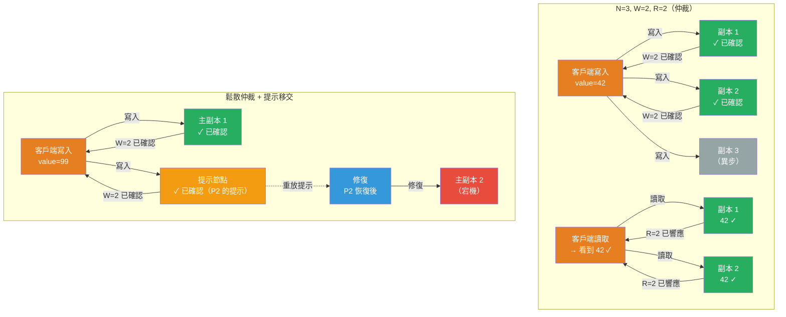

# [BEE-19014] 仲裁系統與 NWR 一致性

:::info
NWR 模型——N 個副本總數、寫入成功所需的 W 個確認、讀取返回所需的 R 個響應——讓系統設計者通過強制寫仲裁和讀仲裁重疊來在最大可用性和強一致性之間進行調整：W + R > N 保證任何讀取集中至少有一個副本已看到最新的寫入。
:::

## Context

基礎思想來自兩篇 1979 年的論文。Robert Thomas 在「多副本數據庫並發控制的多數共識方法」（ACM TODS，第 4 卷，第 2 期，1979 年）中描述了用于複製數據庫的多數投票。David Gifford 在「複製數據的加權投票」（ACM SOSP 1979）中用分數權重進行了推廣，引入了 (v_r, v_w) 表示法，其中讀取需要 r 票，寫入需要 w 票，約束條件為 r + w > v。這是 NWR 模型的直接祖先。

關鍵洞察是幾何性的：如果每次寫入至少觸及 W 個副本，每次讀取至少觸及 R 個副本，且 W + R > N，那麼寫集和讀集MUST（必須）相交——讀取保證會聯繫至少一個擁有當前寫入的副本。當 W + R ≤ N 時，集合可以不相交，讀取MAY（可以）返回舊數據。

Amazon 的 Dynamo 論文（DeCandia 等人，SOSP 2007）將 NWR 帶入主流分散式系統實踐。Dynamo 默認為 N=3、W=2、R=2（滿足 W+R > N，因為 4 > 3）。關鍵地，Dynamo 引入了**鬆散仲裁**：當指定副本因故障或網絡分區不可用時，Dynamo 將寫入路由到環中任何其他可用節點，該節點臨時保存數據，並附帶描述預期目標的**提示**。當目標恢復時，持有提示的節點重放寫入並丟棄其副本。這稱為**提示移交**。鬆散仲裁大幅提高了寫入可用性，代價是讀取MAY（可以）在短暫窗口內看不到最新寫入——系統以嚴格仲裁交集換取分區期間的 AP 行為。

Apache Cassandra 採用相同模型，並通過命名的一致性級別而非原始 N/W/R 數字來暴露它。`QUORUM` 表示 ⌊RF/2⌋ + 1 個節點MUST（必須）響應，其中 RF 是複製因子。`LOCAL_QUORUM` 將仲裁限制在一個數據中心，避免跨數據中心延遲，同時在數據中心內仍提供多數共識。`ALL` 要求每個副本響應——最大一致性，最小可用性。`ONE` 只需要單個副本——最大可用性，無新鮮度保證。將讀寫都設置為 `QUORUM`，RF=3（QUORUM=2）滿足 2+2>3 並提供強一致性。

## Design Thinking

**W + R > N 是必要但不充分的線性化條件。** 仲裁交集保證每個讀取集中至少有一個副本已看到最新寫入。但它不保證副本返回該值，或並發操作表現為按單一全序執行。如果兩個客戶端並發寫入不同值，兩次寫入MAY（可以）各自達到一個仲裁，後續讀取MAY（可以）根據哪個副本首先響應返回任一值。在仲裁之上實現線性化需要共識協議（Raft、Paxos）對寫入進行全序排列，或者版本化讀取（客戶端比較副本響應並返回版本最高的）。Cassandra 的 `QUORUM` 讀取加 `read_repair` 接近這一目標，但不保證線性化；etcd 和 ZooKeeper 確實實現了線性化，因為它們使用 Raft/Zab 進行全序排列，而非可調仲裁。

**根據讀寫比例調整 W 和 R。** 選擇處於一個範圍上：
- **W=N, R=1**（全寫，讀一）：寫入慢且對不可用性敏感；讀取快且始終新鮮。適合寫入吞吐量不是約束的讀密集型工作負載。
- **W=1, R=N**（寫一，全讀）：寫入最大可用；讀取慢且受不可用性影響。實踐中很少使用。
- **W=⌊N/2⌋+1, R=⌊N/2⌋+1**（雙仲裁）：平衡可用性和一致性。N=3 時意味著 W=R=2。任何單個副本故障仍允許讀寫成功。
- **W=1, R=1**（任意-任意）：最大可用性和吞吐量，無一致性保證。僅適用於僅追加、冪等或真正最終一致性數據。

**鬆散仲裁是可用性優化，而非正確性保證。** 使用提示移交時，仲裁交集論點失效：提示存儲在指定 N 之外的節點上，因此對指定 N 個副本的讀取MAY（可以）錯過提示。鬆散仲裁適用於短暫錯過最新寫入可以接受的情況，且衝突解決機制（LWW、向量時鐘、應用合並）能正確處理分歧。對于MUST NOT（不得）丟失或需要強讀己之寫一致性的數據，鬆散仲裁不適合。

**最後寫入勝出（LWW）需要時鐘紀律。** 當寫入衝突且解決策略是保留時間戳最高的寫入時，副本間的時鐘偏差決定哪次寫入存活。具有較低掛鐘時間戳的寫入MAY（可以）被靜默丟棄，即使它因果上更晚。使用 LWW 的系統MUST（必須）使用同步時鐘（具有有界偏差的 NTP，或有界誤差時間戳如 TrueTime），並MUST（必須）接受某些寫入在高並發窗口期間會靜默丟失。Cassandra 默認使用 LWW；Dynamo 最初使用向量時鐘檢測衝突並將解決推送到應用程序。

## Visual



## Example

**Cassandra 一致性級別選擇：**

```
# 複製因子（RF）= 3，集群有 1 個節點臨時宕機

# QUORUM 讀 + QUORUM 寫 → 強一致性
# QUORUM = floor(3/2) + 1 = 2 個副本MUST（必須）響應
# 寫入：3 個節點中 2 個在線確認 → 成功
# 讀取：3 個節點中 2 個響應 → 返回最新值（仲裁相交：2+2>3）
CONSISTENCY QUORUM;
SELECT * FROM orders WHERE order_id = 'abc-123';

# ONE 讀 → 最終一致性（MAY（可以）返回舊數據）
# 更快但無新鮮度保證
CONSISTENCY ONE;
SELECT * FROM product_catalog WHERE product_id = 'sku-456';

# LOCAL_QUORUM → 僅在單個數據中心內的強一致性
# 跨數據中心寫入是異步的
# 使用場景：多區域部署，可以容忍跨區域數據過時
CONSISTENCY LOCAL_QUORUM;
UPDATE user_preferences SET theme = 'dark' WHERE user_id = 'u-789';

# ALL → 最大一致性，任何副本宕機則拒絕
# 僅在以下情況使用：合規要求每個副本確認（審計日誌等）
CONSISTENCY ALL;
INSERT INTO audit_log (event_id, action) VALUES (uuid(), 'account_deletion');
```

**鬆散仲裁與提示移交（Dynamo 風格偽代碼）：**

```python
# N=3 環：節點 A、B、C 擁有鍵 K
# C 臨時不可達

def write(key, value, W=2):
    preference_list = ring.get_preference_list(key, N=3)  # [A, B, C]
    acks = 0
    hints = []

    for node in ring.get_available_nodes():
        if node in preference_list:
            node.write(key, value)
            acks += 1
        elif acks < W and node not in preference_list:
            # 鬆散仲裁：使用非擁有者節點滿足 W
            node.write_with_hint(key, value, hint_target=C)
            hints.append((node, C))
            acks += 1
        if acks >= W:
            break  # 寫入成功

    return "OK" if acks >= W else "TIMEOUT"

# 當 C 恢復時：
def hinted_handoff_replay(hint_node, target_node):
    for (key, value) in hint_node.get_hints_for(target_node):
        target_node.write(key, value)
        hint_node.delete_hint(key, target_node)
    # C 現在已一致；提示節點不再持有鬆散仲裁槽位
```

**NWR 參數選擇指南：**

```
使用場景                  | N | W | R | 取捨
--------------------------|---|---|---|------------------------------------------
購物車（AP 優先）          | 3 | 1 | 1 | 最大可用性；偶爾讀到舊數據
會話數據（均衡）           | 3 | 2 | 2 | 強讀新鮮度；容忍 1 個節點故障
財務記帳條目              | 3 | 3 | 2 | 不丟寫入；2 個節點宕機則讀取失敗
配置數據（讀密集）         | 5 | 3 | 1 | 快速讀取；寫入需要多數
審計日誌（持久性）         | 3 | 3 | 1 | 每個節點確認寫入；讀取快速
```

## Related BEEs

- [BEE-19001](cap-theorem-and-the-consistency-availability-tradeoff.md) -- CAP 定理：W+R>N 的仲裁是 CP（仲裁不可用時拒絕請求）；鬆散仲裁是 AP（路由到任何可用節點）；NWR 是 CAP 所描述的一致性-可用性取捨的一種實現機制
- [BEE-19002](consensus-algorithms-paxos-and-raft.md) -- 共識演算法：Raft 和 Paxos 對所有操作使用嚴格多數仲裁（N/2+1），並通過全序排列保證線性化——這比單獨的 NWR 仲裁更強，後者只保證仲裁交集，不保證單一序列化順序
- [BEE-19003](vector-clocks-and-logical-timestamps.md) -- 向量時鐘與邏輯時間戳：Dynamo 使用向量時鐘檢測仲裁交集無法解決的並發寫入；當兩次寫入並發到達重疊仲裁時，向量時鐘識別衝突，讓應用程序（或 LWW）解決
- [BEE-19013](merkle-trees.md) -- 默克爾樹：Dynamo 和 Cassandra 使用默克爾樹進行反熵修復——鬆散仲裁寫入後，後台修復使用默克爾樹比較找到在分區期間錯過寫入的副本並同步它們

## References

- [複製數據的加權投票 -- David Gifford, ACM SOSP 1979](https://dl.acm.org/doi/10.1145/800215.806583)
- [多副本數據庫並發控制的多數共識方法 -- Robert Thomas, ACM TODS 1979](https://dl.acm.org/doi/abs/10.1145/320071.320075)
- [Dynamo：Amazon 的高可用鍵值存儲 -- DeCandia 等人, SOSP 2007](https://www.allthingsdistributed.com/files/amazon-dynamo-sosp2007.pdf)
- [Cassandra 架構：保證 -- Apache Cassandra 文檔](https://cassandra.apache.org/doc/latest/cassandra/architecture/guarantees.html)
- [Cassandra 架構：Dynamo -- Apache Cassandra 文檔](https://cassandra.apache.org/doc/latest/cassandra/architecture/dynamo.html)
- [複製屬性 -- Riak KV 文檔](https://docs.riak.com/riak/kv/latest/developing/app-guide/replication-properties/index.html)
- [讀取一致性 -- Amazon DynamoDB 開發者指南](https://docs.aws.amazon.com/amazondynamodb/latest/developerguide/HowItWorks.ReadConsistency.html)
- [仲裁系統的起源 -- Marko Vukolić, IBM Research](https://vukolic.com/QuorumsOrigin.pdf)
