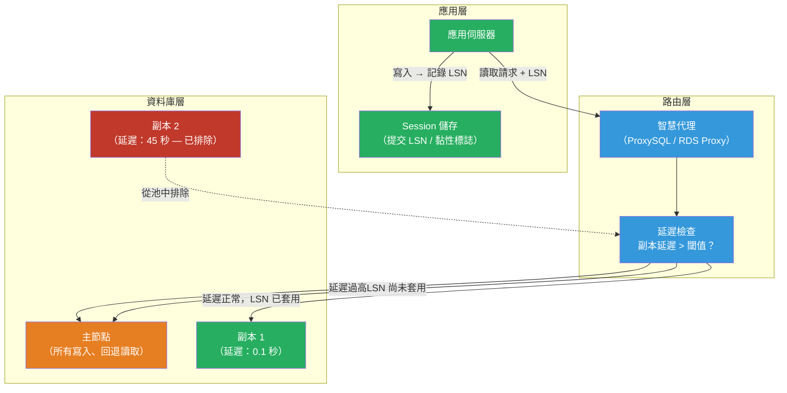

# [BEE-19044] 讀取副本路由與延遲處理

:::info
讀取副本路由（Read replica routing）將 SELECT 查詢導向副本以降低主節點負載，但複寫延遲（replication lag）——寫入在主節點提交後出現在副本上的時間差——會破壞「讀取自身寫入（read-your-writes）」一致性。在應用層設計以偵測、容忍並補償延遲，是核心工程挑戰。
:::

## 背景

當資料庫主節點成為吞吐量瓶頸時，新增讀取副本是最常見的第一步。理論很簡單：以非同步方式將寫入複寫到 N 台備用伺服器，將讀取查詢路由到備用節點，即可線性地提升讀取容量。但實際上，寫入順序（在主節點嚴格有序）與讀取交付（在副本上最終一致）之間的非對稱性，引入了一類只在高負載或網路事件後才顯現的錯誤。

典型的故障場景：使用者提交表單，寫入在主節點提交，UI 重定向到讀取副本的詳情頁面，而副本尚未套用此寫入。使用者看到過時資料——或者更糟，看到 404，因為新建立的記錄在副本上還不可見。Martin Kleppmann 的《Designing Data-Intensive Applications》（2017）將此命名為讀取自身寫入（monotonic reads）問題，並將其歸類為非同步複寫在沒有應用層明確支援的情況下無法提供的 Session 級別一致性保證。

複寫延遲並非固定常數。它隨主節點寫入速率、副本 I/O 吞吐量、網路條件，以及阻塞複寫串流的長事務而變化。PostgreSQL 透過比較主節點目前的預寫日誌（WAL）位置與每個副本已套用的位置來追蹤延遲；這個差距以位元組或估計秒數衡量，可從 `pg_stat_replication` 取得。MySQL 在 `SHOW REPLICA STATUS` 中暴露 `Seconds_Behind_Source`，但當複寫執行緒閒置時，此指標存在已知的不準確性。Percona XtraDB Cluster 和 Galera 使用同步認證式複寫，消除了延遲，但增加了寫入延遲並限制了地理分布。

## 設計思維

### 路由策略

三種模式佔主導地位：

**代理層路由**（ProxySQL、PgBouncer、RDS Proxy、Vitess）：智慧代理（smart proxy）位於應用程式與資料庫之間。應用程式連接到單一端點；代理將唯讀事務路由到副本，寫入路由到主節點。ProxySQL 可設定符合 `SELECT` 語句的查詢規則，以及具有延遲回退的副本群組：若副本延遲超過閾值，代理將其從讀取池中移除，直到追上為止。這將路由邏輯集中化，應用程式無需任何修改。

**驅動層路由**（Aurora 的 AWS JDBC Driver、具讀取唯讀資料源的 Hikari）：資料庫驅動或連線池設定將寫入和讀取資料源分離。應用程式程式碼使用 `@Transactional(readOnly = true)`（Spring）或明確地從不同的連線池取得連線。這種方式侵入性較強，但允許對每個查詢進行精細控制。

**應用層路由**（明確的副本用戶端）：應用程式維護兩個連線池——`primary_pool` 和 `replica_pool`——並明確路由。這提供了最大的彈性（將特定的高延遲分析查詢路由到專用分析副本），但會將路由邏輯分散到整個程式碼庫中。

### 讀取自身寫入一致性

副本路由中最重要的問題是確保使用者能看到自己的寫入。四種方法：

**主節點黏性視窗**（Sticky primary window）：任何寫入之後，在固定時間內（例如 500 ms 到 2 s）將該 Session 的所有讀取路由到主節點。可透過 Session 標誌和時間戳記簡單實作。當「寫入後立即讀取」的延遲是問題時很有效。寫入操作後會有一波讀取湧入主節點；若寫入操作頻繁，副本幾乎不會被使用。

**LSN/GTID 固定**：寫入後，記錄提交位置（PostgreSQL WAL LSN 或 MySQL GTID）。路由後續讀取時，向副本查詢其目前已套用的位置並進行比較。若副本落後於記錄的提交位置，則重定向到主節點。PostgreSQL 的 `pg_last_wal_replay_lsn()` 返回副本已套用的 LSN。MySQL 的 `WAIT_FOR_EXECUTED_GTID_SET(gtid, timeout)` 會阻塞直到副本套用指定的 GTID。這種方式精確——只在必要時路由到主節點——但需要將提交位置傳播到應用層（通常透過 Session Cookie 或快取條目）。

**單調 Session Token**：為每個 Session 發放包含其產生的最高寫入 LSN 的 Token。每次讀取請求時，附帶此 Token。讀取副本評估是否已套用至該 LSN；若未套用，則讀取回退到主節點。Shopify 的「透過 GTID 讀取自身寫入」和 PlanetScale 的一致性 Token 使用此方法。

**關鍵路徑預設讀取主節點**：找出那些必須看到最新資料的少量使用者可見讀取（post-create 重定向、付款確認），並強制這些讀取到主節點。其他所有讀取路由到副本。比 Session 追蹤更簡單；主節點上仍有部分讀取流量，但避免了複雜的分散式狀態。

### 延遲偵測與副本健康

延遲高的副本比沒有副本更糟：路由到它的查詢返回過時資料，而使用者無法察覺不一致性。路由層必須將延遲視為健康訊號。

PostgreSQL 主節點視圖：
```sql
SELECT client_addr,
       application_name,
       state,
       write_lag,
       flush_lag,
       replay_lag
FROM pg_stat_replication;
```
`replay_lag` 是主節點提交 WAL 記錄到副本套用它之間的時間間隔。監控此值；當超過閾值時發出警報（OLTP 通常為 30 秒，分析副本為 5 分鐘）。若延遲超過閾值，從讀取池中移除副本，而不是提供過時讀取。

MySQL 等效指令：
```sql
SHOW REPLICA STATUS\G
-- Seconds_Behind_Source：估計延遲秒數
-- Replica_SQL_Running：必須為 Yes
-- 副本未連接時 Seconds_Behind_Source 為 NULL
```

當副本 I/O 執行緒已追上但 SQL 執行緒閒置時，`Seconds_Behind_Source` 會變得不可靠——即使最後套用的事務是幾分鐘前的，它也會報告 0。Percona 的 `pt-heartbeat` 工具在主節點的心跳表中插入帶時間戳的記錄，並在副本上測量差距；這樣可以不論複寫執行緒閒置狀態，都能產生準確的延遲值。

## 最佳實踐

**必須（MUST）不在延遲超過您的延遲 SLA 的副本上路由讀取，而不回退到主節點。** 如果您的應用程式要求在 1 秒內實現讀取自身寫入一致性，任何 `replay_lag > 1s` 的副本對於必須反映最近寫入的讀取都是不安全的。主動將其從池中移除；不要等到使用者觀察到過時資料。

**必須（MUST）為使用者發起的「寫入後讀取」流程實作讀取自身寫入。** 在 `POST /orders` 之後，`GET /orders/{id}` 重定向必須看到已建立的訂單。選擇以下其中一種方式：主節點黏性視窗、LSN 固定，或關鍵路徑僅使用主節點。在程式碼中記錄此策略，以便新增端點的工程師了解預設假設。

**應該（SHOULD）在開始時使用代理層**（ProxySQL、PgBouncer、RDS Proxy），而非應用層路由。基於代理的路由將操作關注點（副本健康、延遲閾值、容錯移轉）與應用邏輯分離。只有在需要代理無法表達的每查詢控制時，才遷移到應用層路由。

**必須（MUST）在應用層區分唯讀和讀寫事務。** ORM 框架支援此功能：Django 的 `using('replica')` QuerySet 修飾符、Spring 的 `@Transactional(readOnly = true)`、SQLAlchemy 的 `sessionmaker(bind=replica_engine)`。混合讀寫的事務必須（MUST）路由到主節點；不要嘗試拆分它們。

**應該（SHOULD）將副本延遲作為一級 SLO 訊號進行監控。** 將 `db.replica.lag_seconds` 加入您的指標儀表板，與請求延遲和錯誤率並列。設定警報閾值：10 秒時警告，60 秒時呼叫待命人員。持續的延遲表示主節點寫入速率超過副本吞吐量——這是橫向擴展副本或調查寫入放大的訊號。

**必須（MUST）在預備環境中測試副本容錯移轉路徑。** 當副本因高延遲而失敗或從池中移除時，所有讀取流量回退到主節點。驗證主節點能夠處理 100% 的讀取流量，而不會達到連線限制或成為瓶頸。在生產環境中發生之前，使用負載測試工具模擬此情況。

**應該（SHOULD）在使用 LSN 固定時，將提交 LSN/GTID 記錄在分散式快取或 Session 儲存中，而非程序記憶體中。** 若多個應用程式實例服務同一個使用者，每個實例必須讀取相同的固定狀態。將 Session 的最高提交位置儲存在 Redis 或 Session 儲存中，而非程序記憶體中。

## 視覺說明



## 實作範例

**基於 LSN 的讀取自身寫入（Python + PostgreSQL）：**

```python
import psycopg2
from functools import wraps

# 兩個連線池：主節點（寫入）和副本（讀取）
primary_pool = connect_pool("postgres://primary/db")
replica_pool  = connect_pool("postgres://replica/db")

def get_primary_lsn(conn) -> str:
    """寫入後返回主節點目前的 WAL LSN。"""
    row = conn.execute("SELECT pg_current_wal_lsn()::text").fetchone()
    return row[0]

def replica_has_applied(replica_conn, lsn: str) -> bool:
    """若副本已複寫到指定 LSN 或超過，返回 True。"""
    row = replica_conn.execute(
        "SELECT pg_last_wal_replay_lsn() >= %s::pg_lsn", (lsn,)
    ).fetchone()
    return row[0]

def route_read(session_lsn: str | None):
    """
    若副本已套用 Session 的最後寫入 LSN，返回副本連線；
    否則回退到主節點。
    """
    if session_lsn is None:
        return replica_pool.getconn()  # 無先前寫入，副本安全

    replica_conn = replica_pool.getconn()
    if replica_has_applied(replica_conn, session_lsn):
        return replica_conn
    replica_pool.putconn(replica_conn)
    return primary_pool.getconn()  # 副本落後，使用主節點

# Web 處理器中的用法：
def create_order(user_id: int, items: list) -> dict:
    with primary_pool.getconn() as conn:
        conn.execute("INSERT INTO orders (...) VALUES (...)", ...)
        lsn = get_primary_lsn(conn)
        conn.commit()

    session["last_write_lsn"] = lsn  # 儲存在 Session Cookie / Redis
    return {"order_id": ...}

def get_order(order_id: int, session: dict) -> dict:
    lsn = session.get("last_write_lsn")
    with route_read(lsn) as conn:
        return conn.execute(
            "SELECT * FROM orders WHERE id = %s", (order_id,)
        ).fetchone()
```

**延遲監控查詢（PostgreSQL 主節點）：**

```sql
-- 在主節點執行以監控所有已連接的副本
SELECT
    application_name,
    client_addr,
    state,
    EXTRACT(EPOCH FROM write_lag)::int  AS write_lag_s,
    EXTRACT(EPOCH FROM flush_lag)::int  AS flush_lag_s,
    EXTRACT(EPOCH FROM replay_lag)::int AS replay_lag_s,
    CASE
        WHEN replay_lag > interval '30 seconds' THEN 'DEGRADED'
        WHEN replay_lag > interval '5 seconds'  THEN 'WARNING'
        ELSE 'OK'
    END AS lag_status
FROM pg_stat_replication
ORDER BY replay_lag DESC NULLS LAST;
```

**ProxySQL 延遲路由規則（MySQL）：**

```sql
-- 將副本加入主機群組 20（讀取）；延遲 > 30 秒時代理自動移除
INSERT INTO mysql_servers (hostgroup_id, hostname, port, max_replication_lag)
VALUES (20, 'replica1.db.internal', 3306, 30);

-- 將 SELECT 路由到主機群組 20，寫入路由到主機群組 10（主節點）
INSERT INTO mysql_query_rules (rule_id, active, match_pattern, destination_hostgroup)
VALUES (1, 1, '^SELECT', 20);

LOAD MYSQL SERVERS TO RUNTIME;
LOAD MYSQL QUERY RULES TO RUNTIME;
```

## 相關 BEE

- [BEE-6003](../data-storage/replication-strategies.md) -- 複寫策略：涵蓋串流複寫、半同步複寫和 Galera 的機制——本文在此基礎上探討應用層路由問題
- [BEE-8006](../transactions/eventual-consistency-patterns.md) -- 最終一致性模式：副本延遲是最終一致性的一個實例；讀取自身寫入和單調讀取是管理它的關鍵模式
- [BEE-6006](../data-storage/connection-pooling-and-query-optimization.md) -- 連線池與查詢最佳化：分離的主節點和副本連線池是副本路由的基礎；池大小必須考慮所有讀取回退到主節點的可能性
- [BEE-19019](session-guarantees-and-consistency-models.md) -- Session 保證與一致性模型：定義讀取自身寫入、單調讀取和其他副本路由必須保留的 Session 保證

## 參考資料

- [Designing Data-Intensive Applications, Chapter 5: Replication — Martin Kleppmann (2017)](https://dataintensive.net/)
- [pg_stat_replication — PostgreSQL Documentation](https://www.postgresql.org/docs/current/monitoring-stats.html#MONITORING-PG-STAT-REPLICATION-VIEW)
- [SHOW REPLICA STATUS — MySQL Documentation](https://dev.mysql.com/doc/refman/8.0/en/show-replica-status.html)
- [Read Your Writes via GTID — Shopify Engineering (2020)](https://shopify.engineering/read-your-writes-consistency)
- [pt-heartbeat: Replication Lag Measurement — Percona Toolkit](https://docs.percona.com/percona-toolkit/pt-heartbeat.html)
- [ProxySQL: Read/Write Split and Replication Lag Management](https://proxysql.com/documentation/proxysql-read-write-split-use-case/)
- [Amazon RDS Proxy — AWS Documentation](https://docs.aws.amazon.com/AmazonRDS/latest/UserGuide/rds-proxy.html)
