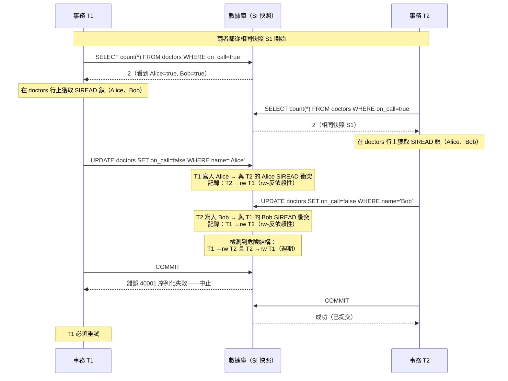

# [BEE-442] 可序列化快照隔離

:::info
可序列化快照隔離（SSI）在快照隔離的非阻塞多版本讀取基礎上實現完整的 SERIALIZABLE 隔離，只中止形成「危險結構」的事務——兩個連續的讀寫反依賴性，無法被序列化——讓讀取永遠不阻塞寫入，同時仍能防止寫偏斜和所有其他序列化異常。
:::

## Context

快照隔離（SI）是 Oracle 在 1980 年代末採用的對兩階段鎖定的實用改進，由 Berenson、Bernstein、Gray 及同事在「ANSI SQL 隔離級別批判」（SIGMOD，1995 年）中正式化。在 SI 下，每個事務從時間點一致的快照中讀取，寫入者永遠不阻塞讀取者。這消除了 2PL 的讀寫阻塞並大幅提升了讀取吞吐量。問題在於：SI 不是可序列化的。它允許**寫偏斜**——一種兩個事務都讀取重疊數據集、各自根據所讀決定寫入、且都看不到對方寫入的異常。結果可能違反在任何串行執行下都會成立的約束。

理論突破來自 Alan Fekete、Dimitrios Liarokapis、Elizabeth O'Neil、Patrick O'Neil 和 Dennis Shasha 在「使快照隔離可序列化」（ACM TODS，2005 年）中的工作。他們證明 SI 的不可序列化性完全源於依賴圖中的一個特定模式：由兩個連續的讀寫反依賴性組成的**危險結構**。讀寫反依賴性（rw-反依賴性）在事務 T1 讀取某對象的一個版本而 T2 隨後覆寫該版本時發生——T2 的寫入對 T1 不可見，創建了一個排序約束（T2 邏輯上必須先於 T1）。當兩條這樣的邊連續出現時（rw-反依賴性中的 T1 → T2 → T3），這些事務無法以任何順序全部序列化。關鍵洞見：您可以在不跟蹤所有可能依賴週期的情況下檢測這種結構。

Michael Cahill、Uwe Röhm 和 Alan Fekete 在「快照數據庫的可序列化隔離」（ACM SIGMOD，2008 年）中將這一理論轉化為實用演算法，並在 PostgreSQL 中實現了它。Dan R.K. Ports 和 Kevin Grittner 在「PostgreSQL 中的可序列化快照隔離」（VLDB，2012 年）中對其進行了精煉和生產優化，PostgreSQL 9.1（2011 年）將其作為 `SERIALIZABLE` 隔離級別發布。核心機制是 **SIREAD 鎖**：記錄每個事務已讀取內容而不阻塞並發寫入者的幻象鎖。當寫入者與另一個事務持有的 SIREAD 鎖衝突時，記錄一個 rw-反依賴性。提交時，如果兩個連續的 rw-反依賴性形成危險結構，一個事務將以錯誤碼 `40001`（序列化失敗）中止，客戶端可以安全重試。

影響是顯著的：PostgreSQL 成為第一個實現真正可序列化隔離而不需要讀寫阻塞的主要生產數據庫。此前，PostgreSQL 中的 SERIALIZABLE 等同於 REPEATABLE READ（它不能防止寫偏斜）。CockroachDB 採用了類似的分散式變體，使用多版本並發控制和基於時間戳的衝突檢測。Google Spanner 通過 TrueTime 和嚴格 2PL 實現外部一致性（強於可序列化性）——這是一種不同的取捨，阻塞讀取但從不因序列化失敗而中止。

## Design Thinking

**SSI 以中止風險換取讀取吞吐量；2PL 以阻塞換取中止可預測性。** 在 2PL 下，可能形成危險結構的事務在創建衝突的讀取時被阻塞——它等待衝突的寫入提交或中止。在 SSI 下，讀取立即進行，衝突在提交時被檢測到，可能在大量計算之後。對於讀取密集型工作負載，SSI 勝出：讀取者永遠不等待。對於在少量熱點行上具有高爭用的寫入密集型工作負載，2PL MAY（可以）產生更少的中止。選擇取決於工作負載；兩者都不是普遍優勢。

**SIREAD 鎖粒度是內存-正確性的取捨。** SSI 默認在元組粒度跟蹤讀取。如果事務讀取許多行，其 SIREAD 鎖會消耗內存。PostgreSQL 將元組級 SIREAD 鎖提升到頁級，然後到關係級，以限制內存使用。頁級 SIREAD 鎖是正確的（保守的），但引入了誤報：對該頁上任何行的任何寫入都會被登記為衝突，即使實際讀取的行不同。關係級提升意味著對表的任何寫入都會觸發潛在衝突。在實踐中，繁忙表上的大型順序掃描在 SSI 下可能導致過多的誤報中止。索引緩解了這一問題：命中索引範圍的掃描在索引條目上獲取 SIREAD 鎖，而非整個關係。

**只讀事務可以選擇退出 SSI 的中止風險。** 只讀且從不寫入的事務無法創建危險結構——它不能有出去的 rw-反依賴性。PostgreSQL 允許只讀事務通過 `SET TRANSACTION READ ONLY` 結合 `DEFERRABLE` 聲明自己，這會導致事務等待直到可以獲得保證安全的快照，然後以零中止風險執行。這是在 `SERIALIZABLE` 隔離下運行的長時間只讀查詢（報告、分析）的正確工具。

## Deep Dive

**寫偏斜異常的詳細說明。** 值班醫生示例是典型說明：兩個事務 T1 和 T2 都執行 `SELECT count(*) FROM doctors WHERE on_call = true`（結果：2），然後 T1 執行 `UPDATE doctors SET on_call = false WHERE name = 'Alice'`，T2 執行 `UPDATE doctors SET on_call = false WHERE name = 'Bob'`。在 SI 下，兩個事務都讀取相同快照（2 名醫生值班），都決定約束得到滿足（至少有 1 名醫生留下），都提交——留下 0 名醫生值班。在 SSI 下，兩個 rw-反依賴性（T1 對 Bob 行的讀取被 T2 覆寫；T2 對 Alice 行的讀取被 T1 覆寫）形成危險結構，一個事務被中止。

**rw-反依賴性圖和危險結構。** 事務調度中存在三種類型的依賴性：
- **wr-依賴性**：T1 寫入 X，T2 讀取 T1 的 X 版本（T1 在 T2 之前）
- **ww-依賴性**：T1 寫入 X，T2 覆寫 X（T1 在 T2 之前）
- **rw-反依賴性**：T1 讀取 X 的版本 V，T2 寫入 X 的更新版本（邏輯上 T2 在 T1 之前，因為 T1 未看到 T2 的寫入）

**危險結構**存在於 T1 對 T2 有 rw-反依賴性且 T2 對 T3 有 rw-反依賴性時（其中 T1 MAY（可以）等於 T3）。Fekete 等人的定理：當且僅當快照隔離調度包含危險結構時，它是不可序列化的。SSI 中止每個檢測到的危險結構中的一個事務，防止不可序列化的執行。

**PostgreSQL 中的 SIREAD 鎖。** 當 `SERIALIZABLE` 事務讀取一行時，PostgreSQL 在該行（或頁，或提升後的關係）上獲取 SIREAD 鎖。SIREAD 鎖在 `pg_locks` 中以 `mode = 'SIReadLock'` 出現。當事務寫入一行時，PostgreSQL 檢查任何其他 `SERIALIZABLE` 事務是否在該行上持有 SIREAD 鎖。如果是，則在內部衝突跟蹤結構中記錄一個 rw-反依賴性。提交時，PostgreSQL 檢查事務記錄的衝突：如果提交事務是危險結構中的「樞紐」（T2）——它既有傳入的 rw-反依賴性（T1 →rw T2）又有傳出的（T2 →rw T3）——它將被中止。

## Visual



## Best Practices

**MUST（必須）處理序列化失敗（錯誤 40001）並重試。** 在 SSI 下，任何 `SERIALIZABLE` 事務都可能在提交時以 `sqlstate 40001`（serialization_failure）被中止。應用程序代碼MUST（必須）捕獲此錯誤並從頭開始重試整個事務——而不是從失敗的語句恢復。中止的事務未做任何更改；重試具有與等待衝突事務提交後再執行完全相同的語義結果。

**設計事務使其具有冪等性和可重試性。** 序列化失敗重試意味著重新執行事務的讀取和寫入。如果事務在提交失敗之前執行了副作用（發送電子郵件、調用外部 API），重試事務將複製這些副作用。副作用MUST（必須）推遲到提交後，或使其具有冪等性，或以防止重試時雙重執行的方式跟蹤。

**對長時間運行的讀取使用 `DEFERRABLE READ ONLY`。** 在 SERIALIZABLE 下聲明 `DEFERRABLE` 的只讀事務等待直到可以獲得保證可序列化的快照，然後以零中止風險執行。這是在 `SERIALIZABLE` 隔離下運行報告、分析和任何必須一致但可以容忍短暫初始等待的讀取的正確工具。

**在 SERIALIZABLE 事務的 WHERE 謂詞使用的列上添加索引。** SSI 的 SIREAD 鎖粒度在使用索引時跟蹤索引條目而非完整關係掃描。大型表上的順序掃描將 SIREAD 鎖提升到關係級，導致對該表的任何寫入都被登記為衝突——大幅增加誤報中止。索引掃描將 SIREAD 鎖限制在返回的特定條目上，減少誤報。

**監控序列化失敗並調整 max_connections / statement_timeout。** PostgreSQL 公開 `pg_stat_database.conflicts`（包含序列化失敗）和 `pg_stat_activity`。序列化失敗的突增表明熱點爭用——檢查涉及哪些事務以及索引覆蓋是否可以降低 SIREAD 鎖粒度。長時間運行的 SERIALIZABLE 事務持有 SIREAD 鎖更長時間，有更多機會發生碰撞；`statement_timeout` 限制失控事務的持續時間。

## Example

**REPEATABLE READ 下的寫偏斜（允許）vs. SERIALIZABLE（防止）：**

```sql
-- 模式：值班醫生，約束：至少必須有 1 人值班
CREATE TABLE doctors (name text PRIMARY KEY, on_call boolean NOT NULL);
INSERT INTO doctors VALUES ('Alice', true), ('Bob', true);

-- 會話 1：REPEATABLE READ——寫偏斜被允許
BEGIN ISOLATION LEVEL REPEATABLE READ;
  SELECT count(*) FROM doctors WHERE on_call = true;  -- 返回 2
  -- （會話 2 也讀取到 2 並決定同時下班）
  UPDATE doctors SET on_call = false WHERE name = 'Alice';
COMMIT;  -- 即使會話 2 已提交類似的更新，也成功

-- 最終結果：0 名醫生值班——違反約束，未引發錯誤
```

```sql
-- 會話 1：SERIALIZABLE——寫偏斜被防止
BEGIN ISOLATION LEVEL SERIALIZABLE;
  SELECT count(*) FROM doctors WHERE on_call = true;  -- 返回 2
  -- 在兩行上獲取 SIREAD 鎖
  UPDATE doctors SET on_call = false WHERE name = 'Alice';
COMMIT;
-- 錯誤: 由於事務間的讀寫依賴無法序列化訪問
-- 詳細: 原因碼: 在提交嘗試期間被識別為樞紐而取消。
-- 提示: 如果重試，事務可能會成功。
-- SQLSTATE: 40001
```

**序列化失敗的重試迴圈（Python + psycopg2）：**

```python
import psycopg2
from psycopg2.extensions import ISOLATION_LEVEL_SERIALIZABLE
import time
import random

SERIALIZATION_FAILURE = "40001"

def with_serializable_retry(conn, fn, max_attempts=5):
    """
    在 SERIALIZABLE 事務中執行 fn(cursor)。
    在序列化失敗時使用抖動退避重試。
    fn 必須無副作用或具有冪等性——它將在重試時再次被調用。
    """
    conn.set_isolation_level(ISOLATION_LEVEL_SERIALIZABLE)
    for attempt in range(max_attempts):
        try:
            with conn.cursor() as cur:
                fn(cur)
            conn.commit()
            return
        except psycopg2.Error as e:
            conn.rollback()
            if e.pgcode == SERIALIZATION_FAILURE and attempt < max_attempts - 1:
                # 重試前的指數退避加抖動
                delay = 0.01 * (2 ** attempt) + random.uniform(0, 0.01)
                time.sleep(delay)
                continue
            raise

def transfer_on_call(cur):
    # 讀取當前狀態
    cur.execute("SELECT count(*) FROM doctors WHERE on_call = true")
    on_call_count = cur.fetchone()[0]
    if on_call_count <= 1:
        raise ValueError("無法下班：只有一名醫生值班")
    # 更新——此寫入將與並發讀取者登記 rw-反依賴性
    cur.execute(
        "UPDATE doctors SET on_call = false WHERE name = %s",
        ("Alice",)
    )

with_serializable_retry(conn, transfer_on_call)
```

**在 PostgreSQL 中觀察 SIREAD 鎖：**

```sql
-- 在 SERIALIZABLE 事務期間查看活動的 SIREAD 鎖
SELECT pid, mode, relation::regclass, page, tuple
FROM pg_locks
WHERE mode = 'SIReadLock';

-- pid  | mode        | relation | page | tuple
-- ------+-------------+----------+------+-------
-- 12345 | SIReadLock  | doctors  |    0 |     1  ← 元組級（行 1 = Alice）
-- 12345 | SIReadLock  | doctors  |    0 |     2  ← 元組級（行 2 = Bob）

-- 如果提升到頁級（太多元組鎖）：
-- 12345 | SIReadLock  | doctors  |    0 | null   ← 第 0 頁，所有元組

-- 數據庫範圍內監控序列化失敗
SELECT datname, conflicts
FROM pg_stat_database
WHERE datname = current_database();
```

## Related BEEs

- [BEE-8002](../transactions/isolation-levels-and-their-anomalies.md) -- 隔離級別及其異常：SSI 是實現 SERIALIZABLE 隔離級別而不需要讀寫阻塞的實現技術；寫偏斜和幻讀是 SSI 防止而 REPEATABLE READ 不防止的具體異常
- [BEE-19021](two-phase-locking.md) -- 兩階段鎖定：2PL 和 SSI 是實現 SERIALIZABLE 隔離的兩種主要方法——2PL 使用主動阻塞衝突操作的鎖；SSI 使用從不阻塞但在提交時檢測和中止危險結構的 SIREAD 鎖
- [BEE-11006](../concurrency/optimistic-vs-pessimistic-concurrency-control.md) -- 樂觀與悲觀並發控制：SSI 是一種樂觀協議——像 OCC 一樣，它允許事務繼續進行並在提交時驗證，承擔中止成本而非阻塞成本；與 OCC 的區別在於 SSI 的中止標準基於依賴圖分析而非版本比較
- [BEE-19009](linearizability-and-serializability.md) -- 線性一致性與可序列化性：可序列化性是 SSI 實現的隔離級別屬性——保證並發事務產生等同於某個串行執行的結果；線性一致性添加了 SSI 單獨不提供的實時排序約束

## References

- [使快照隔離可序列化 -- Fekete, Liarokapis, O'Neil, O'Neil, Shasha, ACM TODS 2005](https://dsf.berkeley.edu/cs286/papers/ssi-tods2005.pdf)
- [快照數據庫的可序列化隔離 -- Cahill, Röhm, Fekete, ACM SIGMOD 2008](https://dl.acm.org/doi/10.1145/1376616.1376690)
- [PostgreSQL 中的可序列化快照隔離 -- Ports and Grittner, VLDB 2012](https://vldb.org/pvldb/vol5/p1850_danrkports_vldb2012.pdf)
- [事務隔離 -- PostgreSQL 文檔](https://www.postgresql.org/docs/current/transaction-iso.html)
- [可序列化快照隔離（SSI）-- PostgreSQL Wiki](https://wiki.postgresql.org/wiki/SSI)
- [可序列化事務 -- CockroachDB 文檔](https://www.cockroachlabs.com/docs/stable/demo-serializable)
- [隔離級別 -- Google Cloud Spanner 文檔](https://docs.cloud.google.com/spanner/docs/isolation-levels)
