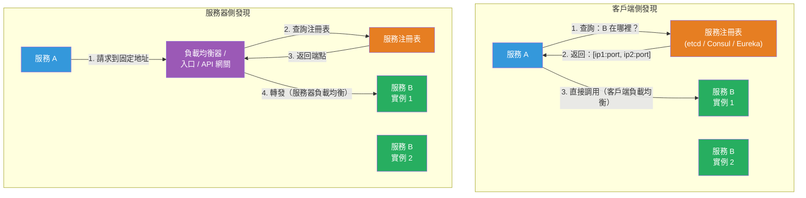

# [BEE-19007] 服務發現

:::info
服務發現是客戶端定位網路端點的機制，這些服務的 IP 地址和端口會動態變更——可通過客戶端直接查詢注冊表，或將所有流量路由到代表客戶端解析地址的中介來解決。
:::

## Context

在靜態部署的環境中，服務位置是固定的：您在配置文件中硬編碼 `db.example.com:5432`，它就一直在那裡。在動態擴展的環境中——由編排器重啟的容器、自動擴展組、滾動部署——每次重啟都可能給服務一個新的 IP 地址。調用二十個其他服務的單體應用無法承受每次任何服務重啟時都需要手動更新配置。

隨著微服務和容器編排的採用，這個問題的規模急劇擴大。Netflix 在這方面做了大量早期思考，於 2012 年開源了 **Eureka** 作為其 JVM 服務的基於注冊表的發現解決方案。Eureka 是一個 AP 系統：實例自我注冊、發送定期心跳，注冊表假設它們是活著的，直到心跳停止。Netflix 還發布了 **Ribbon** 作為從 Eureka 讀取以路由請求的客戶端負載均衡器。Ribbon 現已棄用，但 Eureka 架構仍具影響力。

這個問題有兩個正交軸：**誰發現**（客戶端還是中介）和**誰注冊**（服務本身還是第三方如編排器）。在每個軸上做出錯誤決定會導致不同的故障模式。

DNS 在這個術語出現之前就已經是服務發現的基礎設施。RFC 2782（2000 年）標準化了 SRV 記錄，它攜帶主機和端口，並支持加權優先級選擇——對於 TTL 較短的半靜態環境已足夠。RFC 6763（Cheshire 和 Krochmal，2013 年）標準化了 DNS-SD（基於 DNS 的服務發現），允許客戶端瀏覽特定類型的服務（`_http._tcp.local`），然後解析各個實例記錄，從而在本地網絡上實現零配置發現。Kubernetes 使用 CoreDNS 實現基於 DNS 的發現：每個 Service 都有一個可預測的名稱（`<service>.<namespace>.svc.cluster.local`），由 ClusterIP 支持，CoreDNS 監視 Kubernetes API 服務器以保持記錄最新。

對於需要比 DNS TTL 更強保證的環境，基於注冊表的系統提供了監視/通知機制：客戶端可以訂閱注冊表變更，並在服務的端點集變更時接收推送，而不是輪詢或依賴 TTL 過期。etcd（Raft 支持，CP）、Consul（注冊表使用 Raft + 成員資格使用 Gossip，CP 配可調一致性）和 ZooKeeper（ZAB 共識，CP）都提供這些功能。帶租約的 etcd 臨時鍵在客戶端斷開連接時自動過期，提供內置的注銷機制。

服務網格模型完全從應用代碼中移除了發現。Envoy sidecar 代理攔截所有出站流量；控制平面（Istio 的 `istiod`、Consul Connect、Linkerd）通過 **xDS 協議**（一組 gRPC 流式 API：CDS 用於集群、EDS 用於端點、RDS 用於路由、LDS 用於監聽器）向每個 Envoy 實例推送端點更新。應用代碼與 `localhost:port` 通信；Envoy 處理解析、重試和負載均衡。xDS 協議由 Envoy 項目開發，已成為被多個控制平面採用的行業標準。

## Design Thinking

**客戶端側發現讓客戶端獲得更多控制，但代價是將它們與注冊表耦合。** 客戶端查詢注冊表，獲得健康實例列表，並應用自己的負載均衡邏輯（輪詢、可用區感知、加權）。這允許複雜的路由策略，但要求每個服務客戶端實現或嵌入服務注冊表客戶端庫。如果更換注冊表提供商，所有客戶端都需要更新。

**服務器側發現將客戶端與注冊表解耦，代價是增加一跳網路。** 客戶端向固定的已知地址（負載均衡器、API 網關或入口控制器）發送請求。該中介查詢注冊表并轉發請求。客戶端保持簡單，但每個請求都要穿越額外的一層，這可能成為瓶頸或故障點。

**自我注冊簡單，但在崩潰時會產生孤立注冊記錄。** 在啟動時自我注冊的服務還必須在關閉時注銷——并實現優雅關閉信號處理來執行此操作。在未發送關閉信號的情況下崩潰的進程會在注冊表中留下過期條目，直到 TTL 或健康檢查失敗將其刪除。在此窗口期間，客戶端可能收到已死亡實例的地址并遭遇連接錯誤。

**第三方注冊將耦合轉移到編排器。** Kubernetes 就是這種模式的典範：kubelet 注冊和注銷 Pod，CoreDNS 反映來自 etcd 的 Service 端點變更。服務進程沒有注冊表客戶端代碼。缺點是編排器必須處于所有注冊事件的數據路徑中，這在 Kubernetes 中沒問題，但在其他地方構建需要大量投入。

## Best Practices

**MUST（必須）實現健康檢查並配置注銷超時。** 沒有健康檢查的注冊表是一個過期地址數據庫。每個注冊服務 MUST 暴露一個健康端點（HTTP `GET /health` 在就緒時返回 200，在未就緒時返回 503），且注冊表或編排器 MUST 配置為在可配置的寬限期後注銷健康檢查失敗的實例。在 Consul 中，將 `deregister_critical_service_after` 設置為 `2m` 這樣的值，以自動清除長期失敗的實例。在 Kubernetes 中，配置就緒探針——未通過就緒探針的實例將從 Service 的端點集中移除，在 Pod 被殺死之前停止流量。

**MUST NOT（不得）僅依賴 DNS TTL 作為過期地址防護。** 客戶端 JVM 和運行時 HTTP 庫緩存 DNS 響應遠超 TTL。Java 的 `InetAddress` 歷史上默認永久緩存解析的地址（`networkaddress.cache.ttl = -1`）。即使 TTL 很短（5–30 秒），DNS 負緩存（NXDOMAIN 響應）也可能導致客戶端在完整負 TTL 期間跳過重試最近重啟的服務。在高度動態的環境中，使用健康感知的客戶端庫或 sidecar，而不是原始 DNS，作為您唯一的發現機制。

**SHOULD（應該）在過期條目導致正確性問題時，優先選擇 CP 注冊表系統（etcd、Consul）而非 AP 系統（Eureka）。** Eureka 的自我保護模式——當它停止接收預期心跳的法定人數時觸發，通常在網路分區期間——故意保留所有現有注冊，以防止大規模注銷。這提高了可用性，但意味著客戶端可能接收到實際上無法到達的實例地址。如果您的系統無法處理對死亡端點的重試，CP 注冊表在注冊表分區期間的強一致性值得那個可用性取捨。

**SHOULD（應該）實現優雅關閉以啟用顯式注銷。** 在收到 SIGTERM 時，服務 SHOULD：（1）停止接受新連接，（2）從服務注冊表注銷，（3）清空進行中的請求，（4）關閉連接并退出。這縮短了客戶端接收到「健康但正在關閉中」地址的窗口。實際上，將顯式注銷與停止監聽器之前的短暫延遲結合，以允許注冊表更新傳播到客戶端。

**MAY（可以）使用服務網格模式將發現完全移出應用代碼。** 對于擁有許多服務的多語言環境，在每種語言的每個服務中嵌入注冊表客戶端的維護成本高昂。sidecar 模型——帶 xDS 控制平面的 Envoy，或 Linkerd——將發現、重試、熔斷和 mTLS 集中在基礎設施而非應用代碼中。取捨是操作複雜性：運行控制平面是一個重要的新系統依賴。

## Visual



## Example

**服務發現的 DNS SRV 記錄（RFC 2782）：**

```
# DNS SRV 記錄格式：_service._proto.name TTL IN SRV priority weight port target
# 優先級：較低值 = 首選。權重：在相同優先級記錄間按比例選擇。

_payments._tcp.internal.example.com. 30 IN SRV 10 70 8080 payments-1.internal.example.com.
_payments._tcp.internal.example.com. 30 IN SRV 10 30 8080 payments-2.internal.example.com.
_payments._tcp.internal.example.com. 30 IN SRV 20  0 8080 payments-3.internal.example.com.

# 優先級 10：payments-1 獲得 70% 流量，payments-2 獲得 30%
# 優先級 20：payments-3 是備用，僅在優先級 10 服務器不可用時使用
# TTL 30 秒：客戶端每 30 秒重新查詢

# Kubernetes 等效（由 CoreDNS 自動生成）：
# payments.payments-ns.svc.cluster.local → ClusterIP（由 kube-proxy 輪詢）
# 無頭服務：每個 Pod 獲得自己的 A 記錄
```

**Consul 服務注冊和健康檢查：**

```json
{
  "service": {
    "name": "payments",
    "id": "payments-pod-abc123",
    "address": "10.0.1.42",
    "port": 8080,
    "tags": ["v2", "primary"],
    "check": {
      "http": "http://10.0.1.42:8080/health",
      "interval": "10s",
      "timeout": "3s",
      "deregister_critical_service_after": "2m"
    }
  }
}

// 失敗時發生的情況：
// T=0s：HTTP 檢查 :8080/health → 503（服務正在重啟）
// T=10s：第二次檢查失敗 → 實例標記為「嚴重」
// T=2m：deregister_critical_service_after 觸發 → 實例從注冊表中移除
// T=2m：新客戶端不再收到此實例的地址
// 間隔：客戶端可能遭遇連接錯誤達 2 分鐘；使用重試（BEE-12002）緩解
```

**Envoy xDS 端點發現（EDS）：**

```yaml
# 控制平面推送 EDS 的 DiscoveryResponse：
# Envoy sidecar 接收並更新其上游集群 "payments"
resources:
  - "@type": type.googleapis.com/envoy.config.endpoint.v3.ClusterLoadAssignment
    cluster_name: payments
    endpoints:
      - lb_endpoints:
          - endpoint:
              address:
                socket_address:
                  address: 10.0.1.42
                  port_value: 8080
            health_status: HEALTHY
          - endpoint:
              address:
                socket_address:
                  address: 10.0.1.43
                  port_value: 8080
            health_status: HEALTHY
# 當 payments-pod-abc123 的健康檢查失敗時：
# 控制平面推送更新的 EDS 響應，health_status: UNHEALTHY
# Envoy 停止路由到 10.0.1.42，無需任何應用代碼更改
```

## Related BEEs

- [BEE-19002](consensus-algorithms-paxos-and-raft.md) -- 共識演算法：Consul 和 etcd 在 Raft 之上實現注冊表；CP 保證意味著即使在領導者故障轉移後，注冊表讀取也是一致的
- [BEE-19004](gossip-protocols.md) -- 流言協議：Consul 使用 Serf 庫（SWIM 流言）在 Consul 代理之間進行集群成員資格和故障檢測，與其基於 Raft 的注冊表分離
- [BEE-12001](../resilience/circuit-breaker-pattern.md) -- 熔斷模式：服務發現告訴您將流量發送到哪裡；熔斷器根據最近的失敗率決定是否發送——兩種模式組合使用
- [BEE-12002](../resilience/retry-strategies-and-exponential-backoff.md) -- 重試策略：過期的注冊表條目會產生連接錯誤；在注冊表中對下一個健康實例進行帶抖動的重試是標準緩解方法
- [BEE-14006](../observability/health-checks-and-readiness-probes.md) -- 健康檢查和就緒探針：服務發現依賴健康檢查端點來確定存活狀態，這裡有深入的描述

## References

- [客戶端側服務發現模式 -- Chris Richardson, microservices.io](https://microservices.io/patterns/client-side-discovery.html)
- [服務器側服務發現模式 -- Chris Richardson, microservices.io](https://microservices.io/patterns/server-side-discovery.html)
- [自我注冊模式 -- Chris Richardson, microservices.io](https://microservices.io/patterns/self-registration.html)
- [第三方注冊模式 -- Chris Richardson, microservices.io](https://microservices.io/patterns/3rd-party-registration.html)
- [RFC 2782：用於指定服務位置的 DNS RR -- IETF, 2000](https://datatracker.ietf.org/doc/html/rfc2782)
- [RFC 6763：基於 DNS 的服務發現 -- Cheshire & Krochmal, IETF, 2013](https://datatracker.ietf.org/doc/html/rfc6763)
- [CoreDNS Kubernetes 插件 -- CoreDNS 文檔](https://coredns.io/plugins/kubernetes/)
- [服務發現 -- Consul 文檔](https://developer.hashicorp.com/consul/docs/concepts/service-discovery)
- [Envoy xDS 協議 -- Envoy Proxy 文檔](https://www.envoyproxy.io/docs/envoy/latest/api-docs/xds_protocol)
- [介紹 istiod：簡化控制平面 -- Istio 博客, 2020](https://istio.io/latest/blog/2020/istiod/)
- [Eureka：Netflix 的服務發現 -- GitHub](https://github.com/Netflix/eureka)
- [Kubernetes 服務發現 -- Kubernetes 文檔](https://kubernetes.io/docs/concepts/services-networking/service/)
