# [BEE-19048] 服務間身份驗證

:::info
服務間身份驗證（Service-to-service authentication）確立呼叫服務就是其聲稱的身份——有別於使用者身份驗證——是零信任網路（zero-trust networking）的基礎，在零信任架構中，沒有任何內部請求僅因來自私有網路內部就被默認信任。
:::

## 背景

傳統的邊界安全假設網路邊界內的一切都是可信任的。接收來自另一個內部 IP 位址請求的服務，會直接處理請求而不驗證呼叫方的身份。隨著組織採用微服務、容器化工作負載和多雲部署，「網路」不再是有意義的邊界——來自不同租戶的工作負載共享同一基礎架構，一個被入侵的服務的橫向移動可能觸達內部網路上的每一個服務，這個假設因此崩潰。

John Kindervag 於 2010 年在 Forrester 提出「零信任（Zero Trust）」一詞。NIST 特別出版物 800-207（2020）將架構原則正式化：每個請求無論網路來源為何都必須經過驗證和授權，網路位置不足以授予信任，最小權限原則同樣適用於機器間流量和使用者流量。Google 的 BeyondCorp 計畫（2014，Osborn 等人）在大規模場景下應用了這些原則，消除了受信任企業網路的概念，並基於工作負載身份而非 IP 位址對每個服務間呼叫進行驗證。

工程挑戰在於服務身份在結構上不同於使用者身份。使用者每次 Session 只驗證一次，使用其攜帶的憑證（密碼、硬體 Token）。服務在每個出站請求中都需要驗證，每秒可能數千次，且無法互動式地提示輸入憑證。密鑰必須在執行時期注入，無停機旋轉，並限定在最小必要的受眾範圍內。憑證管理問題與驗證協議本身同樣重要。

## 設計思維

### 三種方法

**雙向 TLS（mTLS）** 從共享 CA 向每個服務發放短期 X.509 憑證。連線的雙方都出示其憑證；TLS 握手同時驗證呼叫方和被呼叫方。這是服務網格（Istio、Linkerd）使用的模型，也是大規模場景下操作上最健壯的選項，因為憑證的發行和旋轉可以由控制平面自動完成。

**短期 JWT 服務 Token** 由受信任的 Token 授權機構（例如 Kubernetes 服務帳號 Token 投影、HashiCorp Vault 的 JWT 驗證）向每個服務發放具有短期有效期（分鐘到小時）的已簽署 JWT。呼叫方在每個請求中以 Bearer Token 的形式包含 JWT；被呼叫方驗證簽名和受眾宣告。比 mTLS 更易於實作，但增加了 Token 授權機構作為依賴，並需要時鐘同步。

**使用雲端供應商 IAM 的工作負載身份** 在基礎架構層面將服務綁定到 IAM 角色。AWS EC2 執行個體設定檔、GCP Workload Identity Federation 和 Azure Managed Identity 為每個工作負載提供由平台自動旋轉的憑證。被呼叫方對照雲端供應商的 IAM API 驗證請求。這在單一雲端供應商內運作良好；跨雲呼叫需要聯邦或單獨的 Token 交換。

**共享 API 金鑰**（儲存在環境變數或密鑰管理器中的長期對稱密鑰）是最簡單的選項，但也是最弱的：洩露的金鑰在旋轉之前永久授予存取權，旋轉通常是手動的，且沒有每個請求的身份——只有每個密鑰的身份。

### 選擇策略

| 方法 | 優勢 | 操作成本 | 最適合 |
|---|---|---|---|
| mTLS（服務網格） | 雙向驗證，自動旋轉 | 高（網格設定） | Kubernetes、大型微服務叢集 |
| 短期 JWT | 易於實作，可審計 | 中（需 Token 授權機構） | 混合雲、跨雲、非網格 |
| 工作負載身份（IAM） | 零憑證管理 | 低（平台管理） | 單一雲端、雲端原生工作負載 |
| 共享 API 金鑰 | 最簡單 | 低（但大規模時風險高） | 內部工具、少量服務 |

決策應基於：（1）存在多少個服務，（2）是否已使用服務網格，（3）憑證旋轉將如何自動化，以及（4）是否需要跨雲或跨叢集驗證。

## 最佳實踐

**不得（MUST NOT）使用長期靜態密鑰（硬式編碼的 API 金鑰、長期密碼）作為生產環境的主要服務驗證機制。** 長期憑證會積累在日誌中，難以在不停機的情況下旋轉，且不提供每個請求的審計追蹤。每個憑證都必須有明確的旋轉間隔和自動化的旋轉機制。

**必須（MUST）將憑證限定在最小必要的受眾範圍內。** 為服務 A 發行的服務 Token 必須被服務 B 拒絕。在 JWT 中包含 `aud`（受眾）宣告，並在每個入站請求中驗證它。mTLS 憑證應在主體替代名稱（Subject Alternative Name）欄位中包含服務的 SPIFFE ID（`spiffe://trust-domain/ns/namespace/sa/service-name`），接收服務根據其授權策略對其進行驗證。

**必須（MUST）在每個請求上驗證入站服務憑證，而非僅在連線建立時驗證一次。** Session 層級的信任（因第一個請求已驗證就信任連線）允許被劫持的連線發出未驗證的請求。HTTP/2 在一個連線上多工許多請求；在每個邏輯請求上驗證 JWT 或檢查 mTLS 對等憑證，而非僅在連線開啟時驗證。

**應該（SHOULD）在有效期屆滿前自動旋轉憑證或 Token。** 正確的旋轉流程為：發行新憑證，部署它（使服務開始出示新憑證），然後撤銷舊憑證。手動旋轉在操作上容易出錯。SPIRE 在有效期屆滿前自動旋轉 SVID 憑證。Kubernetes 投影服務帳號 Token 由 kubelet 旋轉。HashiCorp Vault 租約由 Vault Agent sidecar 自動續約。

**應該（SHOULD）在跨多個叢集、雲端或執行環境運作時使用 SPIFFE/SPIRE 進行工作負載身份。** SPIFFE（Secure Production Identity Framework for Everyone，安全生產身份框架）將工作負載身份標準化為 URI：`spiffe://trust-domain/path`。SPIRE（SPIFFE 執行時期環境）發行由 X.509 或 JWT 支撐的短期 SVID（SPIFFE 可驗證身份文件）。SPIFFE 聯邦允許不同雲端的信任域彼此驗證工作負載，而無需共享共同 CA。

**應該（SHOULD）將服務身份宣告加入所有審計日誌條目。** 當面向使用者的請求扇出到多個服務時，每個服務的審計日誌條目應記錄終端使用者身份（通過原始 JWT 的 `sub` 宣告傳播）和呼叫服務的身份（來自 mTLS 對等憑證或 JWT 的 `iss`/`azp` 宣告）。如果沒有兩者，就無法在跨服務間關聯審計追蹤。

**必須（MUST）在服務呼叫鏈中傳播終端使用者身份。** 通過 mTLS 或服務 JWT 驗證的服務是在證明其自身身份，而非觸發呼叫的使用者的身份。透過標準化的標頭（例如 `X-User-Token` 或通過 OIDC Token 交換）傳遞原始使用者 JWT（或從其衍生的範圍限定子 Token），以便下游服務除了服務層級的驗證外，還能執行使用者層級的授權。

## 視覺說明

```mermaid
flowchart TD
    subgraph "mTLS 流程"
        MA["服務 A\n(憑證: spiffe://td/svc-a)"]:::svc
        MB["服務 B\n(憑證: spiffe://td/svc-b)"]:::svc
        MCA["共享 CA\n(SPIRE / Mesh CA)"]:::ca
        MCA -->|"發行 SVID"| MA
        MCA -->|"發行 SVID"| MB
        MA -->|"mTLS: 出示憑證，驗證 B 的憑證"| MB
    end

    subgraph "JWT 服務 Token 流程"
        JA["服務 A"]:::svc
        JB["服務 B"]:::svc
        TA["Token 授權機構\n(Vault / k8s OIDC)"]:::ca
        TA -->|"發行 JWT (aud=svc-b, exp=15m)"| JA
        JA -->|"Authorization: Bearer <jwt>"| JB
        JB -->|"驗證簽名 + aud + exp"| JB
    end

    subgraph "工作負載身份（IAM）"
        WA["服務 A\n(EC2 / GKE pod)"]:::svc
        WB["服務 B"]:::svc
        IAM["雲端 IAM\n(AWS STS / GCP)"]:::ca
        IAM -->|"自動旋轉的執行個體憑證"| WA
        WA -->|"已簽署請求 (SigV4 / OIDC)"| WB
        WB -->|"對照 IAM API 驗證"| IAM
    end

    style MA fill:#3498db,color:#fff
    style MB fill:#27ae60,color:#fff
    style MCA fill:#9b59b6,color:#fff
    style JA fill:#3498db,color:#fff
    style JB fill:#27ae60,color:#fff
    style TA fill:#9b59b6,color:#fff
    style WA fill:#3498db,color:#fff
    style WB fill:#27ae60,color:#fff
    style IAM fill:#9b59b6,color:#fff
```



## 實作範例

**JWT 服務 Token 驗證（Go）：**

```go
import (
    "github.com/golang-jwt/jwt/v5"
    "errors"
)

type ServiceClaims struct {
    jwt.RegisteredClaims
    ServiceName string `json:"svc"`
}

var signingKey = []byte(os.Getenv("SERVICE_TOKEN_SECRET")) // 在啟動時從 Vault 載入

// ValidateServiceToken 在每個請求上驗證入站服務 JWT。
// 從 HTTP 中介軟體或 gRPC 攔截器呼叫。
func ValidateServiceToken(tokenStr string, expectedAudience string) (*ServiceClaims, error) {
    token, err := jwt.ParseWithClaims(tokenStr, &ServiceClaims{},
        func(t *jwt.Token) (interface{}, error) {
            if _, ok := t.Method.(*jwt.SigningMethodHMAC); !ok {
                return nil, errors.New("unexpected signing method")
            }
            return signingKey, nil
        },
        jwt.WithAudiences(expectedAudience), // 必須（MUST）驗證受眾
        jwt.WithExpirationRequired(),         // 必須（MUST）拒絕已過期的 Token
        jwt.WithIssuedAt(),                   // 拒絕在未來發行的 Token
    )
    if err != nil {
        return nil, err
    }
    return token.Claims.(*ServiceClaims), nil
}

// 發行短期服務 Token（在呼叫服務中執行，不在這裡）
func IssueServiceToken(callerName, targetService string) (string, error) {
    claims := ServiceClaims{
        RegisteredClaims: jwt.RegisteredClaims{
            Issuer:    callerName,
            Audience:  jwt.ClaimStrings{targetService},
            ExpiresAt: jwt.NewNumericDate(time.Now().Add(15 * time.Minute)),
            IssuedAt:  jwt.NewNumericDate(time.Now()),
            ID:        uuid.NewString(), // 防止在有效期內重放
        },
        ServiceName: callerName,
    }
    return jwt.NewWithClaims(jwt.SigningMethodHS256, claims).SignedString(signingKey)
}
```

**Kubernetes 投影服務帳號 Token（YAML + Go 驗證）：**

```yaml
# Pod 規格：掛載限定到目標服務的短期投影 Token
volumes:
  - name: order-svc-token
    projected:
      sources:
        - serviceAccountToken:
            audience: "order-service"   # 受眾限制哪個服務可以接受此 Token
            expirationSeconds: 900      # 15 分鐘；kubelet 在有效期屆滿前旋轉
            path: token
containers:
  - name: payment-service
    volumeMounts:
      - mountPath: /var/run/secrets/order-svc
        name: order-svc-token
```

```go
// 在接收端使用 Kubernetes TokenReview API 驗證投影服務帳號 Token
func validateK8sToken(ctx context.Context, token string) (string, error) {
    review, err := k8sClient.AuthenticationV1().TokenReviews().Create(ctx,
        &authv1.TokenReview{
            Spec: authv1.TokenReviewSpec{
                Token:     token,
                Audiences: []string{"order-service"},
            },
        }, metav1.CreateOptions{})
    if err != nil || !review.Status.Authenticated {
        return "", errors.New("token not authenticated")
    }
    return review.Status.User.Username, nil // 例如："system:serviceaccount:default:payment-svc"
}
```

**非網格環境中的 mTLS 驗證（Go HTTPS 伺服器）：**

```go
// 伺服器：要求並驗證用戶端憑證
tlsConfig := &tls.Config{
    ClientAuth: tls.RequireAndVerifyClientCert,
    ClientCAs:  loadCA("/etc/ssl/internal-ca.crt"),
    MinVersion: tls.VersionTLS13,
}

server := &http.Server{
    TLSConfig: tlsConfig,
    Handler:   http.HandlerFunc(func(w http.ResponseWriter, r *http.Request) {
        // 從 TLS 連線狀態中提取已驗證的對等方身份
        if len(r.TLS.PeerCertificates) == 0 {
            http.Error(w, "client certificate required", http.StatusUnauthorized)
            return
        }
        peerCert := r.TLS.PeerCertificates[0]
        // 驗證 SAN 欄位中的 SPIFFE ID
        for _, uri := range peerCert.URIs {
            if strings.HasPrefix(uri.String(), "spiffe://internal.example.com/") {
                handleRequest(w, r, uri.String())
                return
            }
        }
        http.Error(w, "untrusted peer identity", http.StatusForbidden)
    }),
}
```

## 實作注意事項

**Istio / Linkerd（服務網格 mTLS）**：網格 Sidecar（Envoy / Linkerd2-proxy）以透明方式處理憑證發行、旋轉和 mTLS 終止。應用程式程式碼傳送純 HTTP；mTLS 在代理層強制執行。在 Istio 中使用 `PeerAuthentication` 或通過 Linkerd 的 `Server` 資源啟用嚴格的對等驗證。授權策略（Istio 中的 `AuthorizationPolicy`）在此基礎上限制哪些服務可以呼叫哪些端點。

**HashiCorp Vault**：`pki` 密鑰引擎發行短期 X.509 憑證。`jwt` 驗證方法發行 JWT。Vault Agent Sidecar 或 Vault CSI 提供程式將憑證注入 Pod 並自動旋轉。對非 Kubernetes 工作負載使用 `AppRole`；對 Pod 使用 Kubernetes 驗證方法。

**AWS IAM（EC2/ECS/Lambda）**：IAM 執行個體設定檔和任務角色注入由 AWS SDK 透明旋轉的短期 STS 憑證。呼叫服務使用 AWS Signature Version 4 簽署請求；接收服務通過呼叫 STS `AssumeRole` 或使用 API Gateway 的 IAM 授權來驗證。對於跨帳號呼叫，請設定跨帳號 IAM 信任。

**SPIFFE/SPIRE**：每個信任域部署一個 SPIRE Server，在每個節點上部署 SPIRE Agent。Agent 使用節點認證（TPM、AWS IID、Kubernetes PSAT）向 Server 驗證身份。工作負載從 Workload API（Unix domain socket）檢索 SVID。SPIFFE 聯邦功能允許兩個獨立的信任域互相信任對方的憑證，而無需共享 CA。

## 相關 BEE

- [BEE-1001](../auth/authentication-vs-authorization.md) -- 驗證 vs 授權：涵蓋基礎區別；服務間驗證應用相同原則，但使用自動化憑證管理而非互動式使用者登入
- [BEE-1003](../auth/oauth-openid-connect.md) -- 基於 Token 的驗證：JWT 結構和驗證同樣適用於服務 Token；服務 Token 增加了 `aud` 範圍限定和自動化需求
- [BEE-2003](../security-fundamentals/secrets-management.md) -- 密鑰管理：服務憑證（私鑰、簽署密鑰）必須通過密鑰管理器儲存和旋轉，而非硬式編碼或儲存在內嵌於映像中的環境變數中
- [BEE-3004](../networking-fundamentals/tls-ssl-handshake.md) -- TLS/SSL 握手：mTLS 通過用戶端憑證出示擴展了標準 TLS 握手；理解基礎 TLS 握手是理解 mTLS 的前提
- [BEE-19043](audit-logging-architecture.md) -- 審計日誌架構：服務身份必須出現在審計日誌條目中，以實現跨服務的取證調查

## 參考資料

- [SPIFFE Overview — spiffe.io](https://spiffe.io/docs/latest/spiffe-about/overview/)
- [Zero Trust Architecture — NIST Special Publication 800-207 (2020)](https://nvlpubs.nist.gov/nistpubs/SpecialPublications/NIST.SP.800-207.pdf)
- [Mutual TLS for OAuth 2.0 — RFC 8705 (2020)](https://www.rfc-editor.org/rfc/rfc8705)
- [JSON Web Token (JWT) — RFC 7519](https://www.rfc-editor.org/rfc/rfc7519)
- [Service Account Tokens — Kubernetes Documentation](https://kubernetes.io/docs/concepts/security/service-accounts/)
- [BeyondCorp: A New Approach to Enterprise Security — Osborn et al., USENIX ;login: 2014](https://research.google/pubs/beyondcorp-a-new-approach-to-enterprise-security/)
