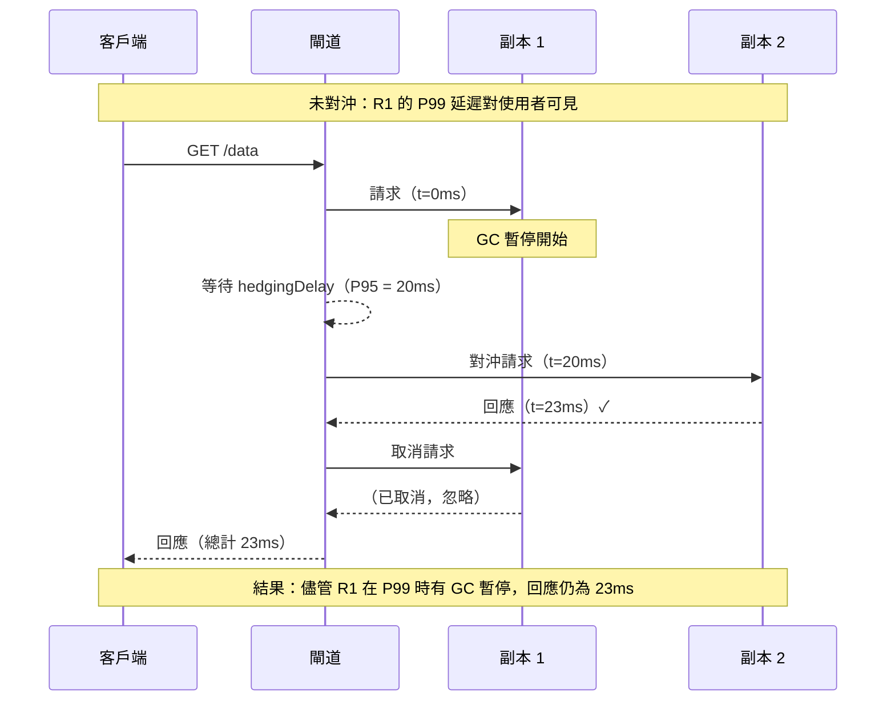

# [BEE-19032] 尾延遲與對沖請求

:::info
在大型分散式系統中，扇出呼叫中最慢的請求——而非平均值——決定了使用者可見的回應時間。Jeff Dean 和 Luiz André Barroso 在 2013 年的論文《The Tail at Scale》中證明：優化平均延遲是不夠的——在第 99 百分位數時，即使只有一個慢速子呼叫，幾乎所有使用者都會受到影響。
:::

## 背景

2013 年，Google 的 Jeff Dean 和 Luiz André Barroso 發表了《The Tail at Scale》（《ACM 通訊》，2013 年 2 月）——這篇論文從根本上改變了大規模系統的設計方式。核心觀察：在任何大型分散式系統中，由於應用程式無法控制的原因，一小部分請求將被緩慢處理：垃圾回收暫停、OS 調度抖動、背景進程競爭磁碟、記憶體頻寬爭用或網路重傳。在低流量時，這些緩慢請求是小問題。在規模化時，它們成為結構性問題。

放大效應來自**扇出（fan-out）**：一個使用者請求通常會扇出到幾十或幾百個子呼叫。如果任何單個子呼叫的 P99 延遲是 1 秒，而一個回應需要 100 個這樣的子呼叫，那麼大約 63% 的回應將遇到至少一個 P99 或更慢的子呼叫——即使底層服務在 P50 時健康且快速。數學計算：至少一個慢速子呼叫的機率 = 1 − (0.99)^100 ≈ 0.63。對於 200 個子呼叫，是 87%。尾部成為整個系統的中位數。

Dean 和 Barroso 在 Google BigTable 中量化了這一點：讀取 1,000 個鍵值對需要在平板伺服器之間扇出，而該讀取的 P99.9 延遲為 1,800ms——即使各個平板伺服器讀取在幾毫秒內完成。透過發送**對沖請求**（在短暫延遲後向第二台伺服器發送重複請求）並使用最先到達的回應，P99.9 降至 74ms，總請求量僅增加 2%。

該論文的貢獻是命名和系統化了 Google 工程師獨立發現的一類技術：**容尾（tail-tolerant）**設計。核心洞見是將尾延遲視為需要繞過的環境條件，而非需要修復的錯誤。

## 設計思維

### 百分位數放大

平均值和 P95 延遲測量會隱藏問題。對於扇出系統，相關問題是：「有多少比例的回應要求所有子呼叫都快速完成？」答案是子呼叫數量（n）和慢速請求率（p）的函數：

```
P（至少一個慢速子呼叫）= 1 − (1 − p)^n
```

在 P99（p = 0.01）和 n = 100 時：63% 的頂層請求受到影響。
在 P99.9（p = 0.001）和 n = 1,000 時：同樣是 63%。
在 P95（p = 0.05）和 n = 100 時：99.4% 的頂層請求受到影響。

這意味著：**必須測量和優化尾部，而不是平均值**。在扇出架構中，P50 優秀但 P99 高的系統將帶來糟糕的使用者體驗，因為大多數使用者在大多數時候看到的是 P99。

### 尾延遲的根本原因

尾延遲主要不是由應用程式錯誤引起的。Dean 和 Barroso 確定的原因主要是環境性和共享性的：

- **垃圾回收暫停**：JVM、Go 和其他託管執行環境會停止世界。每個實例 100ms 的 GC 暫停很罕見，但有 1,000 個實例時，預期頻率為每分鐘一次（100ms × 1,000）。
- **背景維護**：RocksDB 中的日誌壓縮、緩衝池中的頁面驅逐、Postgres 中的檢查點刷新、索引重建。
- **佇列積壓**：請求突增填滿佇列；佇列線性排空；後面的請求等待所有先前請求完成。
- **電源和溫度限制**：接近熱限制的 CPU 會降頻，對一小部分請求增加延遲。
- **網路重傳**：TCP 重傳計時器在 200ms 後觸發（RTO_MIN）。一個丟失的封包導致 200ms 停頓。

這些原因都無法由應用程式單獨解決。容尾技術繞過而非消除它們。

### 對沖的權衡

對沖請求消耗額外資源：每個對沖都是對副本的額外請求。對沖成本大約為 1/(1 − 使用率) × 對沖率的額外工作量。在低使用率時可以忽略不計；在高使用率時可能產生反饋迴路：對沖增加負載，增加尾延遲，增加對沖率，進一步增加負載。**對沖必須受到速率限制，並在系統過載時停用。**

最佳對沖延遲是子呼叫的 P50 或 P75 延遲。在 P50 對沖意味著一半的子呼叫將被對沖——太激進了。在 P95 對沖意味著只有 5% 的子呼叫被對沖——對大多數服務適當。gRPC 對沖規範預設在 `hedgingDelay` 時長後發送對沖，SHOULD（應該）將其設定在目標服務觀察到的延遲的 P95 附近。

## 最佳實踐

**MUST（必須）在每個服務邊界測量 P99 和 P99.9 延遲，而不僅僅是 P50 和 P95。** 只顯示平均值和 P95 延遲的儀表板不會揭示尾部放大問題，直到它們顯現為可見的使用者降級。使用直方圖對所有出站呼叫進行儀器化（Prometheus 的 `histogram_quantile`，或用於進程內測量的 HdrHistogram），並獨立於平均延遲對 P99 增加告警。

**MUST NOT（不得）將逾時作為主要的尾延遲策略。** 在 P99.5 觸發的逾時將終止 0.5% 的請求——這些是請求失敗的真實使用者。對沖請求容忍慢速路徑而不使其失敗：使用者從快速副本獲得回應，而慢速副本的回應在最終到達時被丟棄。

**SHOULD（應該）對具有冪等性且後端有副本的讀取路徑呼叫使用對沖請求。** 對沖在可配置延遲後向不同副本發送第二個請求。MUST NOT（不得）對非冪等的寫入進行對沖：對沖的 `POST /order` 會創建兩個訂單。適合的候選者：從複製資料庫或快取讀取、搜尋查詢、讀取密集型微服務呼叫。

**SHOULD（應該）一旦收到回應就取消較慢的請求。** 對沖在目標伺服器上消耗連線和處理資源。透過 HTTP 請求取消（Go 中的 context 取消、瀏覽器中的 `AbortController`、連線關閉）或 gRPC 的 `cancel()` 立即釋放這些資源。若不取消，「失敗」的請求會繼續消耗伺服器 CPU 直到完成。

**SHOULD（應該）明確限制佇列長度。** 無界佇列將延遲尖峰轉換為延遲級聯：突增填滿佇列，新請求加入長佇列末尾，突增中的所有請求都會遭遇與突增大小成正比的延遲。使用有界佇列並在佇列滿時快速失敗（HTTP 503 或 429），而不是無界佇列。這將延遲尾部轉換為錯誤率，後者更可見、更易告警、且上游更容易處理（使用指數退避重試）。

**SHOULD（應該）將快速和慢速工作分離到不同的佇列。** 如果一個服務同時處理快速讀取（1ms）和慢速背景掃描（100ms），在一個佇列中混合時，當佇列繁忙時快速讀取必須在慢速掃描後等待。為不同請求類別設置專用佇列可防止頭部阻塞（head-of-line blocking）：快速工作始終有一個深度低、預期等待時間低的佇列。

**MAY（可以）使用微分區（micro-partitioning）來減少熱點暴露。** 將資料分配到比物理節點多得多的虛擬分片（例如，50 個節點上有 1,000 個虛擬分片）。當一個節點變慢時，一致性雜湊可以在幾秒鐘內將虛擬分片遷移到其他節點，將慢速節點的影響範圍限制在其當前承載的虛擬分片比例上。

## 視覺圖



## 範例

**gRPC 對沖策略（服務配置 JSON）：**

```json
{
  "methodConfig": [{
    "name": [{"service": "product.ProductService", "method": "GetProduct"}],
    "hedgingPolicy": {
      "maxAttempts": 3,
      "hedgingDelay": "20ms",
      "nonFatalStatusCodes": ["UNAVAILABLE", "RESOURCE_EXHAUSTED"]
    }
  }]
}
```

`hedgingDelay` 應設定為目標方法大約的 P95 延遲。`maxAttempts` 為 3 意味著：立即發送請求 1，20ms 後發送請求 2，再過 20ms 後發送請求 3——然後等待第一個成功回應並取消其他請求。

**Go 中的應用層對沖請求：**

```go
import (
    "context"
    "time"
)

// HedgedGet 發送請求，在 hedgeDelay 後向第二個端點發送並行請求。
// 返回第一個成功的回應。
// MUST 僅用於冪等的唯讀端點。
func HedgedGet(ctx context.Context, primary, secondary string, hedgeDelay time.Duration) ([]byte, error) {
    type result struct {
        body []byte
        err  error
    }

    ch := make(chan result, 2) // 有緩衝：兩個 goroutine 都可以發送而不阻塞

    // 主請求 — 立即發送
    ctx1, cancel1 := context.WithCancel(ctx)
    defer cancel1()
    go func() {
        body, err := fetch(ctx1, primary)
        ch <- result{body, err}
    }()

    // 對沖 — 延遲後發送。如果主請求先回應，ctx2 將被取消。
    ctx2, cancel2 := context.WithCancel(ctx)
    defer cancel2()
    go func() {
        select {
        case <-time.After(hedgeDelay):
            body, err := fetch(ctx2, secondary)
            ch <- result{body, err}
        case <-ctx2.Done():
            // 主請求已回應；跳過對沖
        }
    }()

    // 返回第一個成功的回應；取消另一個
    for i := 0; i < 2; i++ {
        r := <-ch
        if r.err == nil {
            cancel1()  // 取消仍在運行的那個
            cancel2()
            return r.body, nil
        }
    }
    return nil, fmt.Errorf("兩個請求都失敗了")
}
```

**帶拒絕功能的有界工作佇列：**

```python
import queue
import threading
from concurrent.futures import ThreadPoolExecutor

class BoundedWorkerPool:
    """
    帶有界佇列的工作池。超過 MAX_QUEUE_DEPTH 的請求
    立即以 503 失敗，而不是排隊增加延遲。
    將延遲尾部轉換為錯誤率，後者更容易處理。
    """
    MAX_QUEUE_DEPTH = 100  # 根據可接受的 P99 延遲 / 任務持續時間調整

    def __init__(self, workers: int):
        self._pool = ThreadPoolExecutor(max_workers=workers)
        self._semaphore = threading.BoundedSemaphore(workers + self.MAX_QUEUE_DEPTH)

    def submit(self, fn, *args, **kwargs):
        if not self._semaphore.acquire(blocking=False):
            raise QueueFullError("佇列深度超出 — 快速失敗")
        
        def wrapped():
            try:
                return fn(*args, **kwargs)
            finally:
                self._semaphore.release()
        
        return self._pool.submit(wrapped)
```

## 相關 BEE

- [BEE-12002](../resilience/retry-strategies-and-exponential-backoff.md) -- 重試策略與指數退避：對沖請求和重試是互補的；重試容忍完全失敗，對沖請求容忍慢速回應；對沖 MUST（必須）像重試一樣受到速率限制
- [BEE-12003](../resilience/timeouts-and-deadlines.md) -- 逾時與截止時間：對沖延遲是觸發並行嘗試而非失敗的軟逾時；外部請求上的硬逾時仍然限制總延遲
- [BEE-10006](../messaging/backpressure-and-flow-control.md) -- 背壓與流量控制：有界佇列和佇列滿時快速失敗是客戶端對沖的伺服器端補充；容尾系統需要兩者
- [BEE-13004](../performance-scalability/profiling-and-bottleneck-identification.md) -- 效能分析與瓶頸識別：尾延遲根本原因分析需要火焰圖、GC 暫停指標和每實例延遲直方圖，而非聚合平均值
- [BEE-12001](../resilience/circuit-breaker-pattern.md) -- 熔斷器模式：當對沖單獨無法補償降級節點時，對持續緩慢副本的熔斷器是升級路徑

## 參考資料

- [The Tail at Scale -- Dean & Barroso，ACM 通訊，2013 年 2 月](https://research.google/pubs/the-tail-at-scale/)
- [gRPC 請求對沖指南 -- gRPC 文件](https://grpc.io/docs/guides/request-hedging/)
- [When to Hedge in Interactive Services -- Primorac 等，USENIX NSDI 2021](https://www.usenix.org/conference/nsdi21/presentation/primorac)
- [Managing Tail Latency in Datacenter-Scale File Systems -- Microsoft Research，EuroSys 2019](https://dl.acm.org/doi/10.1145/3302424.3303973)
- [Latency at Every Percentile -- Marc Brooker，Amazon（2021）](https://brooker.co.za/blog/2021/04/19/latency.html)
- [Global Payments Inc. 使用 Amazon DynamoDB 對沖請求降低尾延遲 -- AWS Database Blog](https://aws.amazon.com/blogs/database/how-global-payments-inc-improved-their-tail-latency-using-request-hedging-with-amazon-dynamodb/)
