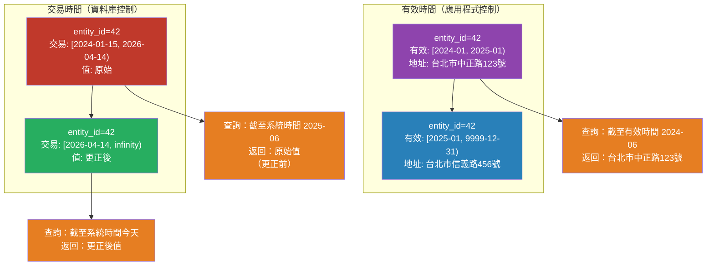

# [BEE-478] 時態資料建模

:::info
時態資料建模不僅追蹤實體的當前狀態，也追蹤其歷史——包括事實在現實世界中何時成立（有效時間）以及何時被記錄到資料庫（交易時間）。需要回答「在此日期我們相信什麼？」的系統需要兩個維度。
:::

## 情境

大多數資料庫列描述的是現在：目前的地址、目前的價格、目前的帳戶餘額。當值改變時，該列被覆寫。這在稽核員問「發票在三月開立時客戶的地址是什麼？」或合規團隊問「在追溯更正前，我們上季的系統報告了什麼？」之前是足夠的。

這個問題有兩個獨立的維度：

**有效時間**：事實在現實世界中成立的時間。價格變更從未來日期起有效；保險保單的承保期間是應用程式時間段。

**交易時間**：系統記錄事實的時間。追溯更正改變了過去的事實，但在較晚的系統時間記錄。資料庫反映對歷史的當前理解，而不一定是原始記錄。

**雙時態建模**追蹤兩者。SQL:2011 標準（ISO/IEC 9075:2011）以 `PERIOD FOR` 語法和 `WITH SYSTEM VERSIONING` 正式化了這一點。MariaDB 10.3+ 原生實作系統版本化資料表；DB2 支援兩種時間段。PostgreSQL 缺乏原生 SQL:2011 支援，但提供範圍型別和排除約束，可手動實作相同的語義。

時態資料建模解決了稽核日誌無法解決的問題：稽核日誌記錄事件，但不讓歷史查詢變得容易。時態資料表以單一索引查詢回答「時間 T 的狀態是什麼？」。

## 設計思維

### 有效時間 vs 交易時間

| 維度 | 名稱 | 控制者 | 範例 |
|---|---|---|---|
| 在現實中成立的時間 | 有效時間 / 應用程式時間 | 應用程式 | 自 2026-06-01 起生效的價格、2024–2026 的保險承保 |
| 在資料庫中記錄的時間 | 交易時間 / 系統時間 | 資料庫 | 2026-04-14 為三月事實輸入的更正 |

**有效時間資料表**增加 `valid_from` 和 `valid_to` 欄位，由應用程式設定。適用於排程、版本控制和業務定義的時間窗口。

**交易時間資料表**增加由系統管理的開始/結束時間戳，在寫入時自動填充。適用於稽核追蹤和合規——可以重建系統在任何過去時刻相信的內容。

**雙時態資料表**同時具備兩者。這是最通用的形式，能清晰處理追溯更正：一個事實可以在過去有有效時段，在現在的交易時間記錄。

### SCD Type 2 模式

緩慢變化維度（SCD）Type 2 是最廣泛部署的時態模式：透過為每次變更添加新列而不是覆寫，追蹤實體的完整歷史。

慣例：
- `valid_from`——有效區間的含左邊界
- `valid_to`——不含右邊界；哨兵值 `9999-12-31`（或 `infinity`）標記當前列
- 不含右邊界（`valid_to > :ts`，而非 `>=`）確保時間點查詢在邊界時間戳時無歧義

不含右邊界的慣例（`[valid_from, valid_to)`）很重要：它符合 PostgreSQL 範圍型別的標準工作方式，避免在邊界時間戳重複計算列，並簡化「關閉先前列、開啟新列」的更新模式。

### 範圍型別和排除約束

PostgreSQL 的 `tstzrange` 型別將有效區間編碼為一等值。這支援：

- 範圍欄位的 **GiST 索引**，用於重疊查詢
- 使用 `&&`（重疊）運算子的**排除約束**，在資料庫層強制不重疊
- 內建運算子：`@>`（包含一個點）、`<@`（被包含於）、`-|-`（相鄰）、`&&`（重疊）

沒有排除約束，應用程式錯誤可能靜默地為同一實體插入重疊列，破壞歷史查詢。

### 雙時態建模

對於追溯更正，需要兩個維度：

```
entity 42:
  列 A: 有效 [2024-01, 2025-01), 交易 [2024-01-15, 2026-04-14)   ← 原始記錄
  列 B: 有效 [2024-01, 2025-01), 交易 [2026-04-14, infinity)      ← 更正版本
```

列 A 反映系統從 2024-01-15 到 2026-04-14 更正前相信的內容。列 B 反映對同一現實世界時段的更正理解。「截至系統時間 2025-06-01」的查詢返回列 A；今天的查詢返回列 B。

## 最佳實踐

**MUST（必須）對有效時間區間使用不含右邊界語義（`[)`）。** 區間 `[valid_from, valid_to)` 意味著 valid_to 不包含在內。使用 `WHERE valid_from <= :ts AND valid_to > :ts` 進行「截至」查詢。在綱要中混合含和不含邊界會導致微妙的差一錯誤，使範圍運算子不可靠。

**MUST（必須）對開放結尾的當前列使用哨兵遠未來日期（例如 `9999-12-31`），而非 NULL。** NULL 使 BETWEEN 查詢複雜化，無法用 B-tree 索引有效索引，並阻止使用範圍排除約束。哨兵日期使「當前列」查詢與歷史查詢一致。

**MUST（必須）對時態主鍵強制使用排除約束確保不重疊。** 複合 `(entity_id, valid_period)` 主鍵防止重複列，但普通唯一約束不防止重疊範圍。使用 `EXCLUDE USING GIST (entity_id WITH =, valid_period WITH &&)` 在資料庫層防止重疊。

**MUST（必須）對重疊或包含查詢中使用的範圍欄位建立 GiST 索引。** 沒有 GiST 索引，範圍欄位上的 `&&` 和 `@>` 操作是順序掃描。在建立資料表時添加索引。

**SHOULD（應該）將有效時間與交易時間分開建模，除非追溯更正是需求。** 雙時態資料表增加了相當大的複雜性：每次更新都變成插入，查詢需要兩個時間維度，報告更難推理。如果更正總是向前應用，單獨的有效時間就足夠了。

**SHOULD（應該）原子性地關閉先前列並開啟新列。** 在當前列上設置 `valid_to = :new_valid_from` 的更新和插入新列必須在同一個交易中。兩者之間的失敗會使資料表處於當前列被錯誤關閉或存在開放結尾重疊的狀態。

**MAY（可以）使用 PostgreSQL 範圍型別（`daterange`、`tstzrange`）代替兩個獨立的日期/時間戳欄位。** 範圍型別減少欄位數量，以較少樣板啟用 GiST 索引和排除約束，並使範圍算術（重疊、包含、相鄰）可用內建運算子表達，而非複合 WHERE 條件。

## 視覺化



## 範例

**使用含排除約束的 `daterange` 有效時間資料表：**

```sql
-- 有效時間客戶地址：追蹤地址歷史
CREATE TABLE customer_addresses (
    customer_id  BIGINT    NOT NULL,
    address      TEXT      NOT NULL,
    -- daterange 預設使用 [) 語義；右邊界不含
    valid_period DATERANGE NOT NULL,

    -- 防止同一客戶的有效時段重疊
    EXCLUDE USING GIST (
        customer_id WITH =,
        valid_period WITH &&
    )
);

-- GiST 索引：排除約束和重疊查詢所需
-- PostgreSQL 會為 EXCLUDE USING GIST 自動建立此索引

-- 哨兵遠未來日期標記當前列
INSERT INTO customer_addresses VALUES
    (42, '台北市中正路123號', '[2024-01-01, 2025-01-01)'),
    (42, '台北市信義路456號', '[2025-01-01, 9999-12-31)');

-- 「截至」查詢：特定日期的地址
SELECT address
FROM customer_addresses
WHERE customer_id = 42
  AND valid_period @> '2024-06-15'::date;
-- 返回：台北市中正路123號

-- 當前地址（截至今天）
SELECT address
FROM customer_addresses
WHERE customer_id = 42
  AND valid_period @> current_date;
-- 返回：台北市信義路456號

-- 客戶的完整地址歷史
SELECT lower(valid_period) AS valid_from,
       upper(valid_period) AS valid_to,
       address
FROM customer_addresses
WHERE customer_id = 42
ORDER BY valid_period;
```

**原子性「關閉先前、開啟新列」更新模式：**

```python
# db.py — 使用有效時間追蹤更新客戶地址
from datetime import date
import psycopg

def update_customer_address(
    pool, customer_id: int, new_address: str, effective_date: date
) -> None:
    """替換當前地址，在 effective_date 關閉先前列。"""
    with pool.connection() as conn:
        with conn.transaction():
            # 步驟 1：在 effective_date 關閉當前開放列
            # valid_period 的右邊界不含，因此 '[今天, infinity)' 變成 '[今天, effective_date)'
            conn.execute(
                """
                UPDATE customer_addresses
                SET valid_period = daterange(lower(valid_period), %s)
                WHERE customer_id = %s
                  AND valid_period @> current_date
                """,
                (effective_date, customer_id),
            )

            # 步驟 2：從 effective_date 開始插入新列
            conn.execute(
                """
                INSERT INTO customer_addresses (customer_id, address, valid_period)
                VALUES (%s, %s, daterange(%s, '9999-12-31'))
                """,
                (customer_id, new_address, effective_date),
            )

# 使用：立即生效
update_customer_address(pool, 42, "台北市松仁路789號", date.today())

# 使用：排程未來變更
update_customer_address(pool, 42, "台北市松仁路789號", date(2026, 7, 1))
```

**追溯更正的雙時態資料表：**

```sql
-- 雙時態：有效時間（應用程式）和交易時間（系統）都有
CREATE TABLE account_balances (
    account_id   BIGINT    NOT NULL,
    balance      NUMERIC   NOT NULL,
    -- 有效時間：餘額在現實中成立的時間
    valid_period DATERANGE NOT NULL,
    -- 交易時間：我們記錄此內容的時間（系統管理）
    txn_period   TSTZRANGE NOT NULL DEFAULT tstzrange(now(), 'infinity'),

    -- 同一帳戶的兩列不能在兩個時間維度都重疊
    EXCLUDE USING GIST (
        account_id WITH =,
        valid_period WITH &&,
        txn_period WITH &&
    )
);

-- 「截至有效時間 2025-06-01，截至系統時間 2025-01-01」（追溯更正前）
SELECT balance
FROM account_balances
WHERE account_id = 100
  AND valid_period @> '2025-06-01'::date
  AND txn_period @> '2025-01-01 00:00:00+00'::timestamptz;

-- 對當前餘額的當前理解
SELECT balance
FROM account_balances
WHERE account_id = 100
  AND valid_period @> current_date
  AND txn_period @> now();
```

**MariaDB 原生系統版本化資料表（供參考）：**

```sql
-- MariaDB 10.3+：資料庫自動管理交易時間
CREATE TABLE customer_addresses (
    customer_id BIGINT NOT NULL,
    address     TEXT   NOT NULL,
    PRIMARY KEY (customer_id)
) WITH SYSTEM VERSIONING;

-- MariaDB 自動維護 row_start 和 row_end 時間戳

-- 「截至系統時間」查詢
SELECT address
FROM customer_addresses
FOR SYSTEM_TIME AS OF TIMESTAMP '2025-06-01 00:00:00'
WHERE customer_id = 42;

-- 客戶列的完整歷史
SELECT customer_id, address, ROW_START, ROW_END
FROM customer_addresses
FOR SYSTEM_TIME ALL
WHERE customer_id = 42;
```

## 實作注意事項

**索引策略**：`(valid_period)` 的 GiST 索引支援 `@>` 包含查詢。對於雙時態查詢，分別對 `valid_period` 和 `txn_period` 建立索引，或在查詢同時過濾兩者時使用複合 GiST 索引。範圍欄位下界（`lower(valid_period)`）的 B-tree 索引有助於按日期排序的查詢。

**ORM 支援**：大多數 ORM 不原生理解時態語義。時態插入/更新操作需要原始 SQL 或自訂 mixin，實作關閉先前、開啟新列的模式。`temporaldb`（Python）或 `bitemporal_activerecord`（Rails）等函式庫存在，但未被廣泛採用。

**時態外鍵**：標準外鍵不驗證時態重疊。子列引用僅在 `[2024, 2025)` 有效的父列，仍可以以 `[2025, 2026)` 的 `valid_period` 插入——FK 只驗證父 ID 存在。用應用程式層驗證或資料庫觸發器強制執行此約束。

**分區**：對於大型時態資料表，按 `lower(valid_period)` 或按年進行範圍分區，以保持歷史查詢的速度。當前狀態查詢總是訪問最新分區；歷史查詢有效地針對較舊的分區。

**PostgreSQL 18**：PostgreSQL 18 引入了時態主鍵和時態約束的 `WITHOUT OVERLAPS` 語法，減少排除約束所需的樣板。語法：`PRIMARY KEY (entity_id, valid_period WITHOUT OVERLAPS)`。

## 相關 BEE

- [BEE-7005](../data-modeling/designing-for-time-series-and-audit-data.md) -- 設計時間序列和稽核資料：涵蓋僅附加事件資料表和稽核日誌；時態資料建模是互補的——兩者都保留歷史，但時態資料表針對時間點查詢進行優化
- [BEE-7003](../data-modeling/schema-evolution-and-backward-compatibility.md) -- 綱要演進和向後相容性：向現有資料表添加有效時間欄位是一種綱要演進；valid_to 的哨兵值必須在插入第一列之前選擇
- [BEE-6007](../data-storage/database-migrations.md) -- 資料庫遷移：時態資料表需要謹慎的遷移策略；追溯地向現有資料表添加 valid_from/valid_to 需要用歷史資料或預設時間點回填

## 參考資料

- [範圍型別 — PostgreSQL 文件](https://www.postgresql.org/docs/current/rangetypes.html)
- [SQL:2011 — Wikipedia](https://en.wikipedia.org/wiki/SQL:2011)
- [時態資料表 — PostgreSQL Wiki](https://wiki.postgresql.org/wiki/SQL2011Temporal)
- [系統版本化資料表 — MariaDB 文件](https://mariadb.com/docs/server/reference/sql-structure/temporal-tables/system-versioned-tables)
- [緩慢變化維度 — Wikipedia](https://en.wikipedia.org/wiki/Slowly_changing_dimension)
