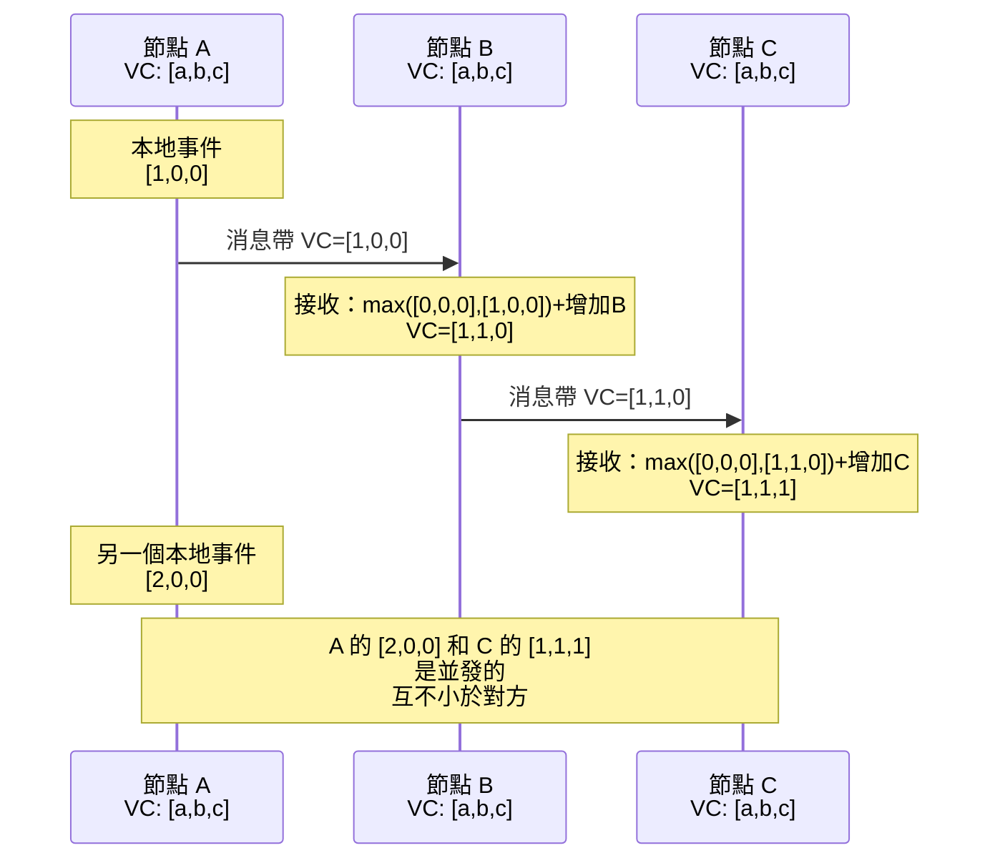

# [BEE-422] 向量時鐘與邏輯時間戳

:::info
邏輯時間戳為分散式系統提供了一種追蹤因果關係的方式——哪個事件發生在哪個之前——而無需依賴同步的物理時鐘，解決了牆鐘時間無法在獨立節點間建立事件順序這一根本問題。
:::

## Context

物理時鐘無法被信任來對分散式系統中的事件排序。即使使用 NTP 同步，在典型的互聯網條件下，跨機器的時鐘偏差也達數十到數百毫秒。在物理時間 T=100ms 由節點 A 發送的消息，可能到達時鐘略微落後而記錄 T=99ms 的節點 B。按牆鐘排序，接收到的事件似乎先於導致它的消息而發生。這不是可以通過調整配置來解決的問題；這是沒有原子鐘硬體的異步網路的基本屬性。

1978 年，Leslie Lamport 在 *Communications of the ACM* 上發表了《分散式系統中事件的時間、時鐘和排序》（DOI: 10.1145/359545.359563）——這篇論文於 2000 年獲得 PODC 影響力論文獎，並於 2007 年入選 ACM SIGOPS 名人堂。Lamport 的貢獻不是更快的時鐘，而是一個不同的抽象：**邏輯時間**。他定義了**發生先於**關係（記作 →）：事件 a 發生先於事件 b，如果（1）a 和 b 在同一進程中且 a 在 b 之前，（2）a 是消息的發送而 b 是其接收，或（3）存在某事件 c 使得 a → c 且 c → b。如果兩個事件互不先於對方，則稱它們為**並發**事件——沒有因果關係連接它們。

Lamport 的**邏輯時鐘**（現稱為 Lamport 時間戳）為每個事件分配一個整數，使得如果 a→b 則 LC(a) < LC(b)。算法：每個進程維護一個計數器，初始化為 0。在記錄本地事件之前，增加計數器。發送消息時，附加當前計數器。收到帶有時間戳 T 的消息時，將本地計數器設置為 max(local, T) + 1。這保證了因果相關的事件被正確排序。局限性：逆命題不成立。如果 LC(a) < LC(b)，你不能得出 a→b 的結論。不同節點上的兩個並發事件可以有任意的相對 Lamport 時間戳順序——時間戳無法檢測並發性。

**向量時鐘**填補了這個空白。Colin Fidge（1988）和 Friedemann Mattern（1989）獨立開發了相同的思想：每個節點不是維護單個計數器，而是維護一個計數器向量，系統中每個節點各一個。節點 i 的向量時鐘 VC 以 VC[i] 作為自己的槽位。算法：本地事件時，增加 VC[i]。發送時，包含完整向量。接收到向量 VC' 時，對所有分量取逐元素最大值，然後增加自己的槽位。現在，完整的因果關係可以恢復：VC(a) < VC(b)——意味著 a 的所有分量都 ≤ b 的對應分量，且至少有一個嚴格小於——當且僅當 a→b。如果 VC(a) 不小於 VC(b) 且 VC(b) 不小於 VC(a)，則事件是並發的。時間戳編碼了系統歷史中的所有因果信息。

Amazon 的 Dynamo 論文（DeCandia 等人，SOSP 2007）將向量時鐘帶入了主流分散式系統工程。Dynamo 使用它們來檢測衝突寫入：當對同一鍵的兩次寫入是並發的——互不具有因果先後關係——Dynamo 將兩個版本都返回給客戶端進行應用層協調，而不是靜默地丟棄其中一個。這是一個刻意的設計選擇：寧願暴露衝突，也不要通過最後寫入勝的方式丟失數據——當時鐘偏差顛倒物理時間戳順序時，最後寫入勝會靜默地丟棄因果上較早的寫入。

**混合邏輯時鐘（HLC）**由 Kulkarni 等人於 2014 年提出，結合了邏輯時間和物理時間。HLC 時間戳是一對 (l, c)，其中 l 來自物理時鐘，c 是邏輯計數器。HLC 值保持接近牆鐘時間，同時保留因果排序屬性：HLC(a) < HLC(b) 意味著 a→b。CockroachDB 使用帶有可配置 `max_offset`（默認 500 毫秒，良好 NTP 條件下建議 250 毫秒）的 HLC；如果時鐘偏差超過 `max_offset` 的 80%，節點會自動關閉以防止一致性違規。

## Design Thinking

**因果關係是目標屬性；時間只是一種機制。** 目標是回答「事件 a 是否可能影響了事件 b？」物理時間戳在分散式系統中不可靠地回答這個問題。Lamport 時間戳單向地回答它。向量時鐘精確地回答它。向量時鐘的代價是大小：向量隨節點數線性增長，在非常大的規模下變得不實際。擁有數千個節點的系統使用近似方法：版本向量（追蹤每個副本而非每個節點的因果依賴）、帶點版本向量（Riak 在 v2.0 中採用，以避免兄弟爆炸），或 HLC（通過保持時間戳接近物理時間並將偏差視為有界來分攤成本）。

**並發是事實，不是錯誤。** 當分散式系統檢測到兩個事件是並發的——互不具有因果先後關係——正確的響應取決於操作的語義。對於計數器，並發增量可以通過求和合並。對於最後寫入勝寄存器，並發寫入本質上是模棱兩可的，其中一個將被丟棄。對於購物車，來自不同設備的並發添加應該都被保留。系統設計選擇是：檢測並發性（需要向量時鐘或等效方案），然後決定如何處理它（特定於應用）。跳過檢測的系統會靜默地丟失數據；檢測但總是最後寫入勝的系統也會丟失數據，只是更明確而已。

**沒有同步時鐘，最後寫入勝是不安全的。** 基於物理時間戳的最後寫入勝衝突解決方案，只有在物理時鐘同步足夠精確使獲勝時間戳始終是因果上較晚的寫入時，才是安全的。實際上，NTP 偏差為 10-100 毫秒，兩個相差小於偏差的並發寫入將被 LWW 任意排序，因果上較早的寫入可能獲勝。這是正確性失敗，而非效能取捨。

## Visual



## Example

**Lamport 時鐘 vs. 向量時鐘——檢測並發寫入：**

```
設置：3 個節點 A、B、C。鍵 K。初始值 K=0。

節點 A 在 Lamport 時間 5 寫入 K=10。
節點 B 在 Lamport 時間 3 寫入 K=20。

Lamport 排序：B 的寫入（LC=3）看起來先於 A 的（LC=5）。
但如果這些寫入是並發的，這個順序是計數器的人工結果，
而非因果關係的證據。基於 Lamport 時間戳的 LWW 會保留 K=10
並丟棄 K=20——但這是任意的，而非正確的。

使用向量時鐘：
  A 的寫入：VC_A = [5, 0, 0]（A 有 5 個事件；發送時 B 和 C 有 0 個）
  B 的寫入：VC_B = [0, 3, 0]（B 有 3 個事件；發送時 A 和 C 有 0 個）

  VC_A < VC_B 嗎？[5,0,0] vs [0,3,0]
    分量 0：5 > 0  → VC_A 不小於 VC_B
  VC_B < VC_A 嗎？[0,3,0] vs [5,0,0]
    分量 1：3 > 0  → VC_B 不小於 VC_A

  結論：並發。系統將兩個值都返回給客戶端。
  客戶端（或數據類型的合並函數）解決衝突。
  沒有數據被靜默丟棄。
```

**混合邏輯時鐘時間戳比較：**

```
HLC 時間戳 = (物理時間_毫秒, 邏輯計數器)

節點 A：HLC = (1713000000100, 0)  — 牆鐘在紀元後 100ms
節點 B：HLC = (1713000000098, 1)  — 牆鐘 98ms（比 A 慢 2ms），計數器=1

比較：(100, 0) > (98, 1)，因為 100 > 98。
→ A 的事件被分配了較晚的 HLC，與它在 B 的事件之後發生一致
  儘管 B 的計數器更高。
→ HLC 保持在牆鐘時間的 max_offset 範圍內，因此時間戳
  仍然可以被解釋為近似的物理時間。
```

## Related BEEs

- [BEE-19001](cap-theorem-and-the-consistency-availability-tradeoff.md) -- CAP 定理：向量時鐘揭示並發性；如何處理並發寫入是 CAP 層面的設計決策（接受衝突並合並，還是拒絕一個寫入以保持一致性）
- [BEE-19002](consensus-algorithms-paxos-and-raft.md) -- 共識演算法：Raft 使用任期號作為一種邏輯時鐘——較高的任期始終覆蓋較低的任期，建立領導時代的全序
- [BEE-8005](../transactions/idempotency-and-exactly-once-semantics.md) -- 冪等性與精確一次語義：冪等鍵是一種因果令牌——發送方控制「這是同一事件」的斷言，而不是依賴時間戳比較
- [BEE-8006](../transactions/eventual-consistency-patterns.md) -- 最終一致性模式：CRDT（無衝突複製資料類型）使用類似向量時鐘的結構來合並並發更新而無需協調

## References

- [分散式系統中事件的時間、時鐘和排序 -- Leslie Lamport, CACM 1978](https://dl.acm.org/doi/10.1145/359545.359563)
- [Dynamo：亞馬遜的高可用鍵值存儲 -- DeCandia 等人, SOSP 2007](https://www.allthingsdistributed.com/files/amazon-dynamo-sosp2007.pdf)
- [分散式系統的虛擬時間和全局狀態 -- Friedemann Mattern, 1989](https://www.researchgate.net/publication/2949837_Virtual_Time_and_Global_States_of_Distributed_Systems)
- [全球分散式資料庫中的邏輯物理時鐘和一致性快照 -- Kulkarni 等人, 2014](https://cse.buffalo.edu/tech-reports/2014-04.pdf)
- [在沒有原子鐘的情況下生活 -- CockroachDB 工程博客](https://www.cockroachlabs.com/blog/living-without-atomic-clocks/)
- [分散式系統：時間 -- Mikito Takada, mixu's distributed systems book](https://book.mixu.net/distsys/time.html)
