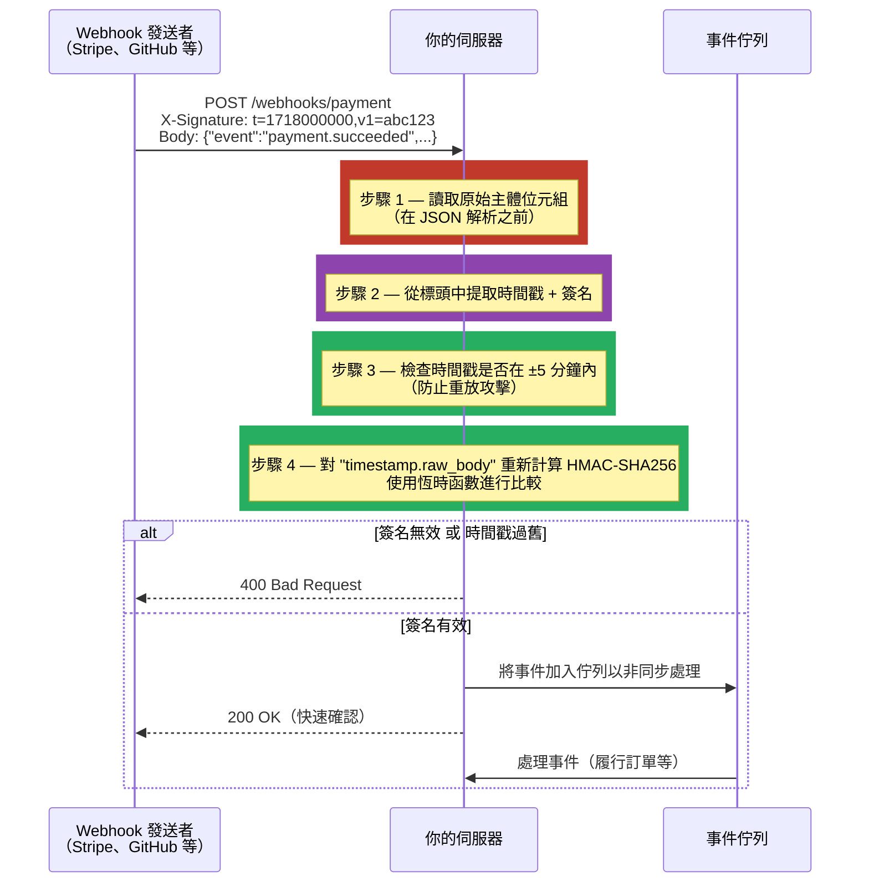

# [BEE-19055] Webhook 簽名驗證與安全性

:::info
Webhook 簽名驗證使用 HMAC-SHA256 來證明傳入的 Webhook 請求是由預期的發送者簽署的，且在傳輸過程中未被篡改——這是防範偽造請求、中間人攻擊和重放攻擊的必要防禦手段。
:::

## 背景

Webhook 是一種 HTTP 回呼：當事件發生時，第三方服務會向你的伺服器發送 `POST` 請求——付款完成、GitHub 提交被推送、訂單發貨。請求通過網際網路抵達，來源 IP 位址可能變化，攜帶著直接驅動業務邏輯的負載：履行訂單、授予存取權限、觸發部署。

若沒有驗證，網際網路上的任何人都可以向你的 Webhook 端點發送請求並觸發這些邏輯。一個發現了你付款 Webhook URL 的攻擊者，可以偽造一個從未被支付的訂單的 `PaymentSucceeded` 事件，或重放一個合法的過去事件，導致某筆訂單被履行兩次。

業界標準的防禦手段是 HMAC-SHA256 簽名驗證，定義於 RFC 2104（HMAC：訊息驗證的金鑰雜湊，Krawczyk、Bellare、Canetti，1997 年）。發送者和接收者在帶外（out-of-band）共享一個密鑰。發送 Webhook 時，發送者計算 `HMAC-SHA256(secret, request_body)` 並將其包含在請求標頭中。接收者使用相同的密鑰對原始請求主體重新計算相同的 HMAC，並比較結果。由於密鑰從不在請求中傳輸，攔截請求的攻擊者無法偽造有效的簽名。

所有主要的 Webhook 發送平台都實作了這個模式：GitHub 使用 `X-Hub-Signature-256`（原始主體的 HMAC-SHA256），Stripe 使用 `Stripe-Signature`（時間戳加上 HMAC-SHA256，允許多個簽名以支援金鑰輪換），Shopify 使用 `X-Shopify-Hmac-SHA256`（Base64 編碼的 HMAC-SHA256）。實作細節——如何處理原始主體、為何字串比較會失敗、時間戳如何防止重放攻擊——正是大多數錯誤發生的地方。

## 最佳實踐

**必須（MUST）在執行任何業務邏輯之前驗證 HMAC 簽名。** 對於生產系統，驗證步驟不是可選的。一個不進行簽名驗證的 Webhook 端點，與公開 API 端點沒有任何區別——任何呼叫者都可以觸發其邏輯。

**必須（MUST）在解析之前，對原始請求主體位元組計算 HMAC。** HMAC 是發送者所傳輸的確切位元組的函數。在雜湊之前解析 JSON 主體並重新序列化，會改變位元組表示（鍵的順序、空格、Unicode 跳脫），從而產生不同的雜湊值。大多數 Web 框架提供了在 JSON 解析器運行之前讀取原始主體的方法：在 JSON 解析器運行之前緩衝它。

**必須（MUST）在比較簽名時使用恆時比較（常數時間比較）函數。** 簡單的 `signature == expected` 比較會洩露時序資訊：當找到第一個不匹配的位元組時，它會提前退出，攻擊者可以測量這個時間，從而得知其偽造簽名中有多少前導位元組是正確的。在每種語言中都使用標準函式庫的恆時比較：Python 的 `hmac.compare_digest()`、Go 的 `subtle.ConstantTimeCompare()`、Node.js 的 `crypto.timingSafeEqual()`。這些函數無論不匹配發生在何處，都始終檢查每個位元組。

**必須（MUST）拒絕時間戳超出可接受容忍視窗（通常為 ±5 分鐘）的 Webhook，以防止重放攻擊。** 有效的 HMAC 簽名證明了發送者知道密鑰——但它不能證明請求是新鮮的。一個捕獲了合法 Webhook 的攻擊者，可以在數天後重放它，它仍然可以通過簽名驗證。在簽名的負載中包含時間戳（如 Stripe 所做：簽名涵蓋 `timestamp.body`），並拒絕 `|now - timestamp| > 300 秒` 的請求，可以縮小這個攻擊視窗。

**必須（MUST）將 Webhook 密鑰作為應用程式機密儲存，而非存放在原始碼或版本控制中。** Webhook 密鑰是一個對稱金鑰；洩露意味著攻擊者可以偽造任何負載。將其存儲在與其他機密相同的系統中（BEE-2003）：環境變數、機密管理器（AWS Secrets Manager、HashiCorp Vault）或加密的配置。

**應該（SHOULD）支援 Webhook 密鑰輪換而不中斷服務。** 允許多個有效簽名的平台（Stripe 在輪換視窗期間同時發送舊簽名和新簽名）可實現零停機輪換：接受任一簽名，更新密鑰，然後停止接受舊密鑰。對於只有單一密鑰的平台，實作一個短暫的過渡視窗，在此期間伺服器同時接受舊密鑰和新密鑰。

**應該（SHOULD）記錄簽名驗證失敗的請求中繼資料（時間戳、IP、端點），並在失敗率升高時發出告警。** 一連串的驗證失敗可能表示攻擊者正在探測端點或發送方配置錯誤。驗證失敗的請求絕不應靜默地返回 `200 OK`——返回 `400 Bad Request` 或 `401 Unauthorized` 並記錄事件。

**可以（MAY）實作 IP 白名單作為縱深防禦。** 部分平台發布已知的發送者 IP 範圍（Stripe、GitHub 維護公開列表）。將這些 IP 列入白名單可增加第二層保護，但它不能取代簽名驗證——IP 範圍會變更，且 IP 欺騙是可行的。將白名單視為縱深防禦，而非主要控制手段。

**可以（MAY）立即返回 `200 OK` 並非同步處理事件。** Webhook 發送者通常有短暫的交付超時（5–30 秒），並在非 2xx 回應時重試。如果處理速度較慢，立即返回 `200 OK`（表示已收到），將事件加入佇列，並非同步處理它。這將交付可靠性與處理延遲解耦。

## 視覺化



## 範例

**Python（FastAPI）——原始主體存取 + HMAC 驗證 + 時間戳檢查：**

```python
import hashlib
import hmac
import time
from fastapi import FastAPI, Request, HTTPException, Header
from typing import Optional

app = FastAPI()
WEBHOOK_SECRET = b"whsec_your_secret_here"  # 生產環境中從機密管理器載入
TIMESTAMP_TOLERANCE_SECONDS = 300  # 5 分鐘

def verify_stripe_signature(
    raw_body: bytes,
    signature_header: str,
    secret: bytes,
    tolerance: int = TIMESTAMP_TOLERANCE_SECONDS,
) -> None:
    """驗證 Stripe-Signature 標頭：t=<timestamp>,v1=<hex-hmac>"""
    # 解析標頭："t=1718000000,v1=abc...,v1=def..."（輪換時有多個 v1=）
    parts = {k: v for k, v in (item.split("=", 1) for item in signature_header.split(","))}
    timestamp = parts.get("t")
    if not timestamp:
        raise HTTPException(status_code=400, detail="簽名中缺少時間戳")

    # 重放攻擊防護：拒絕過期的事件
    age = abs(int(time.time()) - int(timestamp))
    if age > tolerance:
        raise HTTPException(status_code=400, detail=f"Webhook 時間戳過舊：{age}秒")

    # Stripe 對 "timestamp.raw_body" 進行簽名
    signed_payload = f"{timestamp}.".encode() + raw_body
    expected = hmac.new(secret, signed_payload, hashlib.sha256).hexdigest()

    # 收集所有 v1= 簽名（金鑰輪換期間可能有多個）
    received_sigs = [v for k, v in parts.items() if k == "v1"]

    # 對每個簽名進行恆時比較——任一匹配則返回 True
    if not any(hmac.compare_digest(expected, sig) for sig in received_sigs):
        raise HTTPException(status_code=400, detail="簽名驗證失敗")

@app.post("/webhooks/stripe")
async def stripe_webhook(
    request: Request,
    stripe_signature: Optional[str] = Header(None, alias="stripe-signature"),
) -> dict:
    if not stripe_signature:
        raise HTTPException(status_code=400, detail="缺少 Stripe-Signature 標頭")

    # 關鍵：在任何 JSON 解析之前讀取原始位元組
    raw_body = await request.body()

    verify_stripe_signature(raw_body, stripe_signature, WEBHOOK_SECRET)

    # 驗證通過後才能安全解析
    event = await request.json()
    # 加入佇列進行非同步處理；立即返回 200
    await enqueue_event(event)
    return {"received": True}
```

**Go——GitHub Webhook 驗證（`X-Hub-Signature-256`）：**

```go
package webhooks

import (
    "crypto/hmac"
    "crypto/sha256"
    "crypto/subtle"
    "encoding/hex"
    "fmt"
    "io"
    "net/http"
    "strings"
)

var webhookSecret = []byte("your_github_secret")

func VerifyGitHubSignature(r *http.Request) ([]byte, error) {
    // 讀取原始主體——必須在任何 JSON 解碼之前進行
    body, err := io.ReadAll(r.Body)
    if err != nil {
        return nil, fmt.Errorf("讀取主體失敗：%w", err)
    }

    sigHeader := r.Header.Get("X-Hub-Signature-256")
    if sigHeader == "" {
        return nil, fmt.Errorf("缺少 X-Hub-Signature-256 標頭")
    }
    // 標頭格式："sha256=<hex>"
    if !strings.HasPrefix(sigHeader, "sha256=") {
        return nil, fmt.Errorf("非預期的簽名格式")
    }
    received, err := hex.DecodeString(strings.TrimPrefix(sigHeader, "sha256="))
    if err != nil {
        return nil, fmt.Errorf("解碼簽名失敗：%w", err)
    }

    // 計算預期的 HMAC
    mac := hmac.New(sha256.New, webhookSecret)
    mac.Write(body)
    expected := mac.Sum(nil)

    // 恆時比較——防止時序攻擊
    if subtle.ConstantTimeCompare(expected, received) != 1 {
        return nil, fmt.Errorf("簽名不符")
    }

    return body, nil // 返回已驗證的原始主體供呼叫者解析
}

func HandleGitHubWebhook(w http.ResponseWriter, r *http.Request) {
    body, err := VerifyGitHubSignature(r)
    if err != nil {
        http.Error(w, "Unauthorized", http.StatusUnauthorized)
        return
    }
    // 僅在驗證後處理主體（JSON 解碼等）
    w.WriteHeader(http.StatusOK)
    _ = body
}
```

**密鑰輪換——在過渡期間同時接受新舊密鑰：**

```python
def verify_any_secret(
    raw_body: bytes,
    timestamp: str,
    received_sig: str,
    secrets: list[bytes],  # [new_secret, old_secret] — 優先嘗試新密鑰
) -> bool:
    signed_payload = f"{timestamp}.".encode() + raw_body
    for secret in secrets:
        expected = hmac.new(secret, signed_payload, hashlib.sha256).hexdigest()
        if hmac.compare_digest(expected, received_sig):
            return True
    return False

# 輪換期間：兩個密鑰同時有效
ACTIVE_SECRETS = [NEW_SECRET, OLD_SECRET]
```

## 實作說明

**原始主體緩衝**：最常見的實作錯誤是在框架已經消費並解析請求主體後才驗證 HMAC。在 Express（Node.js）中，對 Webhook 路由使用 `express.raw({ type: 'application/json' })`，而非 `express.json()`。在 FastAPI/Starlette 中，`await request.body()` 讀取並快取原始位元組；後續的 `await request.json()` 從快取解析。在 Spring Boot 中，使用 `@RequestBody byte[] body` 或配置 `HttpServletRequest.getInputStream()` 使其可重複讀取。

**Node.js**：標準函式庫提供 `crypto.timingSafeEqual(a, b)` 用於恆時比較；兩個緩衝區的長度必須相同（如需要則填充）。Stripe 的官方 Node.js SDK（`stripe.webhooks.constructEvent`）正確地處理了原始主體、簽名解析、時間戳容忍和恆時比較——請使用它，而非重新實作。

**Django**：新增一個自訂中介軟體或視圖裝飾器，在視圖的 JSON 解析運行之前讀取 `request.body`（原始位元組屬性）。`body` 屬性只在 Django 的 JSON 中介軟體讀取它之前可用。

**重放容忍度與資料新鮮度**：5 分鐘是 Stripe 的建議，也是合理的預設值。對於高安全性操作，可以調短（1–2 分鐘）；對於時鐘不穩定地區的 Webhook 發送者，可以調長（15 分鐘）。取捨是：容忍度越短，重放視窗越小，但因時鐘偏差導致的誤拒率越高。

## 相關 BEE

- [BEE-4007](../api-design/webhooks-and-callback-patterns.md) -- Webhook 與回呼模式：涵蓋 Webhook 架構設計（重試策略、交付排序、扇出）；本文涵蓋每個 Webhook 接收者都必須實作的安全層
- [BEE-2003](../security-fundamentals/secrets-management.md) -- 機密管理：共享的 HMAC 密鑰必須使用與其他對稱金鑰相同的實踐來儲存和輪換——環境變數、機密管理器、絕不放入原始碼
- [BEE-2005](../security-fundamentals/cryptographic-basics-for-engineers.md) -- 工程師的密碼學基礎：HMAC-SHA256 是一個金鑰雜湊函數；理解雜湊特性（抗碰撞性、單向性）可以解釋為何簽名驗證能提供其所聲稱的保證

## 參考資料

- [Validating Webhook Deliveries — GitHub 文件](https://docs.github.com/en/webhooks/using-webhooks/validating-webhook-deliveries)
- [Webhook Signatures — Stripe 文件](https://docs.stripe.com/webhooks/signature)
- [RFC 2104: HMAC: Keyed-Hashing for Message Authentication — IETF](https://datatracker.ietf.org/doc/html/rfc2104)
- [Webhooks — Shopify 開發者文件](https://shopify.dev/docs/apps/build/webhooks/subscribe/https)
