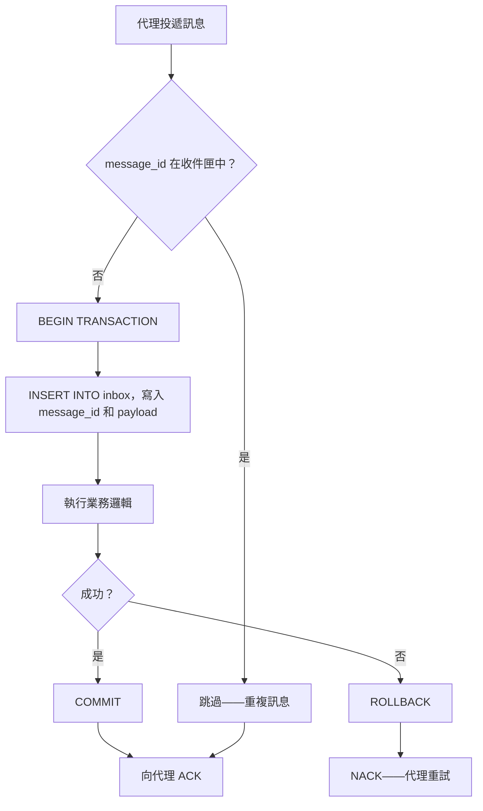

# [BEE-10007] 冪等訊息處理

:::info
設計能容忍重複投遞的消費者。
:::

## 背景

任何提供「至少一次投遞（at-least-once delivery）」保證的訊息代理，在正常運作條件下都會將同一則訊息投遞超過一次。網路分區、消費者在處理中途崩潰、重新平衡（rebalance）、代理端重試，這些情況都會產生重複訊息。假設恰好一次（exactly-once）投遞的消費者，並不是具備彈性的消費者——而是一個在失效之前都能正常運作的消費者。

本 BEE 說明如何設計訊息消費者，使得接收到同一則訊息兩次時，其可觀察的結果與只接收一次相同。

**相關 BEE：**
- [BEE-4003](../api-design/api-idempotency.md) — API 冪等性（相同原則應用於 HTTP 層）
- [BEE-8005](../transactions/idempotency-and-exactly-once-semantics.md) — 恰好一次語意
- [BEE-10003](delivery-guarantees.md) — 投遞保證
- [BEE-10005](dead-letter-queues-and-poison-messages.md) — 死信佇列

**參考資料：**
- [EIP: Idempotent Consumer — microservices.io](https://microservices.io/patterns/communication-style/idempotent-consumer.html)
- [Outbox, Inbox patterns and delivery guarantees explained — event-driven.io](https://event-driven.io/en/outbox_inbox_patterns_and_delivery_guarantees_explained/)
- [Implementing the Inbox Pattern for Reliable Message Consumption — milanjovanovic.tech](https://www.milanjovanovic.tech/blog/implementing-the-inbox-pattern-for-reliable-message-consumption)

## 原則

**無論訊息被處理幾次，消費者都必須產生相同的結果。**

當代理保證至少一次投遞時，這不是選項——而是消費者與其所參與的分散式系統之間的契約。

## 為什麼重複訊息無法避免

考慮標準的消費者生命週期：

1. 代理將訊息投遞給消費者。
2. 消費者處理訊息。
3. 消費者回傳確認（ACK）給代理。

如果消費者在第 2 步和第 3 步之間崩潰，代理會重新投遞。業務邏輯已執行，但代理毫不知情——從其角度來看，訊息從未被確認。消費者將再次處理它。

這不是缺陷。至少一次投遞是一個刻意的取捨，優先考慮資料耐久性而非消除重複。恰好一次投遞要麼是個神話，要麼是非常昂貴的保證，只是將重複消除的複雜性轉移到別處（參見 [BEE-8005](../transactions/idempotency-and-exactly-once-semantics.md)）。

消費者承擔安全處理重複訊息的責任。

## 冪等消費者模式

[冪等消費者模式（EIP）](https://www.enterpriseintegrationpatterns.com/)描述如何讓接收者可以安全地以相同訊息多次呼叫。有兩種主要方式：

### 1. 天然冪等性

某些操作本質上就是冪等的。在領域允許的情況下優先採用：

| 操作 | 冪等？ | 說明 |
|---|---|---|
| `SET stock_level = 42` | 是 | 套用兩次產生相同結果 |
| `stock_level += 5` | 否 | 每次套用都再加 5 |
| `INSERT ... ON CONFLICT DO NOTHING` | 是 | 第二次插入被靜默忽略 |
| `INSERT ...`（無衝突處理） | 否 | 第二次插入失敗或產生重複資料 |
| `UPDATE ... WHERE id = ?` | 是 | 相同更新套用兩次仍是相同狀態 |
| `DELETE ... WHERE id = ?` | 是 | 刪除已刪除的資料列是無操作 |

將訊息設計為攜帶**最終狀態**，而非**增量**。不要用「在購物車中加入 5 件」，而是「將購物車商品 X 的數量設為 8」。不要用「收費 $10」，而是「為訂單 O-456 記錄付款 P-123，金額 $10」。

### 2. 重複消除表

當天然冪等性無法實現時，明確追蹤已處理的訊息 ID。

```sql
CREATE TABLE processed_messages (
    message_id   TEXT        NOT NULL,
    processed_at TIMESTAMPTZ NOT NULL DEFAULT now(),
    result       JSONB,
    PRIMARY KEY (message_id)
);

-- 可選的 TTL 清理（定期執行或透過 pg_cron）
DELETE FROM processed_messages
WHERE processed_at < now() - INTERVAL '7 days';
```

每次訊息到達時：

```sql
-- 嘗試將此訊息記錄為已處理
INSERT INTO processed_messages (message_id, result)
VALUES ($1, $2)
ON CONFLICT (message_id) DO NOTHING;

-- 檢查插入是否為無操作（重複）
-- 若影響列數 = 0，這是重複訊息——跳過業務邏輯
```

此方式直觀，但存在競爭條件：同一訊息的兩次並發投遞在任一提交前都能通過 `INSERT` 檢查。資料庫約束是正確的防護手段——對 `message_id` 使用 `PRIMARY KEY` 或 `UNIQUE` 約束，而非應用層的先查再寫。

## 收件匣模式（Inbox Pattern）

收件匣模式將重複消除延伸至提供交易安全性：訊息與業務邏輯在**同一資料庫交易**中一起存入本地收件匣表。這消除了「已處理但尚未 ACK」的時間窗口——若交易回滾，收件匣記錄也一起回滾，代理會重新投遞至乾淨的狀態。



### 收件匣表結構

```sql
CREATE TABLE inbox_messages (
    message_id    TEXT        NOT NULL PRIMARY KEY,
    message_type  TEXT        NOT NULL,
    payload       JSONB       NOT NULL,
    received_at   TIMESTAMPTZ NOT NULL DEFAULT now(),
    processed_at  TIMESTAMPTZ,
    error         TEXT
);
```

### 處理流程（SQL）

```sql
BEGIN;

-- 步驟 1：嘗試插入收件匣（唯一約束防止競爭條件）
INSERT INTO inbox_messages (message_id, message_type, payload)
VALUES ($message_id, $type, $payload)
ON CONFLICT (message_id) DO NOTHING;

-- 步驟 2：檢查是否為新訊息
-- （影響列數 = 0 表示已在收件匣中）
-- 若為重複：ROLLBACK 或直接 COMMIT 不執行業務邏輯

-- 步驟 3：在同一交易中執行業務邏輯
UPDATE inventory
SET reserved = reserved + $quantity
WHERE product_id = $product_id
  AND order_id IS NULL;  -- 簡化示例；實際檢查會更完整

-- 步驟 4：標記為已處理
UPDATE inbox_messages
SET processed_at = now()
WHERE message_id = $message_id;

COMMIT;
-- 只有在成功提交後才向代理 ACK
```

關鍵特性：收件匣插入與業務邏輯原子性地提交。兩者同時發生，或兩者都不發生。

## 實際範例：庫存預留

**訊息：**「為訂單 Y 預留 5 件商品 X」——以 `message_id: msg-abc-123` 投遞。

**第一次投遞：**

```sql
BEGIN;
INSERT INTO inbox_messages (message_id, message_type, payload)
VALUES ('msg-abc-123', 'inventory.reserve', '{"product_id":"X","qty":5,"order_id":"Y"}');
-- 插入 1 列

INSERT INTO inventory_reservations (order_id, product_id, quantity)
VALUES ('Y', 'X', 5);
-- 預留建立

UPDATE inbox_messages SET processed_at = now() WHERE message_id = 'msg-abc-123';
COMMIT;
-- ACK
```

**第二次投遞（重複）：**

```sql
BEGIN;
INSERT INTO inbox_messages (message_id, message_type, payload)
VALUES ('msg-abc-123', 'inventory.reserve', '{"product_id":"X","qty":5,"order_id":"Y"}');
-- 插入 0 列（ON CONFLICT DO NOTHING）

-- 偵測到 0 列 → 跳過業務邏輯
ROLLBACK; -- 或 COMMIT（無變更）
-- ACK（安全——操作已完成）
```

第二次投遞在不重新執行預留的情況下乾淨地確認。

## 選擇重複消除鍵

重複消除鍵是使訊息可唯一識別的依據。兩種選項：

**訊息 ID（由代理指派）：** 每次訊息投遞都有代理層級的 ID（例如 Kafka 的 offset + partition、SQS 訊息 ID、RabbitMQ 投遞標籤）。當同一邏輯事件無論來源如何都不應被處理兩次時使用此方式。

**業務鍵：** 領域層級的識別碼，例如 `order_id + event_type`。當你關注的是領域層級的冪等性時使用——例如「每個訂單只能有一次預留」，無論有多少不同的訊息觸發了它。

在大多數情況下，優先使用訊息 ID 作為收件匣/去重表的鍵，並在業務層面單獨強制約束（例如在 reservations 表上設置 `UNIQUE(order_id)`）。

## 重複消除記錄的 TTL

重複消除記錄不需要永久保留。適當的 TTL 取決於：

- **最大重新投遞窗口：** 代理在未確認的情況下能持有訊息多久才重新投遞？加上安全邊際（例如 2 倍）。
- **可見性超時 / ACK 期限：** 通常為分鐘至小時級別。
- **運營容忍度：** TTL 越長 = 儲存越多，假陰性越少。

7 天的 TTL 對大多數系統來說是合理的預設值。使用排程清理任務或資料庫原生 TTL 來強制執行（例如 Redis 的 `EXPIRE`、DynamoDB TTL 或 `pg_cron` 任務）。

```sql
-- 清理任務（每日透過 pg_cron 或外部排程器執行）
DELETE FROM inbox_messages
WHERE processed_at IS NOT NULL
  AND processed_at < now() - INTERVAL '7 days';
```

不要省略 TTL。沒有清理的收件匣表會無限增長，最終降低查詢效能或耗盡儲存空間。

## 並發重複處理

應用層的「先查後寫」在並發投遞下並不安全：

```
執行緒 A：SELECT count(*) FROM inbox WHERE message_id = 'X' → 0（未找到）
執行緒 B：SELECT count(*) FROM inbox WHERE message_id = 'X' → 0（未找到）
執行緒 A：INSERT INTO inbox ...  ← 成功
執行緒 B：INSERT INTO inbox ...  ← 也成功（競爭條件！）
```

**使用資料庫約束作為並發防護。** `message_id` 上的 `PRIMARY KEY` 或 `UNIQUE` 約束意味著只有一個插入能獲勝——另一個將收到約束違反。將該例外處理為重複訊息，而非錯誤。

```python
try:
    cursor.execute(
        "INSERT INTO inbox_messages (message_id, ...) VALUES (%s, ...)",
        (message_id, ...)
    )
    # 繼續執行業務邏輯
except UniqueViolation:
    # 這是重複訊息——跳過並 ACK
    pass
```

## 常見錯誤

**1. 假設訊息只到達一次。**
沒有標準訊息代理在沒有重大取捨的情況下能保證這一點。從一開始就將消費者設計為預期重複訊息。

**2. 先查後寫而不保證原子性。**
讀取「此訊息是否存在？」然後在兩個獨立步驟中根據答案採取行動，這是一個競爭條件。收件匣插入和業務邏輯必須在同一交易中，或者重複消除插入必須使用在衝突時失敗的約束。

**3. 使用增量操作而沒有冪等鍵。**
`UPDATE accounts SET balance = balance + 100` 套用兩次會記入 $200。始終將增量操作與冪等性檢查配對，或將其重新設計為與唯一事件 ID 綁定的 set 操作。

**4. 重複消除表沒有 TTL。**
只增長而不清理的表最終會成為效能問題。從一開始就實施清理策略。

**5. 冪等性只在 API 層實施。**
事件驅動架構中的消費者不受 API 層冪等性鍵保護（參見 [BEE-4003](../api-design/api-idempotency.md)）。每個消費者必須獨立實施自己的重複消除。冪等的 HTTP 處理器並不能使下游 Kafka 消費者變得冪等。
