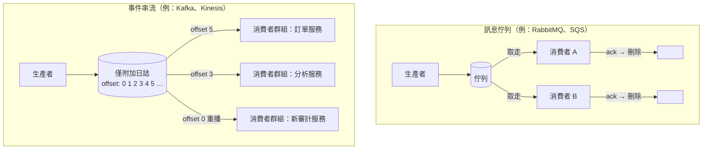

# [BEE-220] 訊息佇列 vs 事件串流

:::info
訊息佇列（RabbitMQ、SQS）與事件串流（Kafka、Kinesis）在語意、傳遞方式與使用情境上的根本差異。
:::

## 背景

分散式系統透過非同步訊息傳遞，將生產者與消費者解耦。目前存在兩種截然不同的模型：**訊息佇列**與**事件串流**。表面上兩者很相似——都是從一個程序將資料傳送到另一個程序——但在語意、資料保留，以及消費者與資料互動的方式上有本質差異。

選錯模型會帶來架構上的痛苦：修完 bug 之後無法重播佇列中的訊息；在 Kafka 上跑一個簡單的工作佇列則增加了毫無必要的複雜度。這個選擇必須是深思熟慮的結果。

**參考資料：**
- [When to use RabbitMQ or Apache Kafka — CloudAMQP](https://www.cloudamqp.com/blog/when-to-use-rabbitmq-or-apache-kafka.html)
- [Martin Kleppmann — Turning the database inside-out with Apache Samza](https://martin.kleppmann.com/2015/03/04/turning-the-database-inside-out.html)
- [Kafka Consumer Design: Consumers, Consumer Groups, and Offsets — Confluent](https://docs.confluent.io/kafka/design/consumer-design.html)

## 原則

**目標是任務分配時，選擇訊息佇列。目標是保留可重播的事件紀錄時，選擇事件串流。**

## 核心語意

### 訊息佇列

訊息佇列是一種點對點、消費即刪除（consume-and-delete）的通道。

- 生產者將訊息寫入佇列。
- 由某一個消費者取走（多個消費者競爭分攤負載）。
- 消費者確認（ack）後，broker 刪除該訊息。
- 沒有位置或偏移量（offset）的概念——訊息存在至被處理，然後消失。

**核心保證：** 每條訊息恰好被一個消費者處理一次（在正確使用確認機制的前提下）。

### 事件串流

事件串流是一種僅附加（append-only）的有序日誌。

- 生產者將事件附加到日誌（Kafka 術語中稱為 partition）。
- 每個消費者群組（consumer group）維護自己的**偏移量（offset）**——即已讀取到的位置。
- 多個消費者群組獨立讀取同一份日誌，互不干擾。
- 訊息根據可設定的保留策略**持續保存**，不因消費而刪除。
- 消費者可從任意過去的偏移量**重播（replay）**日誌。

**核心保證：** 每個消費者群組都會按照順序看到所有事件（在同一 partition 內），且可以隨時重讀歷史資料。

## 並排比較圖



在佇列模型中，消費者確認訊息後，訊息即消失——其他消費者無法讀取，也無法重播。在串流模型中，日誌是共用的；每個消費者群組獨立推進自己的游標，資料持續保留，供新群組或重播使用。

## 訂單處理範例

### 以訊息佇列處理

```
[訂單服務] ──發布──> [queue: orders]
                          │
          ┌───────────────┴───────────────┐
          │                               │
     [Worker 1]                      [Worker 2]
   取走訂單 #42                    取走訂單 #43
   處理付款                        處理付款
   送出 ack ──────────────────────────────>
   訊息刪除                        訊息刪除
```

訂單 #42 由 Worker 1 處理。ack 之後，broker 中不再有此訊息。若付款服務有 bug 需要重新處理，**已不可能**——訊息已消失。

### 以事件串流處理

```
[訂單服務] ──附加──> [topic: orders  | offset: 0  1  2  3  4  5 ]
                                              │  │  │  │  │  │
                      訂單服務讀取到 ─────────────────────────5
                      分析服務讀取到 ────────────────────3
                      審計服務讀取到 ──0  （從頭重播）
```

偏移量 4 的同一個事件被三個群組獨立消費。每個群組追蹤自己的位置。當分析管線修好 bug 部署後，將其偏移量重設為 0，從頭重播整段歷史，完全不影響訂單服務。

**為何串流支援重播：** 日誌是不可變的，依保留策略（例如 7 天或無限期）保存。消費動作不會刪除資料。佇列是消費即刪除：消費本身就是刪除的觸發器。

## 使用時機

| 判斷依據 | 訊息佇列 | 事件串流 |
|---|---|---|
| 主要用途 | 任務分配、工作佇列、命令處理 | 事件溯源、EDA、審計記錄、分析管線 |
| 訊息存活期 | 直到被消費（並確認） | 可設定的保留策略（時間或容量） |
| 多消費者 | 競爭取走同一條訊息（負載分攤） | 每個消費者群組獨立讀取 |
| 重播 | 不支援 | 支援——重設偏移量到任意過去位置 |
| 排序 | 佇列層級的 FIFO | Partition 內保證順序；跨 partition 無保證 |
| 消費者複雜度 | 低（broker 處理路由） | 較高（消費者需管理偏移量） |
| 背壓處理 | 自然——佇列深度增加 | 消費者延遲（consumer lag）需監控 |
| 典型系統 | RabbitMQ、Amazon SQS、ActiveMQ | Apache Kafka、Amazon Kinesis、Redpanda |

### 適合使用佇列的情境

- 每個任務只需一個 worker 處理。
- 任務是獨立命令：發送 email、縮圖處理、信用卡扣款。
- 不需要重播；在乎吞吐量與簡潔性。
- 消費者池需要水平擴展以消化積壓。

### 適合使用串流的情境

- 多個獨立系統需要對同一事件做出反應。
- 需要審計日誌、事件溯源，或從歷史重建狀態的能力。
- 需要讓新消費者讀取歷史資料。
- 正在構建以自己節奏運行的分析或資料管線。
- 修 bug 或推出新功能後，可能需要重播事件。

## 保留策略與排序

### 保留策略

訊息佇列在消費者取走並確認後即保留結束。佇列是緩衝，而非紀錄。

事件串流依設定的策略保留訊息：
- 時間策略：保留 7 天的事件。
- 容量策略：每個 partition 保留最後 100 GB。
- 壓縮策略：每個 key 只保留最新值（log compaction）。

此保留模型使串流適合作為系統記錄（system of record），而不僅僅是傳輸層。

### 排序

兩種模型都提供排序，但範圍不同。

**佇列：** 訊息以 FIFO 順序從佇列送出。有競爭消費者時，兩個 worker 可能同時處理相鄰訊息，跨 worker 的順序無法保證。

**串流：** 在單一 partition 內，順序嚴格保證。跨 partition 無全域排序保證。若某個邏輯群組的事件需要有序（例如同一訂單 ID 的所有事件），必須透過一致的 partition key 將它們路由到同一 partition。

## 消費者群組與 Partition

Kafka 的消費者群組模型常被誤解，值得深入說明。

**消費者群組（consumer group）** 是一個邏輯訂閱者。同一群組內的所有消費者分攤工作：每個 partition 在任一時刻只被群組中的一個消費者分配。兩個群組讀取同一 topic 時互不干擾；各有獨立的偏移量。

```
Topic: orders（3 個 partitions）

消費者群組：payment-service
  Consumer 1 → Partition 0
  Consumer 2 → Partition 1
  Consumer 3 → Partition 2

消費者群組：analytics-service
  Consumer A → Partition 0, 1, 2（單一消費者讀取全部）
```

實際意涵：群組內的擴展受限於 partition 數量。一個群組中的活躍消費者數不能超過 partition 數。規劃 partition 數量時，需考量未來的吞吐量需求。

## 常見錯誤

### 1. 需要重播時卻使用佇列

如果下游服務可能需要重新處理事件——用於補填資料（backfill）、修 bug、或新功能追補——佇列無法滿足需求。訊息一旦被消費並確認，即永久消失。你只能選擇從來源重新發送事件，或另外維護一份事件資料庫。

### 2. 簡單任務分配卻使用串流

Kafka 帶來額外的維運負擔：partition 規劃、偏移量管理、consumer lag 監控，以及 broker 叢集管理。對於簡單的後台工作佇列（發送 email、處理上傳），專用的佇列系統更簡單、更便宜、更易於維運。不要因為 Kafka 聽起來厲害就使用它。

### 3. 假設跨 Partition 有全域排序

不同 partition 中的事件，只保證在**同一 partition 內**的順序。跨 partition 沒有排序保證。若業務邏輯依賴嚴格全域順序（例如「每個使用者所有事件的嚴格順序」），必須使用單一 partition（限制吞吐量），或設計消費者能容忍跨 partition 的亂序。

### 4. 未監控消費者延遲（Consumer Lag）

在串流中，慢速消費者不會阻塞生產者或其他消費者。相反地，消費者的偏移量落後，**consumer lag** 不斷增長。未監控的 consumer lag 意味著你的下游服務正在靜默地處理過時資料。將 lag 作為一級指標追蹤；超過閾值時發出告警。

### 5. 未使用確認就期望保證傳遞

佇列和串流都支援傳遞保證，但都需要明確的確認行為：
- 佇列：消費者在確認前崩潰，broker 重新投遞訊息。
- 串流：消費者負責提交偏移量。若在處理完成前提交偏移量，消費者崩潰後重啟，該事件會被跳過。

明確設定確認與偏移量提交策略。至少一次傳遞（at-least-once，失敗時重處理）通常比恰好一次（exactly-once）更容易安全地實作。

## 相關 BEE

- [BEE-10002](publish-subscribe-pattern.md) — Pub/Sub 模式與扇出（fan-out）
- [BEE-10003](delivery-guarantees.md) — 傳遞保證：至多一次、至少一次、恰好一次
- [BEE-10004](event-sourcing.md) — 事件溯源：從事件日誌重建狀態
- [BEE-7004](../data-modeling/encoding-and-serialization-formats.md) — 訊息序列化格式（Avro、Protobuf、JSON）
