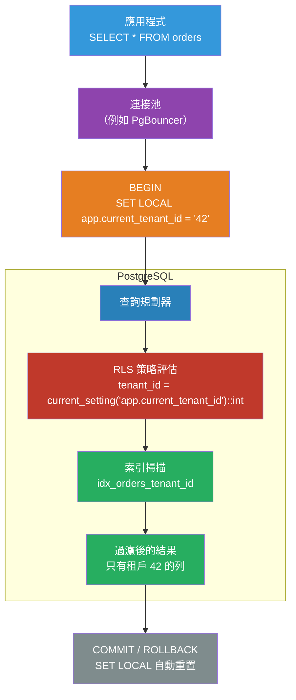

# [BEE-476] 資料庫列層級安全性（Row-Level Security）

:::info
列層級安全性（RLS）透過為資料表上的每次查詢附加謂詞條件，在資料庫層強制執行資料隔離——確保即使應用程式程式碼中存在租戶 ID 的錯誤，資料庫本身也能防止跨租戶資料洩漏。
:::

## 背景

在資料庫資料表中跨租戶共享資料的多租戶應用程式（共享 Schema 隔離模型，BEE-401），面臨一個持續存在的風險：忘記包含 `WHERE tenant_id = ?` 條件的應用程式程式碼，將靜默地返回或覆寫另一個租戶的資料。這類錯誤尤其危險，因為它能通過單元測試（通常以單一租戶運行）、在日誌中不可見，並可能導致法規合規失敗。

傳統的防禦手段是程式碼審查和查詢層測試，但在規模擴大後都不能完全可靠。PostgreSQL 在資料庫層面解決了這個問題，在 9.5 版本（2016 年）引入了列層級安全性（RLS）。RLS 為資料表附加策略表達式；資料庫將這些表達式作為額外的 `WHERE` 條件應用於每次查詢——讀取、寫入、更新和刪除——無論應用程式是否包含了這些條件。一個忘記租戶過濾器的應用程式執行 `SELECT * FROM orders`，只會返回當前租戶被允許查看的列。

設計上類似於基於視圖的存取控制（限制角色可見的資料），但更具可組合性：策略可按操作範圍（`SELECT`、`INSERT`、`UPDATE`、`DELETE`）、組合（寬鬆策略新增到結果；限制策略從結果中減去），並使用任何 SQL 謂詞（包括子查詢和函式呼叫）來表達。

RLS 不能取代應用層過濾——當應用程式也包含租戶條件時，查詢規劃受益，因為最佳化器可以在 RLS 添加其謂詞之前使用索引。RLS 是一個**安全防護網**：即使在應用程式程式碼出錯時，也能強制執行隔離的縱深防禦。

## 設計思考

### 向策略傳遞租戶上下文

RLS 策略在每次查詢時被評估。要按租戶隔離，策略必須知道當前租戶的身份。有三種方法：

**每個租戶一個資料庫角色**：每個租戶以名為 `tenant_<id>` 的角色連接。策略將 `current_user` 與允許的角色進行比較。在規模上操作不實際——數千個角色，連接池複雜。

**透過 `current_setting()` 的 JWT / 會話屬性**（推薦）：應用程式在每個交易開始時設定一個會話本地變數：
```sql
SET LOCAL app.current_tenant_id = '42';
```
策略讀取它：
```sql
USING (tenant_id = current_setting('app.current_tenant_id')::bigint)
```
`LOCAL` 範圍確保變數在交易結束時重置——對連接池至關重要。

**列層級屬性**：策略也可以使用列中的任何欄位（例如 `USING (owner_id = current_user_id_from_jwt())`）。這可行，但需要函式從應用程式層來源安全地擷取使用者身份。

### 寬鬆策略與限制策略

PostgreSQL 支援兩種策略類型：

- **PERMISSIVE**（預設）：策略之間以 OR 連接。如果任何寬鬆策略通過，列就是可見的。沒有策略且啟用了 RLS 的資料表返回零列。
- **RESTRICTIVE**：策略之間以 AND 連接。所有限制策略必須通過。適合在現有寬鬆租戶隔離之上添加強制審計或合規過濾器。

常見模式：一個用於租戶隔離的寬鬆策略，一個隱藏軟刪除列的限制策略（`USING (deleted_at IS NULL)`）。

### 服務角色與應用程式角色

對於必須繞過租戶過濾的操作（管理查詢、後台任務、資料遷移），使用帶有 `BYPASSRLS` 屬性的專用資料庫角色：

```sql
CREATE ROLE app_service BYPASSRLS;  -- 用於管理操作
CREATE ROLE app_user;               -- 用於租戶範圍的應用程式查詢
-- app_user 始終受 RLS 限制；app_service 繞過它
```

這種分離比臨時停用 RLS 更安全：`BYPASSRLS` 是角色屬性，而非查詢時的標誌，因此不會被意外地保持開啟。

## 最佳實踐

**必須（MUST）在每個儲存租戶範圍資料的資料表上啟用 RLS。** 在沒有策略的情況下啟用 RLS 的資料表，對非超級使用者返回零列——這是一個明顯的失敗，不像 RLS 旨在防止的靜默跨租戶洩漏。在同一次遷移中啟用 RLS 並添加第一個策略。

**必須（MUST）在應用程式角色擁有的資料表上使用 `FORCE ROW LEVEL SECURITY`。** 預設情況下，資料表所有者繞過 RLS。如果你的應用程式以擁有資料表的同一角色連接（在較小系統中很常見），沒有 `FORCE ROW LEVEL SECURITY`，RLS 無法發揮作用。

**必須（MUST）在交易中設定租戶上下文變數時使用 `SET LOCAL`（而非 `SET`）。** `SET LOCAL` 在交易結束時恢復。`SET` 在會話期間持續存在。在連接池中，一個會話會在多個請求之間重複使用；如果連接池不重置，請求 A 的 `SET` 將洩漏到請求 B 中。

**必須（MUST）在租戶隔離欄上建立索引。** RLS 將策略謂詞作為額外的 `WHERE` 條件添加。如果 `tenant_id` 上沒有索引，每個查詢都會變成循序掃描。`CREATE INDEX ON orders (tenant_id)` 讓規劃器在 RLS 過濾列之前使用索引掃描。

**應該（SHOULD）為 INSERT 和 UPDATE 策略使用 `WITH CHECK`，以防止租戶寫入帶有另一個租戶 ID 的資料。** `USING` 控制哪些列是可見的（讀取過濾）。`WITH CHECK` 控制哪些列可以被寫入（寫入過濾）。如果沒有 `WITH CHECK`，使用 `USING` 進行讀取隔離的策略不能防止帶有偽造 `tenant_id` 的 INSERT。

**應該（SHOULD）使用 `FOR SELECT`、`FOR INSERT`、`FOR UPDATE`、`FOR DELETE` 分離讀取和寫入策略。** 單一的 `CREATE POLICY ... USING (...)` 應用於所有操作。明確的按操作策略提供更精細的控制，並在程式碼審查中使意圖更清晰。

**應該（SHOULD）透過以應用程式角色（而非超級使用者）連接來明確測試 RLS 策略，並驗證跨租戶存取被阻止。** 超級使用者和 `BYPASSRLS` 角色始終繞過 RLS。以超級使用者身份運行的測試不會發現策略漏洞。在測試中使用 `SET ROLE app_user; SET LOCAL app.current_tenant_id = '1'; SELECT ...`。

**可以（MAY）使用限制策略強制執行橫切不變條件**，例如隱藏軟刪除的列、強制執行審計要求或按時間視窗限制存取——無需修改個別的寬鬆租戶策略。

## 視覺化



## 範例

**Schema 設定——啟用帶有租戶隔離和軟刪除策略的 RLS：**

```sql
-- 應用程式以 app_user 連接（非超級使用者）；不擁有任何資料表
CREATE ROLE app_user;
CREATE ROLE app_service BYPASSRLS;  -- 用於管理 / 後台任務

-- orders 資料表：由獨立的所有者角色擁有，由 app_user 存取
ALTER TABLE orders ENABLE ROW LEVEL SECURITY;
ALTER TABLE orders FORCE ROW LEVEL SECURITY;  -- 即使對資料表所有者也強制執行

-- 必需的索引：RLS 為每個查詢添加 tenant_id 謂詞
CREATE INDEX ON orders (tenant_id);

-- 寬鬆策略：租戶只能看到自己的列（SELECT、UPDATE、DELETE）
CREATE POLICY tenant_isolation ON orders
    AS PERMISSIVE
    FOR ALL
    TO app_user
    USING (tenant_id = current_setting('app.current_tenant_id')::bigint);

-- WITH CHECK：防止帶有偽造 tenant_id 的 INSERT/UPDATE
CREATE POLICY tenant_write_check ON orders
    AS PERMISSIVE
    FOR INSERT
    TO app_user
    WITH CHECK (tenant_id = current_setting('app.current_tenant_id')::bigint);

-- 限制策略：永不顯示軟刪除的列（應用於租戶隔離之上）
CREATE POLICY hide_deleted ON orders
    AS RESTRICTIVE
    FOR SELECT
    TO app_user
    USING (deleted_at IS NULL);
```

**應用程式程式碼——在每個交易中設定上下文：**

```python
# db.py — 每個交易設定租戶上下文的連接池包裝器
from contextlib import contextmanager
import psycopg

@contextmanager
def tenant_transaction(pool, tenant_id: int):
    """開啟一個通過 SET LOCAL 設定了租戶上下文的交易。"""
    with pool.connection() as conn:
        with conn.transaction():
            # SET LOCAL：交易結束時自動恢復
            # 對連接池安全——請求之間不會洩漏狀態
            conn.execute(
                "SET LOCAL app.current_tenant_id = %s",
                (str(tenant_id),),
            )
            yield conn

# 用法：應用程式程式碼在查詢中從不提及 tenant_id
def get_orders(pool, tenant_id: int) -> list[dict]:
    with tenant_transaction(pool, tenant_id) as conn:
        # RLS 靜默地添加：WHERE orders.tenant_id = 42
        rows = conn.execute("SELECT id, amount, status FROM orders").fetchall()
        return [dict(r) for r in rows]

def create_order(pool, tenant_id: int, amount: int) -> int:
    with tenant_transaction(pool, tenant_id) as conn:
        # WITH CHECK 策略防止以錯誤的 tenant_id 插入
        row = conn.execute(
            "INSERT INTO orders (tenant_id, amount) VALUES (%s, %s) RETURNING id",
            (tenant_id, amount),
        ).fetchone()
        return row["id"]
```

**測試 RLS 策略——驗證跨租戶存取被阻止：**

```sql
-- 以 app_user 身份，在租戶 1 的上下文中測試
SET ROLE app_user;
BEGIN;
SET LOCAL app.current_tenant_id = '1';

-- 應只返回租戶 1 的列
SELECT count(*) FROM orders;

-- 嘗試跨租戶 INSERT：應因 WITH CHECK 失敗
INSERT INTO orders (tenant_id, amount) VALUES (2, 100);
-- 錯誤：新列違反了資料表 "orders" 的列層級安全性策略

ROLLBACK;
RESET ROLE;

-- 管理查詢透過 app_service 繞過 RLS
SET ROLE app_service;
SELECT count(*) FROM orders;  -- 返回所有租戶
RESET ROLE;
```

**PgBouncer 設定——強制使用對 RLS 安全的連接池設定：**

```ini
[pgbouncer]
; 交易池化：每個交易獲得一個連接，COMMIT/ROLLBACK 後釋放
; SET LOCAL 自動重置；租戶上下文不會在請求之間洩漏
pool_mode = transaction

; 防止客戶端更改跨交易持續存在的池層級設定
server_reset_query = DISCARD ALL
ignore_startup_parameters = extra_float_digits
```

## 實作說明

**連接池**：PgBouncer 在 `transaction` 池化模式下與 `SET LOCAL` 完全相容——變數在交易邊界重置，連接在每次交易後釋放。在 `session` 池化模式下，`SET LOCAL` 也能工作，但任何裸露的 `SET`（沒有 `LOCAL`）在會話期間持續存在，並洩漏到下一個租戶。將 `server_reset_query = DISCARD ALL` 配置為安全防護網。

**ORM**：SQLAlchemy 透過在每個會話開始時執行 `conn.execute(text("SET LOCAL app.current_tenant_id = :tid"), {"tid": str(tenant_id)})` 支援 `SET LOCAL`。Django 沒有一流的 RLS 整合；使用自訂資料庫後端或中介軟體中的 `connection.execute()`。Prisma（Node.js）透過 `$executeRaw` 和自訂會話變數支援 RLS。

**`current_setting()` 與 `missing_ok`**：如果未設定 `app.current_tenant_id`（例如，在遷移期間或直接的 `psql` 會話中），`current_setting('app.current_tenant_id')` 會引發錯誤。使用 `current_setting('app.current_tenant_id', true)`（`missing_ok` 參數）代替，以返回 NULL，然後在策略中明確處理 NULL：`USING (tenant_id = current_setting('app.current_tenant_id', true)::bigint)`。

**效能**：`EXPLAIN (ANALYZE, BUFFERS)` 將顯示 RLS 謂詞作為索引掃描後應用的過濾器。如果索引在 `tenant_id` 上，規劃器將在可能的情況下將 RLS 謂詞推入索引條件。如果懷疑 RLS 開銷，使用 `pg_stat_statements` 進行分析；實踐中，有了適當的索引，開銷可忽略不計。

**Supabase**：Supabase 使用 RLS 作為其自動生成 API 的主要存取控制機制。其 `auth.uid()` 函式返回當前已驗證使用者的 UUID，無需單獨的上下文設定步驟即可實現基於使用者的存取策略。Supabase 模型是 RLS 如何取代整個授權層的有指導意義的參考。

## 相關 BEE

- [BEE-18002](tenant-isolation-strategies.md) -- 租戶隔離策略：涵蓋獨立資料庫、獨立 Schema 和共享 Schema 隔離之間的決策；RLS 是共享 Schema 模型的強制執行機制
- [BEE-18005](schema-migrations-in-multi-tenant-systems.md) -- 多租戶系統中的 Schema 遷移：RLS 策略是 Schema 物件，必須作為遷移的一部分建立、修改和刪除；針對應用程式角色而非超級使用者測試策略變更
- [BEE-8001](../transactions/acid-properties.md) -- ACID 特性：SET LOCAL 將上下文範圍限定在交易中；ACID 交易邊界使連接池中的每租戶上下文隔離安全

## 參考資料

- [Row Security Policies — PostgreSQL 文件](https://www.postgresql.org/docs/current/ddl-rowsecurity.html)
- [Row Level Security — Supabase 文件](https://supabase.com/docs/guides/auth/row-level-security)
- [Citus: Row-Level Security in Multi-Tenant Applications](https://www.citusdata.com/blog/2016/08/10/sharding-for-a-multi-tenant-app-with-postgres/)
