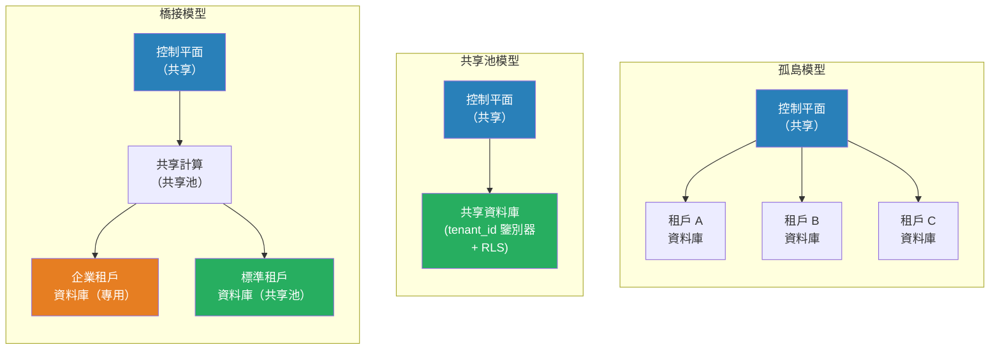

# [BEE-400] 多租戶架構模型

:::info
多租戶是一種架構屬性，即單一軟體系統使用共享基礎架構為多個客戶（租戶）提供服務——三種基本模型（孤島、共享池、橋接）代表了從完全隔離到完全共享的不同點。
:::

## Context

每個 SaaS 產品在商業意義上都是多租戶的：多個客戶為同一服務付費。架構問題在於這些客戶共享基礎架構的深度。答案決定了成本結構、法規態勢、運維複雜度，以及一個租戶降低其他租戶體驗的風險。

這個概念早於雲端時代。1960 年代的分時系統在共享大型機上為多個用戶提供服務，而 1990 年代早期的 ASP（應用服務提供商）產品在不同名稱下也面臨相同的取捨。孤島、共享池和橋接的詞彙在 Amazon 的 AWS Well-Architected Framework SaaS Lens 中被正式化，成為雲端原生多租戶模式的權威參考。

三種模型存在於一個連續體上：

**孤島模型（Silo Model）**：每個租戶獲得專用基礎架構。在資料庫層，這意味著每個租戶有一個單獨的資料庫實例。計算也通常是隔離的：獨立容器、獨立命名空間或獨立帳戶。租戶只共享控制平面——身份系統、入職流程、計費邏輯和運維工具。孤島模型最大化隔離，最適合有數據駐留要求、合規規定（HIPAA、FedRAMP）或需要保證資源空間的 SLA 的企業客戶。成本與租戶數量成正比：十個租戶意味著十個資料庫實例，無論這十個是否都在活躍使用。

**共享池模型（Pool Model）**：所有租戶共享同一個基礎架構堆疊。單一資料庫持有所有租戶的數據，通過 `tenant_id` 鑒別器列加以區分。行級安全（RLS）——在 PostgreSQL、SQL Server 等中原生可用——在資料庫層強制隔離，使應用程式碼無法意外讀取另一個租戶的行。共享池模型實現最高的資源利用率，是具有相似工作負載的 SMB 層租戶的正確預設選擇。其主要風險是**噪鄰問題（noisy neighbor problem）**：單一租戶執行批量導出或索引不佳的查詢可能消耗足夠的 I/O 或 CPU，降低共享同一實例的所有其他租戶的響應時間。

**橋接模型（Bridge Model）**：一種混合方式，對系統的不同部分應用不同的模型。常見模式是：計算是共享的（所有租戶共享同一服務群），而存儲是選擇性孤立的（企業租戶獲得專用 schema 或專用資料庫；標準層租戶共享一個池）。微服務架構進一步擴展了這一點——計費服務可能完全共享，而對超過使用量閾值的租戶，數據處理服務是孤立的。橋接模型讓企業提供差異化層級：「基本」計劃在完全共享的基礎上，「企業」計劃在專用存儲上，而無需維護兩個完全獨立的程式碼庫。

**分層部署（Tiered Deployment）** 是橋接模型的運維形式。租戶層級（免費、標準、企業）決定了租戶在入職時被分配到哪個資源池。隨著使用量增長，租戶可以在層級之間遷移。層級邊界是政策決定，而非架構約束，這使得這種方式在商業上最具靈活性。

所有模型中的一個關鍵問題是**租戶上下文傳播（tenant context propagation）**。多租戶系統中的每個請求必須攜帶已驗證的租戶身份，每次數據訪問必須按該身份過濾。遺漏過濾就是數據洩露。強制執行這一點的模式包括：將 `tenant_id` 綁定到請求上下文的中間件；將 `tenant_id` 注入每個查詢的存儲庫類；以及無論應用程式發送什麼都自動應用的資料庫級 RLS 策略。

## Design Thinking

模型的選擇主要不是技術決策——而是商業和法規決策。技術架構應該跟隨這些約束，而不是領導它們。

**選擇孤島模型當：**
- 任何租戶有合同或法規的數據駐留要求
- 租戶的故障預算必須從其他租戶中物理隔離
- 您在向會審計您的隔離模型的企業買家銷售

**選擇共享池模型當：**
- 租戶是同質的（相似的工作負載、相似的數據量）
- 成本效益是主要的競爭差異化因素
- 您的租戶數量龐大且流失率高（數百個租戶以上，數據庫每租戶模型變得難以管理）

**選擇橋接模型當：**
- 您服務於具有不同隔離需求的多個市場細分
- 您希望提供由分層基礎架構支持的分層定價
- 某些服務有有意義的隔離要求，而其他服務沒有

最困難的遷移是為單一租戶從共享池遷移到孤島。從第一天起就預先規劃，確保您的數據模型在每一行都攜帶 `tenant_id`，並在客戶要求之前構建租戶提取工具。

## Best Practices

工程師 MUST（必須）在每個實體表的初始 schema 中包含 `tenant_id`，即使是在孤島部署中。將租戶上下文改裝到現有 schema 上是 SaaS 產品可能面臨的最昂貴遷移之一。

工程師 MUST（必須）在基礎架構層強制租戶上下文，而不僅僅是在應用邏輯中。使用資料庫行級安全策略或自動注入租戶過濾器的中間件。應用層過濾是縱深防禦的補充，而非替代。

工程師 MUST NOT（不得）允許跨租戶查詢——即使出於管理目的——通過租戶請求使用的相同程式碼路徑。租戶管理操作應使用專用的、有審計的工具，以適當的授權明確繞過 RLS，而不是應用層中的臨時查詢。

工程師 SHOULD（應該）從第一天起就對每個租戶的資源消耗（CPU 秒、查詢計數、存儲字節、API 調用）進行監控，即使在完全共享的部署中也是如此。沒有每個租戶的指標，就無法偵測噪鄰、執行公平使用策略或按租戶強制執行速率限制。

工程師 SHOULD（應該）將租戶入職設計為自動化的、冪等的流程。在孤島模型中，這個流程提供基礎架構；在共享池模型中，它創建租戶記錄並為配置播種。無論哪種方式，租戶配置中的手動步驟都會成為業務擴展時的瓶頸和不一致的來源。

工程師 SHOULD（應該）在 API 閘道器或應用邊界實現租戶感知的速率限制，以限制任何單一租戶流量峰值的爆炸半徑。即使在孤島模型中，應用服務器也可能是共享的，配置錯誤的客戶端可能消耗所有工作線程。

工程師 MAY（可以）從共享池模型開始，按需將高價值租戶遷移到孤島，而不是預先推測性地構建孤島基礎架構。這將複雜性推遲到業務案例存在的時候，是 SaaS 產品最常見的成長路徑。

工程師 MUST NOT（不得）假設孤島模型消除了運維複雜性。每個孤島都是一個獨立的部署目標：schema 遷移必須針對每個租戶資料庫運行，配置更改必須推送到每個租戶堆疊，監控必須跨所有租戶聚合。孤島部署的運維工具是一項重大投資。

## Visual



## Example

**共享池模型的行級安全（PostgreSQL）：**

```sql
-- 每個租戶表都有 tenant_id 列
CREATE TABLE orders (
    id          UUID PRIMARY KEY DEFAULT gen_random_uuid(),
    tenant_id   UUID NOT NULL REFERENCES tenants(id),
    amount      NUMERIC(12,2) NOT NULL,
    created_at  TIMESTAMPTZ NOT NULL DEFAULT now()
);

-- 在表上啟用 RLS
ALTER TABLE orders ENABLE ROW LEVEL SECURITY;

-- 策略：每個連接只能看到匹配其租戶上下文的行
CREATE POLICY tenant_isolation ON orders
    USING (tenant_id = current_setting('app.current_tenant_id')::UUID);

-- 在應用程式碼中，在任何查詢之前設置租戶上下文：
-- SET LOCAL app.current_tenant_id = '<tenant-uuid>';
-- 事務中所有後續查詢只能看到該租戶的行。
-- 不需要應用層 WHERE 子句——資料庫強制執行它。
```

**租戶上下文中間件（偽代碼）：**

```
// 在每個入站請求上提取並綁定租戶身份。
// 這在任何處理器之前運行，並設置 RLS 讀取的上下文。

function tenantMiddleware(request, next):
    token = extractBearerToken(request.headers)
    claims = verifyJWT(token)               // 驗證簽名 + 有效期

    if not claims.tenant_id:
        return 401 Unauthorized

    // 綁定到請求範圍的上下文（線程本地、goroutine 上下文、AsyncLocalStorage 等）
    requestContext.set("tenant_id", claims.tenant_id)

    // 對於資料庫連接：設置會話變量以使 RLS 生效
    db.exec("SET LOCAL app.current_tenant_id = $1", claims.tenant_id)

    return next(request)
```

## Related BEEs

- [BEE-1001](../auth/authentication-vs-authorization.md) -- 身份驗證與授權：在設置租戶上下文之前必須建立租戶身份
- [BEE-1004](../auth/session-management.md) -- Session 管理：多租戶系統中的 Session 將租戶身份作為一級聲明攜帶
- [BEE-6004](../data-storage/partitioning-and-sharding.md) -- 分區與分片：大規模孤島和橋接模型成為一種租戶鍵控分片形式
- [BEE-8002](../transactions/isolation-levels-and-their-anomalies.md) -- 隔離級別及其異常：RLS 與事務隔離交互；理解兩個層次

## References

- [Silo, Pool, and Bridge Models -- AWS Well-Architected SaaS Lens](https://docs.aws.amazon.com/wellarchitected/latest/saas-lens/silo-pool-and-bridge-models.html)
- [SaaS Tenant Isolation Strategies -- AWS Whitepaper](https://docs.aws.amazon.com/whitepapers/latest/saas-tenant-isolation-strategies/pool-isolation.html)
- [Multi-Tenant SaaS Storage Strategies -- AWS Whitepaper](https://docs.aws.amazon.com/whitepapers/latest/multi-tenant-saas-storage-strategies/multitenancy-on-rds.html)
- [Row Security Policies -- PostgreSQL Documentation](https://www.postgresql.org/docs/current/ddl-rowsecurity.html)
- [Tenant isolation in SaaS: pool, silo and bridge models explained -- Just After Midnight](https://www.justaftermidnight247.com/insights/tenant-isolation-in-saas-pool-silo-and-bridge-models-explained/)
