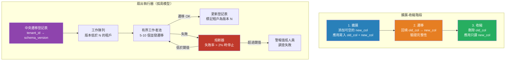

# [BEE-404] 多租戶系統中的 Schema 遷移

:::info
多租戶系統中的 Schema 遷移比單租戶系統複雜得多——部署模型決定了一次遷移是同時影響所有租戶，還是必須扇出到數百或數千個隔離資料庫，每個都需要單獨追蹤和回滾能力。
:::

## Context

BEE-126 將資料庫遷移作為一般實踐加以涵蓋。多租戶引入了本質上不同的挑戰：應用遷移的範圍和協調完全取決於所使用的隔離模型。在共享池模型中，一次遷移影響一個資料庫——熟悉的領域。在孤島或橋接模型中，一次邏輯遷移可能需要對 N 個租戶資料庫執行，每個都可能獨立失敗，並可能需要獨立回滾。

風險很高。單租戶系統中的遷移失敗影響一個系統。在孤島部署中，遷移失敗時可能已經開始在 500 個租戶資料庫中的 300 個上應用，使整個群組處於混合狀態。恢復需要確切知道哪些租戶有新 schema，哪些有舊 schema，哪些處於中間狀態——這些信息必須在遷移開始前明確追蹤。

擴展-收縮模式（也稱為並行變更，由 Martin Fowler 描述）是任何部署模型中零停機時間 schema 變更的基礎。該模式不是原子性地應用破壞性變更，而是將變更分為三個階段：

1. **擴展（Expand）**：在現有結構旁添加新列、表或索引。應用程式更新為同時寫入舊位置和新位置。讀取仍使用舊位置。Schema 與當前應用程式版本向後兼容。
2. **遷移（Migrate）**：在應用程式繼續正常運行的同時，從舊結構回填數據到新結構，或運行數據轉換。
3. **收縮（Contract）**：一旦生產中所有應用程式版本都只使用新結構且數據遷移完成，刪除舊列、表或索引。

在多租戶孤島部署中，這三個階段的每一個都必須扇出到每個租戶資料庫。僅擴展階段就是一個協調的群組操作。

## Design Thinking

**遷移登記表是關鍵的控制工件。** 對於具有一個共享資料庫的共享池模型，一個遷移表追蹤已運行的內容。對於孤島模型，每個租戶資料庫都有自己的遷移表，而中央登記表將租戶 ID 映射到遷移版本。在開始任何遷移之前，系統必須能夠回答：哪些租戶在版本 N？哪些在 N 以下？哪些在上一次嘗試時中途失敗了？這個登記表必須是權威的：遷移運行器讀取它來構建工作隊列，並在每次成功遷移時原子性地寫入它。

**扇出並發是雙刃劍。** 按順序遷移 500 個租戶資料庫是安全的，但可能需要數小時。並行遷移所有租戶很快，但可能使資料庫基礎架構過載，並使失敗恢復更困難（如果 50 個失敗，如何知道哪 50 個？）。實際方法是帶有熔斷器的有界並行：同時對 5-10 個租戶資料庫運行遷移；如果任何失敗，在繼續之前停止整個扇出並進行調查。這在限制壞遷移爆炸半徑的同時保持遷移窗口短暫。

**租戶 schema 分歧隨時間積累。** 在長期存在的孤島部署中，一些租戶可能在過去的遷移中被跳過（因為它們被暫停、欠費或其資料庫暫時不可達）。隨著時間推移，群組出現 schema 漂移：大多數租戶在版本 N，但一些在 N-3、N-7 或更差。遷移運行器必須處理非連續的追趕：在版本 N-5 的租戶需要按順序運行遷移 N-4、N-3、N-2、N-1 和 N。在已被跳過的資料庫上亂序運行遷移是難以診斷的生產故障的常見原因。

**新租戶入職和遷移扇出是相關的。** 當在孤島模型中配置新租戶時，其資料庫必須以當前頭部 schema 版本初始化，而不是按順序應用所有遷移的基線版本。維護每個版本的 schema 快照，可以直接應用，比為新租戶重播完整的遷移歷史更高效——否則他們將經歷數百次與其新鮮資料庫無關的歷史遷移。

## Best Practices

工程師 MUST（必須）在孤島和橋接部署中維護每個租戶的遷移版本追蹤表。中央遷移登記表（將租戶 ID 映射到當前遷移版本）是群組 schema 狀態的運維基礎，並且必須在每次成功遷移執行時原子性地更新。

工程師 MUST（必須）對任何涉及刪除列、重命名列或更改應用程式當前依賴的約束的遷移應用擴展-收縮模式。直接破壞性變更會導致仍持有對舊 schema 引用的應用程式實例發生故障。先擴展，更新應用程式，稍後收縮。

工程師 MUST（必須）在扇出到生產之前，對暫存環境中具有代表性的租戶資料庫樣本運行遷移。租戶數據量、數據分佈或歷史 schema 偏差的差異，可能導致遷移在小型測試租戶上成功，但在大型生產租戶上失敗。

工程師 SHOULD（應該）為扇出遷移實現帶熔斷器的有界並行。失敗率閾值（例如，超過 2% 的租戶在遷移批次中失敗）應自動停止扇出並警報值班工程師。只有在找到根本原因後才繼續。

工程師 SHOULD（應該）確保每次遷移都獨立地可安全回滾。使用擴展-收縮模式時，擴展階段本質上是可逆的：如果還沒有數據寫入新添加的列，刪除它是安全的。作為遷移工件本身的一部分，記錄每次遷移的回滾程序，而非事後才想到。

工程師 MUST NOT（不得）在部署期間應用遷移而不先確認正在部署的應用程式版本與上一個 schema 版本向後兼容。部署順序應該是：部署擴展遷移 → 部署新應用程式版本 → （所有實例更新後）部署收縮遷移。任何應用程式版本都必須能夠同時對 N-1 和 N schema 版本運行。

工程師 SHOULD（應該）維護每個版本的 schema 快照作為新租戶配置的初始化工件。這避免了為新租戶重播完整的遷移歷史，並防止新租戶初始化觸及在應用層已被清理的棄用程式碼路徑。

工程師 MAY（可以）對低風險的加法遷移（添加可空列、並發創建索引、插入新的枚舉值）以比破壞性或結構性遷移更高的並行性運行。每次遷移的風險概況和並發限制應是遷移工件的屬性，而非全局常量。

## Visual



## Example

**中央登記表追蹤和扇出運行器（偽代碼）：**

```
// 在開始之前讀取整個群組的遷移狀態。
// 在不知道初始狀態的情況下，絕不開始遷移。

function run_migration_across_fleet(migration_id, migration_fn):
    // 1. 構建工作隊列：還沒有此遷移的租戶
    pending_tenants = registry.query(
        "SELECT tenant_id FROM tenant_migrations
         WHERE migration_id < $1 OR migration_id IS NULL
         ORDER BY tenant_size ASC",   // 先運行最小的租戶（測試水溫）
        migration_id
    )

    log.info("遷移扇出開始", migration=migration_id, count=len(pending_tenants))

    failures = []
    success_count = 0

    // 2. 有界並行執行
    with worker_pool(max_workers=8) as pool:
        for tenant in pending_tenants:
            future = pool.submit(migrate_one_tenant, tenant, migration_id, migration_fn)
            result = future.result()

            if result.ok:
                success_count += 1
            else:
                failures.append((tenant.id, result.error))

            // 3. 熔斷器：失敗率超過閾值時停止
            failure_rate = len(failures) / (success_count + len(failures))
            if failure_rate > 0.02 and len(failures) >= 3:
                log.error("熔斷器觸發", failures=failures)
                alert_oncall("遷移停止", migration_id, failures)
                return HALTED

    if failures:
        alert_oncall("遷移完成但有失敗", migration_id, failures)
    return DONE


function migrate_one_tenant(tenant, migration_id, migration_fn):
    conn = get_tenant_db_connection(tenant.id)
    try:
        conn.begin()
        migration_fn(conn)                     // 應用 schema 變更
        registry.mark_complete(tenant.id, migration_id, conn)  // 與遷移原子性
        conn.commit()
        return Result(ok=True)
    except Exception as e:
        conn.rollback()
        log.error("遷移失敗", tenant=tenant.id, error=e)
        return Result(ok=False, error=e)
```

**重命名列的擴展-收縮：**

```sql
-- 第 1 階段：擴展——添加新列，保留舊列
ALTER TABLE orders ADD COLUMN customer_reference VARCHAR(255);

-- 應用程式：寫入兩列，從舊列讀取
-- INSERT INTO orders (order_ref, customer_reference) VALUES ($1, $1)

-- 第 2 階段：遷移——回填數據
UPDATE orders
SET customer_reference = order_ref
WHERE customer_reference IS NULL;

-- 應用程式：部署從新列讀取的版本
-- SELECT customer_reference FROM orders WHERE ...

-- 第 3 階段：收縮——刪除舊列（所有應用實例使用新列後才安全）
ALTER TABLE orders DROP COLUMN order_ref;
```

## Related BEEs

- [BEE-6007](../data-storage/database-migrations.md) -- 資料庫遷移：通用遷移實踐；本文將其擴展到多租戶場景
- [BEE-18001](multi-tenancy-models.md) -- 多租戶架構模型：決定是否需要扇出的孤島/共享池/橋接模型
- [BEE-18004](tenant-onboarding-and-provisioning-pipelines.md) -- 租戶入職與配置流水線：使用快照而非完整歷史重播的新租戶 schema 初始化
- [BEE-16002](../cicd-devops/deployment-strategies.md) -- 部署策略：擴展-收縮需要協調的應用程式和 schema 部署排序

## References

- [Parallel Change -- Martin Fowler's Catalog of Refactoring Patterns](https://martinfowler.com/bliki/ParallelChange.html)
- [Zero-Downtime Schema Migrations in PostgreSQL -- Xata](https://xata.io/blog/zero-downtime-schema-migrations-postgresql)
- [Multi-Tenant Database Architecture Patterns Explained -- Bytebase](https://www.bytebase.com/blog/multi-tenant-database-architecture-patterns-explained/)
- [Architectural Approaches for Storage and Data in Multitenant Solutions -- Azure Architecture Center](https://learn.microsoft.com/en-us/azure/architecture/guide/multitenant/approaches/storage-data)
- [Evolutionary Database Design -- Martin Fowler & Pramod Sadalage](https://martinfowler.com/articles/evodb.html)
