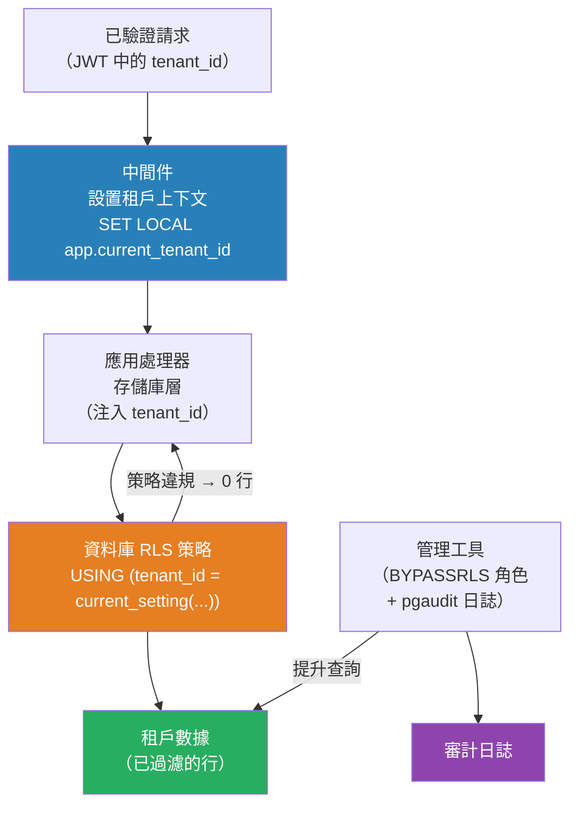

# [BEE-401] 租戶隔離策略

:::info
租戶隔離是一組防止一個租戶的數據、計算或請求影響另一個租戶的技術機制——涵蓋資料庫策略、基礎架構邊界和應用層執行。
:::

## Context

BEE-400 描述了三種部署模型（孤島、共享池、橋接）以及何時選擇每種模型。本文涵蓋在這些模型中如何實際執行隔離。選擇模型是設計決策；正確執行隔離是實現規範。

根本挑戰在於隔離失敗是靜默的。缺少的 WHERE 子句或配置錯誤的策略不會拋出異常——它返回不應可見的數據，或允許不應成功的寫入。隔離 bug 是最嚴重的 SaaS 漏洞之一，因為客戶影響是跨租戶邊界的數據暴露。

隔離必須在多個層面獨立執行。僅依靠應用層執行是不夠的：SQL 注入、ORM 配置錯誤或開發者在管理工具中撰寫的直接查詢都能繞過它。僅靠資料庫層執行對計算或網路隔離也不夠。縱深防禦——在每個能執行的層面執行——是唯一穩健的方法。

## 資料庫層隔離

存在三種策略，大致對應三種部署模型：

**數據庫每租戶**：每個租戶被配置一個單獨的資料庫實例。隔離保證來自操作系統：無論執行什麼 SQL，連接到租戶 A 的資料庫都無法訪問租戶 B 的數據。這是最強的隔離，也是對數據駐留有合同要求的租戶唯一可接受的選項。運維成本與租戶數量成正比——遷移必須針對每個租戶資料庫運行，監控必須跨所有實例聚合，連接池必須按租戶管理。

**每租戶 Schema**（PostgreSQL `CREATE SCHEMA`）：所有租戶 schema 存在於同一個資料庫實例中，但在不同的命名空間中。連接的 `search_path` 決定了哪個 schema 是活躍的，不明確引用該 schema 的查詢無法看到一個 schema 中的表。這比數據庫每租戶弱——DBA 錯誤或過於寬泛的權限角色可以跨 schema——但它允許更簡單的遷移工具（一個連接，多個 schema）和更低的每租戶基礎架構成本。Schema 級別的遷移通過在運行 DDL 之前執行 `SET search_path TO tenant_schema` 來完成。

**帶鑒別器列 + 行級安全（RLS）的共享表**：所有租戶共享相同的表，通過 `tenant_id` 外鍵加以區分。附加到每個表的 RLS 策略限制每個資料庫會話可以看到或修改哪些行。這是共享池模型的執行機制。

PostgreSQL RLS 的工作原理如下：當在表上設置 `ENABLE ROW LEVEL SECURITY` 時，每個查詢在返回任何行之前都按活躍策略的 `USING` 表達式過濾。`USING` 子句定義 SELECT/UPDATE/DELETE 的可見性過濾器。`WITH CHECK` 子句定義 INSERT/UPDATE 的約束——對於正在寫入的行必須返回 true。如果沒有行滿足策略，查詢返回零行（而非錯誤），這使得靜默策略繞過成為需要防范的主要失敗模式。

會話變量模式是將租戶上下文綁定到 RLS 策略而不為每個租戶創建一個資料庫用戶的標準方法：

```sql
-- 應用程式在每個事務開始時設置這個
SET LOCAL app.current_tenant_id = '<uuid>';

-- RLS 策略讀取它
CREATE POLICY tenant_isolation ON orders
  AS PERMISSIVE
  FOR ALL
  TO application_role
  USING (tenant_id = current_setting('app.current_tenant_id')::uuid)
  WITH CHECK (tenant_id = current_setting('app.current_tenant_id')::uuid);
```

`SET LOCAL` 將變量範圍限制為當前事務，這對連接池環境是正確的，其中連接被不同的請求重用。`SET`（沒有 LOCAL）在整個會話中持續，在池中是危險的。

**RLS 繞過**：PostgreSQL 超級用戶和擁有 `BYPASSRLS` 屬性的角色靜默繞過所有 RLS 策略。僅將 `BYPASSRLS` 分配給專用管理員角色，這些角色僅在受審計的管理工具中使用，絕不分配給應用角色。

## 計算隔離

在容器化部署中，計算隔離通過 Kubernetes 原語執行：

- **命名空間（Namespaces）**：每個租戶（或租戶組）被分配一個 Kubernetes 命名空間。命名空間範圍化 RBAC 綁定、資源配額和網路策略。預設情況下，綁定到一個命名空間的 `ServiceAccount` 無法列出或訪問另一個命名空間中的資源。
- **ResourceQuotas**：定義每個命名空間的 CPU 請求、記憶體限制、Pod 數量和持久卷聲明的上限。沒有配額，單個租戶的工作負載可以消耗所有集群資源，導致其他命名空間的 Pod 被 OOMKilled 和調度飢餓。
- **LimitRanges**：為未指定資源的 Pod 設置預設資源請求和限制，防止繞過配額執行的無限制容器。
- **NetworkPolicies**：控制哪些 Pod 可以相互通信以及與外部服務通信。命名空間的默認拒絕 NetworkPolicy，然後只對所需通信路徑添加明確的允許規則，防止租戶工作負載之間的橫向移動。

Kubernetes 命名空間隔離有一個重要限制：內核是共享的。命名空間和 NetworkPolicy 是 Linux 內核構造，而非硬件邊界。容器逃逸漏洞（在 runc 和 containerd 中多年來有幾個已記錄在案的案例）可以打破命名空間隔離。對於需要更強計算隔離的租戶——特別是在受監管行業或運行不受信任的工作負載時——使用每個租戶層的單獨節點池或單獨集群。

## 應用層執行

資料庫和基礎架構隔離是執行的基礎，但應用層執行是常見情況的第一道防線：

**存儲庫/數據訪問層模式**：將所有數據訪問包裝在向每個查詢注入 `tenant_id` 的存儲庫類中。這些存儲庫之外的直接資料庫訪問被程式碼審查政策禁止。這確保即使在 RLS 觸發之前，查詢在結構上也是正確的。

**中間件**：在每個請求上驗證租戶身份（見 BEE-10 和 BEE-400）。中間件在移交給處理器之前設置請求對象和資料庫連接上的租戶上下文。處理器程式碼不應從請求參數派生租戶身份——只能從已驗證的身份派生。

**審計日誌**：記錄每次跨租戶訪問嘗試——成功的（用於授權的管理操作）和失敗的（用於策略違規）。資料庫級審計日誌記錄（PostgreSQL `pgaudit`、SQL Server Audit）捕獲應用日誌看不到的失敗 RLS 檢查和超級用戶繞過。

## Best Practices

工程師 MUST（必須）除應用層過濾外還啟用資料庫層 RLS 或 schema 級隔離。永遠不要僅依賴應用程式碼中的 `WHERE tenant_id = ?` 子句——單個遺漏的子句或原始查詢就能完全繞過保護。

工程師 MUST（必須）在連接池環境中使用 `SET LOCAL`（不是 `SET`）綁定租戶上下文。在池重用中持續的 `SET` 會將一個租戶的上下文洩漏給路由到同一連接的下一個請求。

工程師 MUST（必須）授予應用的資料庫角色最小必要權限。應用角色不應具有 `BYPASSRLS`、`SUPERUSER` 或 schema 創建權限。為專用的、受審計的管理工具保留提升的權限。

工程師 MUST（必須）在每個承載租戶工作負載的 Kubernetes 命名空間上設置 ResourceQuotas。沒有 ResourceQuota 的命名空間不提供計算隔離——行為不當的租戶可以耗盡節點資源。

工程師 SHOULD（應該）在每個租戶命名空間中執行默認拒絕 NetworkPolicy，並且只為所需的通信路徑添加明確的允許規則。從拒絕全部開始，逐步開放；不要從允許全部開始然後嘗試被動限制。

工程師 SHOULD（應該）作為 CI 的一部分運行自動化隔離測試：以租戶 A 身份進行身份驗證，並嘗試在每個數據訪問層（API、資料庫、對象存儲）讀取、寫入和刪除租戶 B 的資源。失敗的隔離測試無論在什麼環境中都是關鍵嚴重性發現。

工程師 MUST NOT（不得）假設每租戶 schema 可以防止所有跨租戶訪問。具有廣泛 schema 訪問權限的應用角色可以明確查詢任何 schema。將 schema 分離與 RLS 或每個 schema 的角色授予結合，進行縱深防禦。

工程師 SHOULD（應該）將管理員和支持工具視為單獨的安全域。支持工程師為診斷租戶問題而運行的查詢與應用 bug 具有相同的數據暴露風險。使用通過 pgaudit 記錄的 BYPASSRLS 專用管理員資料庫角色，並在運行跨租戶查詢之前要求票據或審批工作流程。

## Visual



## Example

**縱深防禦：應用存儲庫 + PostgreSQL RLS 結合：**

```sql
-- 1. 資料庫層：每個租戶表的 RLS 策略
ALTER TABLE invoices ENABLE ROW LEVEL SECURITY;
CREATE POLICY tenant_isolation ON invoices
  FOR ALL TO app_role
  USING  (tenant_id = current_setting('app.current_tenant_id')::uuid)
  WITH CHECK (tenant_id = current_setting('app.current_tenant_id')::uuid);

-- 必需索引：沒有它，RLS 會在每個查詢上導致順序掃描
CREATE INDEX idx_invoices_tenant_id ON invoices (tenant_id);
```

```
// 2. 應用層：存儲庫在結構上執行 tenant_id
// 即使 RLS 配置錯誤，查詢仍會正確過濾。

class InvoiceRepository:
    constructor(db, tenantId):
        this.db = db
        this.tenantId = tenantId

    findAll():
        // SET LOCAL 使上下文不跨池連接洩漏
        this.db.exec("SET LOCAL app.current_tenant_id = $1", this.tenantId)
        return this.db.query(
            "SELECT * FROM invoices WHERE tenant_id = $1",
            this.tenantId  // 除 RLS 外的明確過濾器
        )

    findById(id):
        this.db.exec("SET LOCAL app.current_tenant_id = $1", this.tenantId)
        return this.db.queryOne(
            "SELECT * FROM invoices WHERE id = $1 AND tenant_id = $2",
            id, this.tenantId  // 在主鍵查找中始終包含 tenant_id
        )
```

**Kubernetes 租戶命名空間隔離：**

```yaml
# ResourceQuota：在計算層防止噪鄰
apiVersion: v1
kind: ResourceQuota
metadata:
  name: tenant-quota
  namespace: tenant-acme
spec:
  hard:
    requests.cpu: "4"
    requests.memory: 8Gi
    limits.cpu: "8"
    limits.memory: 16Gi
    pods: "20"
---
# NetworkPolicy：默認拒絕，然後只允許所需的內容
apiVersion: networking.k8s.io/v1
kind: NetworkPolicy
metadata:
  name: default-deny-all
  namespace: tenant-acme
spec:
  podSelector: {}      # 適用於命名空間中的所有 Pod
  policyTypes: [Ingress, Egress]
  # 沒有入口/出口規則 = 拒絕所有流量
```

## Related BEEs

- [BEE-18001](multi-tenancy-models.md) -- 多租戶架構模型：這些隔離技術所實現的孤島/共享池/橋接部署模式
- [BEE-1001](../auth/authentication-vs-authorization.md) -- 身份驗證與授權：在執行隔離之前必須建立租戶身份
- [BEE-8002](../transactions/isolation-levels-and-their-anomalies.md) -- 隔離級別及其異常：事務隔離和行級安全相互作用；理解兩者
- [BEE-12007](../resilience/rate-limiting-and-throttling.md) -- 速率限制與節流：每租戶速率限制是數據隔離的計算層補充

## References

- [Row Security Policies -- PostgreSQL Documentation](https://www.postgresql.org/docs/current/ddl-rowsecurity.html)
- [Multi-tenant data isolation with PostgreSQL Row Level Security -- AWS Database Blog](https://aws.amazon.com/blogs/database/multi-tenant-data-isolation-with-postgresql-row-level-security/)
- [SaaS Tenant Isolation Strategies -- AWS Whitepaper](https://d1.awsstatic.com/whitepapers/saas-tenant-isolation-strategies.pdf)
- [Multi-tenancy -- Kubernetes Documentation](https://kubernetes.io/docs/concepts/security/multi-tenancy/)
- [Row Level Security for Tenants in Postgres -- Crunchy Data](https://www.crunchydata.com/blog/row-level-security-for-tenants-in-postgres)
