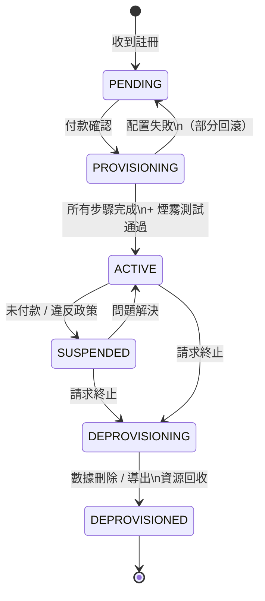

# [BEE-403] 租戶入職與配置流水線

:::info
租戶入職是將新客戶轉變為活躍租戶的運維流水線——以可重複、自動化、完全可觀測的順序配置身份、基礎架構、隔離策略和計費。
:::

## Context

在 SaaS 產品的早期階段，租戶入職通常是手動的：開發者運行腳本、創建資料庫 schema、向租戶表添加記錄，然後通過電子郵件發送憑證給客戶。這在前十個租戶時有效。到第一百個租戶時，手動步驟已積累成一個容易出現配置漂移、遺漏步驟和環境不一致的數小時流程。到第一千個租戶時，它成為業務增長的瓶頸。

AWS Well-Architected SaaS Lens 將完全自動化、可預測的租戶入職確定為運維成熟度的要求。他們的指導方針描述了一個**入職服務**——控制平面中的一個專用元件，負責端到端的配置工作流程。這個服務協調每個步驟：創建租戶記錄、配置基礎架構（如果層級適當）、設置隔離策略、配置初始管理員身份、與計費系統整合、運行煙霧測試以驗證租戶環境，以及發送下游系統可以響應的完成事件。

關鍵的區別在於**控制平面**和**數據平面**之間。控制平面管理租戶：它知道租戶是誰、他們在什麼層級、他們擁有哪些資源，以及他們處於什麼狀態。數據平面是產品本身——租戶實際使用的服務。入職服務存在於控制平面中，其工作是將新租戶從零帶到已知良好的數據平面狀態。這種分離使獨立部署成為可能：控制平面變更（入職邏輯、計費整合、管理工具）可以在不影響現有租戶工作負載的情況下部署。

**租戶生命週期**最好建模為有限狀態機。租戶通過具有明確觸發器和結果的轉換在定義良好的狀態中移動：

- `PENDING`：收到註冊，付款尚未確認。
- `PROVISIONING`：入職流水線進行中。
- `ACTIVE`：配置完成，租戶可以使用產品。
- `SUSPENDED`：由於未付款或違反政策而禁用訪問；保留數據。
- `DEPROVISIONING`：租戶已請求終止；數據刪除或導出進行中。
- `DEPROVISIONED`：所有資源已回收；租戶記錄已歸檔。

流水線中的每個步驟都必須更新租戶的狀態，以便工作流程中的當前位置始終可觀測。在預期持續時間內仍處於 `PROVISIONING` 狀態的租戶會觸發警報。

## Design Thinking

**流水線必須是冪等的。** 配置步驟會失敗：創建資料庫 schema 時網路超時、計費 API 返回 503、Kubernetes 命名空間創建超時。流水線必須能夠從任何步驟重試，而不創建重複資源或不一致狀態。將每個步驟設計為在創建之前檢查是否存在：「如果不存在，則創建 schema `tenant_acme`。」冪等流水線可以安全重試，並且可以在沒有人工干預的情況下從部分失敗中恢復。

**層級決定了流水線的形狀，而不僅僅是結果。** 共享池模型中的新標準層租戶只需要租戶記錄插入和身份配置調用——幾秒鐘的工作。孤島模型中的新企業層租戶需要資料庫配置、網路配置、DNS 更新、TLS 證書頒發以及租戶特定服務實例的部署——幾分鐘或幾小時的工作。同一個入職服務必須處理兩條路徑，基於租戶層級進行分支。將層級特定的配置步驟編碼在流水線中而非臨時腳本中，確保了一致性和可審計性。

**計費整合需要特殊的彈性。** 計費系統是比內部服務更可能失敗的外部依賴。入職期間的計費失敗不應回滾整個配置——租戶通常已經付款或同意付款。正確的模式是將計費整合記錄為具有自己重試隊列的單獨步驟，允許租戶在核心配置完成後進入 `ACTIVE` 狀態，並異步協調計費。將此記錄為明確的決定：對某些產品在入職期間的計費失敗快速失敗是一個有效的選擇，但應該是刻意的。

**取消配置是反向配置，有保留要求。** 當租戶終止時，流水線必須：立即撤銷所有訪問（身份暫停）、導出客戶有權保留的任何數據、在合同規定的保留期後安排刪除、釋放基礎架構資源，以及歸檔租戶記錄。數據刪除通常是最難正確且可審計的步驟，因為法規要求（GDPR 第 17 條刪除權）對刪除什麼、何時刪除以及提供什麼證明設置了義務。

## Best Practices

工程師 MUST（必須）從第一個租戶開始就端到端自動化租戶入職，而不是在達到某個任意規模閾值後才自動化。手動配置積累的技術債務與租戶數量成正比；將自動化改裝到已建立的產品中遠比從一開始就正確構建要昂貴得多。

工程師 MUST（必須）使每個配置步驟冪等。不能在部分失敗後安全重試的配置流水線，對於每次基礎架構中斷都需要人工干預，這在規模上是運維上不可接受的。

工程師 MUST（必須）在每個配置步驟的開始和結束時更新租戶的生命週期狀態，而不僅僅是在整個流水線的開始和結束時。細粒度的狀態允許可觀測性儀表板顯示卡住的租戶正在哪個步驟上，並允許重試邏輯從失敗的步驟恢復，而不是從頭開始。

工程師 SHOULD（應該）對具有超過三個步驟的配置流水線使用協調機制（步驟函數、saga、工作流引擎）。應用程式碼中的順序 API 調用沒有可見性、沒有重試語義，也沒有暫停和恢復的能力。協調層提供執行歷史、步驟級重試和超時處理。

工程師 MUST（必須）在將新配置的租戶環境標記為 `ACTIVE` 之前對其進行煙霧測試。至少：驗證租戶記錄存在、驗證租戶可以進行身份驗證，以及驗證代表性的數據操作成功。結構上配置成功但應用層配置錯誤的租戶，將在首次使用後數分鐘內生成支持票。

工程師 SHOULD（應該）在入職服務成功完成後發出域事件（例如 `TenantProvisioned`）。下游系統（電子郵件投遞、分析流水線、支持工具、計費同步）訂閱此事件，而不是輪詢或直接耦合到入職服務。這將入職流水線與其消費者解耦，並使流水線可以獨立測試。

工程師 MUST（必須）將取消配置設計為可審計的。對於每次租戶終止，記錄刪除了什麼、何時刪除，以及通過哪個流程刪除。對於受監管的行業，維護一個滿足刪除權審計要求的刪除日誌，而不保留已刪除的數據本身。

工程師 MUST NOT（不得）在租戶之間共享配置憑證或服務帳戶。每個自動配置步驟應使用該步驟所需的最小權限。用於創建租戶資源的憑證不應能夠讀取或修改另一個租戶的資源。

## Visual



## Example

**冪等配置步驟（偽代碼）：**

```
// 每個步驟在創建之前檢查是否存在。
// 在任何失敗後安全重試——網路超時、服務錯誤、Pod 重啟。

function provision_tenant_schema(tenant_id):
    schema_name = "tenant_" + tenant_id.replace("-", "_")

    // 檢查 schema 是否已存在（冪等性檢查）
    exists = db.query_one(
        "SELECT 1 FROM information_schema.schemata WHERE schema_name = $1",
        schema_name
    )
    if exists:
        log.info("Schema 已存在，跳過創建", schema=schema_name)
        return OK

    db.exec("CREATE SCHEMA " + schema_name)
    db.exec("SET search_path TO " + schema_name)
    run_migrations(schema_name)   // 應用基線 schema

    log.info("Schema 已創建", tenant=tenant_id, schema=schema_name)
    return OK
```

**帶狀態追蹤的配置流水線：**

```
// 協調器按順序調用每個步驟，在步驟之間更新狀態。
// 任何步驟失敗在升級之前都使用指數退避重試。

function onboard_tenant(tenant):
    update_tenant_state(tenant.id, "PROVISIONING", step="started")

    steps = [
        ("create_tenant_record",     create_tenant_record),
        ("provision_infrastructure", provision_by_tier(tenant.tier)),
        ("setup_isolation_policies", setup_rls_or_schema),
        ("provision_admin_identity", create_admin_user),
        ("integrate_billing",        integrate_billing_with_retry),
        ("run_smoke_tests",          smoke_test_tenant_env),
    ]

    for step_name, step_fn in steps:
        update_tenant_state(tenant.id, "PROVISIONING", step=step_name)
        result = step_fn(tenant)
        if result != OK:
            alert_oncall(tenant.id, step_name, result)
            return FAILED

    update_tenant_state(tenant.id, "ACTIVE")
    emit_event("TenantProvisioned", tenant_id=tenant.id, tier=tenant.tier)
    return OK
```

## Related BEEs

- [BEE-18001](multi-tenancy-models.md) -- 多租戶架構模型：孤島與共享池模型決定了配置流水線的形狀
- [BEE-18002](tenant-isolation-strategies.md) -- 租戶隔離策略：入職期間配置的隔離策略（RLS、schema、命名空間）
- [BEE-8004](../transactions/saga-pattern.md) -- Saga 模式：具有失敗補償事務的多步驟配置
- [BEE-8005](../transactions/idempotency-and-exactly-once-semantics.md) -- 冪等性與精確一次語義：冪等配置步驟使安全重試成為可能

## References

- [How are new tenants onboarded to your system? -- AWS Well-Architected SaaS Lens](https://wa.aws.amazon.com/saas.question.OPS_3.en.html)
- [Tenant onboarding in SaaS architecture for the silo model -- AWS Prescriptive Guidance](https://docs.aws.amazon.com/prescriptive-guidance/latest/patterns/tenant-onboarding-in-saas-architecture-for-the-silo-model-using-c-and-aws-cdk.html)
- [Architectural approaches for deployment of multitenant SaaS -- Azure Architecture Center](https://learn.microsoft.com/en-us/azure/architecture/guide/multitenant/approaches/deployment-configuration)
- [Building Multi-Tenant SaaS Architectures, Chapter 4: Onboarding and Identity -- O'Reilly](https://www.oreilly.com/library/view/building-multi-tenant-saas/9781098140632/ch04.html)
- [Simplify SaaS Tenant Deployments With Infrastructure As Code -- The Scale Factory](https://scalefactory.com/blog/2022/01/20/simplify-saas-tenant-deployments-with-infrastructure-as-code/)
