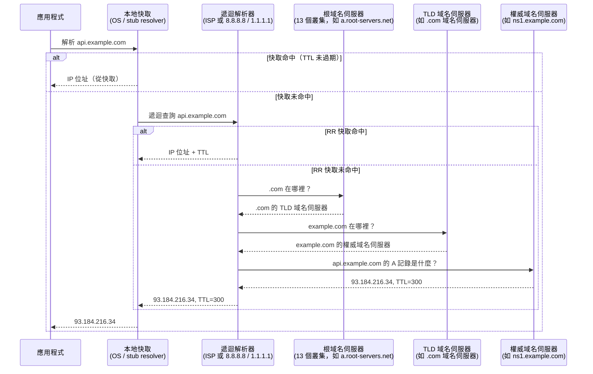

# [BEE-3002] DNS 解析

## 背景

在後端服務能夠向另一個服務建立 TCP 連線之前，它必須先將主機名稱（hostname）轉換為 IP 位址。這個轉換過程就是 DNS（Domain Name System，網域名稱系統），它影響你的服務所發出的每一個對外連線。DNS 不是一個設定好就可以忘記的已解決問題：它有失敗模式、快取行為、傳播延遲以及延遲特性，這些都經常導致正式環境事故。

本文涵蓋 DNS 解析的端對端運作方式、後端工程師常遇到的記錄類型（record types）、DNS 如何用於負載平衡（load balancing）和故障轉移（failover），以及你需要設計對應方案的失敗模式。

**參考資料：**
- [RFC 1035 — Domain Names: Implementation and Specification](https://www.rfc-editor.org/rfc/rfc1035)
- [Cloudflare Learning Center — What is DNS?](https://www.cloudflare.com/learning/dns/what-is-dns/)
- [Cloudflare Learning Center — DNS record types](https://developers.cloudflare.com/dns/manage-dns-records/reference/dns-record-types/)
- [Cloudflare Learning Center — DNS over TLS vs DNS over HTTPS](https://www.cloudflare.com/learning/dns/dns-over-tls/)
- [Julia Evans — DNS category (jvns.ca)](https://jvns.ca/categories/dns/)
- [Julia Evans — "DNS propagation is actually caches expiring"](https://jvns.ca/blog/2021/12/06/dns-doesn-t-propagate/)
- [Cloudflare — What is DNS-based load balancing?](https://www.cloudflare.com/learning/performance/what-is-dns-load-balancing/)


## 原則

**永遠不要寫死 IP 位址。始終使用 DNS，並且永遠遵守 TTL。**

DNS 是網際網路的電話簿。每當你使用主機名稱而非 IP 位址，你就獲得了在不修改客戶端的情況下變更目標位置的能力。這種靈活性是服務探索（service discovery）、藍綠部署（blue/green deployment）以及 DNS 故障轉移的基礎。代價是增加了一層間接層，具有其自身的延遲、快取和失敗模式。理解這些代價讓你能夠主動設計因應方案，而不是在遭遇問題時措手不及。


## DNS 解析的運作方式

當你的應用程式呼叫 `getaddrinfo("api.example.com")` 或向 `https://api.example.com` 發出 HTTP 請求時，一連串的查詢便會展開。



### 四個角色

**Stub resolver（本地快取）：** 一個內建在作業系統中的小型解析器（或像 `systemd-resolved`、`dnsmasq` 這樣的本地守護程序）。它維護一個以 `(名稱, 類型)` 為鍵的快取。它先查詢 `/etc/hosts`，再查詢 `/etc/resolv.conf` 中設定的遞迴解析器。

**遞迴解析器（Recursive resolver）：** 主力工作者。它接受來自 stub resolver 的完整查詢，並代表客戶端處理所有的迭代查詢，快取每個回應。例如：你的 ISP 解析器、Google Public DNS（`8.8.8.8`）、Cloudflare DNS（`1.1.1.1`）。

**根域名伺服器（Root nameservers）：** 共有 13 個邏輯根域名伺服器身份（a–m.root-servers.net），透過 anycast 路由由全球數百台實體機器提供服務。它們不知道任何個別主機名稱的答案；它們只知道哪些域名伺服器對每個頂級網域（TLD）具有權威性。

**權威域名伺服器（Authoritative nameserver）：** 持有某個網域實際 DNS 區域檔案（zone file）的伺服器。它給出最終答案。當你在域名註冊商或 DNS 提供商（Route 53、Cloudflare、Google Cloud DNS）設定記錄時，你就是在編輯由你的權威域名伺服器提供服務的區域。


## DNS 記錄類型

| 類型 | 說明 |
|------|------|
| **A** | 將主機名稱對應到 IPv4 位址。最常見的記錄類型。 |
| **AAAA** | 將主機名稱對應到 IPv6 位址。 |
| **CNAME** | 從一個名稱建立別名到另一個名稱（canonical name，正規名稱）。不能與同名的其他記錄共存。不能用於區域頂點（裸網域）。 |
| **MX** | 郵件交換（Mail exchange）記錄。指向負責接收網域電子郵件的郵件伺服器。包含優先級值。 |
| **TXT** | 任意文字。用於網域所有權驗證（Let's Encrypt、Google Search Console）、SPF、DKIM 和 DMARC 電子郵件身份驗證記錄。 |
| **SRV** | 服務記錄。為服務編碼 `priority`（優先級）、`weight`（權重）、`port`（埠號）和 `target`（目標主機名稱）。被 SIP、XMPP 和 Kubernetes etcd 節點探索等協定使用。格式：`_service._proto.name TTL class SRV priority weight port target`。 |
| **NS** | 指定網域的權威域名伺服器。你在域名註冊商那裡登記的頂層域名伺服器就是 NS 記錄。 |
| **SOA** | 授權起始（Start of Authority）。每個區域一筆。包含主要域名伺服器、負責人電子郵件、序號（用於區域傳輸同步）以及更新/重試/過期間隔。 |


## TTL 與快取

**TTL（Time-To-Live，存活時間）** 在 RFC 1035 中定義為「一個 32 位元有符號整數，指定資源記錄（resource record）在再次查詢資訊來源之前可被快取的時間間隔（單位：秒）」。

TTL 為 `300` 表示解析器和 OS 快取最多可在 5 分鐘內提供該記錄而無需重新驗證。過期後，它們必須重新查詢。

**實用 TTL 值：**

| 情境 | 建議 TTL |
|------|---------|
| 穩定的正式環境服務 | 300–3600 秒 |
| 即將遷移的服務 | 60–300 秒（在變更前降低） |
| 主動故障轉移 / 動態路由 | 30–60 秒 |
| 永不快取（應謹慎使用；對域名伺服器負載高） | 0 |

**DNS 傳播（propagation）是個誤稱。** 沒有任何推送機制會將記錄變更廣播給所有解析器。實際發生的是，快取的記錄根據其 TTL 過期，解析器在那個時間點重新查詢。如果你的 TTL 是 3600，部分客戶端在你更新記錄後最多一小時仍會使用舊記錄。在計劃變更之前降低 TTL；事後再將其恢復。


## 關鍵系統檔案

### `/etc/hosts`

大多數作業系統在 DNS 之前先查詢此檔案。讓你可以在本地覆寫 DNS。在開發環境和容器中很有用，可以在不執行 DNS 伺服器的情況下注入服務位址。

```
127.0.0.1   localhost
::1         localhost
192.168.1.50 db.internal
```

查詢順序由 `/etc/nsswitch.conf` 控制（`hosts: files dns` 表示先查 `/etc/hosts`，再查 DNS）。

### `/etc/resolv.conf`

設定 stub resolver：使用哪個遞迴解析器，以及搜尋網域後綴（search domain suffixes）。

```
nameserver 10.96.0.10          # DNS 伺服器 IP（例如 Kubernetes 中的 kube-dns）
search default.svc.cluster.local svc.cluster.local cluster.local
options ndots:5                 # 如果名稱包含少於 5 個點，嘗試附加搜尋網域
```

`search` 和 `ndots` 設定在 Kubernetes 中很重要。對 `redis` 的查詢在回落到簡單查詢之前，最多會變成 6 個查詢（`redis.default.svc.cluster.local`、`redis.svc.cluster.local` 等）。這為每個連線都增加了延遲。使用完全合格的網域名稱（FQDN，尾部加點，如 `redis.default.svc.cluster.local.`）來跳過搜尋清單。


## 使用 `dig` 檢查 DNS

`dig`（屬於 `bind-utils` / `dnsutils` 套件的一部分）是查詢 DNS 的標準工具。

```bash
$ dig api.example.com A

; <<>> DiG 9.18.0 <<>> api.example.com A
;; ->>HEADER<<- opcode: QUERY, status: NOERROR, id: 12345
;; flags: qr rd ra; QUERY: 1, ANSWER: 1, AUTHORITY: 0, ADDITIONAL: 1

;; QUESTION SECTION:
;api.example.com.               IN      A

;; ANSWER SECTION:
api.example.com.        300     IN      A       93.184.216.34

;; Query time: 12 msec
;; SERVER: 1.1.1.1#53(1.1.1.1)
;; WHEN: Mon Apr 07 10:00:00 UTC 2026
;; MSG SIZE  rcvd: 56
```

關鍵欄位解讀：

- **status**：`NOERROR`（找到）、`NXDOMAIN`（名稱不存在）、`SERVFAIL`（解析器失敗）、`REFUSED`（解析器拒絕）。
- **flags**：`qr` = 這是回應；`rd` = 遞迴所需（客戶端要求解析器遞迴查詢）；`ra` = 遞迴可用（伺服器支援遞迴）；`aa` = 權威答案（直接來自權威伺服器）。
- **ANSWER SECTION**：TTL 欄（300）是剩餘時間（秒）。最右側欄位是 IP 位址。
- **Query time**：查詢耗時。快取的回應通常 <1 毫秒；未快取的遞迴查詢可能需要 50–300 毫秒。

```bash
# 追蹤 CNAME 鏈
dig www.example.com CNAME

# 顯示完整解析路徑（從根開始的迭代查詢）
dig +trace api.example.com

# 直接查詢特定域名伺服器
dig @ns1.example.com api.example.com A

# 精簡輸出（只顯示答案）
dig +short api.example.com A

# 透過 DNS over HTTPS 查詢（需要 curl）
curl -H 'accept: application/dns-json' \
  'https://cloudflare-dns.com/dns-query?name=api.example.com&type=A'
```


## DNS 負載平衡

DNS 可以透過為同一名稱返回多個位址，在不使用硬體負載平衡器（load balancer）的情況下將流量分散到多個後端。

### Round-Robin DNS（輪詢 DNS）

為同一主機名稱返回多個 A 記錄。解析器和客戶端通常會輪流使用它們。

```
api.example.com.  60  IN  A  10.0.1.10
api.example.com.  60  IN  A  10.0.1.11
api.example.com.  60  IN  A  10.0.1.12
```

**限制：** 客戶端會在 TTL 期間快取它們收到的第一個位址。輪替不保證均勻。沒有健康檢查——如果某個 IP 下線，客戶端會繼續向它發送請求，直到 TTL 過期並收到更新的記錄集。標準的 round-robin DNS 不知道哪些後端是健康的。

### 加權 DNS（Weighted DNS）

AWS Route 53 和 Google Cloud DNS 等 DNS 提供商支援加權路由（weighted routing）：為每個記錄分配一個權重，解析器按比例返回各記錄。適用於金絲雀部署（canary deployment）（例如將 5% 的流量導向新版本）。

### 地理位置 / 延遲導向路由

根據客戶端解析器的 IP，將流量路由到最近或延遲最低的區域。權威域名伺服器根據查詢來源返回不同的 IP。被全球 CDN 和多區域部署廣泛使用。

### DNS 故障轉移情境

這是後端可靠性中最重要的模式之一。

**情境：** `api.example.com` 解析到主要伺服器 `10.0.1.10`。主要伺服器宕機。

1. 一個**健康檢查代理**（Route 53 health check、Cloudflare Health Checks 或你自己的監控）偵測到 `10.0.1.10:443` 無回應。
2. 代理更新 DNS 記錄：移除 `10.0.1.10`，新增 `10.0.1.20`（備援伺服器）。記錄的 TTL 是 30 秒。
3. 新的 DNS 查詢返回 `10.0.1.20`。
4. 快取中仍指向 `10.0.1.10` 的客戶端將繼續失敗，直到其快取條目過期（最多 TTL，即 30 秒）。
5. 快取過期後，這些客戶端解析到 `10.0.1.20` 並恢復正常。

**關鍵洞察：** 恢復時間窗口受 TTL 限制，而非受你更新記錄的速度限制。如果你的故障轉移 TTL 是 300 秒，客戶端可能會中斷最多 5 分鐘。在你打算進行故障轉移的記錄上保持較低的 TTL。

此外，**應用層的 DNS 快取可能會覆寫 TTL。** 許多 HTTP 客戶端、基於 JVM 的服務以及連線池會無限期地快取 DNS 結果，或按與 DNS TTL 無關的固定時間快取。這些客戶端在其內部快取過期之前不會看到更新的記錄——即使 OS 快取已經刷新。這在「常見錯誤」一節中會進一步討論。


## DNS 失敗模式

| 回應 | 含義 | 常見原因 |
|------|------|----------|
| `NOERROR` 且 0 個答案 | 名稱存在但沒有所請求類型的記錄 | 區域中缺少記錄 |
| `NXDOMAIN` | 名稱不存在 | 主機名稱拼寫錯誤、網域過期、記錄缺失、區域委派問題 |
| `SERVFAIL` | 解析器無法獲得答案 | 權威伺服器無法連線、DNSSEC 驗證失敗、上游逾時 |
| `REFUSED` | 解析器拒絕回答 | 查詢只接受特定 IP 遞迴查詢的權威伺服器 |
| 逾時（Timeout） | 在客戶端逾時內未收到回應 | 網路分割、UDP 封包丟失、解析器過載、大型回應需要 TCP 備援 |

```bash
# 模擬並觀察各種失敗模式
dig @8.8.8.8 nonexistent.example.com A      # NXDOMAIN
dig @8.8.8.8 _dmarc.broken-dnssec.com TXT   # SERVFAIL（DNSSEC 失敗）
dig +time=1 +retry=0 @192.0.2.1 example.com # 逾時（黑洞 IP）
```

**DNS 逾時值得特別關注。** DNS 查詢預設使用 UDP。如果 UDP 回應丟失，客戶端會在短暫間隔後重試（通常每次嘗試 1–5 秒，重試 2–3 次）。大於 512 位元組的 DNS 回應（EDNS0 將此上限提高到 4096 位元組）可能會迫使回退到 TCP，在 DNS 回應到達之前增加一次完整的 TCP 握手。在封鎖 DNS over TCP（53/TCP 埠）的防火牆環境中，大型回應會導致無聲的失敗。


## DNS 傳播

更新 DNS 記錄不會立即到達所有客戶端。所謂的「傳播延遲」實際上是每個解析器的快取 TTL 獨立過期的過程。沒有全球廣播機制。

**TTL=300（5 分鐘）記錄變更的時間軸：**

```
T+0s    你在權威域名伺服器更新記錄。
T+0s    解析器沒有快取的客戶端：他們立即獲得新記錄。
T+0s–300s  解析器有快取條目的客戶端：他們繼續獲得舊記錄。
T+300s  此記錄的所有解析器快取已過期。新查詢返回新值。
```

**在計劃變更前最小化傳播延遲：**

1. 在變更前 24–48 小時將 TTL 降低到 60 秒（或更低），時間足夠讓所有先前 TTL 的舊快取條目過期。
2. 進行變更。
3. 等待一個新 TTL 間隔（60 秒），讓變更完全生效。
4. 將 TTL 恢復到正常值。


## DNS over HTTPS (DoH) 與 DNS over TLS (DoT)

傳統 DNS 查詢以明文形式透過 UDP/TCP 53 埠傳送。網路路徑上的任何人都可以看到你在解析哪些主機名稱——這是一個重大的隱私和安全隱患。

**DNS over TLS (DoT)** — 將標準 DNS 包裹在 TLS 會話中。使用專用埠（TCP 853）。查詢是加密的，但 853 埠流量是 DNS 這一事實對網路觀察者仍然可見。

**DNS over HTTPS (DoH)** — 將 DNS 查詢以 HTTPS 請求的形式發送（443 埠）。DNS 流量與一般 HTTPS 無法區分。定義於 [RFC 8484](https://www.rfc-editor.org/rfc/rfc8484)。Firefox、Chrome 等瀏覽器以及作業系統越來越多地預設使用 DoH。

| 功能 | DoT | DoH |
|------|-----|-----|
| 埠 | 853 | 443 |
| 協定 | DNS over TLS | DNS over HTTPS |
| 可見性 | DNS 流量可透過埠號識別 | 與 HTTPS 混合 |
| 網路控制 | 較易集中允許/封鎖 | 較難攔截或封鎖 |
| 採用層級 | OS / 解析器層級 | 瀏覽器、應用程式、OS 層級 |

**後端相關性：** 如果程式語言執行環境或容器映像使用了寫死的 DoH 提供商，你的服務的對外 DNS 查詢可能會繞過企業或 VPC 的 DNS 解析器。這可能破壞依賴內部 DNS 的環境中的服務探索（例如 Kubernetes `kube-dns`、AWS VPC DNS 在 `169.254.169.253`）。驗證你的容器基礎映像或語言執行環境中是否無意中啟用了 DoH。


## DNS 與服務探索

在微服務架構中，DNS 是一種常見的服務探索機制：

- **Kubernetes：** 每個 Service 都獲得一個 DNS 名稱（`<service>.<namespace>.svc.cluster.local`）。叢集 DNS 伺服器（`kube-dns` 或 `CoreDNS`）返回 ClusterIP，kube-proxy 將流量路由到健康的 Pod。
- **AWS ECS/EKS：** AWS Cloud Map 透過 DNS 提供服務登錄與探索。
- **Consul：** HashiCorp Consul 透過 8600 埠的 DNS 介面公開服務健康狀態和位址。
- **Docker Compose：** 服務可透過 Docker 嵌入式 DNS 在 Compose 網路中以服務名稱相互訪問。

當服務崩潰並以新 IP 重啟時，基於 DNS 的服務探索會自動更新記錄。快取了舊 DNS 結果的客戶端將在其快取過期前持續失敗——這就是為什麼服務探索記錄使用較短的 TTL（10–60 秒），以及為什麼連線池必須設計為能夠偵測死連線（TCP keepalive、健康探針），而不是單純依賴 DNS 的新鮮度。


## 常見錯誤

### 1. 快取 DNS 結果超過 TTL（故障轉移後的陳舊記錄）

Java 虛擬機器（JVM）歷史上會永久快取 DNS 結果（或按 JVM 全域逾時 `networkaddress.cache.ttl` 快取）。許多 HTTP 客戶端程式庫實作了自己的 DNS 快取，忽略解析器返回的 TTL。當故障轉移發生且 DNS 記錄指向新 IP 時，具有應用層快取的客戶端會繼續連接已宕機的伺服器。

**修正方式：** 設定你的 HTTP 客戶端以遵守 DNS TTL。在 Java 中，在 JVM 安全策略中設定 `networkaddress.cache.ttl=30`，或按客戶端設定。在 Go 中，`net` 套件預設遵守 TTL。驗證你使用的任何連線池或 HTTP 客戶端程式庫的行為。

### 2. 在應用層 HTTP 客戶端中不遵守 TTL

與上述相關：持有持久 TCP 連線的連線池在連線關閉之前不會重新解析 DNS。10 分鐘前建立的連線可能仍然指向 DNS 記錄不再廣播的 IP。連線有效直到該 IP 上的伺服器消失——此時連線池有一個死連線，必須建立新連線，在最糟糕的時機才支付 DNS 查詢成本。

**修正方式：** 在你的連線池中設定最大連線存活時間（讓連線定期回收並重新解析 DNS），或實作一個獨立的 DNS 解析迴圈，偵測記錄變更並關閉指向陳舊 IP 的連線。

### 3. 寫死 IP 位址而非使用 DNS

如果你在服務設定中寫死 `10.0.1.50`，因為「那是資料庫 IP，它永遠不會變」，你就放棄了在不重新部署程式碼的情況下遷移資料庫的能力，失去了進行 DNS 故障轉移的能力，並引入了一個單一耦合點（single point of coupling）。IP 確實會變更——雲端實例被替換、負載平衡器獲得新的虛擬 IP、叢集重建後 IP 地址被重新分配。

**修正方式：** 始終使用 DNS 名稱。DNS 查詢的開銷最多只是第一次連線到某個名稱時多一次往返，之後就會被快取。

### 4. DNS 中的單點故障（沒有次要域名伺服器）

如果你的網域由單一權威域名伺服器提供服務，而該伺服器宕機，對你網域的 DNS 查詢將返回 SERVFAIL。即使你所有的應用程式伺服器都健康，你的服務也會變得無法訪問。DNS 提供商（Route 53、Cloudflare、Google Cloud DNS）維護著全球分散的 anycast 域名伺服器叢集，具有高可用性。自管理的域名伺服器至少必須有主要 + 次要冗餘。

**修正方式：** 使用具有多個 anycast 域名伺服器的受管 DNS 提供商。透過檢查你的網域 NS 記錄指向至少兩個不同 IP 範圍的域名伺服器位址來驗證。

### 5. 在延遲預算中忽略 DNS 解析時間

後端工程師會測量資料庫查詢時間、HTTP 請求時間和服務處理時間——但 DNS 查詢時間往往是不可見的。冷 DNS 查詢（無快取條目）根據解析器位置、TTL 設定和網路狀況，可能需要 50–300 毫秒。對於在每個請求上向相依服務開啟新連線的服務，這個延遲會被反覆支付。

**修正方式：** 將 DNS 解析時間加入你的可觀測性（observability）中。測量包含 DNS 階段的首字節時間（time-to-first-byte）。使用連線池將 DNS 成本分攤到多個請求上。在高吞吐量系統中，考慮使用本地 DNS 快取守護程序（如 `nscd`、`dnsmasq`、`systemd-resolved`），讓熱門條目的解析器延遲保持在毫秒以下。


## 相關 BEE

- [BEE-3001 — TCP/IP and the Network Stack](./50.md)：DNS 解析後發生的事情——TCP 連線生命週期。
- [BEE-3004 — TLS/SSL Handshake](./53.md)：TLS 在 TCP 之上增加了另一次往返；DNS + TCP + TLS 意味著在第一個 HTTP 位元組之前需要三次往返。
- [BEE-3002 — Load Balancers](./51.md)：L7 負載平衡器作為 DNS 負載平衡的替代方案，具備健康檢查能力。
- [BEE-12002 — Timeouts](261.md)：DNS 解析是總請求延遲的一部分；明確設定 DNS 逾時預算。
