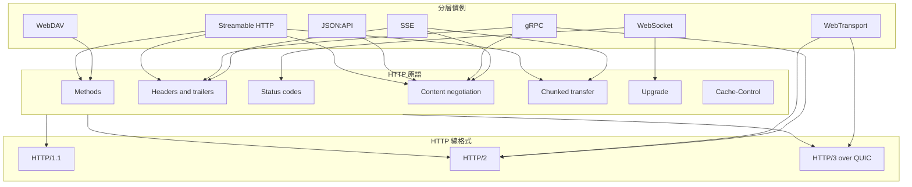

# [BEE-3008] HTTP 作為新協定的承載基底

:::info
HTTP 起初是文件抓取協定，後來成為新應用協定預設疊加其上的承載基底。RFC 9110 將 HTTP 定義為一族無狀態、請求/回應、語意可擴充、欄位命名空間已註冊的協定，這使得分層在工程上可行。本文盤點 SSE、WebSocket、gRPC、WebDAV、JSON:API、WebTransport 與 MCP 的 Streamable HTTP 各自重用了哪些 HTTP 原語，從線格式逐一檢視三個較舊的慣例，將 Streamable HTTP 視為當代案例研究，並指出哪些工作負載不適合疊加在 HTTP 上。
:::

## Context

RFC 9110 將 HTTP 定義為「a family of stateless, application-level, request/response protocols that share a generic interface, extensible semantics, and self-descriptive messages.」這四個性質——無狀態、通用介面、可擴充語意、自描述——讓另一個協定能搭乘在上層，而下層基底毋須理解承載內容的意義。

可擴充性存在於 HTTP 欄位中。RFC 9110 規定 HTTP「uses 'fields' to provide data in the form of extensible name/value pairs with a registered key namespace. Fields are sent and received within the header and trailer sections.」新協定可以引入自訂的請求與回應標頭，若跑在 HTTP/2 或 HTTP/3 還可使用 trailers，整個過程不需要升 HTTP 版本，也不需要要求中介裝置學習任何新東西。

長壽的回應主體是第三個被重用的原語。RFC 9112 規定「the chunked transfer coding wraps content in order to transfer it as a series of chunks, each with its own size indicator.」分塊傳輸讓 Server-Sent Events、HTTP/1.1 後備路徑上的 gRPC、以及 MCP 的 Streamable HTTP 能保持單一回應持續開啟，並隨資料抵達持續寫入位元組。

## Visual

RFC 9113 將 HTTP/2 描述為「an optimized transport for HTTP semantics. HTTP/2 supports all of the core features of HTTP but aims to be more efficient than HTTP/1.1.」RFC 9114 延續同樣的分離：HTTP/3 是「a mapping of HTTP semantics over the QUIC transport protocol, drawing heavily on the design of HTTP/2.」疊加在 HTTP 語意之上的協定，會繼承部署所選用的線格式。

## Example

### Server-Sent Events

WHATWG HTML Living Standard 將 SSE 定義為「this event stream format's MIME type is `text/event-stream`.」伺服器回傳一個正常的 HTTP 回應，搭配 `Content-Type: text/event-stream`，接著在事件抵達時寫入 UTF-8 行，倚賴分塊傳輸保持主體開啟。

恢復語意同樣留在 HTTP 內。同一份規範規定「the `Last-Event-ID` HTTP request header reports an `EventSource` object's last event ID string to the server when the user agent is to reestablish the connection.」重新連線的客戶端送出 `Last-Event-ID: <id>`，伺服器據此重播遺漏的事件。

### WebSocket

RFC 6455 只在開場握手時重用 HTTP：「The WebSocket client's handshake is an HTTP Upgrade request... The request MUST contain an `Upgrade` header field whose value MUST include the 'websocket' keyword.」伺服器以 `101 Switching Protocols` 回應，之後連線就切換到 WebSocket 框架。HTTP 提供入口（方法、標頭、狀態碼、`Upgrade` 機制），並在握手完成後退場。

### gRPC

gRPC over HTTP/2 規範將線格式設定為 `Content-Type: 'application/grpc' [('+proto' / '+json' / {custom})]`。請求中繼資料透過標準 HTTP/2 框架傳遞：「Request-Headers are delivered as HTTP2 headers in HEADERS + CONTINUATION frames.」回應遵循 `(Response-Headers *Length-Prefixed-Message Trailers) / Trailers-Only`，所以 gRPC 狀態碼存放於 HTTP/2 trailers 中。gRPC 所需的每一個框架原語，HTTP/2 都已經提供。

## Best Practices

- **MUST** 透過已註冊的媒體型別宣告自訂協定的線格式。JSON:API 即是這個模式的範例：「Its media type designation is `application/vnd.api+json`.」一個已註冊的 `Content-Type` 讓中介裝置能正確處理主體；按 RFC 9110，HTTP 欄位是可擴充的名稱/值命名空間，因此新增媒體型別不需要新版本的 HTTP。
- **SHOULD** 當操作對應到既有語意時，優先採用標頭層級的擴充。RFC 7240 的 `Prefer` 標頭是經典案例：「The Prefer request header field is used to indicate that particular server behaviors are preferred by the client but are not required for successful completion of the request.」當操作確實無法套用既有方法時，RFC 5789 為新增方法樹立了先例：「This proposal adds a new HTTP method, PATCH, to modify an existing HTTP resource.」
- **MUST** 在串流與長壽回應上設定 `Cache-Control` 指令。RFC 7234 規定「the 'Cache-Control' header field is used to specify directives for caches along the request/response chain.」沒有明確指令時，中介裝置會遵循預設儲存規則，可能儲存或重播原本應為即時的串流。
- **SHOULD** 將 HTTP 狀態碼視為傳輸層級的訊號，將應用層級的錯誤語意放在主體或 trailers 中。gRPC 將其狀態碼放在 HTTP/2 trailers（`(Response-Headers *Length-Prefixed-Message Trailers)`）正是此模式的實踐，把應用回應與 HTTP 層級的傳輸結果區分開來。

## 慣例目錄

| 慣例 | 倚賴的 HTTP 原語 | 定義規範 | 適用工作負載 |
| --- | --- | --- | --- |
| Server-Sent Events | `text/event-stream` 媒體型別、分塊傳輸、`Last-Event-ID` 標頭 | WHATWG HTML Living Standard, "Server-sent events" | 在單一回應上提供伺服器到客戶端的事件串流 |
| WebSocket | 帶 `websocket` 關鍵字的 HTTP `Upgrade` 請求、`101 Switching Protocols` | RFC 6455 | 在一次性 HTTP 握手後進行雙向框架式訊息傳遞 |
| gRPC | HTTP/2 HEADERS + CONTINUATION 框、`application/grpc` 內容型別、HTTP/2 trailers 攜帶狀態 | gRPC Authors, "gRPC over HTTP/2" | 倚賴 HTTP/2 框架、強型別 schema 的 RPC |
| WebDAV | 新增的 HTTP 方法（PROPFIND、PROPPATCH、MKCOL、COPY、MOVE、LOCK、UNLOCK） | RFC 4918 | 在 HTTP 資源上進行帶鎖定的分散式編寫 |
| JSON:API | 在純 HTTP 上使用單一已註冊媒體型別 `application/vnd.api+json` | jsonapi.org | 所有約定都能放進 `Content-Type` 的 API 慣例 |
| Streamable HTTP（MCP） | 單一端點同時支援 POST 與 GET、以內容協商選擇 `application/json` 或 `text/event-stream`、`Mcp-Session-Id` 標頭、`Last-Event-ID` 恢復 | Model Context Protocol, Transports (2025-03-26) | 代理人對伺服器的訊息傳遞，可能以一次性或串流回覆 |
| WebTransport | 在 HTTP/3 或 HTTP/2 連線上的 session、多重串流、單向串流、datagrams | W3C, "WebTransport" | 在 HTTP 傳輸之上的多重串流與不可靠傳輸 |

## 案例研究：Streamable HTTP

Model Context Protocol 的 Streamable HTTP 傳輸是組合既有 HTTP 原語以達成分層的範例。它使用的每一個原語都已經定義在 HTTP 的其他地方；它的貢獻在於組合的選擇。

第一個決策是單一端點。規範指出：「The server **MUST** provide a single HTTP endpoint path (hereafter referred to as the **MCP endpoint**) that supports both POST and GET methods.」兩個方法都落在同一個 URL，整個協定的對外介面都藏在單一路徑後面。

主體形態由內容協商選擇。規範規定：「If the input contains any number of JSON-RPC *requests*, the server **MUST** either return `Content-Type: text/event-stream`, to initiate an SSE stream, or `Content-Type: application/json`, to return one JSON object.」標準的 `Accept` 與 `Content-Type` 機制扮演了協定選擇的角色：一個請求可以由一個 JSON 物件或一個長壽的 SSE 串流回覆，視何者合適。

session 親和性搭乘在單一個自訂標頭上。規範規定：「A server using the Streamable HTTP transport **MAY** assign a session ID at initialization time, by including it in an `Mcp-Session-Id` header on the HTTP response containing the `InitializeResult`.」session 因此成為疊加在 HTTP 之上的標頭慣例，停留在 HTTP 框架內，毋須新增連線層級的概念。

恢復則完整重用 SSE 機制。規範規定：「If the client wishes to resume after a broken connection, it **SHOULD** issue an HTTP GET to the MCP endpoint, and include the `Last-Event-ID` header to indicate the last event ID it received.」WHATWG 為 SSE 定義的同一個 `Last-Event-ID` 標頭，也用於處理 MCP 的恢復。

單一端點、內容協商的主體、自訂 session 標頭、SSE 恢復：四個既有原語組合而成的傳輸。

## 何時不應在 HTTP 上分層

有三類工作負載落在 HTTP 適合的範圍之外。

**受限裝置與不穩定網路。** RFC 7252 為 HTTP 過重的環境引入 CoAP：「The nodes often have 8-bit microcontrollers with small amounts of ROM and RAM, while constrained networks such as IPv6 over Low-Power Wireless Personal Area Networks (6LoWPANs) often have high packet error rates and a typical throughput of 10s of kbit/s... The goal of CoAP is not to blindly compress HTTP, but rather to realize a subset of REST common with HTTP but optimized for M2M applications.」CoAP 保留 REST 形態，但拋棄 HTTP 本身。

**單次請求開銷過高的 M2M 與 IoT。** OASIS 將 MQTT 描述為「light weight, open, simple, and designed to be easy to implement... ideal for use in many situations, including constrained environments such as for communication in Machine to Machine (M2M) and Internet of Things (IoT) contexts where a small code footprint is required and/or network bandwidth is at a premium.」在長壽 TCP 連線上的 pub/sub broker，可徹底避開 HTTP 每次請求的框架成本。

**亞毫秒級雙向流量。** 當工作負載需要 HTTP 延遲下限以下的原始串流語意時，應用會下沉至 QUIC。RFC 9000 規定：「Endpoints communicate in QUIC by exchanging QUIC packets... QUIC packets are carried in UDP datagrams to better facilitate deployment in existing systems and networks. Streams in QUIC provide a lightweight, ordered byte-stream abstraction to an application.」走 HTTP 之下而非之上，能取得串流與 datagrams，免於請求/回應的形態約束。

更下層還有一類較舊的協定。例如 SSH 與 IRC 直接跑在原始 socket 上，從未疊加在 HTTP 上。它們提醒我們「現在一切都是 HTTP」是過度概化的說法。

## Related Topics

- [HTTP/1.1、HTTP/2、HTTP/3](/zh-tw/networking-fundamentals/http-versions) — 本文承載基底所搭乘的線格式
- [代理與反向代理](/zh-tw/networking-fundamentals/proxies-and-reverse-proxies) — 自訂 HTTP 慣例必須通過的中介裝置
- [Long-Polling、SSE 與 WebSocket 架構](/zh-tw/distributed-systems/long-polling-sse-and-websocket-architecture) — 對 Example 中三個慣例的更深入處理
- [gRPC 串流模式](/zh-tw/distributed-systems/grpc-streaming-patterns) — 本文展示之 gRPC 慣例的實務指引
- [Model Context Protocol（MCP）](/zh-tw/ai-backend-patterns/model-context-protocol-mcp) — 本文案例研究中 Streamable HTTP 傳輸所屬的協定

## References

- IETF, "HTTP Semantics," RFC 9110 (2022). https://www.rfc-editor.org/rfc/rfc9110.html
- IETF, "HTTP/1.1," RFC 9112 (2022). https://www.rfc-editor.org/rfc/rfc9112.html
- IETF, "HTTP/2," RFC 9113 (2022). https://www.rfc-editor.org/rfc/rfc9113.html
- IETF, "HTTP/3," RFC 9114 (2022). https://www.rfc-editor.org/rfc/rfc9114.html
- IETF, "QUIC: A UDP-Based Multiplexed and Secure Transport," RFC 9000 (2021). https://www.rfc-editor.org/rfc/rfc9000.html
- IETF, "The WebSocket Protocol," RFC 6455 (2011). https://www.rfc-editor.org/rfc/rfc6455.html
- IETF, "HTTP Extensions for Web Distributed Authoring and Versioning (WebDAV)," RFC 4918 (2007). https://www.rfc-editor.org/rfc/rfc4918.html
- IETF, "HTTP/1.1: Caching," RFC 7234 (2014). https://www.rfc-editor.org/rfc/rfc7234.html
- IETF, "Prefer Header for HTTP," RFC 7240 (2014). https://www.rfc-editor.org/rfc/rfc7240.html
- IETF, "PATCH Method for HTTP," RFC 5789 (2010). https://www.rfc-editor.org/rfc/rfc5789.html
- IETF, "The Constrained Application Protocol (CoAP)," RFC 7252 (2014). https://www.rfc-editor.org/rfc/rfc7252.html
- WHATWG, "Server-sent events," HTML Living Standard. https://html.spec.whatwg.org/multipage/server-sent-events.html
- gRPC Authors, "gRPC over HTTP/2." https://github.com/grpc/grpc/blob/master/doc/PROTOCOL-HTTP2.md
- W3C, "WebTransport" (Editor's Draft / Working Draft). https://www.w3.org/TR/webtransport/
- Anthropic et al., "Model Context Protocol — Transports (2025-03-26)." https://modelcontextprotocol.io/specification/2025-03-26/basic/transports
- OASIS, "MQTT Version 5.0 OASIS Standard" (2019). https://docs.oasis-open.org/mqtt/mqtt/v5.0/os/mqtt-v5.0-os.html
- JSON:API Working Group, "JSON:API." https://jsonapi.org/
