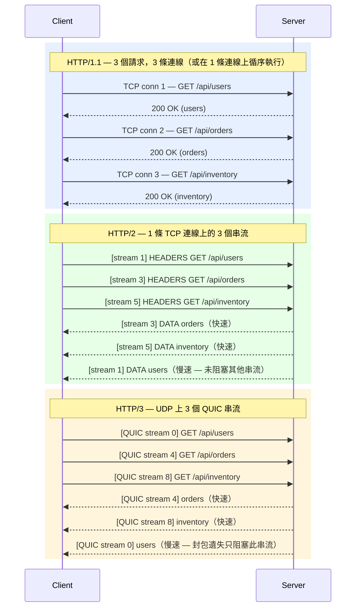

# [BEE-3003] HTTP/1.1、HTTP/2、HTTP/3

:::info
協定演進、多工處理（multiplexing）、隊頭阻塞（head-of-line blocking）與 QUIC — 三個版本之間的差異，以及為何對後端服務至關重要。
:::

## 背景

HTTP（HyperText Transfer Protocol，超文本傳輸協定）是驅動幾乎所有 Web 與 API 流量的應用層協定。三個主要版本中，傳輸模型有根本性的變化：從同步的文字格式請求（HTTP/1.1），到透過 TCP 的二進位幀多工串流（HTTP/2），再到基於 UDP 的 QUIC 傳輸多工串流（HTTP/3）。每一步都是為了解決前一版本的具體瓶頸。

理解這些差異有助於做出明智的決策：何處終止協定版本、如何設定內部服務、以及預期哪些維運限制。

**規範性參考資料：**
- [RFC 9110 — HTTP Semantics（跨所有版本共用）](https://datatracker.ietf.org/doc/html/rfc9110)
- [RFC 9113 — HTTP/2](https://datatracker.ietf.org/doc/html/rfc9113)
- [RFC 9114 — HTTP/3](https://datatracker.ietf.org/doc/html/rfc9114)
- [High Performance Browser Networking — HTTP/2](https://hpbn.co/http2/)（Ilya Grigorik）

## 原則

**根據路徑的延遲與可靠性特性選擇 HTTP 版本。不要假設 CDN 邊緣處理了一切 — 在每一個重複使用持久連線的內部跳點上啟用 HTTP/2。**

## HTTP/1.1

發佈於 RFC 2068（1997），後修訂為 RFC 7230–7235（2014），目前已整合至 RFC 9110–9112。儘管歷史悠久，HTTP/1.1 在內部服務對服務（service-to-service）的流量中仍被廣泛使用。

### 持久連線（Persistent Connections）

HTTP/1.0 對每個請求都開啟一條新的 TCP 連線。HTTP/1.1 預設加入了 `Connection: keep-alive` — 同一條 TCP 連線可跨多個循序請求重複使用，消除了重複 TCP 握手與慢啟動（slow-start）的成本。

### Pipelining 及其限制

HTTP/1.1 定義了 pipelining：用戶端可在不等待回應的情況下連續傳送多個冪等請求（`GET`、`HEAD` 等）。實務上 pipelining 幾乎都被停用，原因如下：

- 伺服器必須**依序**回應。第一個請求若緩慢，後續所有回應都被阻塞，這就是 HTTP 層的**隊頭阻塞（head-of-line blocking，HOL blocking）**。
- 代理（proxy）往往無法正確處理 pipelined 連線。
- 錯誤恢復複雜。

### 「六條連線」的變通方法

瀏覽器透過對每個來源開啟最多 **六條並行 TCP 連線**來繞開 HOL blocking。這雖然平行化了請求，卻也倍增了握手成本、記憶體用量與伺服器檔案描述符（file descriptor）的消耗。這是用戶端的 hack，並非協定本身的解決方案。

### Domain Sharding

將資源分散至多個子網域（例如 `static1.example.com`、`static2.example.com`），可讓瀏覽器開啟超過六條並行連線。這是 HTTP/1.1 下有效的最佳化技巧。**在 HTTP/2 下反而有害** — 詳見下方「常見錯誤」。

## HTTP/2

標準化為 RFC 7540（2015），修訂為 RFC 9113（2022）。HTTP/2 保留與 HTTP/1.1 相同的 HTTP 語意（methods、status codes、headers），但完全替換了線路格式（wire format）。

### 二進位幀層（Binary Framing Layer）

HTTP/2 以**二進位幀層**取代 HTTP/1.1 的換行分隔文字格式。每則訊息被拆分成帶有類型的幀（frames）：DATA、HEADERS、SETTINGS、PUSH_PROMISE 等，每個幀帶有 9 位元組的標頭，包含：幀長度、幀類型、旗標（flags）、31 位元的**串流識別碼（stream identifier）**。

優點：
- 解析無歧義（沒有 chunked-encoding 的邊角案例）。
- 不同邏輯請求的幀可在線路上交錯傳輸。
- 單一 TCP 連線承載同一來源的所有流量。

### 多工處理（Multiplexing）

多個獨立的**串流（streams）**共用一條連線。每個串流有數字 ID。來自不同串流的幀在線路上被多工傳輸，並在接收端獨立重組。

這消除了 HTTP 層的 HOL blocking：串流 3 上的緩慢回應不會延遲串流 5 上幀的傳遞。

:::warning TCP HOL Blocking 依然存在
HTTP/2 的多工處理建立在單一 TCP 連線上。若有 TCP 封包遺失，該連線上的**所有串流**都會被暫停，直到重傳完成 — 這是 TCP 層的隊頭阻塞。HTTP/3 解決了這個問題。
:::

### HPACK 標頭壓縮

HTTP/1.1 在每次請求中以純 ASCII 文字傳送標頭，包含大量重複欄位（`User-Agent`、`Cookie`、`Accept-*`）。HTTP/2 使用 **HPACK**（RFC 7541）壓縮標頭：

- **靜態表（Static table）**：61 個預定義項目，涵蓋最常見的標頭名稱–值對（如 `:method: GET`、`:scheme: https`）。
- **動態表（Dynamic table）**：每條連線維護一個 FIFO 表，儲存最近傳送過的標頭。
- **Huffman 編碼**：對字串字面值使用可變長度二進位編碼。

HPACK 平均可將標頭大小減少約 30%。更重要的是，它避免了困擾 SPDY zlib 方案的壓縮 Oracle 攻擊（CRIME、BREACH）。

### Server Push

伺服器可在客戶端請求資源前，透過 `PUSH_PROMISE` 幀主動推送資源。被推送的資源：
- 可被用戶端快取並跨頁重複使用。
- 可被用戶端拒絕（`RST_STREAM`）。

實務上，server push 難以正確使用 — 它經常傳送用戶端已快取的資源，浪費頻寬。主流瀏覽器已移除或棄用相關支援。**不要在服務設計中依賴 server push。**

### 串流優先順序（Stream Prioritisation）

用戶端可為每個串流指定權重（1–256）並宣告串流間的依賴關係，形成優先樹。這讓伺服器可優先處理高優先級的回應（例如關鍵 API 呼叫）。實務上各伺服器實作對優先順序的支援程度不一。

### ALPN 協商

HTTP/2 透過 TLS 握手中的 **ALPN（Application-Layer Protocol Negotiation，應用層協定協商）**擴充來協商。用戶端在 ALPN 清單中提出 `h2`（以及可選的 `http/1.1`）；伺服器若支援則選擇 `h2`。無需額外往返。這也是為何 HTTP/2 在實務上要求 TLS，即便規範允許明文的 `h2c`。

## HTTP/3

標準化為 RFC 9114（2022）。HTTP/3 將 HTTP 語意對應至 **QUIC**（RFC 9000）— 一個建立在 UDP 之上的新傳輸協定。

### QUIC 傳輸

QUIC 最初由 Google 設計（以 SPDY-over-UDP 為起點），後由 IETF 標準化。主要特性：

| 特性 | 說明 |
|---|---|
| 傳輸層 | UDP |
| 加密 | TLS 1.3 強制，內建於協定 |
| 串流模型 | 獨立位元組串流 — 一條串流的封包遺失不阻塞其他串流 |
| Connection ID | 連線以 ID 識別，非四元組 — 可在 IP 變更後存活（行動裝置換手） |
| 1-RTT 建立 | 加密與傳輸握手合併在一次往返中完成 |
| 0-RTT 建立 | 已恢復的連線可以零額外往返傳送資料 |

### 無 TCP HOL Blocking

由於 QUIC 串流在傳輸層獨立，遺失的 UDP 資料報只會暫停它所屬的那一條串流。所有其他串流持續不受影響。這是相對於 TCP 上 HTTP/2 的核心優勢。

### 0-RTT 連線恢復

曾連線過伺服器的用戶端可儲存 session ticket，以 **0-RTT 模式**恢復 QUIC 連線，在第一個封包中就傳送 HTTP 請求，完全消除回訪用戶端的握手延遲。

:::warning 0-RTT 重放攻擊風險
0-RTT 資料不受重放攻擊保護。只有冪等請求（如 `GET`）才應在 0-RTT 模式下傳送。修改性請求（`POST`、`PATCH`、`DELETE`）必須等待 1-RTT 握手完成。
:::

### HTTP/3 的 ALPN

HTTP/3 使用 ALPN token `h3`。伺服器透過 `Alt-Svc` HTTP 回應標頭或 `HTTPS` DNS 記錄廣告 HTTP/3 支援，引導用戶端並行嘗試在 UDP/443 上建立 QUIC 連線（類似 QUIC vs TCP 的「Happy Eyeballs」方式）。

### 防火牆與中間設備問題

QUIC 在 UDP 上執行。許多企業防火牆與中間設備（middleboxes）會封鎖或限速 UDP port 443。當 QUIC 被封鎖時，用戶端會回退至 TCP 上的 HTTP/2。這個回退是正確且預期的行為 — 但這意味著在企業或受限網路環境中，HTTP/3 無法端對端保證可用。務必確保 HTTP/2 作為備援可用。

## 並排比較

**HOL blocking 範例：** 假設 `/api/users` 需要 500 ms，其他兩個只需 20 ms。

- **HTTP/1.1**（單一連線）：orders 與 inventory 在 users 後面等待 — 總計約 540 ms。
- **HTTP/1.1**（3 條並行連線）：三個請求同時開始 — 總計約 500 ms，但有 3 倍的連線開銷。
- **HTTP/2**：三個請求在同一條連線上開始；orders 與 inventory 約 20 ms 完成；users 約 500 ms 完成，彼此之間無 HOL 延遲。
- **HTTP/3**：與 HTTP/2 相同，但 users 回應期間的封包遺失完全不延遲 orders 或 inventory。

## 協定比較表

| 特性 | HTTP/1.1 | HTTP/2 | HTTP/3 |
|---|---|---|---|
| 線路格式 | 文字 | 二進位幀 | 二進位幀（QUIC） |
| 傳輸層 | TCP | TCP | UDP（QUIC） |
| 每來源連線數 | 1–6（瀏覽器） | 1 | 1 |
| 多工處理 | 無（pipelining 損壞） | 有（串流） | 有（QUIC 串流） |
| HTTP HOL blocking | 有 | 無 | 無 |
| TCP HOL blocking | 有 | 有 | 無（無 TCP） |
| 標頭壓縮 | 無 | HPACK | QPACK |
| 需要 TLS | 否（但建議） | 實際上是（ALPN） | 是（內建） |
| 0-RTT | 否 | 否 | 是 |
| Server Push | 否 | 是（實務上已棄用） | 有限 |
| 連線遷移（Connection Migration） | 否 | 否 | 是（QUIC Connection ID） |
| ALPN token | `http/1.1` | `h2` | `h3` |

## 各版本何時適用於後端服務

### HTTP/1.1 仍然適用的情境

- 與不支援 HTTP/2 的舊式內部服務通訊。
- 使用簡單的腳本或工具，HTTP/2 支援增加複雜度但沒有可測量的收益。
- 在 HTTP/2 代理後方，入站 h2 被翻譯為上游 HTTP/1.1（在舊式應用伺服器中很常見）。

### HTTP/2 應為內部服務的預設值

大多數技術棧中最常被忽略的機會：**HTTP/2 只在邊緣（CDN、負載均衡器）啟用，內部服務間並未啟用**。當你的 API gateway 或服務網格將入站 HTTP/2 翻譯為對上游的 HTTP/1.1 呼叫時，你就失去了多工處理與連線重用 — 對於發出大量小型並行請求的服務代價尤其昂貴。

應在以下位置啟用 HTTP/2：
- 服務對服務的 gRPC（強制要求 HTTP/2 / h2c）。
- 具有高請求並發的內部 REST 服務。
- 任何每條連線處理超過 1 個並發請求的 proxy-to-backend 連結。

### HTTP/3 / QUIC 適用的情境

- 你掌控邊緣，且用戶端在行動裝置或高封包遺失率的網路上（QUIC 的連線遷移與無 TCP HOL 優勢在此最明顯）。
- 降低首次訪客的連線建立延遲至關重要（0-RTT）。
- 你正在部署公開 API，且你的 CDN/負載均衡器已支援（Cloudflare、AWS CloudFront、Google Cloud）。

除非所有防火牆都允許 UDP/443，否則不要在純粹的內部服務對服務流量上啟用 HTTP/3 — 在資料中心內部，回退的代價是不必要的摩擦。

### 連線聚合（Connection Coalescing）

HTTP/2 與 HTTP/3 支援**連線聚合**：若兩個來源解析到相同的 IP，且共享 TLS 憑證（例如萬用字元憑證），用戶端可重用現有連線而非開啟新連線。這對 CDN 架構很重要 — 它比簡單的每主機名稱連線池進一步減少連線數。

## 常見錯誤

### 1. 開啟過多 HTTP/1.1 連線

對單一上游建立大型連線池（例如 100 條連線）會在伺服器端產生等量的開銷：檔案描述符、記憶體、TLS session。在 HTTP/2 下，每個後端實例通常只需要**一條**持久連線，或在需要超過每條連線串流限制時建立小型連線池（大多數實作的預設值 `SETTINGS_MAX_CONCURRENT_STREAMS` 為 100）。

### 2. 依賴 HTTP/2 Server Push

Server push 在理論上適用於在 HTML 旁主動傳送 CSS/JS。實務上它有快取盲點問題（伺服器無法知道用戶端已快取什麼），主流瀏覽器已棄用或移除支援。不要圍繞它設計新服務。改用 `103 Early Hints` 進行預載。

### 3. 未在內部服務上啟用 HTTP/2

最常見的部署缺口。只在 CDN 邊緣啟用 HTTP/2，意味著每個內部跳點仍然承受 HTTP/1.1 的成本。在所有持久連線重用有意義的內部監聽器上啟用 `h2c`（HTTP/2 明文）或 TLS + `h2`。

### 4. 忽視 QUIC / UDP 防火牆問題

UDP port 443 在企業防火牆、資安設備與雲端安全群組中經常被封鎖或限速。在依賴 HTTP/3 處理外部流量之前，請驗證你的網路路徑允許 UDP/443，並確保用戶端回退至 HTTP/2 的機制有監控和告警。

### 5. 在 HTTP/2 下使用 Domain Sharding

Domain sharding（將資源分散至多個子網域）是有效的 HTTP/1.1 最佳化。在 HTTP/2 下**主動有害**：它強制開啟多條連線（而一條就夠了）、破壞連線聚合、增加 TLS 握手成本。升級至 HTTP/2 時請移除 domain sharding。

## 相關 BEE

- [BEE-3001 — TCP/IP and the Network Stack](./50.md)：TCP 握手、慢啟動，以及為何 HTTP/3 以 QUIC 取代 TCP。
- [BEE-3004 — TLS/SSL Handshake](./53.md)：ALPN 擴充、TLS 1.3 與 QUIC 的整合、憑證協商。
- [BEE-3005 — Load Balancers](./54.md)：HTTP/2 與 HTTP/3 的第 7 層終止，對上游的協定翻譯。
- [BEE-4001 — REST API Design](70.md)：協定版本如何影響 API 延遲與用戶端連線策略。
- [BEE-9006 — HTTP Caching](205.md)：Cache-Control 語意定義於 RFC 9110，在所有 HTTP 版本中完全相同。
