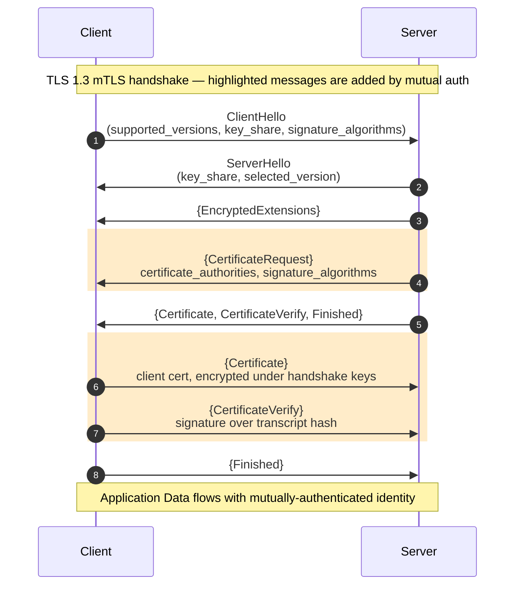

# [BEE-3007] Mutual TLS (mTLS) 握手與伺服器設定

:::info
Mutual TLS 在基礎 TLS 握手中加入伺服器端的 `CertificateRequest` 與用戶端的 `Certificate` + `CertificateVerify`：雙方都能證明擁有與對方所信任憑證相綁定的私鑰，讓連線本身承載經過驗證的身份。
:::

## 背景

標準 TLS 只驗證伺服器身份。當瀏覽器連線到 `api.example.com`，它會對伺服器憑證做 CA 信任鏈驗證，確認伺服器持有相符的私鑰；但用戶端在這一層是匿名的，TLS 會話本身不承載任何對呼叫方的驗證身份。後續的身份驗證機制（session cookie、OAuth bearer token、API key）都建立在這個匿名傳輸層之上。對人類使用者而言這沒問題：登入流程在應用層建立身份，瀏覽器將它綁定到會話。對內部服務對服務的流量而言，這裡沒有互動式登入、也沒有可驗證的人類身份，在傳輸層接受匿名呼叫方即是零信任網路所拒絕的隱式信任。

mTLS 位於應用層驗證之下、TCP 之上。連線本身承載經過驗證的對端身份：伺服器在每次請求時直接從 TLS 會話狀態讀取用戶端憑證，省去額外的驗證往返。這樣就把兩件原本需要各自處理的事情壓進同一次握手：傳輸層的機密性與身份層的驗證一起談妥。終止 mTLS 的應用程式無需自行發起挑戰-回應，只需檢查握手期間已驗證過的對端憑證。

TLS 1.2 在 RFC 5246 §7.4.4（2008 年 8 月發布）中定義了選用的用戶端驗證，這在長期存在的內部服務網格中仍常見。該版本裡，用戶端的 `Certificate` 訊息以明文傳輸，被動監聽網路的攻擊者可以看出哪個用戶端憑證被提交，對內部工作負載身份而言是隱私洩漏。TLS 1.3（RFC 8446，2018 年 8 月發布）重新設計了握手流程：`EncryptedExtensions` 之後的所有訊息都在握手流量金鑰下加密，因此用戶端 `Certificate` 不再暴露在線上。TLS 1.3 也引入 `post_handshake_auth` 擴充，允許伺服器在連線建立後要求用戶端驗證；適合呼叫方在會話中途嘗試存取更敏感資源的情境。

要了解開啟 mTLS 的架構動機，參閱 BEE-2007（零信任安全架構）；要了解 mTLS 與 JWT 服務 Token、雲端 IAM 工作負載身份的策略比較，參閱 BEE-19048（服務對服務驗證）。本文聚焦於握手機制與實務伺服器設定。

## 原則

相較於單向 TLS，mTLS 多了三個握手訊息：

- **`CertificateRequest`**（RFC 8446 §4.3.2）：由伺服器發出，表示它要求用戶端進行驗證，並限制用戶端可用的 CA 與簽章演算法。
- **用戶端 `Certificate`**（RFC 8446 §4.4.2）：由用戶端回應，攜帶自己的憑證鏈。
- **用戶端 `CertificateVerify`**（RFC 8446 §4.4.3）：用用戶端的私鑰對握手謄本進行簽章。

`CertificateVerify` 是結構上不可或缺的一步。憑證本身是公開資料，觀察過任一次 mTLS 握手的網路攻擊者都持有一份合法用戶端的憑證複本；若沒有 `CertificateVerify`，只要出示這份複本就會通過驗證。對謄本雜湊的簽章證明了提交者擁有與憑證公鑰相符的私鑰，這才是真正的驗證行為。

身份綁定位於 Subject Alternative Name（SAN）層級。URI SAN 承載 SPIFFE 形式的工作負載身份（`spiffe://trust-domain/service-name`）；DNS SAN 承載主機名形式的身份。RFC 2818 於 2000 年棄用了以 CN 為基礎的主機名比對，主流 TLS 函式庫直接拒絕只有 CN 的憑證。本文聚焦於 TLS 層如何驗證身份；底層憑證的簽發、輪替與撤銷則屬於 BEE-2011（TLS 憑證生命週期與 PKI）的範疇。

## 視覺化



以 `{...}` 包裹的訊息皆在握手加密下傳輸（TLS 1.3 特性）。圖中標示的三個訊息，就是 mTLS 相較單向 TLS 所新增的部分。

## 協定細節 — TLS 1.3

### CertificateRequest（RFC 8446 §4.3.2）

TLS 1.3 把 `CertificateRequest` 移進伺服器的加密擴充飛行（flight）中。伺服器在 `EncryptedExtensions` 之後、自己的 `Certificate`、`CertificateVerify` 與 `Finished` 之前送出它。`CertificateRequest` 內的兩個擴充限制了用戶端可以送回的內容：

- `certificate_authorities` 攜帶伺服器接受的 CA Distinguished Name 清單。若用戶端同時持有多家 CA 簽發的憑證，就用這份清單挑選哪一張要提交。空的或缺少 `certificate_authorities` 擴充表示「用戶端信任的任何 CA 都可以」，伺服器把信任錨的把關留到自己的驗證階段。
- `signature_algorithms` 限制了用戶端後續的 `CertificateVerify` 可用的簽章演算法。用戶端必須從這份清單挑一個、並且其私鑰類型支援的簽章方案。

### 用戶端 Certificate（RFC 8446 §4.4.2）

用戶端在收到並驗證完伺服器的 `Finished` 之後，才送出自己的 `Certificate` 訊息。在 TLS 1.3 中這個訊息走在握手加密下，被動監聽網路的觀察者無法得知用戶端出示了哪一張憑證；相較 TLS 1.2（用戶端憑證在明文中），這是隱私層級的改進。

若用戶端找不到符合伺服器 `certificate_authorities` 清單的憑證，可以送出 `certificate_list` 為空的 `Certificate` 訊息。接下來由伺服器決定：以 `certificate_required` 警報終止握手（若用戶端驗證是必要的），或無驗證身份繼續（若用戶端驗證為選用）。

### 用戶端 CertificateVerify（RFC 8446 §4.4.3）

`CertificateVerify` 是對握手謄本的簽章，用用戶端的私鑰計算，所用的簽章方案必須在伺服器 `signature_algorithms` 擴充宣告的清單內。這是所有權證明的一步。從過往連線擷取到合法用戶端憑證的攻擊者可以重放該憑證；他們無法重放簽章，因為每次連線的謄本雜湊都不同，相符的私鑰只在真正的擁有者手上。

若前一步用戶端送出的是空的 `Certificate`，`CertificateVerify` 就省略。

### 伺服器端驗證

伺服器收到用戶端的 `Certificate` 與 `CertificateVerify` 之後，必須完成以下檢查才接受請求：

1. **憑證鏈建構** — 從提交的葉憑證，往伺服器的用戶端 CA 信任庫裡的信任錨建出一條鏈。
2. **有效期** — 拒絕 `notAfter` 已過期、或 `notBefore` 尚未生效的憑證。
3. **SAN 比對** — 將 URI SAN（SPIFFE 形式的身份）或 DNS SAN（主機名形式的身份）比對到伺服器的授權策略。
4. **CertificateVerify 簽章** — 使用提交憑證中的公鑰驗證該簽章是否對應到握手謄本雜湊。
5. **選用的撤銷檢查** — 若部署方使用撤銷機制，檢查 CRL、OCSP 或 OCSP stapling。短期憑證（壽命以小時計、而非以月計）可以讓憑證在外洩變得有用之前就過期，省去撤銷這一步。

### 握手後用戶端驗證（RFC 8446 §4.6.2）

TLS 1.3 引入 `post_handshake_auth` 擴充。用戶端在 `ClientHello` 中帶上這個擴充，表示它接受握手後驗證。收到該擴充的伺服器，可以在已建立的連線上任何時刻送出一次 `CertificateRequest`，用戶端回應的 `Certificate` + `CertificateVerify` 會綁定到新的謄本。這適合這種場景：初始 TLS 握手以較弱的身份驗證，較強的身份只在呼叫方嘗試存取敏感資源時才被要求。完整訊息流程請見 RFC 8446 §4.6.2。

## TLS 1.2 差異

多數新建的內部環境應直接以 TLS 1.3 為預設；TLS 1.2 在長期存在的服務網格與無法升級的舊用戶端中仍有其存在空間。與 mTLS 相關的差異：

- **用戶端 `Certificate` 在明文中傳輸。** TLS 1.2 的 `ChangeCipherSpec` 在用戶端 `Certificate` 之後才送出，所以憑證在線上以明文傳輸。被動觀察者會得知哪個用戶端身份連到了哪個伺服器。這項隱私洩漏在 TLS 1.3 中被修復，作法是把該訊息移到握手加密之下。
- **`CertificateRequest` 的飛行位置。** 伺服器在 `ServerKeyExchange` 與 `ServerHelloDone` 之間送出，與 `ServerHelloDone` 在同一個飛行中。該訊息在明文中傳輸，因為紀錄層加密要到 `ChangeCipherSpec` 之後才啟用。
- **沒有握手後用戶端驗證。** TLS 1.2 沒有與 `post_handshake_auth` 對應的機制；用戶端驗證必須在初始握手協商，或透過重新協商（renegotiation）安排，而重新協商因 TLS renegotiation 攻擊已被大多數部署停用。
- **簽章演算法列舉不同。** RFC 5246 §7.4.1.4.1 定義了 TLS 1.2 `CertificateVerify` 所用的 `SignatureAndHashAlgorithm` 值；TLS 1.3 以 RFC 8446 §4.2.3 的 `SignatureScheme` 取而代之。

mTLS 的實務設定（nginx 設定、Go 伺服器設定、`openssl s_client` 參數）在兩個版本中相同，除非另行說明。

## 實務 — 在伺服器上設置 mTLS

業界常見的兩種拓撲：（A）在反向代理終止 mTLS，通過私有網段把已驗證身份傳給上游；（B）在應用程式本身終止 mTLS。兩者都從相同的憑證材料開始。

### 1. 產生 CA、伺服器憑證與用戶端憑證

```bash
# Root CA (self-signed, kept offline in production)
openssl req -x509 -newkey ec -pkeyopt ec_paramgen_curve:P-256 \
  -keyout ca.key -out ca.crt -days 3650 -nodes \
  -subj "/CN=internal-root-ca"

# Server certificate (SAN = DNS name the client will connect to)
openssl req -new -newkey ec -pkeyopt ec_paramgen_curve:P-256 \
  -keyout server.key -out server.csr -nodes \
  -subj "/CN=api.internal"
openssl x509 -req -in server.csr -out server.crt -days 90 \
  -CA ca.crt -CAkey ca.key -CAcreateserial \
  -extfile <(printf "subjectAltName=DNS:api.internal")

# Client certificate (SAN = URI, SPIFFE-style identity)
openssl req -new -newkey ec -pkeyopt ec_paramgen_curve:P-256 \
  -keyout client.key -out client.csr -nodes \
  -subj "/CN=orders-service"
openssl x509 -req -in client.csr -out client.crt -days 90 \
  -CA ca.crt -CAkey ca.key -CAcreateserial \
  -extfile <(printf "subjectAltName=URI:spiffe://internal.example.com/orders-service")
```

產出結果是三實體結構：一張自簽的 root CA 同時簽發伺服器與用戶端憑證；伺服器憑證的 DNS SAN 供用戶端驗證主機名；用戶端憑證的 URI SAN 承載 SPIFFE 形式的工作負載身份。正式部署中，root CA 的金鑰應留在離線環境（或 HSM），由一張短期中繼 CA 負責實際簽發；完整的 PKI 做法請見 BEE-2011。

### 2. 拓撲 A — 在 Nginx 終止 mTLS、上游明文

```nginx
server {
    listen 443 ssl;
    server_name api.internal;
    ssl_certificate     /etc/nginx/server.crt;
    ssl_certificate_key /etc/nginx/server.key;

    ssl_client_certificate /etc/nginx/ca.crt;
    ssl_verify_client on;
    ssl_verify_depth 2;

    location / {
        # Fail closed: only forward when the TLS module verified the client cert
        if ($ssl_client_verify != SUCCESS) { return 403; }

        proxy_pass http://backend:8080;
        proxy_set_header X-SSL-Client-Verify $ssl_client_verify;
        proxy_set_header X-SSL-Client-S-DN   $ssl_client_s_dn;
        proxy_set_header X-SSL-Client-Cert   $ssl_client_escaped_cert;
    }
}
```

**關鍵提醒：可信標頭偽造風險。** 透過 `X-SSL-Client-*` 標頭傳遞身份，只有在上游網段是攻擊者無法直接抵達的私有網路時才安全。若 `backend:8080` 從公網可達，攻擊者發出一個帶偽造 `X-SSL-Client-S-DN` 標頭的純 HTTP 請求，就整個繞過 Nginx。把上游綁在 `localhost` 或私有子網，在防火牆或 security group 層級強制這一點，並且要求上游拒絕任何非來自代理的入站請求（例如在代理與上游之間也跑 mTLS，或使用 IP 允許清單）。

`$ssl_client_escaped_cert` 帶的是用戶端憑證的 URL 編碼 PEM 全文，SAN 由上游自行從憑證解析。只傳遞 DN 是常見的簡化做法，但不足以表達 SPIFFE 形式的身份；需要 URI SAN 時要解析完整憑證。

### 3. 拓撲 B — mTLS 一路到 Go 應用程式

```go
package main

import (
    "crypto/tls"
    "crypto/x509"
    "net/http"
    "os"
    "strings"
)

func mustLoadCAPool(caPath string) *x509.CertPool {
    pem, err := os.ReadFile(caPath)
    if err != nil {
        panic(err)
    }
    pool := x509.NewCertPool()
    if ok := pool.AppendCertsFromPEM(pem); !ok {
        panic("failed to parse CA certificate")
    }
    return pool
}

func main() {
    tlsConfig := &tls.Config{
        ClientAuth: tls.RequireAndVerifyClientCert, // not RequireAnyClientCert — see Common Mistakes
        ClientCAs:  mustLoadCAPool("/etc/tls/ca.crt"),
        MinVersion: tls.VersionTLS13,
    }

    server := &http.Server{
        Addr:      ":8443",
        TLSConfig: tlsConfig,
        Handler:   http.HandlerFunc(handle),
    }
    _ = server.ListenAndServeTLS("/etc/tls/server.crt", "/etc/tls/server.key")
}

func handle(w http.ResponseWriter, r *http.Request) {
    if r.TLS == nil || len(r.TLS.PeerCertificates) == 0 {
        http.Error(w, "client certificate required", http.StatusUnauthorized)
        return
    }
    peer := r.TLS.PeerCertificates[0]

    // Validate the SPIFFE URI SAN
    for _, uri := range peer.URIs {
        if strings.HasPrefix(uri.String(), "spiffe://internal.example.com/") {
            // peer identity established — route to handler
            w.Write([]byte("authorized caller: " + uri.String()))
            return
        }
    }
    http.Error(w, "untrusted peer identity", http.StatusForbidden)
}
```

`RequireAndVerifyClientCert` 會把提交的憑證對 `ClientCAs` 建鏈，並驗證對握手謄本的簽章。每次請求都從 `r.TLS.PeerCertificates[0]` 讀取已驗證的對端身份；連線層級的身份快取會掩蓋零信任所要求的逐請求稽核軌跡。

### 4. 測試與除錯

```bash
# Inspect the full mTLS handshake; -showcerts dumps the server's chain
openssl s_client -connect api.internal:443 \
  -cert client.crt -key client.key \
  -CAfile ca.crt -tls1_3 -showcerts </dev/null

# End-to-end request
curl --cert client.crt --key client.key --cacert ca.crt \
  https://api.internal/health
```

握手失敗時，對端回傳的 TLS 警報標示了失敗類別。常見警報（RFC 8446 §6，IANA TLS Alert Registry）：

| 警報 | 代碼 | 常見原因 |
|---|---|---|
| `bad_certificate` | 42 | 用戶端憑證格式錯誤，或簽章無法驗證 |
| `unsupported_certificate` | 43 | 用戶端憑證的簽章演算法不在伺服器的 `signature_algorithms` 擴充之中 |
| `certificate_expired` | 45 | `notAfter` 已過期，或 `notBefore` 尚未生效 |
| `unknown_ca` | 48 | 伺服器無法把用戶端憑證建鏈到信任庫中的任何 CA |
| `certificate_required` | 116 | TLS 1.3 專屬：伺服器要求用戶端憑證，而用戶端送出了空的 `Certificate` |

`openssl s_client` 以名稱印出這些警報；`curl` 則印出 SSL 函式庫的詮釋（例如 `error:0A000415:SSL routines::sslv3 alert certificate required`）。除錯正式環境失敗時，從失敗呼叫方的同一個網段對同一個主機跑 `s_client`；多數 mTLS 失敗是信任庫不一致，立刻就能重現。

## 常見錯誤

1. **把可信身份標頭經由不可信的網段轉送。** Nginx 終止的拓撲只有在上游網段為私有網路時才安全。把上游綁在私有介面上、在防火牆層級強制，或者在代理與上游之間也跑 mTLS。

2. **用 `RequireAnyClientCert` 代替 `RequireAndVerifyClientCert`。** `RequireAnyClientCert` 接受任何格式正確的憑證（包括自簽憑證），不對 `ClientCAs` 建鏈驗證。攻擊者隨便交一張憑證就被放行。要求驗證身份的 mTLS 應使用 `RequireAndVerifyClientCert`。

3. **以 CN 而非 SAN 比對身份。** RFC 2818 已棄用 CN 形式的主機名比對，現代 TLS 函式庫直接拒絕。在 Go 中以 `peer.URIs` / `peer.DNSNames` 驗證 URI SAN（SPIFFE 形式）或 DNS SAN（主機名形式）；在 Nginx 中，只靠 `$ssl_client_s_dn` 不足以涵蓋 SAN，應轉送 `$ssl_client_escaped_cert` 讓上游解析完整憑證。

4. **長期用戶端憑證沒有撤銷策略。** 長期用戶端憑證本身就是零信任部署中的警訊；當它存在時，CRL 或 OCSP 是必要的。短期 SVID（例如 SPIRE 簽發的 1 小時憑證）讓憑證在外洩變得有用之前就過期，省去撤銷這一步。

5. **內部工作負載信任作業系統預設 CA 清單。** 作業系統的預設信任庫包含 130 多個公開根 CA。把它當成 `ClientCAs` 使用，任何一家公開受信任的 CA 都能冒充內部呼叫方。以 `x509.NewCertPool` + `AppendCertsFromPEM` 從內部 CA 的 PEM 建立專屬信任池。

## 相關 BEE

- [BEE-2007](../security-fundamentals/zero-trust-security-architecture.md) -- 零信任安全架構：mTLS 是零信任網路中東西向的驗證原語
- [BEE-2011](../security-fundamentals/tls-certificate-lifecycle-and-pki.md) -- TLS 憑證生命週期與 PKI：本文假設已經有的那些憑證，是如何簽發、輪替與撤銷的
- [BEE-3004](tls-ssl-handshake.md) -- TLS/SSL 握手：mTLS 所擴充的基礎握手機制；為先備知識
- [BEE-5006](../architecture-patterns/sidecar-and-service-mesh-concepts.md) -- Sidecar 與服務網格概念：服務網格如何把本文的實務模式（憑證簽發、輪替、強制執行）自動化
- [BEE-19048](../distributed-systems/service-to-service-authentication.md) -- 服務對服務驗證：mTLS 是服務驗證的三種策略之一，與 JWT 服務 Token、雲端 IAM 工作負載身份並列

## 參考資料

- [RFC 8446 — The Transport Layer Security (TLS) Protocol Version 1.3](https://www.rfc-editor.org/rfc/rfc8446) — §4.3.2 CertificateRequest、§4.4.2 Certificate、§4.4.3 CertificateVerify、§4.6.2 Post-Handshake Authentication、§6 Alert Protocol
- [RFC 5246 — The Transport Layer Security (TLS) Protocol Version 1.2](https://www.rfc-editor.org/rfc/rfc5246) — §7.4.4 Certificate Request
- [RFC 8705 — OAuth 2.0 Mutual-TLS Client Authentication and Certificate-Bound Access Tokens](https://www.rfc-editor.org/rfc/rfc8705)
- [RFC 5280 — Internet X.509 Public Key Infrastructure Certificate and CRL Profile](https://www.rfc-editor.org/rfc/rfc5280)
- [IANA TLS Alert Registry — tls-parameters](https://www.iana.org/assignments/tls-parameters/tls-parameters.xhtml)
- [Nginx HTTP SSL 模組 — ngx_http_ssl_module](https://nginx.org/en/docs/http/ngx_http_ssl_module.html)
- [Go crypto/tls — ClientAuthType](https://pkg.go.dev/crypto/tls#ClientAuthType)
