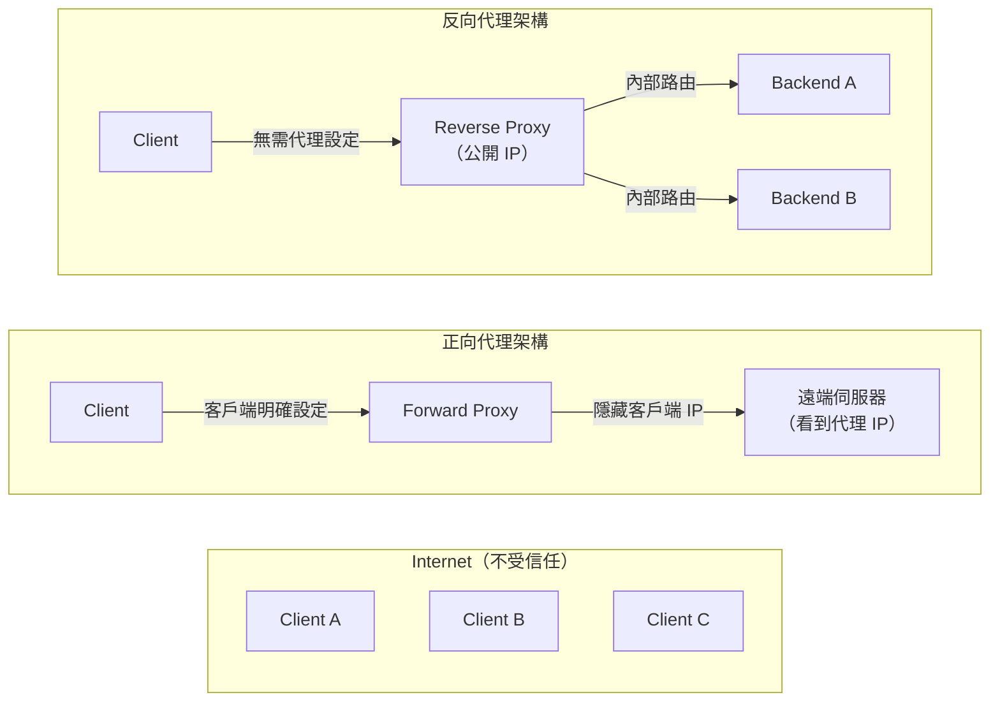
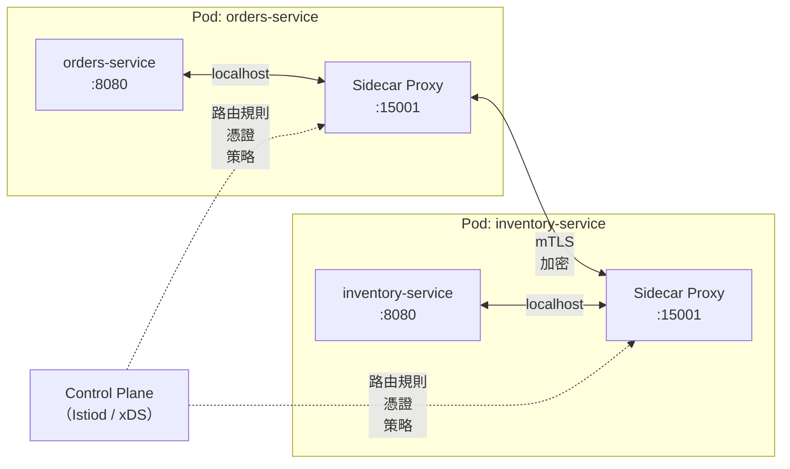

# [BEE-3006] 代理與反向代理

:::info
正向代理（forward proxy）vs 反向代理（reverse proxy）、使用情境、SSL 終止、請求路由、邊車代理模式，以及常見的設定陷阱。
:::

## 背景脈絡

「proxy（代理）」這個詞被過度使用。企業 IT 部門部署正向代理（forward proxy）來控制員工可存取的外部網路資源；CDN 業者在每個源站前放置反向代理（reverse proxy）來吸收流量；服務網格（service mesh）則在每個 Pod 中注入邊車代理（sidecar proxy）來觀測並控制東西向流量。這些都是「proxy」，但它們服務的主體根本不同，位於不同的信任邊界（trust boundary），也有各自獨特的失效模式。

如果搞不清楚自己在操作哪種代理，或忽略了夾在客戶端與伺服器中間的獨特失效情境，就會導致：日誌中遺失客戶端真實 IP、代理逾時設定比後端處理時間更短、大型請求/回應造成代理緩衝區溢位，以及加了代理之後反而新增了一個原本不存在的單點故障（single point of failure）。

**參考資料：**
- MDN Web Docs — Proxy servers and tunneling: <https://developer.mozilla.org/en-US/docs/Web/HTTP/Proxy_servers_and_tunneling>
- NGINX ngx_http_proxy_module 文件: <https://nginx.org/en/docs/http/ngx_http_proxy_module.html>
- Envoy Proxy — What is Envoy: <https://www.envoyproxy.io/docs/envoy/latest/intro/what_is_envoy>

## 原則

**搞清楚代理服務的主體是客戶端還是伺服器，並據此正確設定：轉送客戶端 IP、對齊後端實際的逾時時間、依照請求體積分佈調整緩衝區大小，並且從第一天起就將代理本身視為需要設計高可用的故障域（failure domain）。**

---

## 正向代理（Forward Proxy）vs 反向代理（Reverse Proxy）

核心問題是：**這個代理隱藏了誰的身份，代表誰行動？**

### 正向代理（Forward Proxy）

正向代理代表**客戶端**行動。客戶端需要明確設定才能透過它發送請求。代理以自己的 IP 向外部伺服器發送請求，因此目標伺服器看到的是代理的 IP，而非客戶端的 IP。

常見的正向代理使用情境：
- 企業出口流量管控（對外部 URL 建立允許清單/封鎖清單）
- 透過共用快取減少頻寬消耗
- 匿名化（Tor 透過多層正向代理轉送流量）
- 法規遵循的內容過濾

**客戶端知道**自己在透過代理通訊。**伺服器不知道**（也不在乎）真正的客戶端是誰。

### 反向代理（Reverse Proxy）

反向代理代表**伺服器**行動。客戶端不需要任何特殊設定，只需連線到一個解析至代理的主機名稱即可。代理將請求轉送到一台或多台後端伺服器，並回傳回應。客戶端只看到代理，看不到後端。

常見的反向代理使用情境：
- SSL 終止（proxy 解密 HTTPS，以純文字 HTTP 轉送至內部）
- 將流量分散到多台後端伺服器
- 請求路由（依路徑、主機名稱、標頭）
- 快取靜態或高成本回應
- 速率限制（rate limiting）與 DDoS 防護
- 請求/回應修改（注入標頭、改寫主體）

**伺服器知道**自己在代理後方（連線中看到的是代理 IP）。**客戶端不知道**後端有幾台伺服器，也不知道哪台處理了這次請求。

### 信任邊界示意圖



| 維度 | 正向代理 | 反向代理 |
|---|---|---|
| 代表誰行動 | 客戶端 | 伺服器 |
| 客戶端是否感知 | 客戶端需明確設定 | 客戶端不知道後端存在 |
| 隱藏什麼 | 客戶端身份（對伺服器） | 後端拓樸（對客戶端） |
| 部署位置 | 客戶端網路邊緣 | 伺服器網路邊緣 |
| 信任邊界 | 隔離客戶端與網際網路 | 隔離網際網路與後端 |

---

## 透明代理（Transparent Proxy）vs 顯式代理（Explicit Proxy）

代理可以是**顯式（explicit）**——客戶端透過瀏覽器設定、作業系統代理配置或 PAC 檔案明確設定——也可以是**透明（transparent）**——在網路層（防火牆或路由器）攔截流量，客戶端完全不知情。

**顯式代理：** 客戶端以完整 URL 格式或 `CONNECT` 方法發送請求至代理地址，代理的存在在請求路徑中是可見的。常見於企業出口流量管控。

**透明代理：** 網路基礎設施將特定流量（例如 80/443 埠）重新導向至代理，無需客戶端設定。常見於 CDN 邊緣節點與網路層內容過濾器。

`CONNECT` 隧道方法讓位於 HTTP 代理後方的客戶端能為 HTTPS 建立 TCP 隧道：客戶端發送 `CONNECT target-host:443 HTTP/1.1`，代理在不解密的情況下雙向轉送位元組。

---

## 反向代理作為 API 閘道（API Gateway）

具備路由與策略能力的反向代理通常被稱為 **API gateway（API 閘道）**。同一個代理程序在路由流量的同時，也可以執行：

- 身份驗證（JWT 驗證、API key 檢查）
- 授權（依路由的 scope 存取控制）
- 速率限制（per client、per route、per tenant）
- 請求/回應轉換（注入標頭、Schema 驗證）
- 可觀測性（請求日誌、指標、分散式追蹤標頭）

關鍵架構意涵：**橫切關注點（cross-cutting concerns）只需在閘道層處理一次**，不必在每個後端服務中重複實作。後端服務收到的是已通過驗證、已完成預先校驗的請求，可以專注在業務邏輯上。

---

## 請求路由（Request Routing）

### 路徑型路由（Path-Based Routing）

代理檢查 URL 路徑，依據前綴或正規表達式比對，將請求轉送至不同的上游（upstream）。

```
傳入請求：POST /api/orders/123
  → 路由至：orders-service:8080

傳入請求：GET /auth/token
  → 路由至：auth-service:8081

傳入請求：GET /static/app.js
  → 路由至：cdn-bucket 或 static-file-server
```

路徑型路由是在單一公開主機名稱後方進行微服務拆分最常見的模式。

### 主機名稱型路由（Host-Based / Virtual Host Routing）

代理檢查 `Host` header，依主機名稱將請求路由至不同的上游。

```
Host: api.example.com      → api-backend cluster
Host: admin.example.com    → admin-backend cluster
Host: app.example.com      → frontend-backend cluster
```

單一代理實例可以為多個服務提供服務，每個服務有各自的主機名稱，不需要不同的 IP 位址或埠號。

### 標頭型與參數型路由

進階代理可以依據任意 HTTP header 或 query parameter 進行路由：

```
X-API-Version: v2    → v2-backend cluster
X-API-Version: v1    → v1-backend cluster（舊版）
?beta=true           → canary-backend（10% 推出）
```

### 路由設定範例（通用概念）

以下虛擬設定說明反向代理上最常同時設定的三個路由關注點：

```
# 路徑型路由
route /api/*     → upstream: api-service    (timeout: 30s)
route /auth/*    → upstream: auth-service   (timeout: 10s)
route /          → upstream: frontend       (timeout: 5s)

# 所有上游請求的 header 注入
inject-header X-Request-ID     = generate-uuid()
inject-header X-Forwarded-For  = client-ip
inject-header X-Forwarded-Proto = incoming-scheme

# 依路由的速率限制
rate-limit /api/*   → 1000 req/min per client-ip
rate-limit /auth/*  → 20 req/min per client-ip
```

原則：路由規則、header 注入、速率限制集中在代理層設定。每個上游服務接收一組一致的 context header，不需要自行產生。

---

## SSL 在代理層的終止（SSL Termination）

在反向代理進行 TLS 終止（TLS termination）意味著：
1. 代理持有 TLS 憑證與私鑰
2. 代理解密傳入的 HTTPS 流量
3. 代理透過受信任的內部網路以純文字 HTTP 轉送至後端伺服器（或以獨立的內部憑證重新加密）

**優點：**
- 後端服務不需要管理憑證或承擔 TLS 交握的 CPU 成本
- 憑證輪換只需在代理端操作一次，不必逐一更新所有後端
- 代理只有在解密後才能檢查 HTTP header（路由與速率限制的必要條件）

**部署拓樸（另見 [BEE-3004](tls-ssl-handshake.md)）：**

| 拓樸 | 說明 | 適用情境 |
|---|---|---|
| 邊緣終止（Edge termination） | 代理解密；後端接收純文字 HTTP | 內部網路受信任、追求操作簡單 |
| 重新加密（Re-encryption） | 代理解密後再加密轉送至後端 | 法規要求傳輸全程加密 |
| TLS 穿透（Pass-through） | 代理轉送加密位元組，不做解密 | 端對端 mTLS 必要；代理不能檢查 payload |

---

## 在代理層進行快取（Caching at the Proxy Layer）

反向代理可以快取回應並直接提供，不需觸及後端，從而降低後端負載與延遲。

快取行為由回應的 HTTP cache-control header 控制：
- `Cache-Control: public, max-age=300` — 代理可快取 5 分鐘
- `Cache-Control: private` — 代理不得快取；僅供特定使用者
- `Cache-Control: no-store` — 代理不得儲存此回應

**適合在代理層快取的內容：**
- 靜態資源（JS、CSS、圖片）搭配較長的 `max-age`
- 讀取頻繁、允許輕微過期的 API 回應（商品目錄、參考資料）
- HTML 頁面的壓縮變體（`Vary: Accept-Encoding`）

**絕對不能在代理層快取的內容：**
- 已驗證使用者的個人化回應（個人資料、帳戶細節）
- Session token 與憑證
- POST、PUT、DELETE 的回應——這些操作不具冪等性，不能被重播

---

## 在代理層進行速率限制（Rate Limiting at the Proxy Layer）

在代理層執行速率限制可以保護後端免於流量突發、濫用與憑證填充（credential-stuffing）攻擊。代理在滑動視窗（sliding window）或令牌桶（token bucket）中追蹤每個 key（客戶端 IP、API key、user ID）的請求數，超過限制時回傳 `429 Too Many Requests`。

常見的速率限制 key：
- **以 IP 位址** — 最簡單；能阻擋明顯的濫用，但無法對應共用 NAT 的情境
- **以 API key / bearer token** — 適合已驗證身份的 API
- **以 user ID** — 需要代理從 token 中提取 ID，而非僅看 header

在代理層限速比在應用程式中更有效，因為：
- 在任何後端工作開始前就觸發（不浪費 CPU、資料庫連線等）
- 跨多副本後端一致套用
- 在流量尖峰時可以不修改後端就卸載請求

---

## 請求與回應的修改

### Header 注入（Header Injection）

代理在轉送至後端前新增或覆寫 header：

- `X-Request-ID: <uuid>` — 分散式追蹤的關聯 ID；若不存在則產生
- `X-Forwarded-For: <client-ip>` — 原始客戶端 IP（後端必須讀取此 header，而非 TCP 來源 IP）
- `X-Forwarded-Proto: https` — 原始協定（後端可據此強制執行 HTTPS-only 邏輯）
- `X-Real-IP: <client-ip>` — `X-Forwarded-For` 的單一值替代方案

標準化 header `Forwarded`（RFC 7239）將以上全部整合：
```
Forwarded: for=1.2.3.4;proto=https;host=api.example.com
```

### Header 移除（Header Stripping）

代理應移除客戶端不應能設定並傳遞至後端的 header：
- 在附加真實 IP 之前，先移除客戶端提供的 `X-Forwarded-For`（防止 IP 偽造）
- 在回應中移除內部除錯 header（`X-Internal-*`），避免它們洩漏給客戶端

### 回應主體改寫（Body Rewriting）

部分代理設定會改寫回應主體：在 HTML 中注入分析腳本、將重新導向中的絕對 URL 改寫為公開主機名稱，或是為向下相容而轉換 API 回應格式。主體改寫的代價高昂（代理必須緩衝並解析完整主體），除非別無選擇，否則應避免使用。

---

## 邊車代理模式（Sidecar Proxy Pattern）與服務網格（Service Mesh）

在微服務環境中，每個服務實例旁邊可以部署一個專屬的代理程序，稱為**邊車代理（sidecar proxy）**。邊車攔截服務的所有入站與出站網路流量，無需修改服務本身的程式碼。



每個邊車從**控制面（control plane）**（例如 Istio 的 `istiod` 透過 xDS API）接收設定。控制面負責分發：
- 路由規則（哪個服務位址對應哪個端點）
- mTLS 憑證（自動輪換，無需逐一管理每個服務的憑證）
- 策略（重試預算、熔斷器、速率限制）

**邊車相較於集中式反向代理的優勢：**
- 服務間資料路徑上無單點故障
- 每個服務的可觀測性（每個邊車都會發出指標與追蹤資料）
- 可按服務對設定細粒度策略，而非只在邊緣設定

**邊車的代價：**
- 每個 Pod 多執行一個程序，消耗額外的 CPU 與記憶體
- 每個請求多一個網路躍點（service → sidecar → network → sidecar → service）
- 控制面的操作複雜度

詳見 [BEE-5006](../architecture-patterns/sidecar-and-service-mesh-concepts.md) 對服務網格的完整介紹。

---

## 常見錯誤

### 1. 未轉送客戶端 IP — 真實 IP 在代理後方遺失

當代理終止 TCP 連線並向後端建立新連線時，後端看到的每個請求來源都是代理的 IP。若沒有注入 `X-Forwarded-For` 或 `X-Real-IP`，就無法依 IP 進行速率限制，稽核日誌形同虛設，地理位置路由也會失效。

**修正方式：** 設定代理在每個上游請求中注入 `X-Forwarded-For: <client-ip>`。在附加真實 IP 前先移除客戶端提供的此 header，防止偽造。驗證應用程式讀取的是該 header 而非原始 TCP 來源位址。

### 2. 代理逾時比後端處理時間更短

代理對上游連線有自己的讀取逾時設定。若後端合理地需要 45 秒來處理大型匯出或慢速查詢，但代理的讀取逾時設為 30 秒，代理就會中斷連線並回傳 `504 Gateway Timeout` 給客戶端。後端會繼續執行並完成工作，但客戶端永遠收不到結果。

**修正方式：** 依據每個路由的後端回應時間 p99 實測值來設定代理讀取逾時，而非使用單一全域預設值。對於長時間執行的操作，考慮採用非同步工作模式（回傳 `202 Accepted`，輪詢結果），而非讓同步連線長時間保持開啟。

### 3. 大型請求或回應主體導致代理緩衝區溢位

許多反向代理在轉送至後端之前會緩衝完整的請求主體（以便正確處理慢速客戶端）。若 `proxy_buffer_size` 與 `proxy_buffers` 的大小是依照典型 payload（4–8 KB）設定，但某個檔案上傳送來 100 MB，代理可能直接拒絕請求、溢出至磁碟（延遲驟升），或是不緩衝直接穿透（失去慢速客戶端保護）。

**修正方式：** 依照實際的 payload 分佈調整代理緩衝區大小。對於檔案上傳路由，考慮停用代理端的請求緩衝並直接串流至後端（接受對慢速客戶端保護的取捨）。依路由設定明確的主體大小上限，拒絕超出業務需求的 payload。

### 4. 未將代理視為單點故障

在三台健康的後端前加入反向代理，卻只執行一個代理實例，等同於用後端韌性換來一個新的單點故障。若代理程序崩潰或節點宕機，所有流量就會中斷。

**修正方式：** 從一開始就以高可用設定部署代理（active-passive 搭配虛擬 IP、active-active 搭配 DNS 或 anycast，或使用內建備援的雲端托管代理服務）。將代理層視為需要自身監控、告警與故障處理手冊的故障域。

### 5. 在代理層快取敏感回應

若包含個人資料、session token 或授權相關內容的回應被代理快取，後續的客戶端——包括不同使用者——可能會收到那份快取的回應。這是資料洩漏漏洞，不只是正確性問題。

**修正方式：** 稽核所有涉及使用者特定資料的路由，確認其回應包含 `Cache-Control: private` 或 `Cache-Control: no-store`。將快取視為代理層的選擇性功能：預設不快取，只對明確識別為安全的回應啟用。

---

## 相關 BEE

- [BEE-3001](tcp-ip-and-the-network-stack.md) — TCP/IP and the Network Stack：每個代理連線都是 TCP 連線；代理與後端之間的連線池（keepalive）可減少每個請求的 TCP 交握開銷
- [BEE-3003](http-versions.md) — HTTP/1.1, HTTP/2, HTTP/3：HTTP/2 多工（multiplexing）改變了請求流過代理的方式；代理必須理解 HTTP/2 framing，才能正確將請求串流分派至後端
- [BEE-3004](tls-ssl-handshake.md) — TLS/SSL Handshake：在代理層進行 SSL 終止是主流部署模式；詳見終止拓樸、憑證管理，以及重新加密 vs 穿透的取捨
- [BEE-3005](load-balancers.md) — Load Balancers：反向代理與 L7 負載平衡器有大量重疊；負載平衡器在核心代理機制上增加了上游健康檢查、連線排水（connection draining）與負載平衡演算法
- [BEE-5006](../architecture-patterns/sidecar-and-service-mesh-concepts.md) — Sidecar and Service Mesh：邊車代理將反向代理的概念延伸至東西向（service-to-service）流量；控制面、xDS API 與 mTLS 憑證自動化在此深入說明
