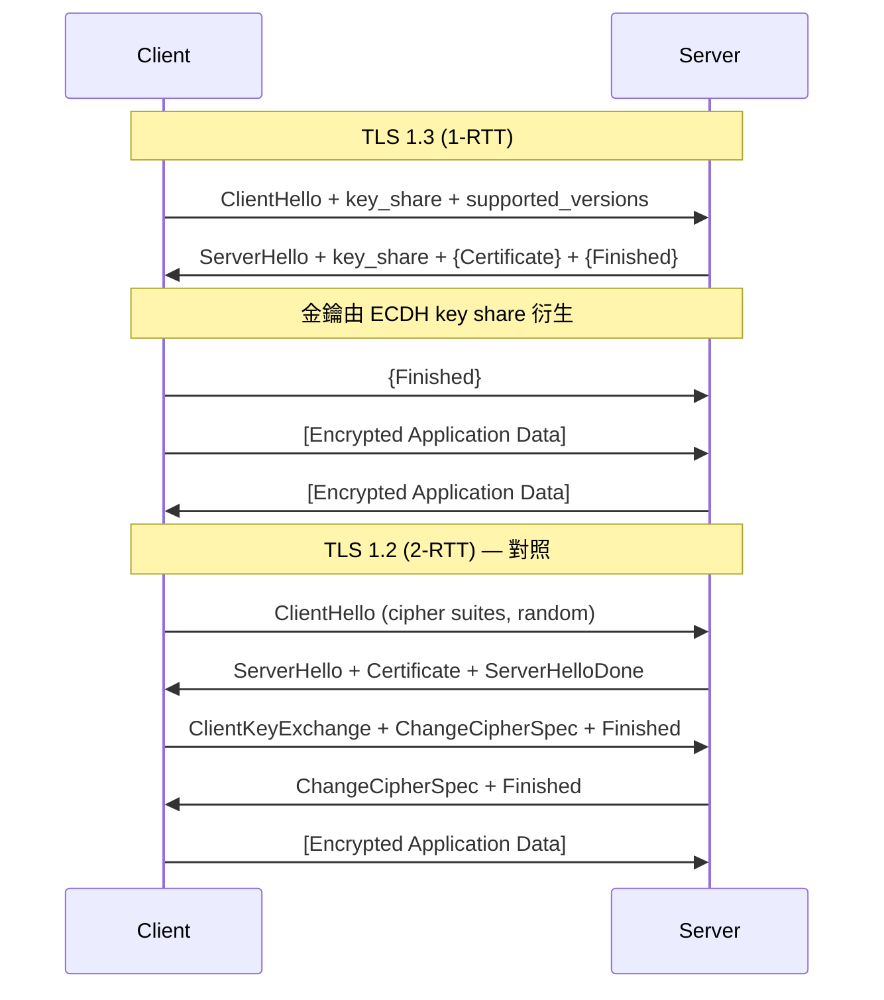
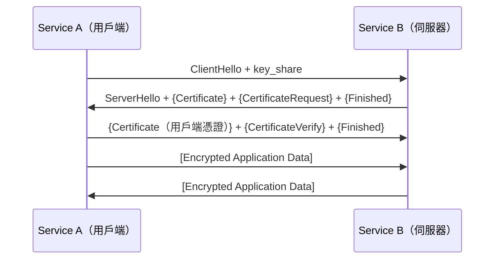

# [BEE-3004] TLS/SSL 握手

:::info
加密連線的建立過程、憑證鏈，以及 mTLS 雙向驗證。
:::

## 背景

每一個對正式環境服務發出的 HTTP 請求，都經由 TLS 傳輸。瀏覽器顯示鎖頭圖示，負載均衡器終止 HTTPS，服務之間以 mTLS（Mutual TLS）互相呼叫。但握手過程中究竟發生了什麼？為什麼 TLS 1.3 很重要，憑證鏈為何會在凌晨兩點斷掉？

## TLS 提供什麼保障

TLS（Transport Layer Security，傳輸層安全協定）提供三項安全屬性（RFC 8446, Section 1）：

| 屬性 | 意義 |
|---|---|
| **Confidentiality（保密性）** | 資料加密，只有端點能讀取 |
| **Integrity（完整性）** | 資料在傳輸中若遭修改可被偵測（AEAD） |
| **Authentication（驗證）** | 透過憑證驗證伺服器身分；可選擇驗證用戶端（mTLS） |

SSL（Secure Sockets Layer）是 TLS 的前身。「SSL」這個詞仍普遍使用，但 SSLv2 與 SSLv3 已被破解，不得使用。現行標準為 TLS 1.2 與 TLS 1.3。


## TLS 1.2 與 TLS 1.3 握手比較

### TLS 1.2 — 2-RTT 握手

TLS 1.2 需要兩次完整往返（Round Trip）才能開始傳送應用資料：

1. **RTT 1**：ClientHello → ServerHello + Certificate + ServerHelloDone
2. **RTT 2**：ClientKeyExchange + ChangeCipherSpec + Finished → ServerChangeCipherSpec + Finished
3. 應用資料開始傳輸

這代表在第一個位元組的應用資料之前，至少有 2 個 RTT 的延遲。

### TLS 1.3 — 1-RTT 握手

TLS 1.3（RFC 8446）將此縮短為一次往返，方法是在第一個訊息中直接帶入用戶端的 key share（金鑰份額）：

```
Client                                           Server
------                                           ------
ClientHello
  + key_share (ECDH public key)
  + supported_versions
  + cipher_suites
                          ------->

                                          ServerHello
                                            + key_share
                                          {EncryptedExtensions}
                                          {Certificate}
                                          {CertificateVerify}
                                          {Finished}
                          <-------

{Finished}                ------->

[Application Data]        <------>   [Application Data]
```

`{}` 符號表示使用從 key share 立即衍生的握手金鑰加密。應用資料在一個 RTT 後即可開始。

TLS 1.3 也支援使用舊有 session 的 PSK（Pre-Shared Key，預共享金鑰）進行 **0-RTT 恢復**，允許在第一次發送時帶上資料 — 但代價是失去重放保護（對非冪等請求不安全）。

### Mermaid 圖：TLS 1.3 (1-RTT) vs TLS 1.2 (2-RTT)



### 差異比較

| 功能 | TLS 1.2 | TLS 1.3 |
|---|---|---|
| 首次資料前的往返次數 | 2 | 1 |
| 靜態 RSA 金鑰交換 | 允許 | 已移除 |
| 前向保密（Forward Secrecy） | 可選 | 強制（ephemeral (EC)DHE） |
| 握手加密 | 部分（CCS 之後） | 完整（ServerHello 之後） |
| Cipher suite 協商 | 合併（金鑰 + 驗證 + AEAD） | 分離（AEAD + KDF hash） |
| 0-RTT 恢復 | 無 | 有（PSK，有附加條件） |


## Cipher Suite（密碼套件）

Cipher suite 指定 TLS session 中使用的演算法組合。TLS 1.2 中一個完整的 suite 如下：

```
TLS_ECDHE_RSA_WITH_AES_128_GCM_SHA256
  |     |   |        |          |
  |     |   |        |          +--- PRF hash
  |     |   |        +-------------- 對稱加密演算法 + 模式
  |     |   +----------------------- 驗證演算法
  |     +--------------------------- 金鑰交換演算法
  +--------------------------------- 協定
```

TLS 1.3 簡化了這個結構，將關注點分離。TLS 1.3 的 cipher suite 只描述 AEAD 演算法和 HKDF hash — 金鑰交換則透過 `supported_groups` 和 `key_share` extension 另行指定：

```
TLS_AES_128_GCM_SHA256
TLS_AES_256_GCM_SHA384
TLS_CHACHA20_POLY1305_SHA256
```

**OWASP 建議**：停用 null cipher、匿名 cipher、EXPORT cipher 和 RC4。優先使用以 GCM 為基礎的 suite。


## 憑證鏈（Certificate Chain）

### 結構：Leaf → Intermediate → Root CA

瀏覽器和 TLS 用戶端不會直接信任單一憑證（除了某些企業設定）。它們信任的是 **Certificate Authority（CA，憑證授權機構）**，信任透過鏈條傳遞：

```
Root CA（自簽，存於 OS/瀏覽器信任儲存庫）
  └── Intermediate CA（由 Root CA 簽署）
        └── Leaf Certificate（由 Intermediate CA 簽署，發給你的網域）
```

伺服器在 TLS 握手期間出示 leaf 憑證和所有中繼憑證。用戶端驗證整條鏈直到受信任的 root。

### openssl s_client 範例

```bash
openssl s_client -connect example.com:443 -showcerts
```

輸出範例（附說明）：

```
CONNECTED(00000005)
depth=2 C=US, O=DigiCert Inc, CN=DigiCert Global Root CA         # Root CA
verify return:1
depth=1 C=US, O=DigiCert Inc, CN=DigiCert TLS RSA SHA256 2020 CA1  # Intermediate CA
verify return:1
depth=0 CN=example.com                                             # Leaf 憑證
verify return:1
---
Certificate chain
 0 s:CN=example.com
   i:C=US, O=DigiCert Inc, CN=DigiCert TLS RSA SHA256 2020 CA1
 1 s:C=US, O=DigiCert Inc, CN=DigiCert TLS RSA SHA256 2020 CA1
   i:C=US, O=DigiCert Inc, CN=DigiCert Global Root CA
---
SSL-Session:
    Protocol  : TLSv1.3
    Cipher    : TLS_AES_128_GCM_SHA256
    ...
```

需要確認的欄位：
- `depth=0` 是你的 leaf 憑證 — 驗證 CN/SAN 是否與網域一致
- `depth=1` 是中繼憑證 — 必須包含在伺服器的握手訊息中
- `Protocol` — 應為 `TLSv1.3`，至少要是 `TLSv1.2`
- `Cipher` — 確認沒有弱加密套件（例如 RC4、DES、EXPORT suite）

### 憑證驗證步驟

TLS 用戶端驗證憑證時會檢查：
1. **信任鏈** — 每張憑證由上層簽署，最終到達受信任的 root
2. **有效期間** — `notBefore` 和 `notAfter` 欄位
3. **網域吻合** — Subject Alternative Name（SAN）必須與主機名稱一致（CommonName 在現代用戶端已不建議用於此目的）
4. **撤銷狀態** — 透過 OCSP（Online Certificate Status Protocol）或 CRL（Certificate Revocation List）
5. **Key usage extension** — 憑證必須被授權用於其被使用的目的


## ALPN（應用層協定協商）

ALPN（Application-Layer Protocol Negotiation）是 TLS extension（RFC 7301），允許用戶端和伺服器在 TLS 握手期間協商使用哪種應用層協定 — 在任何應用資料流動之前就完成。

```
ClientHello:
  extensions:
    application_layer_protocol_negotiation: ["h2", "http/1.1"]

ServerHello (TLS 1.3 中為 EncryptedExtensions):
  application_layer_protocol_negotiation: "h2"
```

這是 HTTP/2 透過 TLS 協商的方式（參見 [BEE-3003](http-versions.md)）。沒有 ALPN，就需要額外一次往返在連線建立後才能切換協定。


## mTLS（Mutual TLS，雙向 TLS）

標準 TLS 只驗證**伺服器**。mTLS 要求**用戶端和伺服器雙方**都出示憑證，提供雙向驗證。

### 使用場景

- 微服務網格中的服務間通訊（例如 Istio、Linkerd）
- 需要強身分驗證的 API 用戶端
- 不以 IP 位址作為信任依據的零信任（Zero-Trust）內部網路

### mTLS 握手的額外步驟

在 TLS 握手中，伺服器在其憑證之後發送 `CertificateRequest` 訊息。用戶端回應自己的憑證和 `CertificateVerify` 訊息。



### mTLS 操作注意事項

- 每個服務需要一張由共享內部 CA 發出的憑證（例如 Vault PKI、cert-manager 搭配內部 issuer）
- 憑證輪換必須自動化 — 跨數百個服務手動輪換不可行
- Sidecar proxy（服務網格中的 Envoy）可在應用程式無感的情況下透明處理 mTLS


## Let's Encrypt 與 ACME 協定

**Let's Encrypt** 是由 ISRG（Internet Security Research Group）運營的免費、自動化 CA，發行的 DV（Domain Validation）憑證受所有主流瀏覽器信任。

**ACME**（Automatic Certificate Management Environment，RFC 8555）是 Let's Encrypt 使用的協定，支援自動化：
1. **網域驗證** — 證明你控制該網域（HTTP-01 或 DNS-01 挑戰）
2. **憑證發行** — 取得已簽署的憑證
3. **更新** — 通常由 Certbot、cert-manager 或 Caddy 等工具自動完成

ACME DNS-01 挑戰是通配符（wildcard）憑證的唯一選項，也適用於無法從公網存取的內部服務（使用公開 DNS 的情況）。


## 憑證輪換（Certificate Rotation）

憑證有有限的有效期間（Let's Encrypt：90 天；商業 CA：通常 1 年）。輪換必須自動化，否則將面臨正式環境中斷。

### 輪換清單

| 步驟 | 細節 |
|---|---|
| 監控到期 | 30 天前告警，7 天前觸發 on-call |
| 自動更新 | cert-manager、Certbot，或 CD pipeline 中的 ACME 用戶端 |
| 熱重載 | Nginx：`nginx -s reload`；Envoy：xDS API push；避免完整重啟 |
| 輪換後驗證 | 在部署後檢查中執行 `openssl s_client -connect host:443` |
| 金鑰輪換 | 定期輪換私鑰本身，而不只是憑證 |

**零停機輪換**：先部署新憑證和金鑰，保留舊憑證直到所有進行中的連線排空後再移除。


## TLS 終止（TLS Termination）

TLS 在技術棧哪個位置終止，對安全性有重大影響。

### 在負載均衡器終止（Edge Termination）

```
Internet --[TLS]--> Load Balancer --[HTTP]--> Backend Services
```

- 管理最簡單（憑證只在 LB 上）
- 後端接收明文 — 若內部網路不受信任或共享，這是安全漏洞
- 無端對端加密；能存取內部網路的攻擊者可以讀取流量

### 重新加密（Re-Encryption）

```
Internet --[TLS]--> Load Balancer --[TLS]--> Backend Services
```

- LB 終止 TLS、檢查/路由後再重新加密傳給後端
- 後端憑證可使用內部 CA
- 提供縱深防禦（Defense in Depth） — 即使外圍遭入侵，內部流量仍然加密

### TLS Pass-Through（直通）

```
Internet --[TLS]--> Load Balancer --[TLS（不解密）]--> Backend
```

- LB 不解密，直接轉發 TLS（僅使用 SNI 進行路由）
- 端對端加密完整保留；LB 無法檢查 L7 內容
- 路由規則較不靈活

**建議**：對於任何處理敏感資料或在零信任環境中運作的服務，使用重新加密或 pass-through。不要依賴內部網路是可信任的假設。


## 常見錯誤

### 1. 仍然允許 TLS 1.0 和 TLS 1.1

TLS 1.0 和 1.1 已被 RFC 8996 棄用，並於 2020 年被所有主流瀏覽器停用。已知漏洞包括 BEAST、POODLE 和 CRIME。稽核你的 nginx/haproxy/ALB 設定：

```nginx
# 錯誤 — 允許已棄用的協定
ssl_protocols TLSv1 TLSv1.1 TLSv1.2 TLSv1.3;

# 正確
ssl_protocols TLSv1.2 TLSv1.3;
ssl_ciphers 'ECDHE-ECDSA-AES128-GCM-SHA256:ECDHE-RSA-AES128-GCM-SHA256:...';
ssl_prefer_server_ciphers on;
```

### 2. 在服務間呼叫中不驗證憑證鏈

內部服務常常以「方便」為由或因使用自簽憑證而跳過憑證驗證：

```python
# 錯誤 — 停用所有 TLS 驗證
requests.get("https://internal-service", verify=False)

# 正確 — 提供內部 CA bundle
requests.get("https://internal-service", verify="/etc/ssl/certs/internal-ca.pem")
```

停用驗證完全破壞了 TLS 的驗證屬性。被入侵的服務現在可以攔截所有流量。

### 3. 在正式環境中使用自簽憑證卻沒有適當的信任管理

自簽憑證用於開發環境沒問題。在正式環境中，它們要求每個用戶端都明確設定信任 — 而這種信任管理在大規模環境下幾乎不可能正確執行。改用內部 CA（HashiCorp Vault PKI、Step CA，或搭配內部 issuer 的 cert-manager）。

### 4. 沒有在到期前輪換憑證

憑證到期會造成硬性中斷。一張未自動更新的 90 天 Let's Encrypt 憑證將在午夜造成正式環境中斷。使用 cert-manager 或 Certbot 自動化，並加上監控：

```bash
# 檢查到期日
openssl x509 -enddate -noout -in /etc/ssl/certs/service.pem

# notAfter=Dec 31 23:59:59 2025 GMT
```

### 5. 在 LB 終止 TLS 後內部流量未加密

在負載均衡器終止 TLS 並將明文傳給後端是常見做法，但在共享或雲端環境中很危險。如果你在邊緣終止 TLS，至少使用私有網路和防火牆規則限制爆炸半徑 — 但對敏感服務優先考慮重新加密。


## 相關 BEE

- [BEE-2005](../security-fundamentals/cryptographic-basics-for-engineers.md) — 密碼學基礎：對稱加密、雜湊、數位簽章（TLS 使用的建構模塊）
- [BEE-3001](tcp-ip-and-the-network-stack.md) — TCP/IP：TLS 在 TCP 之上運行；理解 TCP 握手可釐清總連線延遲（TCP SYN + TLS = 資料前 2-3 RTT）
- [BEE-3003](http-versions.md) — HTTP/2 與 HTTP/3：ALPN 在 TLS 上協商 HTTP/2；HTTP/3 使用內建 TLS 1.3 的 QUIC
- [BEE-3005](load-balancers.md) — 負載均衡器：大規模環境的 TLS 終止策略、SNI 路由和憑證管理
- [BEE-3007](mutual-tls-handshake-and-server-configuration.md) — Mutual TLS (mTLS) 握手與伺服器設定：用戶端憑證 mTLS 的協定機制、伺服器端驗證與實務設定細節；延伸本文涵蓋的基礎握手

## 參考資料

- [RFC 8446 — TLS 1.3 規格書](https://www.rfc-editor.org/rfc/rfc8446)
- [OWASP Transport Layer Security Cheat Sheet](https://cheatsheetseries.owasp.org/cheatsheets/Transport_Layer_Security_Cheat_Sheet.html)
- [Cloudflare：TLS 協定概覽](https://developers.cloudflare.com/ssl/reference/protocols/)
