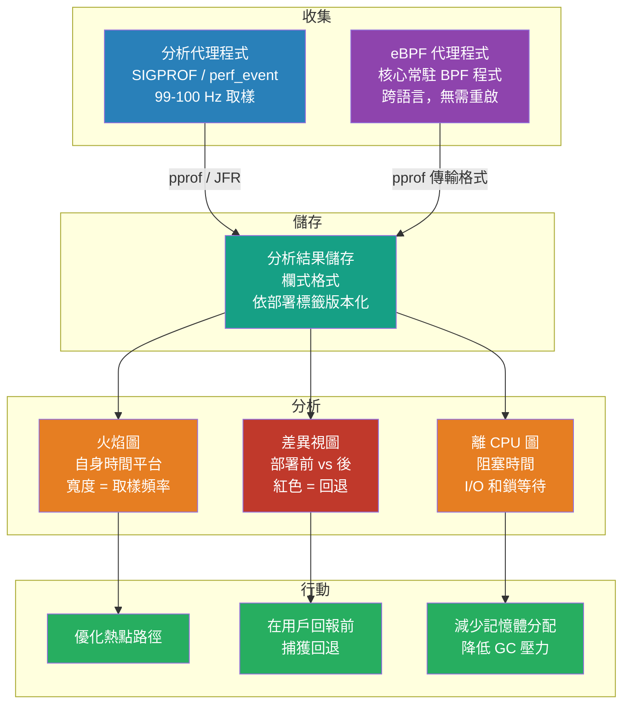

# [BEE-326] 生產環境持續分析

:::info
持續分析（Continuous Profiling）在整個服務群中持續取樣，並將分析結果與部署元資料一起儲存，支援部署前後的差異比較——不僅回答「什麼慢了」，更回答「哪個程式碼變更導致它變慢了」。
:::

## 背景

三支柱可觀測性模型（BEE-320：日誌、指標、追蹤）回答了「發生了什麼」、「發生了多少」和「在請求路徑的哪裡」。但這些都無法回答「為什麼這個函式消耗了 40% 的 CPU？」或「哪行程式碼正在產生 GC 壓力？」分析（Profiling）是填補這個空白的第四個支柱。

傳統的分析是一次性手動操作，針對預演環境中的單個進程進行。根本問題在於生產工作負載不可重現：資料分布、JIT 編譯狀態、OS 排程行為和負載形狀都與預演環境不同。對預演環境進行分析只能告訴你預演環境的效能特性，而非生產環境的特性。

現代解答是持續分析：對生產環境所有主機上的所有進程進行始終開啟、低開銷的取樣，持久化儲存分析結果，並以部署版本、實例和時間戳記進行標記。這一實踐在 2010 年由 Google 確立。Gang Ren、Eric Tune、Tipp Moseley 等人在《IEEE Micro》（2010 年）發表了「Google-Wide Profiling: A Continuous Profiling Infrastructure for Data Centers」，記錄了一個以可忽略的單機開銷對數千個應用程式進行機群範圍分析的系統——透過在任何時刻只對輪流輪換的機器子集進行分析來實現。儲存的分析結果揭示了「大量 CPU 時間花費在與業務邏輯無關的函式上」，包括序列化、記憶體分配和字串操作。

Netflix 在其規模上將此付諸實踐，透過對 Java 微服務進行火焰圖（flame graph）分析，每天節省約 1,300 萬 CPU 分鐘（2016 年）。Meta 的 Strobelight 機群分析系統（2025 年）在所有生產主機上同時執行 42 種分析器，單個程式碼優化可節省約 15,000 台伺服器的容量。工具生態系統已大幅成熟：Pyroscope（Grafana）、Parca（CNCF/Polar Signals）和 Google Cloud Profiler 均已達到生產就緒；OpenTelemetry eBPF 分析器提供跨語言零插樁分析。

## 火焰圖

所有持續分析工具都使用火焰圖作為主要視覺化方式。正確讀取火焰圖是使用分析資料的前提。

Brendan Gregg 於 2011 年 12 月在 Sun/Oracle 調查 MySQL 效能回退時發明了火焰圖。標準參考文獻是「The Flame Graph」，發表於《ACM Queue》/《Communications of the ACM》（第 59 卷，第 6 期，2016 年 6 月）。

**讀取火焰圖：**
- **Y 軸**：堆疊深度，從底部的零開始計數。根框架在底部，其被調用者向上堆疊。
- **X 軸**：**按字母順序排序**的堆疊追蹤*母體*——**不是**時間的流逝。共享相同呼叫堆疊的相鄰框架被合併。排序純粹是為了最大化合併和可讀性。
- **框架寬度**：與該框架出現在取樣中的次數成比例——即該框架在堆疊上的總分析時間比例（包括其被調用者）。越寬 = 時間越多。
- **平台頂部寬度**（框架在其子框架上方暴露的頂部）：自身時間（self-time）——花費在該函式上的時間（不包括被調用者）。寬底座配窄頂部意味著大多數時間委托給了子函式。
- **顏色**：在 CPU 火焰圖中，顏色通常是隨機暖色調，沒有語義含義。差異火焰圖（比較視圖）使用紅色表示回退，藍色表示改善。

**最常見的誤讀**：將 X 軸視為時間。左側的寬框架並不意味著它最先執行或在時間意義上執行最久——它意味著其呼叫堆疊在取樣母體中出現頻繁。Gregg 在其所有文件中明確區分了火焰圖（字母排序、時間折疊）和「火焰圖表（flame chart）」（X 軸為時間，Chrome DevTools 使用）。

**離 CPU 火焰圖**：標準火焰圖顯示在 CPU 上主動執行的時間。離 CPU 火焰圖顯示執行緒*未在*執行的位置——等待 I/O、鎖、網路或排程器延遲。對於 I/O 密集型服務，在 CPU 上的分析通常具有誤導性（熱點框架是「從套接字讀取」，看起來開銷很小，但實際的掛鐘時間是等待時間）。離 CPU 分析揭示了阻塞執行緒在等待什麼。

## 分析類型

| 分析類型 | 測量內容 | 主要使用場景 |
|---|---|---|
| 在 CPU | 消耗 CPU 週期的函式 | 計算密集型熱點路徑、演算法低效 |
| 離 CPU / 掛鐘 | 執行緒阻塞的位置 | I/O 等待、鎖競爭、排程器延遲 |
| 堆積 / 分配 | 記憶體分配呼叫路徑 | GC 壓力、記憶體洩漏、物件流失 |
| Goroutine / 執行緒計數 | 所有存活執行緒的快照 | Goroutine 洩漏、執行緒池耗盡 |
| 鎖競爭 | 執行緒等待鎖的時間 | 並發瓶頸、`synchronized` 開銷 |

**MUST（必須）根據假設選擇正確的分析類型。** CPU 使用率高、延遲也高的服務是在 CPU 上的問題——CPU 分析是正確的第一工具。CPU 使用率低但延遲高（由資料庫查詢、外部 I/O 或鎖等待主導）的服務需要離 CPU 或掛鐘分析。

## 取樣分析器的運作方式

現代的生產安全分析器使用統計取樣而非插樁：

1. SIGPROF 信號（或 eBPF 分析器的 `perf_event` 溢出中斷）以固定速率觸發——通常為 99 或 100 Hz。
2. 在每次中斷時，分析器走訪呼叫堆疊並記錄框架鏈。
3. 經過許多取樣後，呼叫堆疊的頻率直方圖近似於程式時間花費位置的分布。

以每秒 100 次取樣，每次取樣增加約 1–2 微秒的開銷。對於每秒消耗 1 秒 CPU 時間的進程，這大約是 0.1–0.2% 的開銷——與垃圾回收開銷在同一數量級。

**安全點偏差問題（JVM）：** 基於 JVMTI 的 Java 分析器必須在讀取堆疊框架之前將執行緒帶到安全點。JIT 編譯的程式碼只在特定的已編譯入的檢查點才能到達安全點，因此分析器系統性地漏掉安全點之間的框架——產生過度代表安全點密集程式碼的偏差視圖。Nitsan Wakart 的 2016 年博客文章「Why (Most) Sampling Java Profilers Are Fucking Terrible」精確地記錄了這個問題。`async-profiler` 透過使用 `AsyncGetCallTrace`（一個 HotSpot 內部 API，可以在任意中斷點捕獲堆疊追蹤）結合 `perf_events` 來消除它。

## 最佳實踐

**MUST（必須）在生產環境而非僅預演環境運行持續分析器。** 生產工作負載的資料分布、JIT 編譯狀態和並發模式與預演環境不同。分析預演環境只能獲得預演環境的效能特性，而非生產環境的特性。

**MUST（必須）以部署元資料標記分析結果。** 沒有版本標記儲存的分析結果無法跨部署進行差異比較。最低限度：部署版本、環境、主機/Pod 標籤和時間戳記。這支援典型使用場景：「部署 v2.1，比較 CPU 分析結果與 v2.0，找出回退。」

**SHOULD（應該）從在 CPU 分析開始，只在延遲與 CPU 使用率不相關時才加入離 CPU 分析。** 對於 CPU 使用率高且延遲高的服務，在 CPU 分析是正確的第一工具。對於 CPU 使用率低且延遲高（由資料庫查詢、外部 I/O 或鎖等待主導）的服務，需要離 CPU 或掛鐘分析。

**SHOULD（應該）以 99 Hz 而非 100 Hz 進行取樣。** 使用質數取樣率可以避免與週期性系統活動的混疊（60 Hz 螢幕刷新率、100 Hz 核心計時器中斷、週期性 GC 週期）。Parca 出於同樣原因使用 19 Hz。

**MUST NOT（不得）在生產程式碼中為分析目的加入每次呼叫的插樁（函式入口/出口鉤子）。** 插樁為每次函式呼叫增加固定開銷。在生產呼叫速率（每秒數百萬次呼叫）下，即使是幾奈秒的每次呼叫開銷也會累積為可測量的吞吐量下降。統計取樣以極小的開銷達到相同的洞察。

**SHOULD（應該）在使用 eBPF 分析器或 Linux `perf` 時，將 JVM 配置為 `-XX:+PreserveFramePointer`。** 現代 JIT 編譯器為了效能會省略框架指標暫存器（`rbp`）；沒有它，原生堆疊走訪器無法從 JIT 編譯的程式碼重建呼叫鏈。保留框架指標的效能成本通常為 1–3%。

**SHOULD（應該）儲存分析結果至少 30 天**，以支援跨發布週期的回退分析。

## 各執行環境工具

### JVM

**async-profiler**：生產 JVM 分析的正確選擇。支援 CPU、掛鐘（I/O 密集型服務）、分配（堆積壓力）和鎖競爭模式。透過 `AsyncGetCallTrace` 消除安全點偏差。與 Pyroscope、Parca、Datadog 和 Grafana 代理程式整合。從掛鐘模式開始進行延遲調查；當 GC 暫停率高時切換到分配模式。

**Java Flight Recorder（JFR）**：內建於 OpenJDK（JEP 328，在 JDK 11 開源）。使用 JVM 內環形緩衝區進行連續錄製。「default」配置的目標開銷低於 1%。JFR 捕獲方法分析（使用安全點取樣，與 async-profiler 不同）、GC 事件、I/O 事件、執行緒暫停事件和監視器等待——全部在一次錄製中。

```bash
# async-profiler：30 秒掛鐘分析，輸出為火焰圖 HTML
java -agentpath:/path/to/libasyncProfiler.so=start,wall,interval=10ms,file=profile.html -jar app.jar

# Java Flight Recorder：始終開啟錄製，預設開銷目標
java -XX:StartFlightRecording=maxage=1h,filename=/tmp/flight.jfr -jar app.jar

# eBPF/perf 原生堆疊展開所需的 JVM 旗標
-XX:+PreserveFramePointer
```

### Go

Go 標準函式庫包含完整的分析框架。`net/http/pprof` 套件在 `/debug/pprof/` 註冊 HTTP 處理器，按需提供即時分析結果。

```go
import _ "net/http/pprof" // 副作用：註冊 HTTP 處理器

// 從執行中的服務獲取分析結果
go tool pprof http://localhost:6060/debug/pprof/heap      // 即時堆積
go tool pprof http://localhost:6060/debug/pprof/allocs    // 分配熱點路徑
go tool pprof http://localhost:6060/debug/pprof/profile?seconds=30  // CPU，30 秒

// block 和 mutex 分析預設關閉；在執行期啟用：
// runtime.SetBlockProfileRate(1)      // 每個阻塞事件
// runtime.SetMutexProfileFraction(1)  // 每個 mutex 競爭
```

`allocs` 分析顯示不考慮存活狀態的分配呼叫堆疊——它是尋找 GC 壓力熱點路徑的正確工具，與顯示存活分配的 `heap` 分析不同。

### Python

**py-spy**：用 Rust 撰寫的取樣分析器，從 `/proc` 讀取 CPython 直譯器狀態，無需注入目標進程。可安全地附加到正在執行的生產進程，無需重啟或程式碼變更。

```bash
# 附加到正在執行的進程並生成火焰圖
py-spy record --pid <PID> --output profile.svg --format speedscope

# 類似 top 的即時視圖（終端機）
py-spy top --pid <PID>
```

### Node.js

```bash
# 內建 V8 分析器
node --prof app.js
node --prof-process isolate-*.log > processed.txt

# clinic.js（NearForm）——包含自動診斷的分析工具
npx clinic flame -- node app.js
```

## 持續分析產品

**Pyroscope（Grafana）**：開源，支援單一執行檔或微服務架構。支援 Java、Go、Python、Ruby、.NET、Rust、PHP 和 eBPF 代理程式。以針對火焰圖查詢和差異視圖優化的欄式格式儲存分析結果。可自行託管或使用 Grafana Cloud 託管服務。

**Parca（CNCF / Polar Signals）**：以 19 Hz 取樣的 eBPF 代理程式。在核心中的 BPF 映射中聚合呼叫堆疊；每 10 秒清空到用戶空間。以 Apache Arrow / Parquet 欄式格式儲存分析結果。對公開的 `debuginfod` 伺服器遠端符號化，因此生產二進位檔案可保持 strip 狀態。需要 Linux 5.3+ 並支援 BTF。

**OpenTelemetry eBPF 分析器**：最初由 Elastic 開發，捐贈給 OpenTelemetry。支援 10 種以上執行環境，包括 C/C++、Go、Rust、Python、Java、Node.js/V8、.NET、PHP、Ruby、Perl。宣稱 CPU 開銷低於 1%，RAM 開銷低於 250 MB。

**Google Cloud Profiler**：直接衍生自 GWP 的託管服務。測量結果：每個服務 CPU 開銷低於 0.5%，RAM 約 4 MB。確保每個部署每次只有一個副本被分析。

**Datadog 持續分析器**：將分析資料與 APM 追蹤整合——可以從慢速追蹤 span 直接導航到該服務在該時間的分析資料。支援差異視圖，回退以紅色突出顯示。

## 視覺化



## 常見錯誤

**只在預演環境進行分析。** 生產環境和預演環境在 JIT 編譯狀態、資料大小、執行緒數量和請求並發方面不同。冷 JVM 上的 Java 服務與流量進入 5 分鐘後有完全不同的 CPU 分析結果。持續的生產環境分析不是可選的——它是觀察實際生產行為的唯一方式。

**對 I/O 密集型服務使用 CPU 分析。** 90% 時間等待資料庫回應的服務幾乎會顯示空的 CPU 分析——資料庫等待不是 CPU 時間。使用掛鐘或離 CPU 分析。診斷問題是：「這個服務是 CPU 密集型還是等待密集型？」

**將 X 軸誤讀為時間。** 最常見的火焰圖錯誤。火焰圖左側的寬框架意味著其呼叫堆疊被頻繁取樣，而非最先執行。時間不在 X 軸中表示。

**只看最寬的框架，而非平台頂部。** 最寬的框架（按包含子框架的總寬度）是最高層的調用者——通常是 `main` 或請求處理器。平台頂部（在其子框架上方暴露的部分）最寬的框架才是自身時間集中的地方。自身時間才是你無需重構調用者就能實際優化的部分。

**不以部署版本標記分析結果。** 分析結果在部署前後進行比較時最有價值。只儲存原始火焰圖而沒有版本元資料的分析系統無法回答「哪個變更導致了回退」。

**忘記在 Go 中啟用 block/mutex 分析。** `block` 和 `mutex` 分析預設禁用（它們為每個鎖操作增加開銷）。在 CPU 或堆積分析中看不到的延遲問題，可以暫時啟用它們：`runtime.SetBlockProfileRate(1)` 和 `runtime.SetMutexProfileFraction(1)`。

## 相關 BEE

- [BEE-13004](../performance-scalability/profiling-and-bottleneck-identification.md) -- 效能分析與瓶頸識別：針對性效能調查的一次性分析工具和工作流程
- [BEE-14001](three-pillars-logs-metrics-traces.md) -- 三個支柱：日誌、指標、追蹤：持續分析作為第四個支柱所補充的可觀測性基礎
- [BEE-14003](distributed-tracing.md) -- 分散式追蹤：將追蹤 span 資料與分析資料連結，以找出導致慢速 span 的函式
- [BEE-13007](../performance-scalability/memory-management-and-garbage-collection.md) -- 記憶體管理與垃圾回收：分配分析揭示 GC 壓力熱點路徑；持續分析捕獲跨部署的分配回退
- [BEE-13008](../performance-scalability/jvm-jit-compilation-and-application-warm-up.md) -- JVM JIT 編譯與應用程式預熱：JIT 預熱在啟動與穩態下產生不同的 CPU 分析結果；持續分析捕獲兩者

## 參考資料

- [Gang Ren et al. Google-Wide Profiling: A Continuous Profiling Infrastructure for Data Centers — IEEE Micro, 2010](https://research.google/pubs/google-wide-profiling-a-continuous-profiling-infrastructure-for-data-centers/)
- [Brendan Gregg. The Flame Graph — ACM Queue / Communications of the ACM, June 2016](https://queue.acm.org/detail.cfm?id=2927301)
- [Brendan Gregg. Off-CPU Flame Graphs — brendangregg.com](https://www.brendangregg.com/FlameGraphs/offcpuflamegraphs.html)
- [Meta Engineering. Strobelight: A Profiling Service Built on Open Source Technology — January 2025](https://engineering.fb.com/2025/01/21/production-engineering/strobelight-a-profiling-service-built-on-open-source-technology/)
- [Netflix TechBlog. Saving 13 Million Computational Minutes per Day with Flame Graphs — April 2016](https://netflixtechblog.com/saving-13-million-computational-minutes-per-day-with-flame-graphs-d95633b6d01f)
- [Netflix TechBlog (Martin Spier, Brendan Gregg). Netflix FlameScope — April 2018](https://netflixtechblog.com/netflix-flamescope-a57ca19d47bb)
- [async-profiler — GitHub](https://github.com/async-profiler/async-profiler)
- [Parca Agent Design — parca.dev](https://www.parca.dev/docs/parca-agent-design/)
- [Frederic Branczyk. Design Decisions of a Continuous Profiler — Polar Signals, December 2022](https://www.polarsignals.com/blog/posts/2022/12/14/design-of-continuous-profilers)
- [Go Diagnostics — go.dev](https://go.dev/doc/diagnostics)
- [JEP 328: Flight Recorder — OpenJDK](https://openjdk.org/jeps/328)
- [Nitsan Wakart. Why (Most) Sampling Java Profilers Are Fucking Terrible — 2016](http://psy-lob-saw.blogspot.com/2016/02/why-most-sampling-java-profilers-are.html)
