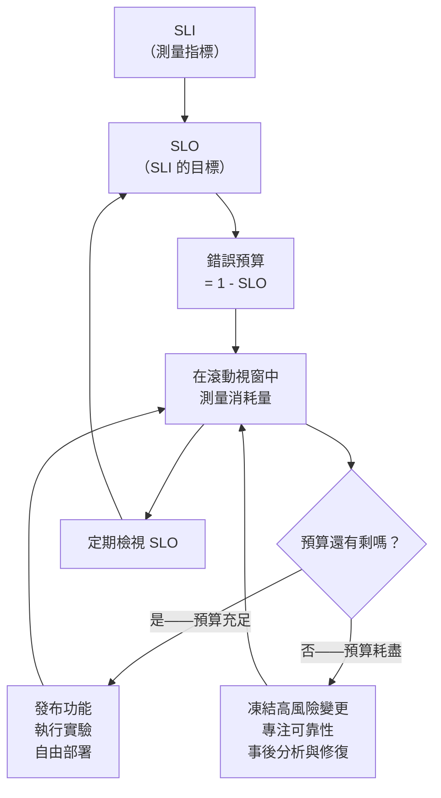

# [BEE-324] SLO 與錯誤預算

:::info
用 SLO 定義可靠性目標，再用錯誤預算決定何時發布功能、何時專注於可靠性改善。
:::

## 背景

可靠性是一項功能，但「夠可靠」到底是多可靠？沒有量化目標，工程師會爭論某次中斷是否可以接受，PM 會在值班工程師還在滅火時要求部署，而管理層則憑感覺做容量決策。

服務水準目標（SLO）給了團隊一個基於數據的共同答案。搭配錯誤預算，可靠性就從模糊的願景變成具體的決策工具。

權威參考資料：[Google SRE 書籍第四章：服務水準目標](https://sre.google/sre-book/service-level-objectives/)。Alex Hidalgo 的 [Implementing Service Level Objectives](https://www.oreilly.com/library/view/implementing-service-level/9781492076803/) 提供了實務層面的細節。Google 的 [SRE Workbook 燃燒率告警章節](https://sre.google/workbook/alerting-on-slos/) 則涵蓋了基於燃燒率的告警設定方式。

## 原則

**定義可測量的 SLI，將 SLO 目標設定在 100% 以下，從差距推導出錯誤預算，並用該預算驅動所有部署和可靠性決策。**

## 核心概念

### SLI — 服務水準指標

SLI 是對服務行為的量化測量，需與使用者體驗相關。它是從原始遙測資料計算出的比率或數值。

常見的 SLI：

| 維度     | 定義                                           | 範例                        |
|----------|------------------------------------------------|-----------------------------|
| 可用性   | `成功請求數 / 總請求數`                        | HTTP 2xx / 所有 HTTP 回應   |
| 延遲     | 在閾值內完成服務的請求比例                     | 300 ms 內完成的請求比例     |
| 吞吐量   | 每單位時間成功處理的請求數                     | 每秒成功寫入次數            |
| 正確性   | 回應資料正確的請求比例                         | 通過 checksum 驗證的紀錄比例 |

**選擇能反映使用者體驗的 SLI，而非基礎設施健康狀態。** CPU 使用率不是 SLI。「使用者的請求在合理時間內成功」才是。

### SLO — 服務水準目標

SLO 是在滾動時間視窗內對 SLI 設定的目標值：

```
SLO：可用性 SLI >= 99.9%（滾動 30 天視窗）
```

SLO 是內部目標，屬於工程團隊自己的承諾。它不是給使用者看的合約，而是對自己維持可靠性水準的承諾。

良好 SLO 的關鍵屬性：

- 直接關聯到使用者可見的 SLI
- 定義明確的測量視窗（28 天或 30 天均常見）
- 設定在使用者實際需求以下——留有緩衝空間
- 定期檢視，因為使用模式會隨時間改變

### SLA — 服務水準協議

SLA 是你與使用者（或客戶）之間的合約，通常包含未達成時的後果——財務懲罰、服務積分、升級程序等。

```
SLA：每月可用性 99.5%；違約觸發 10% 服務積分退還
```

SLO 必須比 SLA 更嚴格。SLO 是內部警戒線；SLA 是絕對不能越過的底線。若 SLO 是 99.9%，SLA 可以是 99.5%——讓你有足夠的空間在違反合約前偵測並修正問題。

### 錯誤預算

錯誤預算是 SLO 所隱含的允許不可靠程度：

```
錯誤預算 = 1 - SLO 目標
```

30 天 99.9% SLO（43,200 分鐘）的計算：

```
錯誤預算 = 0.1% × 43,200 分鐘 = 43.2 分鐘
```

這是服務在違反 SLO 之前可以累積的停機時間（或失敗請求數量）。這不是懲罰，而是消費預算。團隊可以自由地將預算花在風險上：部署、實驗、基礎設施變更。預算耗盡時，消費就必須停止。

## 決策流程



回饋迴圈是核心洞察：錯誤預算讓可靠性自我調節。快速發布的團隊會消耗預算；預算用完後，團隊無法繼續發布，直到可靠性工作補充了預算。這在不需要管理層升級的情況下對齊了所有人的誘因。

## 實際範例

**服務：** REST API

**SLI：** `成功請求數 / 總請求數`（HTTP 2xx 和 3xx / 所有回應，不包含 4xx 用戶端錯誤）

**SLO：** 滾動 30 天視窗可用性 >= 99.9%

**錯誤預算計算：**

```
視窗：          30 天 = 43,200 分鐘
SLO 目標：      99.9%
錯誤預算：      0.1% × 43,200 = 43.2 分鐘的等效停機時間
```

對於每月處理 1,000,000 個請求的服務：

```
允許的失敗數：  0.1% × 1,000,000 = 1,000 次失敗請求
```

**視窗第 20 天的當前狀態：**

```
已消耗預算：    約 465 次失敗請求（約 46.5% 的預算）
剩餘預算：      約 535 次失敗請求（約 53.5% 的預算，≈ 23 分鐘等效）
```

**決策：** 團隊在視窗過了三分之二時消耗了不到一半的預算，燃燒率健康。可以安全地推進計畫中的資料庫遷移（預估風險：截換期間約 200 次失敗請求）。

相反地，若在第 20 天已消耗了 1,000 次中的 950 次，正確的做法是暫停非關鍵部署，並在繼續之前調查可靠性退步的原因。

## 錯誤預算政策

沒有政策的錯誤預算只是一個數字。政策定義了預算處於不同狀態時團隊該做什麼：

| 預算狀態        | 行動                                                           |
|-----------------|----------------------------------------------------------------|
| > 50% 剩餘      | 正常運作；功能開發正常進行                                     |
| 10–50% 剩餘     | 提高謹慎度；高風險部署前需要可靠性審查                         |
| < 10% 剩餘      | 凍結高風險變更；SRE/平台團隊介入                               |
| 耗盡（0%）      | 僅允許 P0 錯誤修復和安全補丁；所有其他發布暫停                 |
| 長期未使用      | SLO 可能設定太寬鬆；考慮收緊目標                               |

這份政策必須在事故發生前取得產品、工程和 SRE 三方的共識。在危機前達成共識才是重點所在。

## 基於 SLO 的告警（燃燒率）

傳統閾值告警在指標越過某條線時觸發，噪音大且反應慢。燃燒率告警回答了一個更有用的問題：**「我們消耗錯誤預算的速度，是否會在視窗關閉前將其耗盡？」**

**燃燒率** 是當前錯誤率與恰好耗盡預算的錯誤率之比：

```
燃燒率 = 當前錯誤率 / (1 - SLO 目標)
```

燃燒率 1.0 表示以恰好可持續的速率消耗預算；燃燒率 10.0 表示將在 3 天內耗盡 30 天的預算。

**Google 推薦的多視窗多燃燒率方法**（來自 [SRE Workbook](https://sre.google/workbook/alerting-on-slos/)）：

| 告警嚴重性       | 燃燒率 | 短視窗   | 長視窗   | 已消耗預算          |
|-----------------|--------|----------|----------|---------------------|
| 頁面呼叫（嚴重） | 14x    | 5 分鐘   | 1 小時   | 1 小時消耗 2%       |
| 頁面呼叫（嚴重） | 6x     | 30 分鐘  | 6 小時   | 6 小時消耗 5%       |
| 工單（警告）     | 3x     | 6 小時   | 1 天     | 1 天消耗 10%        |
| 工單（警告）     | 1x     | 3 天     | 3 天     | 30 天消耗 100%      |

使用雙視窗可同時防止誤報（短暫尖峰）和漏報（緩慢退化）。實作細節請參見 [BEE-14004](alerting-philosophy.md)。

## 常見錯誤

**1. 將 SLO 設定為 100%**

100% 的 SLO 意味著零錯誤預算。每一次失敗都是違規。所有部署都不安全。事後分析變成責任追究。沒有服務能在真實流量下達到 100% 可用性；假裝可以只會讓 SLO 被忽視。

**2. 有 SLO 卻沒有錯誤預算政策**

沒有明確後果的 SLO 只是一個儀表板指標，不是決策工具。如果團隊不知道預算耗盡時該做什麼，SLO 就什麼都改變不了。

**3. SLO 太多**

如果一個服務有十五個 SLO，團隊就無法排定優先順序。選擇兩到三個涵蓋最重要使用者旅程的 SLO。只有在有證據顯示現有 SLO 遺漏了真實使用者痛點時，才增加更多。

**4. SLO 基於基礎設施指標而非使用者體驗**

「資料庫 CPU < 70%」不是 SLO。它測量的是系統元件，而非使用者結果。使用者不會感受到 CPU 使用率——他們感受到的是請求失敗和回應緩慢。將 SLI 對應到使用者旅程。

**5. 未定期檢視 SLO**

當服務每天處理 10,000 個請求時設定的 99.9% SLO，在每天處理 10,000,000 個請求時可能已不適用。使用模式會改變，使用者期望也會改變。至少每年審查一次 SLO，以及在任何重大架構變更後進行審查。

## 選擇正確的 SLO 目標

一個實用的啟發式方法：將 SLO 設定為略嚴於使用者開始注意到的水準。如果使用者在可用性低於 99.5% 時開始投訴或流失，將 SLO 設定為 99.9%——而非 99.99%，後者需要大量可靠性投入卻沒有可測量的使用者受益。

SLO 也應該反映你實際能達到的水準。如果歷史數據顯示可用性為 99.6%，設定 99.9% 的 SLO 會立即耗盡預算並凍結所有部署。從反映現實的目標開始，隨著可靠性工作見效後再逐步收緊。

## 相關 BEE

- [BEE-12006](../resilience/chaos-engineering-principles.md) — 混沌工程：SLO 定義了混沌實驗的穩態假設。若錯誤預算已耗盡，不要執行混沌實驗。
- [BEE-14001](three-pillars-logs-metrics-traces.md) — 指標儀器化：SLI 計算所依賴的原始計數器和直方圖。
- [BEE-14004](alerting-philosophy.md) — 告警哲學：使用 Prometheus 和 Alertmanager 實作燃燒率告警。

## 參考資料

- [Google SRE 書籍 — 服務水準目標](https://sre.google/sre-book/service-level-objectives/)
- [Google SRE Workbook — 實作 SLO](https://sre.google/workbook/implementing-slos/)
- [Google SRE Workbook — 基於 SLO 的告警](https://sre.google/workbook/alerting-on-slos/)
- [Google SRE Workbook — 錯誤預算政策](https://sre.google/workbook/error-budget-policy/)
- Alex Hidalgo，[Implementing Service Level Objectives](https://www.oreilly.com/library/view/implementing-service-level/9781492076803/)（O'Reilly，2020）
