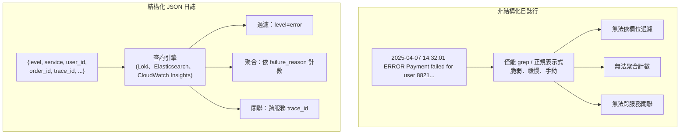

# [BEE-14002] 結構化日誌

:::info
為何非結構化日誌在規模下失效、日誌層級、關聯 ID，以及絕對不該記錄的內容。
:::

## 背景

日誌是最古老的可觀察性工具。幾十年來，應用程式將純文字行輸出到 stdout 或檔案，工程師用 `grep` 和 `awk` 找出所需資訊。當你只有一台伺服器上的一個服務，且日誌量能在終端機視窗內顯示時，這個方法行得通。

但在規模下，這個方法完全失效。

現代後端每秒處理數千個請求，每小時可能在數十個服務中產生數百萬行日誌。當出現問題時，你需要回答：*哪些請求失敗了、在哪些服務實例上、確切的錯誤情境是什麼？* 在分散式系統中對純文字進行 grep 不是一種工作流程 — 它是一種在壓力最大時必然失敗的危機應對方式。

結構化日誌 — 以機器可讀的鍵值對（通常為 JSON）發出日誌條目 — 是讓日誌可查詢、可聚合、真正成為操作工具而非考古遺跡的做法。

**參考資料：**
- [Structured Logging: Best Practices & JSON Examples — Uptrace](https://uptrace.dev/glossary/structured-logging)
- [Logging Levels: What They Are & How to Choose Them — Sematext](https://sematext.com/blog/logging-levels/)
- [9 Logging Best Practices You Should Know — Dash0](https://www.dash0.com/guides/logging-best-practices)
- [Log Debug vs. Info vs. Warn vs. Error — EdgeDelta](https://edgedelta.com/company/blog/log-debug-vs-info-vs-warn-vs-error-and-fatal)
- [Structured Logging — A Developer's Guide — SigNoz](https://signoz.io/blog/structured-logs/)

## 原則

**將每一行日誌作為結構化 JSON 物件發出。每個條目包含一組一致的標準欄位。在所有服務間傳播關聯 ID，使任何請求的完整生命週期都能從日誌中重建。**

## 非結構化 vs. 結構化日誌

同樣的付款失敗事件，兩種記錄方式：

**非結構化（避免使用）：**
```
2025-04-07 14:32:01 ERROR Payment failed for user 8821 order ORD-4492 amount 149.99 reason gateway timeout after 3s
```

**結構化（建議使用）：**
```json
{
  "timestamp": "2025-04-07T14:32:01.412Z",
  "level": "error",
  "service": "payment-service",
  "message": "payment failed",
  "user_id": "8821",
  "order_id": "ORD-4492",
  "amount_usd": 149.99,
  "failure_reason": "gateway_timeout",
  "duration_ms": 3012,
  "trace_id": "4bf92f3577b34da6a3ce929d0e0e4736",
  "request_id": "req-7a91c2d4"
}
```

非結構化行需要正規表示式才能提取 `user_id` 或 `order_id` 進行分析。結構化條目讓日誌聚合系統可以直接執行查詢：

```
level=error AND service=payment-service AND failure_reason=gateway_timeout
```

無需任何前置處理。每個欄位都可以獨立過濾、排序和聚合。



## 日誌層級

每個日誌條目都必須帶有層級，傳達事件的嚴重性和操作意義。一致地使用層級，才能讓告警和降噪成為可能。

| 層級 | 使用時機 |
|------|---------|
| **DEBUG** | 開發或排錯時有用的詳細內部狀態：變數值、分支決策、快取命中/未命中。生產環境預設停用。若在熱路徑上使用，必須搭配取樣。 |
| **INFO** | 確認系統正常運作的一般預期事件：服務啟動、請求成功完成、任務結束、設定載入。系統行為的基本敘述。 |
| **WARN** | 發生了意外的事情，但請求成功或系統已自動恢復：重試成功、呼叫了已棄用的 API、慢查詢超出閾值但未失敗。值得監控，但不需要立即處理。 |
| **ERROR** | 操作失敗且系統無法自動恢復：資料庫寫入失敗、外部呼叫耗盡重試、必要設定值遺失。需要調查。 |
| **FATAL** | 程序無法繼續並即將退出：無法恢復的狀態損毀、無法綁定必要端口。謹慎使用 — 大多數失敗是錯誤，而非致命錯誤。 |

### 最常見的日誌層級錯誤

將所有事件記錄在 INFO 層級，會造成洪流，使真正的問題與例行事件無法區分。每個層級都應有明確的合約：

- 監控系統應該能夠對 `level=error` 發出告警，而不會因為每次快取未命中就觸發。
- 調查事件的開發者應該能在 INFO 日誌中找到適當詳細程度的故事敘述，而不是每個條件分支的 40,000 行追蹤紀錄。

## 關聯 ID

微服務系統中，單一使用者操作會觸及多個服務。沒有共同識別符，每個服務的日誌就是孤立的孤島。貫穿每個服務每條日誌條目的 `trace_id` 或 `request_id`，是讓分散式除錯成為可能的關鍵。

### 運作方式

1. API 閘道（或第一個接收請求的服務）為每個入站請求產生唯一的 `trace_id`。
2. 每個對其他服務的出站呼叫都在請求標頭中包含此 ID（慣例上使用 `X-Request-ID`、`X-Trace-ID`，或 W3C `traceparent` 標頭）。
3. 每個下游服務從標頭中提取 ID，並將其包含在所有自身的日誌條目中。
4. 針對該事件的每次日誌聚合查詢都可以限定在單一 `trace_id`，返回所有服務間的完整請求生命週期。

### 跨三個服務追蹤一個請求

```json
// API 閘道
{
  "timestamp": "2025-04-07T14:32:00.001Z",
  "level": "info",
  "service": "api-gateway",
  "message": "request received",
  "method": "POST",
  "path": "/orders",
  "trace_id": "4bf92f3577b34da6a3ce929d0e0e4736",
  "request_id": "req-7a91c2d4"
}

// 訂單服務
{
  "timestamp": "2025-04-07T14:32:00.045Z",
  "level": "info",
  "service": "order-service",
  "message": "order created",
  "order_id": "ORD-4492",
  "trace_id": "4bf92f3577b34da6a3ce929d0e0e4736",
  "request_id": "req-7a91c2d4"
}

// 付款服務
{
  "timestamp": "2025-04-07T14:32:01.412Z",
  "level": "error",
  "service": "payment-service",
  "message": "payment failed",
  "order_id": "ORD-4492",
  "failure_reason": "gateway_timeout",
  "trace_id": "4bf92f3577b34da6a3ce929d0e0e4736",
  "request_id": "req-7a91c2d4"
}
```

單一查詢 — `trace_id="4bf92f3577b34da6a3ce929d0e0e4736"` — 就能按時間順序取得三個服務的完整故事，且每個步驟都有完整的上下文。

## 標準日誌結構

每個日誌條目都應包含以下最少欄位集：

| 欄位 | 類型 | 說明 |
|------|------|------|
| `timestamp` | ISO 8601 UTC | 事件發生時間（`2025-04-07T14:32:01.412Z`） |
| `level` | string | `debug`、`info`、`warn`、`error` 或 `fatal` |
| `service` | string | 服務名稱（`order-service`） |
| `message` | string | 事件的人類可讀描述 |
| `trace_id` | string | 原始請求的關聯 ID |
| `request_id` | string | 即時 HTTP 請求或任務的 ID |
| `environment` | string | `production`、`staging`、`development` |
| `version` | string | 服務版本或 Git SHA |

視需要在每個事件中附加額外欄位：`user_id`、`order_id`、`duration_ms`、`http_status`、`error_code`、`stack_trace` 等。

## 應該記錄什麼

### 應記錄的內容

- **請求元資料**：方法、路徑、狀態碼、回應時間、呼叫的上游服務。
- **狀態轉換**：訂單建立、付款擷取、任務開始/完成、快取失效。
- **錯誤與例外**：完整錯誤訊息、錯誤碼、堆疊追蹤（以結構化欄位記錄，不要串接到訊息字串中）。
- **重要決策**：功能旗標評估、A/B 版本分配、斷路器開啟。
- **外部呼叫結果**：呼叫了第三方 API、結果代碼、延遲。

### 不應記錄的內容

- **密碼與機密**：絕不記錄憑證、API 金鑰、令牌或私鑰 — 即使是遮罩後的版本。不完整遮罩的風險太高。
- **個人識別資訊（PII）**：姓名、電子郵件地址、電話號碼、IP 位址、實體地址、國民身分證號碼。記錄 PII 會造成 GDPR、HIPAA 和 PCI DSS 合規風險。使用假名 ID（如 `user_id`）代替原始使用者資料。
- **完整請求/回應主體**：這些通常同時包含機密和 PII。記錄元資料，不要記錄酬載。
- **INFO 層級的高頻噪音**：健康檢查輪詢、心跳和例行快取讀取以 INFO 層級記錄，會淹沒系統並埋沒真實信號。使用 DEBUG 或完全跳過。

## 情境式日誌

最有用的日誌攜帶的情境，是在請求生命週期早期建立的，而不僅僅是在記錄呼叫當下可用的資料。這稱為情境式或豐富化日誌。

不要這樣做：
```json
{ "level": "error", "message": "query failed", "query": "SELECT ..." }
```

應該這樣做：
```json
{
  "level": "error",
  "message": "query failed",
  "query": "SELECT ...",
  "service": "order-service",
  "trace_id": "4bf92f3577b34da6a3ce929d0e0e4736",
  "user_id": "8821",
  "request_path": "/orders",
  "duration_ms": 4812
}
```

第二個條目不只回答了*什麼*失敗，還回答了*哪個請求觸發了它*、*誰受到影響*，以及*它已執行多久*。大多數日誌函式庫支援情境物件或 MDC（Mapped Diagnostic Context），它能自動將這些欄位附加到請求處理器中的每次日誌呼叫，無需每個日誌語句手動重複設定。

## 高流量下的日誌取樣

在極高吞吐量下（每秒數萬個請求），記錄每個成功請求可能產生的量，超出了操作上有用或經濟上可行的儲存範圍。取樣策略解決了這個問題：

- **頭部取樣**：記錄固定比例的所有請求（如 10%）。簡單，但會失去罕見事件的可見性。
- **尾部取樣**：緩衝請求的完整日誌，並在請求完成後決定是否保留。保留 100% 的錯誤和慢速請求；將成功的快速請求取樣降至 1–5%。這樣可以保留重要事件，同時減少整體量。
- **始終記錄錯誤**：無論取樣策略如何，每個 ERROR 和 FATAL 日誌條目都必須發出。取樣絕不能捨棄錯誤信號。

取樣應用於日誌聚合代理（Fluentd、Fluent Bit、OpenTelemetry Collector），而不是在應用程式本身，讓應用程式程式碼保持簡單。

## 日誌聚合

JSON 格式的結構化日誌設計用來被日誌聚合平台接收：

- **自行架設**：Elasticsearch + Kibana（ELK stack）、Loki + Grafana。
- **託管服務**：AWS CloudWatch Logs Insights、Google Cloud Logging、Datadog Logs、Grafana Cloud。

這些系統對每個 JSON 欄位建立索引，使得可以在數十億條日誌條目中進行毫秒級的全文和欄位層級查詢。結構化日誌的價值只有在連接到聚合後端時才能完全實現 — 寫入檔案卻從未傳輸的結構化日誌，僅比非結構化日誌稍好一點。

## 常見錯誤

### 1. 記錄 PII 和機密

這是合規違規（GDPR、HIPAA、PCI DSS）和安全風險。日誌聚合系統在組織內廣泛可存取，且通常保留數個月。一次記錄的密碼或 API 金鑰，在整個保留期間內都可能暴露給所有有日誌存取權限的工程師。使用 `user_id`，不要使用 `email`。遮蔽支付資料。在來源端就進行令牌的遮蔽。

### 2. 所有事件都用 INFO 層級

如果每個事件都是 INFO，那麼 INFO 在有用的意義上就沒有任何事件了。如果錯誤以 INFO 記錄，則對 `level=error` 的告警什麼都抓不到。如果 INFO 既包含「請求完成」又包含「資料庫連線池耗盡」，顯示 INFO 速率的儀表板毫無意義。審查你的日誌層級：INFO 應該是系統的敘述，ERROR 應該觸發告警。

### 3. 沒有關聯 ID

沒有共同識別符，請求鏈中每個服務的日誌就是互不相連的。重建特定使用者請求發生了什麼，需要交叉比對時間戳並猜測哪些條目屬於同一組。這是 2 分鐘調查和 2 小時調查之間的差距。從第一個服務到最後一個服務都要傳播 `trace_id`。

### 4. 以參考方式記錄物件

在某些語言（特別是 JavaScript）中，在不序列化的情況下記錄物件，會在日誌輸出中產生 `[object Object]` — 所有情境都遺失了。始終明確序列化物件，或使用能自動處理此問題的日誌函式庫。同樣地，避免為日誌訊息使用字串串接；改用結構化鍵值欄位傳遞。

### 5. 沒有保留或輪替策略

寫入磁碟而沒有輪替的日誌會填滿磁碟。傳輸到託管服務而沒有保留策略的日誌會無限累積成本。定義適合你合規要求的保留策略（生產日誌的常見起點是 90 天），並在儲存層設定輪替或 TTL，而不是事後才想到。

## 相關 BEE

- [BEE-14001](three-pillars-logs-metrics-traces.md) — 三大支柱：日誌、指標和追蹤如何相互補充
- [BEE-14002](structured-logging.md) — 分散式追蹤：分散式系統情境中的 `trace_id` 和 `span_id`
- [BEE-4006](../api-design/api-error-handling-and-problem-details.md) — 錯誤處理：在錯誤回應中包含關聯 ID，讓客戶端能回報
