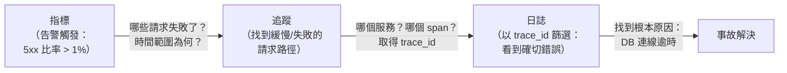

# [BEE-320] 三大支柱：日誌、指標、追蹤

:::info
日誌、指標與追蹤各自提供什麼、為何三者缺一不可，以及如何在事故中串聯使用。
:::

## 背景

2017 年，Peter Bourgon 發表了一篇奠基性文章，定義了可觀測性的三種不同訊號：指標、追蹤與日誌。三者在基數（cardinality）、資料量與能回答的問題類型上各有本質差異。各大廠商熱情採納此框架，它也因此成為系統觀測的標準心智模型。

OpenTelemetry（OTel）目前由 CNCF 支持，獲得超過 90 家廠商支援，將此模型規範為單一的廠商中立 SDK 與傳輸協定（OTLP）。使用 OpenTelemetry 進行儀器化，意味著一次性捕捉三種訊號，共用同一資料模型，並可路由到任何後端，無需重新儀器化。

**參考資料：**
- [Peter Bourgon — Metrics, tracing, and logging (2017)](https://peter.bourgon.org/blog/2017/02/21/metrics-tracing-and-logging.html)
- [OpenTelemetry — Signals 概覽](https://opentelemetry.io/docs/)
- [OpenTelemetry Signals: Logs vs Metrics vs Traces — Dash0](https://www.dash0.com/knowledge/logs-metrics-and-traces-observability)

## 原則

**用指標得知系統發生了問題，用追蹤找到問題出在哪裡，用日誌了解確切發生了什麼。以共用的 trace ID 將三者串聯。**

## 三大支柱

### 日誌（Logs）

日誌是執行中程序所記錄的、帶有時間戳記的單次事件記錄。

**特性：**
- 三種訊號中資料量最大——位元組數往往超過生產流量本身。
- 可為非結構化（純文字行）或結構化（含鍵值欄位的 JSON 物件）。
- 能捕捉指標無法呈現的豐富情境：錯誤訊息、使用者 ID、查詢參數、堆疊追蹤。
- 原始形式無法聚合；查詢需要搜尋索引。

**非結構化日誌（生產環境應避免）：**
```
2025-04-07 14:32:01 ERROR failed to connect to database after 3 retries
```

**結構化日誌（建議做法）：**
```json
{
  "timestamp": "2025-04-07T14:32:01Z",
  "level": "error",
  "message": "database connection failed",
  "service": "order-service",
  "db_host": "db-primary.internal",
  "retries": 3,
  "trace_id": "4bf92f3577b34da6a3ce929d0e0e4736",
  "span_id": "00f067aa0ba902b7"
}
```

日誌回答的問題：**究竟發生了什麼事？在什麼情境下？對應哪個請求？**

### 指標（Metrics）

指標是對系統屬性隨時間進行的數值量測，以取樣或累積方式呈現。

**特性：**
- 三種訊號中資料量最小；時序資料壓縮效果好。
- 可跨維度聚合（依服務、主機、地區、狀態碼）。
- 易於儲存與查詢；專為儀表板與告警設計。
- 刻意捨棄每個請求的細節——這是換取規模化的代價。

**常見指標類型：**
| 類型 | 定義 | 範例 |
|---|---|---|
| Counter（計數器） | 單調遞增的值 | `http_requests_total{status="500"}` |
| Gauge（儀表） | 當下時間點的值 | `db_connection_pool_active` |
| Histogram（直方圖） | 觀測值的分布 | `http_request_duration_seconds` |

指標回答的問題：**系統健康嗎？趨勢如何？何時開始出問題？**

### 追蹤（Traces）

追蹤是單一請求流經一個或多個服務的完整路徑記錄。

**特性：**
- 資料量介於指標與日誌之間——每個請求一條追蹤，高流量系統會進行取樣。
- 由**Span**組成：每個 span 代表一個工作單元（服務呼叫、資料庫查詢、外部 HTTP 請求）。
- 每個 span 記錄開始時間、持續時間、狀態及鍵值屬性。
- Context propagation 透過 HTTP header（W3C Trace Context 標準）或訊息 metadata，將 `trace_id` 與 `span_id` 跨越服務邊界傳遞。

```
Trace: 4bf92f3577b34da6a3ce929d0e0e4736
│
├── [api-gateway]          0ms → 342ms   (root span)
│   ├── [auth-service]     5ms → 23ms
│   ├── [order-service]   25ms → 340ms   ← 緩慢
│   │   ├── [db query]    26ms → 318ms   ← 極慢
│   │   └── [cache get]  319ms → 322ms
│   └── [notify-service] 341ms → 342ms
```

追蹤回答的問題：**在呼叫路徑的哪個位置發生了延遲或錯誤？**

## 三者如何互補

沒有任何單一支柱能提供完整的全貌。

- **僅有指標**：你知道錯誤率飆升，但不知道哪些請求失敗，也不知道原因。
- **僅有日誌**：你能看到個別錯誤訊息，但無法統計頻率，也無法找到根源服務。
- **僅有追蹤**：你能追蹤單一請求的路徑，但沒有指標就無法判斷這條追蹤是否具有代表性。

當三者**串聯**時效力最強：

- 在每一行結構化日誌中嵌入 `trace_id`。當追蹤發現緩慢的 span，就能以該 ID 篩選日誌，看到該請求在所有服務中的每個事件。
- 使用**metric exemplars**（Prometheus 與 OpenTelemetry 皆支援），在直方圖的某個區間附加一個取樣的 `trace_id`。當延遲告警觸發時，點擊 exemplar 即可直接跳轉到代表性追蹤。

## 調查流程圖



## 生產環境事故範例

**告警：** PagerDuty 觸發——`order-service` 的 `http_5xx_rate` 連續 3 分鐘超過 1%。

**第一步 — 指標（確定問題範圍）**

開啟儀表板。指標 `http_requests_total{service="order-service", status="500"}` 顯示飆升從 14:30 UTC 開始。`http_request_duration_p99` 也在同一時刻從 120ms 跳升至 4.2s。

你現在知道：order-service，從 14:30 開始，高延遲且有錯誤。但還不知道原因。

**第二步 — 追蹤（找到問題所在）**

篩選 14:30 至 14:35 之間 `order-service` 中 `status=error` 的追蹤。在追蹤瀑布圖中，你發現一個規律：所有失敗請求都有一個 `db_query` span 耗時 3–4 秒後逾時。緩慢的 span 位於 `order-service → db_query`，不在任何上下游服務。

你現在取得了 `trace_id`：`4bf92f3577b34da6a3ce929d0e0e4736`。

**第三步 — 日誌（了解發生了什麼）**

搜尋 `trace_id="4bf92f3577b34da6a3ce929d0e0e4736"` 的日誌。在三個服務實例中，你發現以下記錄反覆出現：

```json
{
  "level": "error",
  "message": "database connection failed",
  "db_host": "db-primary.internal",
  "error": "connection pool exhausted: max_connections=20, active=20",
  "trace_id": "4bf92f3577b34da6a3ce929d0e0e4736"
}
```

根本原因：10 分鐘前的一次部署增加了連線池的使用量，耗盡了資料庫的連線上限。

**若缺少任一支柱：** 指標告訴你有問題；沒有追蹤，你要花 20 分鐘在各服務間 grep 日誌；沒有日誌，你知道追蹤緩慢，但看不到底層的錯誤訊息。

## 可觀測性 vs 監控

這兩個詞常被混用，但描述的是不同的實踐。

**監控（Monitoring）**是檢查已知狀態：顯示預定義指標的儀表板，以及當數值超過預設閾值時觸發的告警。監控回答的是你在事故**發生前**就預料到的問題。它是針對已知故障模式目錄的被動反應。

**可觀測性（Observability）**是系統的一種性質，讓你能夠在不部署新儀器化的情況下提出新問題。當出現你未預見的新型故障模式時，可觀測性讓你能夠探索：依任意維度篩選、從指標樞轉到追蹤再到日誌、查詢原始結構化資料。可觀測性是調查未知問題的基礎設施。

監控是可觀測性所能實現的子集。兩者都需要：用儀表板與告警應對已知情況，用探索能力應對其他一切。

## 常見錯誤

### 1. 日誌缺乏結構

非結構化的日誌行無法按欄位搜尋或聚合。當事故發生時，你無法篩選 `level=error AND service=order-service AND trace_id=X`，只能在凌晨兩點 grep 純文字。請務必使用 JSON 或結構化格式記錄日誌。詳見 [BEE-14002](structured-logging.md)。

### 2. 指標缺乏情境

在指標中使用高基數標籤（使用者 ID、請求 ID、電子郵件地址）會造成基數爆炸：唯一時序的數量無限增長，壓垮指標儲存。原則：指標標籤必須是低基數的枚舉值（狀態碼、服務名稱、地區）。高基數的情境資訊屬於日誌與追蹤，不屬於指標標籤。

### 3. 沒有追蹤 context propagation

一條在第一個服務邊界就中斷的追蹤，對分散式除錯毫無用處。每個服務都必須提取傳入的 `traceparent` header（W3C Trace Context 標準），建立子 span，並在所有傳出請求中轉發該 header——包括透過訊息佇列 metadata 的非同步訊息。沒有 propagation，你看到的只是孤立的 span，而非端對端的追蹤。

### 4. 將可觀測性視為單純的監控

有固定面板的儀表板是監控。可觀測性需要互動式查詢的能力：依任意維度切片、從指標飆升跳轉到造成它的追蹤、依任意結構化欄位搜尋日誌。如果你的工具只支援預定義儀表板，你做的是監控——有用，但不足以應對新型故障。

### 5. 三大支柱之間缺少關聯

沒有 `trace_id` 的日誌無法與造成它的追蹤連結。沒有 exemplar 的指標無法連結到代表性追蹤。在儀器化時就建立關聯，而非事後補救。OpenTelemetry SDK 在正確設定後會自動傳播追蹤 context；主要的紀律是確保每次日誌寫入都包含當前 span 的 context。

## 相關 BEE

- [BEE-14002](structured-logging.md) — 結構化日誌：schema、日誌等級，以及什麼不該記錄
- [BEE-14003](distributed-tracing.md) — 分散式追蹤：span、取樣策略與 context propagation
- [BEE-14004](alerting-philosophy.md) — 告警哲學：應該告警什麼，以及如何撰寫好的 runbook
- [BEE-14005](slos-and-error-budgets.md) — SLO 與錯誤預算：使用指標定義並追蹤可靠性目標
