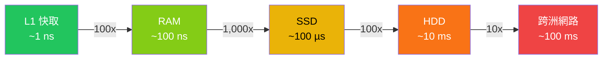

# [BEE-13001] 粗略估算

:::info
每位工程師都應熟記的延遲數字，以及容量計算方法。
:::

## 背景

在寫下第一行程式碼或選擇資料庫之前，工程師應該能夠回答：「這個問題的規模有多大？」粗略估算（Back-of-Envelope Estimation）是一種快速、近似的計算方法，用來驗證一個設計方案是否能承受預期的負載——只需一塊白板和幾個熟知的常數即可完成。

這個技術由 Google Fellow Jeff Dean 透過「Numbers Every Programmer Should Know」演講推廣開來，已成為系統設計面試和實際架構評審的標準要求。Alex Xu 在《System Design Interview》一書中整章介紹這項技能，因為若缺乏這個能力，工程師只能依靠直覺而非數量級來做決策。

目標從來不是假精確。一個粗略的答案——「這大約需要 10 TB/年的儲存空間」——比沒有答案好得多，也比「9,847,296 GB」這種假精確的答案更誠實。

## 原則

**先估算，再設計。** 使用數量級近似值來識別哪些維度（吞吐量、儲存、頻寬、記憶體）足夠大、足以約束設計決策。明確陳述每一個假設。當假設改變時，重新審視估算值。

## 你必須內化的延遲數字

這些數字來自 Jeff Dean 的原始演講，自 2010 年前後便成為業界標準參考。確切數值會隨硬體世代而有所變化，但*數量級*是穩定的，這才是重點所在。

| 操作 | 延遲 | 備註 |
|---|---|---|
| L1 快取存取 | ~1 ns | 晶片上，最快 |
| 分支預測失誤懲罰 | ~5 ns | CPU 管線刷新 |
| L2 快取存取 | ~4 ns | 仍在晶片上 |
| Mutex 鎖定/解鎖 | ~17 ns | |
| 主記憶體（RAM）存取 | ~100 ns | 比 L1 慢 100 倍 |
| 以 Snappy 壓縮 1 KB | ~3 µs | |
| 從記憶體循序讀取 1 MB | ~3 µs | |
| SSD 隨機讀取（4 KB） | ~100 µs | 比 RAM 慢 1,000 倍 |
| 從 SSD 循序讀取 1 MB | ~1 ms | |
| 同一資料中心來回延遲 | ~0.5 ms | |
| HDD 磁碟尋軌 | ~10 ms | 比 RAM 慢 10,000 倍 |
| 從 HDD 循序讀取 1 MB | ~20 ms | |
| 封包 CA → 荷蘭 → CA | ~150 ms | 跨洲來回延遲 |

**參考來源：** [Latency Numbers Every Programmer Should Know (gist.github.com/jboner/2841832)](https://gist.github.com/jboner/2841832)、[Jeff Dean 原始數字 (brenocon.com)](https://brenocon.com/dean_perf.html)

### 延遲規模視覺化



實務結論：記憶體存取便宜到幾乎可以忽略。磁碟 I/O 和網路 I/O 的成本極高，在大多數後端系統中主導了所有其他成本。設計決策的核心在於盡量減少它們。

## 容量估算的二的次方表

估算儲存和記憶體時，以二的次方為單位計算。請熟記以下數值：

| 單位 | 二的次方 | 近似值 | 常見情境 |
|---|---|---|---|
| 1 Byte | 2^0 | 1 B | 一個字元 |
| 1 Kilobyte (KB) | 2^10 | 1,024 B ≈ 10^3 | 一封短信 |
| 1 Megabyte (MB) | 2^20 | ~100 萬 B ≈ 10^6 | 一張壓縮照片 |
| 1 Gigabyte (GB) | 2^30 | ~10 億 B ≈ 10^9 | 一部壓縮電影 |
| 1 Terabyte (TB) | 2^40 | ~1 兆 B ≈ 10^12 | 一個大型資料庫 |
| 1 Petabyte (PB) | 2^50 | ~10^15 | Google 規模的儲存 |

**參考來源：** [Memory Estimation Cheatsheet (medium.com/@bindubc)](https://medium.com/@bindubc/to-convert-between-bytes-b-megabytes-mb-gigabytes-gb-and-terabytes-tb-you-can-use-the-18555f7066d2)

在估算時，將 1 KB 視為恰好 1,000 bytes 只會引入 2.4% 的誤差，可以放心使用。

## QPS 換算：從 DAU 到每秒請求數

最常見的起點是每日活躍用戶數（DAU）。關鍵常數：**1 天 ≈ 86,400 秒**。

估算時，將其四捨五入為 **10^5 秒/天**（86,400 ≈ 100,000）。換算公式：

```
平均 QPS = (DAU × 每位用戶每天的請求數) / 86,400
尖峰 QPS = 平均 QPS × 尖峰係數（通常為 2–10 倍）
```

快速參考乘數：

| DAU | 平均 QPS（每用戶 1 次/天） | 平均 QPS（每用戶 10 次/天） |
|---|---|---|
| 100 萬 | ~12 | ~120 |
| 1,000 萬 | ~120 | ~1,200 |
| 1 億 | ~1,200 | ~12,000 |
| 10 億 | ~12,000 | ~120,000 |

**80/20 流量法則：** 在實務中，80% 的每日流量集中在 20% 的時段（約 4–5 小時）。這意味著你的尖峰 QPS 可能是平均值的 4–5 倍，而不只是 2 倍。永遠針對尖峰設計，而非平均值。

## 估算框架

按照以下順序執行，以避免循環推理：

1. **明確陳述假設** — 寫下來。「假設 1 億 DAU，讀寫比 10:1，平均 URL = 100 bytes。」未陳述的假設無法被驗證或挑戰。
2. **估算請求量** — 將 DAU 換算為平均 QPS，再套用尖峰係數。
3. **估算儲存量** — （每日寫入次數）×（每次寫入 bytes）×（保留年數）。
4. **估算頻寬** — （QPS）×（每次請求 bytes）。
5. **估算記憶體** — 若使用快取，套用 20/80 法則：快取 20% 的每日資料以應對 80% 的讀取需求。
6. **對照已知限制驗證** — 你的儲存估算能放進一台機器嗎？一個機架？頻寬是否超過你的網路規格？

## 實例演練：為 1 億 DAU 設計短網址服務

### 假設條件

- 每日活躍用戶：1 億
- 讀寫比 = 100:1（讀取主導——點擊連結遠多於建立連結）
- 平均原始 URL 長度：100 bytes
- 平均短網址長度：7 bytes
- 保留期限：5 年
- 每位用戶每天建立 ~0.1 條短網址，點擊 ~10 次

### 第一步：QPS 估算

```
寫入 QPS = 1 億 × 0.1 / 86,400
         ≈ 1,000 萬 / 86,400
         ≈ ~116 次寫入/秒
         → 四捨五入為 ~100 寫入 QPS

讀取 QPS  = 100 × 寫入 QPS
          = ~10,000 讀取 QPS

尖峰讀取 QPS = 10,000 × 5（尖峰係數）
             = ~50,000 讀取 QPS
```

### 第二步：儲存估算

```
每日寫入數     = 1 億 × 0.1 = 1,000 萬條 URL/天
每條 URL bytes = 100 bytes（原始）+ 7 bytes（短網址）+ 元資料 ≈ 500 bytes
每日儲存量     = 1,000 萬 × 500 B = 5 GB/天
5 年儲存量     = 5 GB × 365 × 5 ≈ 9 TB

→ 四捨五入為 ~10 TB 總儲存量
```

### 第三步：頻寬估算

```
寫入頻寬 = 100 寫入 QPS × 500 B = 50 KB/s   （可忽略）
讀取頻寬 = 10,000 讀取 QPS × 500 B = 5 MB/s （輕鬆應對）
尖峰頻寬 = 50,000 × 500 B = 25 MB/s
```

### 第四步：記憶體估算（快取）

```
每日讀取請求數  = 10,000 QPS × 86,400 = ~8.64 億次讀取/天
快取 20% URL   = 8.64 億 × 0.2 × 500 B ≈ 86 GB

→ 單一大型記憶體節點或分散式快取即可應對
```

### 結論

這是一個讀取密集、低寫入量的服務。5 年 10 TB 的儲存量可以放進幾台商用伺服器。讀取 QPS ~1 萬（尖峰 5 萬）可以用資料庫前的少量快取層來應對。**估算結果告訴你，第一天不需要分散式資料庫** — 帶有 CDN 快取的主從式關聯型資料庫就已足夠。這正是粗略估算所能帶來的決策價值。

## 常見錯誤

### 1. 假精確
說「我們的系統將處理 1,234,567 QPS」毫無意義，也不誠實。你並未量測過這個數字，你只是估算了它。應寫成「~120 萬 QPS」。假精確會破壞信任並浪費討論時間。

### 2. 忘記尖峰 vs 平均值
平均 QPS 是一個容易誤導人的基準。流量從來不是平坦的。使用尖峰 = 平均的 2–10 倍作為設計目標。確切係數取決於你的流量模式；對社群網路和電商來說，5 倍是合理的預設值。

### 3. 忽略資料隨時間的成長
今天運作良好的 10 TB 設計，三年後可能需要處理 100 TB。在儲存估算中加入時間範圍。「現在 10 TB，5 年後 100 TB」會改變架構決策。

### 4. 將所有儲存視為相同
RAM、SSD 和 HDD 在成本、延遲和吞吐量上有著截然不同的特性。「我們需要 10 TB 儲存空間」的估算若不指定層級則不完整。10 TB 的 RAM 約需 5 萬美元；10 TB 的 HDD 約需 200 美元。上方的延遲表應指導每種存取模式應屬於哪個層級。

### 5. 估算時不陳述假設
如果你的估算寫著「1 億 DAU」卻從未寫下來，審閱者無法挑戰它，你也無法在需求改變時更新它。每個估算只有和它的假設一樣好。讓假設可見。

## 摘要

| 概念 | 快速法則 |
|---|---|
| 每天的秒數 | ~10^5（86,400） |
| 尖峰 QPS | 平均的 2–10 倍 |
| L1 vs RAM | 相差 100 倍 |
| RAM vs SSD | 相差 1,000 倍 |
| SSD vs HDD | 相差 100 倍 |
| 1 KB、MB、GB、TB | 10^3、10^6、10^9、10^12 bytes |
| 快取目標 | 快取 20% 的資料以服務 80% 的讀取 |

## 相關 BEE

- [BEE-13002](horizontal-vs-vertical-scaling.md) — 擴展決策：估算如何指導水平擴展 vs 垂直擴展的選擇
- [BEE-6004](../data-storage/partitioning-and-sharding.md) — 分片（Sharding）：資料量超過單一節點容量時的處理門檻
