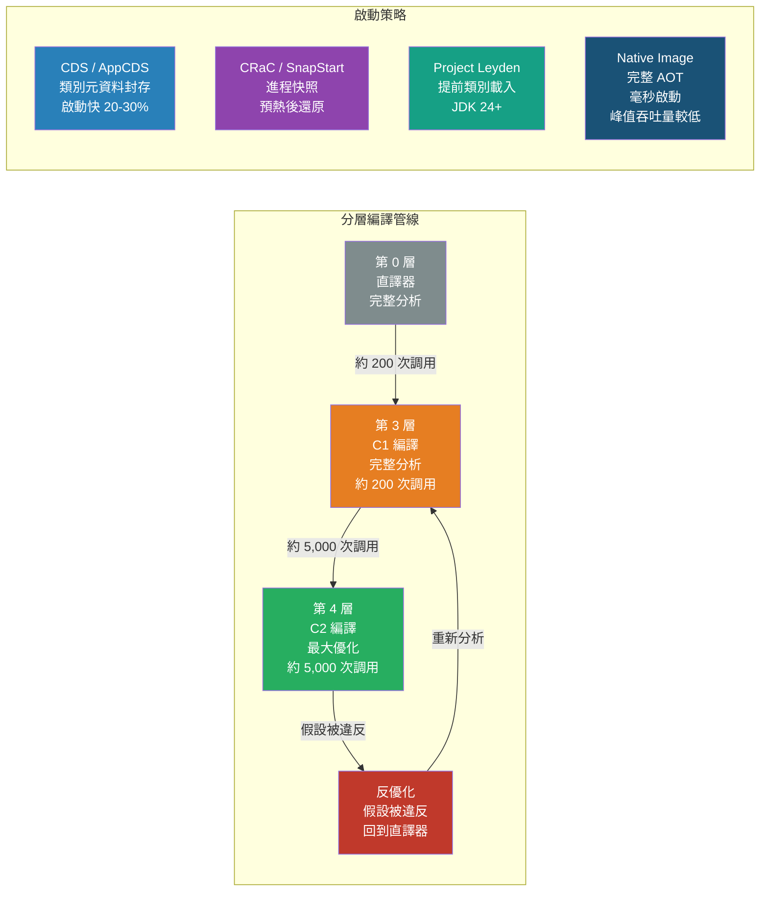

# [BEE-496] JVM JIT 編譯與應用程式預熱

:::info
JVM 的即時編譯器（Just-In-Time compiler）啟動時速度慢，但隨著觀察到的執行期行為增加而持續優化——理解這個管線，就能解釋為什麼 Java 服務在冷啟動時會有延遲尖峰，以及如何應對。
:::

## 背景

Java 的效能有個矛盾現象：JVM 在穩態吞吐量上常常能媲美甚至超越原生 C++ 程式，但剛啟動的 Java 服務卻經常比穩定後慢上 10 到 100 倍。這個差距正是 JIT 編譯器自適應編譯模型所造成的，也是冷啟動問題的根源——隨著容器部署和自動擴展的普及，這個問題日益嚴峻。

HotSpot 核心的雙編譯器架構——C1（「客戶端」編譯器，快速但優化程度適中）和 C2（「伺服器」編譯器，激進優化）——在 Java 7 引入，並在 Java 8 成為預設的「分層編譯（tiered compilation）」模式。分層編譯的設計目標是在不犧牲需要分析引導優化的吞吐量前提下，提供可接受的啟動效能。Microsoft for Java Developers 工程團隊詳細記錄了這個管線的五個層級；Aleksey Shipilev（Red Hat、OpenJDK 提交者）則在其 JVM Anatomy Quark 系列中，以最精確的方式闡述了推測式優化與反優化（deoptimization）的交互作用。

自適應 JIT 在無伺服器和 Kubernetes 環境中的限制，促使業界產生了兩個並行的解決方向：GraalVM Native Image（提前編譯，完全消除 JVM）與 Project Leyden / CRaC（在保留 JVM 自適應吞吐量優勢的同時縮短預熱時間）。兩者目前都已達到生產就緒狀態，代表不同的取捨，而非單一解法。

## 分層編譯的運作方式

HotSpot 透過五個層級編譯方法。每個方法從第 0 層（直譯）開始，並可依執行頻率晉升至第 4 層（C2 優化）。

| 層級 | 編譯器 | 說明 |
|---|---|---|
| 0 | 直譯器 | 完整監測；追蹤調用與迴圈計數器 |
| 1 | C1 | 簡單編譯，無分析（僅用於極簡方法） |
| 2 | C1 | 部分呼叫點的有限分析 |
| 3 | C1 | 完整分析：型別輪廓、分支頻率、接收者型別 |
| 4 | C2 | 利用所有第 3 層分析資料進行最大化優化 |

**晉升閾值**（JDK 預設值）：
- 第 3 層在約 200 次調用時觸發（`Tier3InvocationThreshold`）
- 第 4 層在約 5,000 次調用（`Tier4InvocationThreshold`）或 15,000 次調用加迴圈組合（`Tier4CompileThreshold`）時觸發

這些閾值並非固定——JVM 會根據編譯佇列深度和可用編譯器執行緒動態調整，以防止佇列飽和。

### C2 優化技術

**方法內聯（Method inlining）**是最基礎的優化。C2 將被調用方的方法體複製到調用方，消除調用開銷——更重要的是，這使得跨內聯邊界的逃逸分析和死碼消除成為可能。預設閾值：35 位元組以下的方法在調用次數超過 `MinInliningThreshold` 時內聯；6 位元組以下的方法永遠內聯。

**逃逸分析（Escape analysis）**判斷分配的物件是否在編譯方法之外可見。被分類為 `NoEscape` 的物件會進行**純量替換（scalar replacement）**：其欄位成為區域變數（存於暫存器或堆疊），完全消除堆積分配。被分類為 `ArgEscape` 的物件則進行**鎖消除（lock elision）**，刪除其 `synchronized` 區塊。這也是為什麼在緊密迴圈中的短命物件，在已預熱的 JVM 中往往完全不產生 GC 壓力——它們從未到達堆積。

**推測式優化（Speculative optimization）**利用第 3 層收集的型別輪廓資料。如果一個虛擬調用點在數千次調用中只觀察到型別 `A`，C2 就假設它永遠是型別 `A`，將虛擬分發替換為直接調用（或內聯方法體），並加上型別守衛檢查。從未被執行的冷路徑則替換為**非常規陷阱（uncommon trap）**——一種在假設被違反時觸發的反優化存根（stub）。

**棧上替換（On-Stack Replacement，OSR）**解決了一個特殊問題：在直譯器中啟動的長時間執行迴圈。JVM 不等待方法的下次調用，而是在迴圈執行途中將堆疊框架替換為已編譯版本。OSR 編譯的方法在 `-XX:+PrintCompilation` 輸出中以 `%` 標記顯示。

### 反優化（Deoptimization）

當推測式假設被違反時——在單型態調用點出現了意外的子型別、在從未觀察到 null 的地方遇到了 null、載入了使內聯虛擬調用失效的新類別（類別層次分析，CHA）——JVM 會**反優化**：

1. 從已編譯框架重建直譯器狀態
2. 將已編譯方法標記為「不可進入（not entrant）」（不允許新調用者）
3. 恢復直譯執行並收集新的分析資料
4. 最終以更新且較不激進的假設重新編譯

反優化本身只需微秒。代價是重新直譯期間和再次預熱期間的延遲尖峰。這就是為什麼預熱流量必須與生產流量一致：只用正常路徑請求進行預熱，會在生產流量觸及錯誤路徑或不同型別時引發反優化。

## 診斷 JIT 編譯

```bash
# 印出每個編譯事件（方法名稱、層級、編譯時間）
-XX:+PrintCompilation

# 將含內聯決策的詳細日誌輸出到 hotspot.log
-XX:+LogCompilation -XX:+UnlockDiagnosticVMOptions -XX:+PrintInlining

# 觀察程式碼快取使用量
jstat -compiler <pid>
jstat -printcompilation <pid> 1000

# 檢查程式碼快取壓力（可能導致編譯停頓）
jcmd <pid> VM.native_memory summary
```

若程式碼快取滿載（`-XX:ReservedCodeCacheSize`，分層編譯下預設 240 MB），JVM 將停止編譯新方法，導致所有新程式碼以全直譯成本執行。在大型應用中，症狀是隨著更多方法成為「殭屍」但新熱點路徑無法編譯，效能逐漸退化。

## 預熱策略

**SHOULD（應該）在接受生產流量之前重放生產流量。** 在負載均衡器層進行預熱（將實例從輪詢中移除、傳送合成或重放流量、在指標穩定後重新加入）是最可靠的策略。工具：Apache JMeter、k6、Gatling、AWS Lambda Provisioned Concurrency。

**SHOULD（應該）使用 JVM 旗標，在預熱期間加速編譯：**

```bash
# 在受控預熱階段縮短閾值
-XX:CompileThreshold=1000      # C2 觸發（非分層模式；較低 = 初始編譯更快）
-XX:Tier4InvocationThreshold=2000   # 分層模式下降低第 4 層觸發
```

**MUST NOT（不得）在生產環境使用 `-Xcomp`（第一次調用即編譯）。** 它在沒有分析資料的情況下進行編譯，產生次優的 C2 程式碼，並可能比正常預熱期引發更多反優化。它也會顯著延遲啟動。

**SHOULD（應該）確保預熱流量涵蓋與生產流量相同的程式碼路徑**，包括錯誤路徑、認證流程和查詢模式。分析資料不符會導致反優化，在真實流量到達時表現為延遲尖峰。

## 類別資料共享（CDS 與 AppCDS）

類別資料共享（Class Data Sharing）將預處理的類別元資料寫入記憶體映射檔案，並在 JVM 進程間共享。它能縮短啟動時間（大型應用程式約 20–30%），並透過讓同一主機上的多個 JVM 實例共享唯讀封存頁面來節省記憶體。

JDK 12+ 隨附預設的 CDS 封存，涵蓋約 1,400 個核心 JDK 類別。AppCDS（JEP 310，Java 10）將其擴展至應用程式類別。

```bash
# 靜態 AppCDS 工作流程（Java 10+）
# 步驟 1：記錄所有載入的類別
java -Xshare:off \
     -XX:DumpLoadedClassList=app.classlist \
     -cp app.jar com.example.Main

# 步驟 2：建立共享封存
java -Xshare:dump \
     -XX:SharedClassListFile=app.classlist \
     -XX:SharedArchiveFile=app.jsa \
     -cp app.jar

# 步驟 3：使用封存執行（啟動改善在此可見）
java -Xshare:on \
     -XX:SharedArchiveFile=app.jsa \
     -cp app.jar com.example.Main

# 動態 CDS（Java 13+，更簡單）：退出時封存，立即使用
java -XX:ArchiveClassesAtExit=dynamic-cds.jsa -cp app.jar com.example.Main
java -XX:SharedArchiveFile=dynamic-cds.jsa -cp app.jar com.example.Main
```

CDS 封存是平台和 JDK 版本特定的。執行期 classpath 必須與建立封存時的 classpath 一致。

## GraalVM Native Image

Native Image 執行靜態提前（AOT）編譯：從進入點出發透過指向分析（points-to analysis）遍歷所有可達程式碼，並產生帶有自身 GC 和執行緒排程的獨立原生可執行檔。

**核心取捨是啟動時間與峰值吞吐量：**

| 指標 | JVM（JIT） | GraalVM Native Image |
|---|---|---|
| 啟動時間 | 秒級（冷啟動） | 毫秒級 |
| 達到峰值吞吐量的時間 | 分鐘級 | 立即 |
| 穩態吞吐量 | 較高 | 較低 |
| 記憶體佔用 | 較高 | 較低 |

吞吐量差距的原因：JIT 基於實際執行期分析進行自適應優化；Native Image 的優化基於建置期靜態分析，無法做到這一點。

**封閉世界約束（Closed-world constraint）。** Native Image 要求執行期可達的所有程式碼在建置期可見。動態發現類別的功能（反射、動態代理、JNI）必須在配置檔案中明確宣告（`reflect-config.json`、`proxy-config.json`）。可用 `native-image-agent` 透過觀察 JVM 測試執行來生成這些配置：

```bash
# 觀察 JVM 執行，生成 Native Image 配置
java -agentlib:native-image-agent=config-output-dir=META-INF/native-image \
     -cp app.jar com.example.Main

# 使用生成的配置建置 Native Image
native-image -cp app.jar com.example.Main
```

**適合使用 Native Image 的場景：**
- 無伺服器函式、CLI 工具、邊車（sidecar）代理——啟動延遲的重要性高於穩態吞吐量
- 記憶體受限環境（Native Image RSS 通常低 50–75%）
- 避免用於 CPU 密集型長時間執行服務——JIT 的自適應吞吐量優勢在此顯著

## Project Leyden 與 CRaC

這兩個 OpenJDK 專案在不需要 Native Image 封閉世界約束的前提下，解決預熱時間問題。

**Project CRaC（Coordinated Restore at Checkpoint）**：在作業系統層級（Linux 上使用 CRIU）對完全預熱的 JVM 進程建立快照，然後從該檢查點還原。還原後的 JVM 已在記憶體中擁有所有 C2 編譯程式碼和已載入類別。

AWS Lambda SnapStart（Java 11+）建置於 CRaC 之上：它凍結已初始化的 Lambda 執行環境並在被調用時還原，實現 P99 冷啟動延遲降低 94%（從秒級降至約 100–200 ms）。應用程式必須處理還原時的狀態失效（連線、時間戳記、隨機種子）。

**Project Leyden（JEP 483，Java 24；JEP 514–515，Java 25）**：在訓練執行中儲存提前類別載入和連結的元資料，然後在後續執行中用於加速啟動和早期 JIT——無需完整進程快照，也不需要封閉世界約束。這是 JDK 24–26 時間框架內 OpenJDK 對啟動問題的主流解答。

## 視覺化



## 常見錯誤

**將冷 JVM 上的負載測試結果視為效能基準。** 冷 JVM 的吞吐量不是應用程式的效能——它是直譯器和早期 C1 程式碼的效能。只有在 JVM 達到穩態後才能進行基準測試（通常需要 30–60 秒的持續負載，或等到 `jstat -compiler` 顯示編譯速率穩定為止）。

**只使用正常路徑流量進行預熱。** 若預熱只處理成功請求，分析器會建立無法代表錯誤路徑、重試迴圈或邊緣型別多型性的型別輪廓。當生產流量觸及這些路徑時，反優化會觸發延遲尖峰，看起來像程式錯誤。

**程式碼快取填滿。** 分層編譯下的預設 `ReservedCodeCacheSize` 為 240 MB。在類別眾多的大型應用中，這很容易填滿。症狀：日誌中出現 Java 編譯器執行緒警告、隨著更多方法無法編譯而效能逐漸退化。建議增加至 512 MB 或 1 GB，並透過 `jstat -compiler` 監控。

**對受益於 JIT 吞吐量的工作負載使用 Native Image。** Native Image 適合 CLI 工具、無伺服器函式和邊車（sidecar）。對於每秒處理數千個請求的 CPU 密集型、長時間執行的應用伺服器，JIT 的自適應優化在穩態下將超過 Native Image 的靜態分析。在做出決定前請先進行基準測試。

**AppCDS classpath 配置錯誤。** 執行期 classpath 必須與建立封存時的 classpath 完全一致。Classpath 不符會導致封存被靜默拒絕（`-Xshare:on` 預設會回退到非共享模式而不報錯）。使用 `-Xlog:class+path=info` 確認封存是否正在被使用。

## 相關 BEE

- [BEE-13004](profiling-and-bottleneck-identification.md) -- 效能分析與瓶頸識別：async-profiler 與火焰圖用於 JVM CPU 方法層級分析
- [BEE-16005](../cicd-devops/container-fundamentals.md) -- 容器基礎：冷啟動對 Kubernetes 自動擴展的影響；預熱期間的存活與就緒探針時機
- [BEE-13007](memory-management-and-garbage-collection.md) -- 記憶體管理與垃圾回收：JVM 堆積配置、G1GC 和 ZGC、逃逸分析與 GC 的交互作用

## 參考資料

- [How Tiered Compilation Works in OpenJDK — Microsoft for Java Developers](https://devblogs.microsoft.com/java/how-tiered-compilation-works-in-openjdk/)
- [How the JIT Compiler Boosts Java Performance in OpenJDK — Roland Westrelin, Red Hat Developer (2021)](https://developers.redhat.com/articles/2021/06/23/how-jit-compiler-boosts-java-performance-openjdk)
- [JVM Anatomy Quark #29: Uncommon Traps — Aleksey Shipilev, Red Hat](https://shipilev.net/jvm/anatomy-quarks/29-uncommon-traps/)
- [JEP 310: Application Class-Data Sharing — OpenJDK](https://openjdk.org/jeps/310)
- [JEP 483: Ahead-of-Time Class Loading and Linking (Project Leyden) — OpenJDK](https://openjdk.org/jeps/483)
- [Project CRaC — OpenJDK](https://openjdk.org/projects/crac/)
- [Reducing Java Cold Starts on AWS Lambda with SnapStart — AWS Compute Blog](https://aws.amazon.com/blogs/compute/reducing-java-cold-starts-on-aws-lambda-functions-with-snapstart/)
- [Runtime Profiling in OpenJDK's HotSpot JVM — Roland Westrelin, Red Hat Developer (2021)](https://developers.redhat.com/articles/2021/11/18/runtime-profiling-openjdks-hotspot-jvm)
