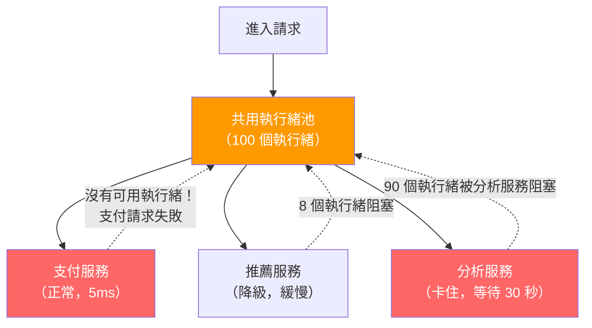
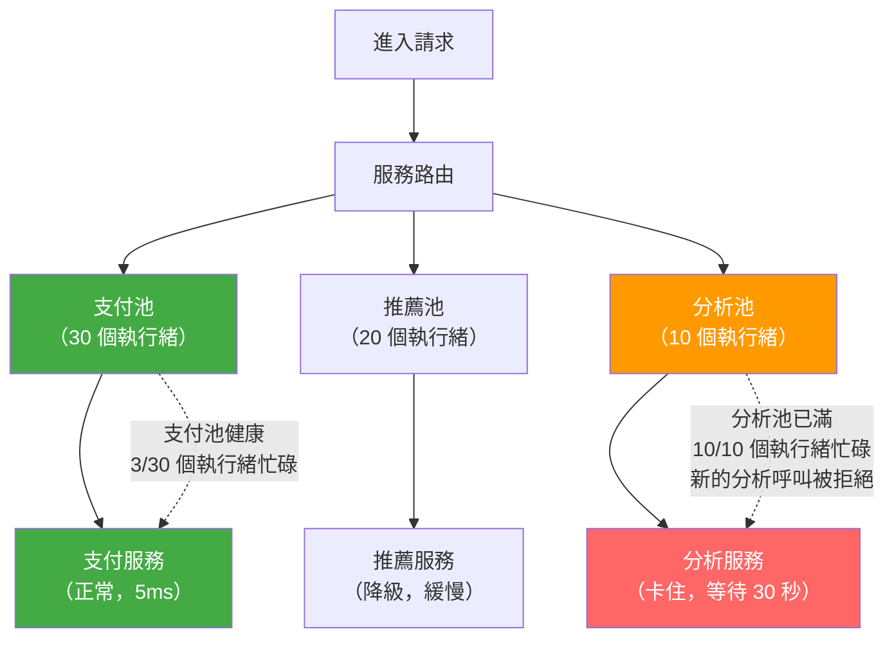

# [BEE-12004] 艙壁模式

:::info
依照下游依賴項目分配獨立的資源分區，確保單一分區的故障或緩慢不會耗盡其他分區所需的資源。
:::

## 背景

大多數服務呼叫共用同一組有限資源：執行緒池、連線池或信號量。當某個依賴服務變慢時——不是故障，只是回應遲緩——等待回應的執行緒會不斷累積。若每個進入服務的請求都要呼叫這個緩慢的依賴，共用池就會逐漸耗盡。新請求排隊等候，佇列持續增長，最終所有進入請求都卡住了——包括那些完全與緩慢依賴無關的請求。

這就是**資源耗盡引發的級聯故障**。這個問題隱蔽且常見。斷路器（[BEE-12001](circuit-breaker-pattern.md)）在依賴*故障*時才會啟動；它無法保護你免於依賴*緩慢*的衝擊。逾時設定（[BEE-12002](retry-strategies-and-exponential-backoff.md)）限制單次呼叫的等待時間，但若 500 個執行緒同時各等待最多 5 秒，執行緒池仍會在任何逾時觸發之前就被耗盡。

艙壁模式由 Michael Nygard 在 *Release It!*（Pragmatic Programmers，2018）中描述，並收錄於 Microsoft Azure 架構中心（[learn.microsoft.com/en-us/azure/architecture/patterns/bulkhead](https://learn.microsoft.com/en-us/azure/architecture/patterns/bulkhead)），其解決方式是為不同的依賴項目或呼叫者類別分配獨立的資源分區——即艙壁。某個艙壁的故障無法消耗其他艙壁的資源。

命名來自船舶設計。船體被內部隔板（艙壁）分隔成防水艙室。若船體破損，只有受損艙室灌水。船隻仍可繼續航行。若沒有艙壁，任何一處破損都會讓整艘船沉沒。

## 原則

**為每個下游依賴項目分配專屬、有限的資源分區。根據預期負載與重要性設定分區大小。緩慢或故障的依賴只能耗盡自己的分區；其他所有分區保持可用。**

## 隔離機制

艙壁隔離有四種主要實作方式，從粗粒度到細粒度依序如下。

### 執行緒池隔離

每個依賴項目擁有獨立的固定大小執行緒池。對依賴 A 的呼叫在池 A 上執行；對依賴 B 的呼叫在池 B 上執行。池 A 耗盡不影響池 B。

這是最強的隔離機制。即使依賴 A 完全卡住、池 A 的所有執行緒都被阻塞，池 B 也不受影響。主服務執行緒能快速返回，因為它將工作委派給依賴專屬的池，然後以短暫逾時等待 Future，或採用響應式模式。

**取捨：** 每個執行緒池都有開銷（每個執行緒的記憶體使用、上下文切換成本）。若對數十個依賴都進行細粒度分區，成本會相當可觀。

**適用時機：** 依賴緩慢或採用阻塞 I/O（資料庫、外部 HTTP API、遺留服務）。這是 I/O 密集型呼叫的預設建議。

### 信號量隔離

信號量限制對某依賴項目的並發呼叫數量。呼叫者在自己的執行緒上執行，但在呼叫依賴之前必須取得許可。當所有許可都被持有時，新呼叫者會立即被拒絕（或在短暫等待後拒絕）。

信號量隔離很輕量——不需管理執行緒池——但無法防止呼叫執行緒阻塞。若依賴緩慢而呼叫者執行緒阻塞等待回應，呼叫者的執行緒仍會被佔用。信號量隔離防止無限制的並發；它不能防止呼叫側的執行緒耗盡。

**適用時機：** 呼叫本身很快（毫秒以下的快取查詢、同進程呼叫），或使用完全非阻塞的非同步模式（執行緒在等待時不被佔用）。

### 連線池隔離

每個依賴項目擁有獨立的連線池。用於關鍵使用者驗證的資料庫分配 20 個連線；分析寫入路徑分配 5 個。當分析服務緩慢時，最多只能持有 5 個連線。

大多數連線池函式庫已提供此功能，但應針對每個依賴項目明確設定，而非共用單一連線池。

### 進程級隔離

在微服務架構中，將非關鍵工作負載分離到獨立服務（獨立進程、容器或虛擬機器）提供最強的隔離邊界。崩潰的推薦服務無法影響支付服務，因為它們完全不共用進程內資源。

這適合具有截然不同的擴展需求、可用性要求或容錯需求的工作負載——但這是比進程內艙壁更粗粒度且成本更高的機制。

## 沒有艙壁的問題



分析服務卡住，等待它的執行緒不斷累積。共用池耗盡。支付請求——本來 5ms 就能完成——找不到可用執行緒而失敗。非關鍵工作負載殺死了關鍵服務。

## 使用艙壁的解決方案



分析服務仍然卡住，但只能耗盡自己的 10 個執行緒池。新的分析呼叫被立即拒絕並返回錯誤——不需等待。支付池完全不受影響；支付請求正常成功。

## 實作範例

**情境：** API 閘道每個請求呼叫三個後端服務。

| 服務 | 重要性 | 預期行為 |
|---|---|---|
| 支付 | 關鍵 | 主要使用者操作必須成功 |
| 推薦 | 非關鍵 | 增強回應品質；可降級 |
| 分析 | 發送後不管 | 僅用於記錄；可丟棄 |

**沒有艙壁：** 分析服務開始卡住——可能是下游資料倉儲緩慢。幾秒鐘內，分析呼叫耗盡共用的 100 個執行緒池。推薦和支付呼叫找不到執行緒。支付——最重要的呼叫——對使用者返回 503，儘管支付後端本身完全健康。

**使用艙壁：**

| 池 | 大小 | 分析服務故障時的行為 |
|---|---|---|
| 支付池 | 30 個執行緒 | 3 個執行緒忙碌。不受影響。支付成功。 |
| 推薦池 | 20 個執行緒 | 5 個執行緒忙碌。不受影響。推薦成功。 |
| 分析池 | 10 個執行緒 | 10/10 個執行緒耗盡。新的分析呼叫立即被拒絕，返回非阻塞錯誤。 |

支付和推薦繼續為使用者服務。分析呼叫被丟棄（對於發送後不管的操作可接受）。分析池耗盡的警報觸發，提示工程師調查資料倉儲。

## 艙壁 + 斷路器

艙壁和斷路器是**互補關係，而非替代關係**。

| 模式 | 防護對象 | 機制 |
|---|---|---|
| 艙壁 | 緩慢依賴導致的資源耗盡 | 限制每個依賴的並發呼叫數 |
| 斷路器 | 故障依賴導致的級聯失敗 | 停止呼叫故障的依賴 |

若沒有斷路器，緩慢的依賴仍會一次一個槽地消耗整個艙壁分區。呼叫持續進入，每個都阻塞至逾時時間。分區保持接近滿載，增加排隊呼叫者的延遲。

加入斷路器後：一旦達到故障率門檻，斷路器開啟，新呼叫立即被拒絕，完全不進入艙壁分區。分區排空，恢復閒置狀態。

**建議的分層方式（由內到外）：**

1. **逾時**（[BEE-12002](retry-strategies-and-exponential-backoff.md)）——限制單次呼叫的阻塞時間。
2. **艙壁**——限制每個依賴的並發進行中呼叫數量。
3. **斷路器**（[BEE-12001](circuit-breaker-pattern.md)）——停止呼叫故障或飽和的依賴。

## 設定分區大小

分區大小是最重要的營運決策。沒有通用公式，但以下是實用的起始方法。

**執行緒池艙壁：**

```
pool_size = (throughput_rps × p99_latency_seconds) × safety_factor
```

- `throughput_rps`：路由到此依賴的預期每秒請求數
- `p99_latency_seconds`：依賴在正常條件下的第 99 百分位回應時間（秒）
- `safety_factor`：乘以 1.5–2.0 以吸收突發流量

**範例：** 支付服務 100 RPS，p99 延遲 50ms（0.05 秒），安全係數 2.0：
`100 × 0.05 × 2.0 = 10 個執行緒`

**信號量艙壁：**

使用相同公式作為起點。信號量許可數可以小於執行緒池大小，因為當呼叫本身是非同步時，許可獲取是非阻塞的。

**建議方向：**

| 依賴類型 | 建議起始大小 |
|---|---|
| 關鍵、低延遲（支付、驗證） | 較大分區——優先保障可用性 |
| 高流量、中等延遲（商品目錄） | 中等分區，根據峰值負載設定 |
| 非關鍵、延遲不穩定（推薦） | 較小分區；服務降級可接受 |
| 發送後不管（分析、稽核日誌） | 最小分區；丟棄呼叫可接受 |

定期根據實際觀測的 p99 延遲和並發指標重新評估分區大小。

## 監控分區使用率

靜默飽和的艙壁無法提供任何保護——呼叫排隊、延遲飆升，分區最終表現得如同完全沒有艙壁。

**每個分區應暴露的指標：**

| 指標 | 描述 | 警報門檻 |
|---|---|---|
| `bulkhead.active` | 目前進行中的呼叫數 | — |
| `bulkhead.queue_depth` | 等待許可或執行緒的呼叫數 | 持續 > 0 時警報 |
| `bulkhead.rejected_total` | 因分區已滿而被拒絕的呼叫數 | 任何增加時警報 |
| `bulkhead.utilization` | `active / max_concurrent` 的百分比 | 持續 > 70% 時警報 |
| `bulkhead.latency` | 通過分區的端對端呼叫延遲 | 建立基準線，出現峰值時警報 |

持續超過 70% 的 `bulkhead.utilization` 是分區需要調整大小或下游依賴正在降級的早期警告。`rejected_total` 增加意味著分區已經滿了——上游呼叫者此刻正在接收錯誤。

## Resilience4j 參考

Resilience4j（[resilience4j.readme.io/docs/bulkhead](https://resilience4j.readme.io/docs/bulkhead)）為 JVM 服務提供兩種艙壁實作。

**SemaphoreBulkhead（信號量艙壁）：**

```java
BulkheadConfig config = BulkheadConfig.custom()
    .maxConcurrentCalls(25)                          // 最大並發許可數
    .maxWaitDuration(Duration.ofMillis(50))          // 等待許可的最長時間
    .build();

Bulkhead bulkhead = Bulkhead.of("payments", config);

// 包裝呼叫
CheckedFunction0<String> decorated = Bulkhead
    .decorateCheckedSupplier(bulkhead, () -> paymentsClient.charge(amount));
```

**ThreadPoolBulkhead（執行緒池艙壁）：**

```java
ThreadPoolBulkheadConfig config = ThreadPoolBulkheadConfig.custom()
    .coreThreadPoolSize(5)
    .maxThreadPoolSize(10)
    .queueCapacity(20)
    .keepAliveDuration(Duration.ofMillis(20))
    .build();

ThreadPoolBulkhead bulkhead = ThreadPoolBulkhead.of("analytics", config);

// 包裝非同步呼叫
Supplier<CompletionStage<String>> decorated = ThreadPoolBulkhead
    .decorateSupplier(bulkhead, () -> analyticsClient.record(event));
```

響應式或非阻塞程式碼選擇 `SemaphoreBulkhead`。需要真正執行緒池隔離的阻塞 I/O 呼叫選擇 `ThreadPoolBulkhead`。

對於 .NET，[Polly](https://github.com/App-vNext/Polly) 函式庫提供語意相同的 `BulkheadPolicy`。

## 常見錯誤

### 1. 所有依賴共用單一執行緒池

這是許多框架的預設設定。若沒有明確的依賴專屬池，所有對外呼叫都競爭相同的執行緒。設定艙壁需要主動投入；預設就是沒有隔離。

### 2. 艙壁分區設定過大

分區大小為總執行緒池 90% 的設定幾乎沒有隔離效果。若分析服務拿到 100 個執行緒中的 80 個，它仍然可以讓所有其他依賴挨餓。保守地設定分區大小；寧可讓非關鍵依賴在高負載時丟棄呼叫，也不要借用關鍵依賴的容量。

### 3. 不監控分區耗盡情況

滿載的分區是無聲的事故。若沒有對 `rejected_total` 或 `utilization` 設定警報，工程師只有在使用者投訴時才會發現分區耗盡。在部署到生產環境之前，將所有艙壁指標接入你的可觀測性系統。

### 4. 艙壁沒有搭配逾時或斷路器

艙壁限制同時進行中的呼叫數量，但對呼叫等待時間毫無作為。緩慢的呼叫仍會佔用分區槽直到完成或逾時。沒有逾時設定，分區槽會緩慢流失並長時間被佔用。沒有斷路器，故障的依賴會一次一個槽地繼續接收呼叫，直到分區飽和。三種模式必須搭配使用。

### 5. 過度分區

為每個獨立端點或操作建立單獨的執行緒池會浪費資源並增加複雜度。極端情況下，50 個每池 2 個執行緒的設定，效果不如 10 個每池 10 個執行緒。依照故障域和重要性等級對依賴進行分組，而不是依照個別端點。

## 相關 BEE

- [BEE-11002](../concurrency/race-conditions-and-data-races.md)（Worker Pools）——執行緒池大小設定與管理的基礎概念
- [BEE-12001](circuit-breaker-pattern.md)（斷路器模式）——停止呼叫故障依賴；與艙壁搭配使用以提供完整保護
- [BEE-12002](retry-strategies-and-exponential-backoff.md)（逾時與截止時間）——限制呼叫持續時間，避免分區槽被無限期佔用
- [BEE-12002](retry-strategies-and-exponential-backoff.md)（優雅降級）——定義艙壁分區已滿時的後備行為

## 參考資料

- Michael Nygard, *Release It! Design and Deploy Production-Ready Software*, 2nd ed., Pragmatic Programmers (2018) — Chapter 4: Stability Patterns
- Microsoft Azure Architecture Center, *Bulkhead Pattern*, learn.microsoft.com/en-us/azure/architecture/patterns/bulkhead
- Resilience4j documentation, *Bulkhead*, resilience4j.readme.io/docs/bulkhead
- Netflix Hystrix, *How It Works — Thread Isolation*, github.com/Netflix/Hystrix/wiki/How-it-Works
