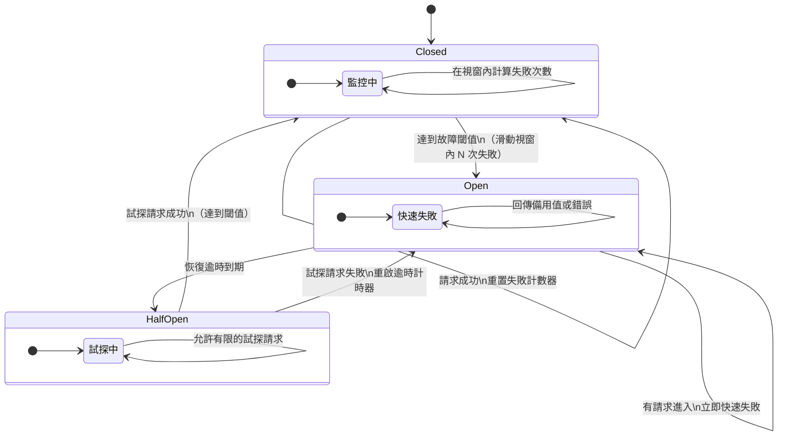

# [BEE-260] 斷路器模式

:::info
及早偵測故障、開路以快速失敗，並透過半開狀態實現受控的服務恢復。
:::

## 背景

分散式系統依賴網路呼叫來存取其他服務與資源。這些遠端呼叫可能以多種方式失敗：逾時、連線被拒絕、HTTP 500 回應，或下游服務直接崩潰。大多數情況下，故障是短暫的，重試即可解決。

但有些故障並非短暫性的。下游服務可能過載、陷入崩潰迴圈，或正在等待一個停止運作的資料庫。當呼叫方持續向無法處理請求的服務發送請求時，會同時發生兩件壞事：

1. 下游服務永遠沒有喘息的機會來恢復。
2. 上游服務不斷累積被阻塞的執行緒和耗盡的連線池，最終也開始失敗。

這就是**級聯故障（Cascading Failure）** — 一個服務的問題向外擴散，直到整個呼叫鏈全面降級。

斷路器模式由 Michael Nygard 在《Release It!》（Pragmatic Programmers, 2018）中推廣，並由 Martin Fowler 詳細描述（[martinfowler.com/bliki/CircuitBreaker.html](https://martinfowler.com/bliki/CircuitBreaker.html)），透過將遠端呼叫包裝在一個狀態機中來解決這個問題：該狀態機偵測持續性故障，並在下游服務顯示恢復跡象之前停止發出那些呼叫。

## 原則

**將每個對外的遠端呼叫包裝在斷路器中。當故障超過閾值時，開路並立即回傳備用值。在恢復逾時後，允許少量試探性請求。只有在試探成功後才關閉電路。**

斷路器位於呼叫方與依賴服務之間。在正常情況下，它是透明的。當依賴服務開始出現故障時，斷路器累積證據，最終觸發，同時保護呼叫鏈的兩端。

## 三種狀態

斷路器以具有三種狀態的狀態機運作。

### 關閉（Closed，正常運作）

所有請求皆通過至依賴服務。斷路器在滾動時間視窗（即**滑動視窗**）內追蹤失敗次數（或比率）。若失敗次數保持在閾值以下，斷路器會定期重置計數器並維持關閉狀態。

當失敗次數超過閾值時，斷路器轉換至**開路（Open）**狀態。

### 開路（Open，快速失敗）

沒有任何請求到達依賴服務。斷路器立即回傳錯誤或備用值，不會進行任何網路呼叫。這就是「快速失敗（Fail Fast）」——呼叫方在微秒內就能得到回應，而不必等待逾時。

電路開路時，**恢復計時器**啟動。計時器讓下游服務有時間恢復，而不必承受持續的流量轟炸。

### 半開（Half-Open，試探恢復）

當恢復計時器到期後，斷路器進入半開狀態，允許少量**試探性請求**到達依賴服務，其餘請求仍快速失敗。

- 若試探請求成功，斷路器關閉（恢復正常運作）。
- 若任何試探請求失敗，斷路器重新開路，恢復計時器重新啟動。

半開狀態能防止正在恢復的服務立即被流量淹沒。服務在恢復後可能仍很脆弱；突然恢復全量流量可能再次將其擊垮。

## 何者算作故障

並非所有非 200 回應都是斷路器意義上的故障。

| 回應類型 | 是否計為故障 | 原因 |
|---|---|---|
| HTTP 5xx（500、502、503、504） | 是 | 伺服器端問題 |
| 連線逾時 | 是 | 服務無法存取或過載 |
| 讀取逾時 | 是 | 服務回應過慢 |
| 連線被拒絕 | 是 | 服務停止運作 |
| HTTP 4xx（400、401、403、404、422） | **否** | 客戶端錯誤，非伺服器問題 |
| HTTP 429（Too Many Requests） | 視情況而定 | 可能代表過載；需明確設定 |

**4xx 錯誤絕對不能觸發斷路器。** 404 表示資源不存在；400 表示請求格式錯誤。這些是客戶端的程式錯誤。若以 4xx 觸發斷路器，會掩蓋應用程式的 bug，並產生錯誤的可用性訊號。

Microsoft Azure 架構中心的指引（[learn.microsoft.com/zh-tw/azure/architecture/patterns/circuit-breaker](https://learn.microsoft.com/en-us/azure/architecture/patterns/circuit-breaker)）指出，斷路器應對例外類型敏感，而非僅對例外的存在做出反應。觸發斷路器所需的逾時例外數量，可能需要比「連線被拒絕」錯誤更多。

## 故障閾值與滑動視窗

**基於計數的閾值**在達到 N 次失敗後開路，不考慮時間因素。這種方式簡單但脆弱：分散在一小時內的 5 次失敗不應開路；但在 10 秒內的 5 次失敗則應該。

**滑動視窗**解決了這個問題。斷路器在固定的時間視窗內（例如 30 秒）追蹤失敗次數。若視窗內發生 5 次失敗，則電路開路。視窗外的失敗將被忘記。

部分實作使用**基於比率的閾值**：當視窗內超過 X% 的請求失敗時開路。基於比率的閾值在流量量變化時更為穩健——5 次失敗中有 5 次（100% 失敗率）比 500 次失敗中有 5 次（1% 失敗率）更令人擔憂。

合理的初始參數值：

| 參數 | 合理預設值 | 備註 |
|---|---|---|
| 故障閾值 | 5 次失敗或 50% 失敗率 | 依照依賴服務的 SLA 調整 |
| 滑動視窗 | 30–60 秒 | 對應預期的突發持續時間 |
| 恢復逾時 | 30–60 秒 | 給依賴服務足夠的恢復時間 |
| 半開試探次數 | 1–3 次請求 | 保守設定；關閉後再增加 |

## 備用行為（Fallback）

開路時**必須**回傳某些內容。兩種糟糕的選擇是：

- 向呼叫方回傳通用 500（無備用）——這只是把故障繼續傳播。
- 靜默回傳 null 或空值——這隱藏了問題，可能導致下游的 NullPointerException。

正確的備用方案取決於依賴服務提供什麼：

| 依賴服務類型 | 備用選項 |
|---|---|
| 商品目錄 / 讀取密集型資料 | 回傳帶有快取 TTL 的過期快取資料 |
| 個人化 / 推薦 | 回傳通用預設值（「熱門商品」） |
| 支付閘道 | 向使用者回傳錯誤並提示稍後重試 |
| 通知服務 | 將通知排入佇列稍後發送 |
| 詐欺評分 | 失效開放（允許交易，標記審查）或失效關閉（拒絕交易） |
| 內部健康檢查依賴 | 回傳降級回應；繼續提供其他功能 |

目標是**優雅降級（Graceful Degradation，見 [BEE-12005](graceful-degradation.md)）**——系統應繼續提供有限的功能，而非完全失敗。

## 具體範例

**場景：** 服務 A（結帳服務）呼叫服務 B（庫存服務）在完成訂單前確認庫存。

### 沒有斷路器的情況

服務 B 開始回傳 HTTP 503。服務 A 對每次呼叫進行重試（依照 [BEE-12002](retry-strategies-and-exponential-backoff.md)）。每次對服務 A 的請求現在都要阻塞執行緒數秒，等待服務 B 的逾時加上重試退避時間。在正常負載下，50 個並發結帳請求佔用了 50 個執行緒。連線池耗盡。服務 A 開始拒絕所有請求——包括與庫存無關的呼叫。故障已級聯擴散。

### 有斷路器的情況

1. 服務 A 將庫存呼叫包裝在斷路器中（閾值：30 秒內 5 次失敗，恢復逾時：45 秒）。
2. 服務 B 開始回傳 503。
3. 達到 5 次失敗後，電路開路。
4. 後續的結帳請求立即收到備用回應：「庫存確認暫時無法使用——訂單已建立，稍後將確認。」沒有任何執行緒被阻塞等待服務 B。
5. 服務 B 不再受到流量轟炸；開始恢復。
6. 45 秒後，電路進入半開狀態。對服務 B 的試探請求成功。
7. 電路關閉。完整的庫存確認恢復正常。

服務 A 優雅降級。服務 B 在不受干擾的情況下恢復。沒有級聯故障。

## 斷路器 vs. 重試

這兩種模式是**互補關係，而非替代關係**。

| | 重試（Retry） | 斷路器（Circuit Breaker） |
|---|---|---|
| 目的 | 處理短暫性、短期的故障 | 處理持續性、系統性的故障 |
| 行為 | 重複呼叫 | 停止發出呼叫 |
| 範圍 | 單一請求 | 對某個依賴服務的所有請求 |
| 使用時機 | 偶發性的小故障 | 依賴服務停止運作或過載 |

兩者應一起使用：對短暫性錯誤重試幾次，但若電路已開路，則跳過重試並立即回傳備用值。重試邏輯必須遵守斷路器的狀態——透過開路的電路進行重試會適得其反。

常見實作方式：將斷路器包裝在重試機制外層。若電路開路，重試根本不會觸發。

## 監控與告警

斷路器是重要的可觀測性埋點。每次狀態轉換都應發出日誌條目和指標。

**需要暴露的指標：**

- `circuit_breaker.state`（closed / open / half-open）——依依賴服務區分
- `circuit_breaker.failure_count`——當前視窗內的失敗次數
- `circuit_breaker.open_total`——電路開路的累計次數
- `circuit_breaker.latency`——請求延遲（有助於在觸發前偵測慢速問題）

**需要設定的告警：**

- 電路開路（狀態轉換至 Open）——若持續則需要通知值班人員
- 電路持續開路超過 N 分鐘——升級處理
- 故障率升高接近閾值——提前預警

如 Martin Fowler 所寫：*「斷路器的任何狀態變更都應被記錄，斷路器應公開其狀態細節以供更深入的監控。」* 靜默開路的斷路器沒有任何運維價值。

## 常見錯誤

### 1. 閾值設定過高

將故障閾值設定為 50 次失敗才開路，意味著服務要承受 50 次失敗呼叫、50 個被阻塞的執行緒，以及大量的延遲，電路才會觸發。從低閾值開始（5–10 次失敗或 50% 比率），只有在誤觸發成為問題時才向上調整。

### 2. 電路開路時沒有備用行為

電路開路時回傳原始錯誤比永久阻塞要好，但仍然傳播了故障。為每個斷路器定義有意義的備用行為。

### 3. 將 4xx 視為故障

客戶端錯誤（400、401、404、422）不是依賴服務健康狀況的症狀。將它們計為失敗會因為錯誤的請求而觸發電路，掩蓋真實的客戶端 bug 並造成不正確的降級。

### 4. 狀態變更時沒有監控或告警

靜默開路和關閉的斷路器無法提供任何運維可見性。將每次狀態變更接入您的可觀測性系統。

### 5. 每個服務實例持有各自獨立的斷路器，而非每個依賴服務持有一個

若服務 A 的每個實例持有自己獨立的斷路器狀態，則系統的故障偵測會不一致。實例 1 可能已開路，而實例 2 仍在對故障的依賴服務發起呼叫。使用共享狀態存儲（Redis、Service Mesh 控制平面），或接受各實例獨立追蹤但需相應降低個別閾值的現實。

### 6. 對同一主機的不同操作使用同一個斷路器

服務 B 上的慢速端點不應觸發對服務 B 上健康、快速端點的電路開路。將斷路器的作用域限定在操作或路由層級，而非僅限於主機名。

## 實作函式庫

| 語言 / 平台 | 函式庫 |
|---|---|
| Java / JVM | Resilience4j、Hystrix（已棄用，僅維護） |
| .NET | Polly |
| Go | `sony/gobreaker`、`cenkalti/backoff` |
| Python | `pybreaker` |
| Node.js | `opossum` |
| Service Mesh | Envoy（Istio、Linkerd）——見 [BEE-5006](../architecture-patterns/sidecar-and-service-mesh-concepts.md) |

Service Mesh（[BEE-5006](../architecture-patterns/sidecar-and-service-mesh-concepts.md)）可以以 Sidecar 的形式實作斷路器，將其從應用程式程式碼中移除。這是 Kubernetes 環境中實現一致跨服務策略的首選方式。

## 相關 BEE

- [BEE-12002](retry-strategies-and-exponential-backoff.md)（重試策略與指數退避）——以重試搭配斷路器處理短暫性故障
- [BEE-12003](timeouts-and-deadlines.md)（逾時與期限）——務必將逾時與斷路器配合使用；過長的逾時會延遲電路開路
- [BEE-12004](bulkhead-pattern.md)（艙壁模式）——隔離執行緒池以限制故障的影響範圍
- [BEE-12005](graceful-degradation.md)（優雅降級）——定義電路開路時備用行為的處理方式
- [BEE-5006](../architecture-patterns/sidecar-and-service-mesh-concepts.md)（Service Mesh）——Service Mesh 以基礎設施層級策略提供斷路器功能

## 參考資料

- Martin Fowler, *Circuit Breaker*, martinfowler.com/bliki/CircuitBreaker.html（2014）
- Microsoft Azure 架構中心, *斷路器模式*, learn.microsoft.com/zh-tw/azure/architecture/patterns/circuit-breaker
- Michael Nygard, *Release It! Design and Deploy Production-Ready Software*, 第 2 版, Pragmatic Programmers（2018）——第 5 章：穩定性模式
- Resilience4j 文件：resilience4j.readme.io/docs/circuitbreaker
